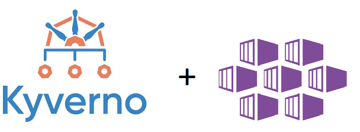
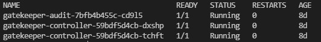
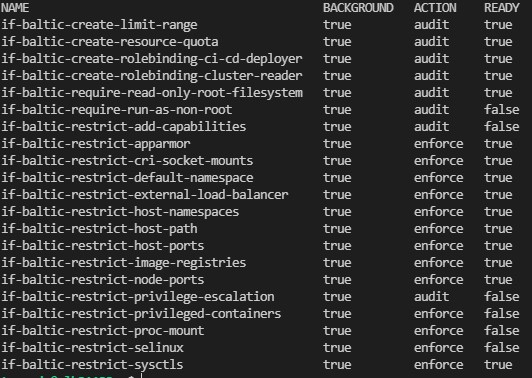
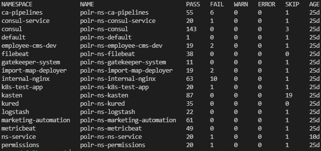
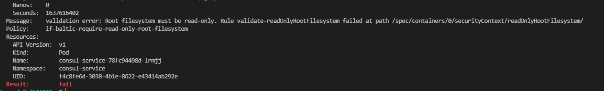
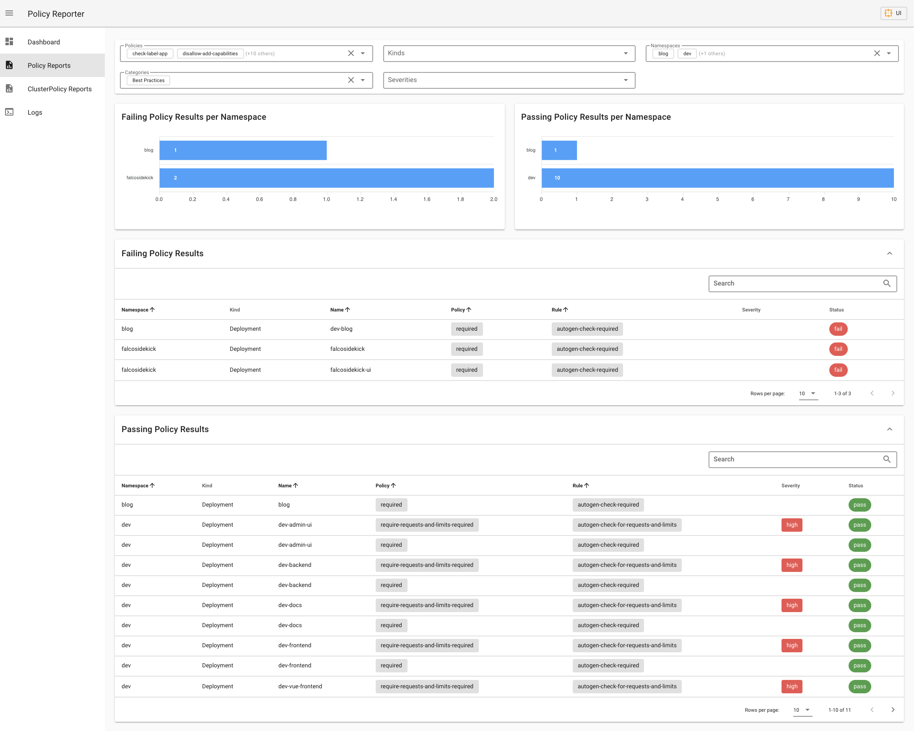

Hello Folks,

In this AKS series post I would like to about how to secure your AKS cluster after the Pod Security Policy removal from Kubernetes.

## 1. PSP Deprecation

Those of you who constantly works with Kubernetes and tracks release changelog probably have heard that [Pod Security Policies] (PSP) deprecated as of Kubernetes v1.21, and will be removed in v1.25. PSP is a cluster-level resource that controls security sensitive aspects of the pod specification. The PodSecurityPolicy objects define a set of conditions that a pod must run with in order to be accepted into the system, as well as defaults for the related fields. With PSP you can deny such thing like privileged pods, run container as a root, force read only root file system etc.

PSP deprecation for cluster admins means that we need to prepare our K8S infrastructure to be able to control security context of pods and containers which will run on our clusters. There are bunch of different projects which could help to achieve the same or even more that we can to achieve with PSP, but in my opinion there are two projects [Kyverno] and [OPA GateKeeper] which are most valuable in this area. Both of this solutions are open source CNCF projects.

## 2. Kyverno or OPA Gatekeeper

Generally [Kyverno] and [OPA GateKeeper] runs as [admission controllers] in Kubernetes receives validating and mutating admission webhook HTTP callbacks from the API server and applies matching policies to return results that enforce admission policies or reject requests.

In terms of AKS if you enable [azure policy addon] for you clusters you can create policies from the portal or azure cli, but in the background [OPA GateKeeper] used as the policy management engine.

As you probably noticed from the post title I prefer to use Kyverno instead of OPA GateKeeper based azure policy addon and there are few reasons for this:

* Both policy managers can **validate** (check that resource is match specified criteria), **mutate** (edit resource based on specified criteria), however only Kyverno can [generate] new resources based on specified conditions and this quite valuable feature as it can automate a lot of things. As example you can create Kyverno policy according to which each time when new namespace will be created additionally Kyverno will create a network policy or resource quota or whatever resource you need.

* Another key deference between GateKeeper and Kyverno is the way how policies are written. 
  In order to use GateKeeper you need to understand a REGO language which is used to describe policy in GateKeeper constraint templates. So if you writing a complex policy this might be quite tricky if you don't know well all REGO specifics. In case of AKS with enabled azure policy addon you may find a lot of already prepared azure policies which are ready to use and can help to secure a cluster in many aspects and for sure these policies covers all what PSP does. However if you will need to create some custom policy (currently [custom policy definitions for aks clusters] available as in public preview) you will need to write an azure policy definition with a reference to Gatekeeper constraint template and constraint files this might be quite complicated process. Additionally it may take more than 30 minutes for policy to take effect after policy assignment to the cluster.

  In case of Kyverno things are much more simpler. When you deploy Kyverno it deploys a few Custom Resource Definitions (CRD's) then when you want to deploy a Kyverno policy you simply need to apply `ClusterPolicy` or `Policy` definition file to your cluster. All Kyverno policies should described as a simple yaml based files without using any additional complex languages. For sure you still need to understand basic rules on [how Kyverno policies should be written] and which spec's are supported in policy definition files.

  Here is how the policy which requires for `environment` label to be set on each namespace looks in [OPA GateKeeper]
  In GateKeeper we first need to specify a constraint template where we describe our policy rules

```yaml
apiVersion: templates.gatekeeper.sh/v1beta1
kind: ConstraintTemplate
metadata:
  name: k8srequiredlabels
spec:
  crd:
    spec:
      names:
        kind: K8sRequiredLabels
      validation:
        # Schema for the `parameters` field
        openAPIV3Schema:
          properties:
            labels:
              type: array
              items:
                type: string
  targets:
    - target: admission.k8s.gatekeeper.sh
      rego: |
        package k8srequiredlabels
        violation[{"msg": msg, "details": {"missing_labels": missing}}] {
          provided := {label | input.review.object.metadata.labels[label]}
          required := {label | label := input.parameters.labels[_]}
          missing := required - provided
          count(missing) > 0
          msg := sprintf("you must provide labels: %v", [missing])
        }
```

After this we need to create a constraint for this template. Constraint used to describe for which resource kind our constraint template will be applied.

```yaml
apiVersion: constraints.gatekeeper.sh/v1beta1
kind: K8sRequiredLabels
metadata:
  name: pod-must-have-gk
spec:
  match:
    kinds:
      - apiGroups: [""]
        kinds: ["Namespace"]
  parameters:
    labels: ["environment"]  
  ```

  And the following yaml shows how the same policy looks in Kyverno

```yaml
apiVersion: kyverno.io/v1
kind: ClusterPolicy
metadata:
  name: require-labels 
spec:
  validationFailureAction: audit
  background: true
  rules:
  - name: check-for-labels
    match:
      resources:
        kinds:
        - Namespace
    validate:
      message: "The label `environment` is required."
      pattern:
        metadata:
          labels:
            environment: "?*" 
```  

As you can see Kyverno policy much more simple and easier to understand compared to GateKeeper.

These two aspects are the main reasons why my choice was `Kyverno` instead of Azure Policy + OPA GateKeeper. Also it's worth to mention that if you wish you can use both policy managers in parallel however if your AKS clusters are large with a lot of requests to the API this may add additional load for control plane and cause a delay during various operations with resources. This is because a lot of API requests (depends for which resource kind policies will be applied) will be forwarded to and processed by `Kyverno` and `GateKeeper` admissions controller before action.

If you would like to see super detailed comparison between Kyverno and OPA Gatekeeper I recommend to read this [Kyverno vs OPA Gatekeeper comparison] post.

## Protect AKS with Azure Policy for Kubernetes aka OPA Gatekeeper

If you want to secure your AKS cluster with Azure Policy for Kubernetes you can use [Azure Policy for Kubernetes addon] for AKS. To enable this addon you can run the following command:

```bash
az aks enable-addons --addons azure-policy-aks --resource-group <resource-group> --name <cluster-name>
```

After the addon will be enabled you will see a additional Gatekeeper pods running on your AKS cluster. These pods runs as [admission controllers] and they are responsible for enforcing policies on your cluster.



Next you can can create Azure policy initiative (contains several policy definitions) and assign it to your subscriptions. There are several built-in azure policy iniatives already created for you:

* Kubernetes cluster pod security baseline standards for Linux-based workloads - [Kubernetes cluster pod security baseline standards for Linux-based workloads](https://github.com/Azure/azure-policy/blob/master/built-in-policies/policySetDefinitions/Kubernetes/Kubernetes_PSPBaselineStandard.json)

* Kubernetes cluster pod security restricted standards for Linux-based workloads - [Kubernetes cluster pod security restricted standards for Linux-based workloads](hhttps://github.com/Azure/azure-policy/blob/master/built-in-policies/policySetDefinitions/Kubernetes/Kubernetes_PSPRestrictedStandard.json)

These two initiatives contains policies which can help to secure your cluster according some kubernetes standards and they also can do the same as PSP does:
  * Restrict privileged containers
  * Restrict Using Host Network
  * Restrict Using Host PID
  * Restrict Capabilities
  * Restrict Some Volume Types (e.g. HostPath)
  * Resrtict privilege escalation
  * Restrict SecComp Profiles
  * Restrict Root User

There are also a lot of other built-in policies which can be found in [Azure Policy built-in definitions for Azure Kubernetes Service](https://docs.microsoft.com/en-us/azure/aks/policy-reference) documentation. These policies may help not only to secure your cluster but also to enforce some kubernetes or AKS specific standards like requiring a specific label on each namespace or enforce using internal load balancer. Each policy can be set in three different modes:

  * `Enforce` - Enforce the policy.
  * `Warn` - Warn if the policy is violated.
  * `Audit` - Audit the policy.

Policy assignment process is the same as for any other Azure policy. You choose the policy or policy initiative and assign it to your subscription/resource group/resource.:

```bash
az policy assignment create --name <policy-assignment-name> --policy <policy-name> --display-name <policy-assignment-display-name> --resource-group <resource-group>
```

Built-in Azure Policy for Kubernetes are written in such way that you can add exclusions or assign your values via parameters.

IF your case is not covered by built-in AKS policies it also possible to create your own custom policy for Azure Kubernetes Service. This functionality is currently in Preview [Create and Assign Custom Policy for Azure Kubernetes Service](https://docs.microsoft.com/en-us/azure/aks/use-azure-policy#create-and-assign-a-custom-policy-definition-preview), and also looks for me a bit to complicated to implement compared to Kyverno.

Additional disadvantage is that policy assignment or update can take up to 20 minutes to sync in to each cluster. And this can be a problem in case you will need to quickly fix some behavior.

Microsoft Defender for Cloud and Azure Advisor uses same Built Azure Policy for Kubernetes in order to evaluate your clusters for potential security issues and misconfigurations.

## Protect AKS with Kyverno

If your choose to use Kyverno to secure and manage your AKS cluster you need to deploy it by using official Kyverno Helm chart. You can find official Kyverno Installation guide [here](https://docs.microsoft.com/en-us/azure/aks/use-azure-policy#create-and-assign-a-custom-policy-definition-preview).
or simply run the following commands against your AKS cluster:

```bash
helm repo add kyverno https://kyverno.github.io/kyverno/
helm repo update
helm install kyverno kyverno/kyverno --namespace kyverno --create-namespace
```

Refer to [Kyverno Helm Chart Configuration](https://artifacthub.io/packages/helm/kyverno/kyverno#configuration) if you want to adjust some parameters.

After successful installation of Kyverno you will see a new Kubernetes deployment pods running on your AKS cluster.


So now you can use Kyverno to enforce policies on your AKS cluster.

Unlike Azure Policy for Kubernetes with Kyverno you can create a policies not only to validate or mutate resources, but also policies wich will generate/create new k8s resources bases on specified rules.

There are already more than 90 different policies in [Kyverno Policies Library](https://kyverno.io/policies/) so you can use all these examples and adopt for your use case. All the policies are quite simple and easy to understand as the written in yaml format and deployble as any other kubernetes resource.

Kyverno has official Kyverno-Policies helm chart which contains policies to cover a [Kubernetes Pod Security Standards](https://kubernetes.io/docs/concepts/security/pod-security-standards) basically these policies covers same aspects as a Pod Security Policies or Azure Kubernetes pod Security Policies. You can find all information about Kyverno Policies Helm Chart [here](https://artifacthub.io/packages/helm/kyverno/kyverno-policies/). However you can configure only few global settings in this chart and can't granularly configure particular policies in one place via helm configuration file.

So I decided to create my own Kyverno Policies Helm Chart and adopt specifically for Azure Kubernetes Service. Currently my [aks-kyverno-policies](https://github.com/andriktr/helm-charts/tree/main/charts/aks-kyverno-policies) helm chart contains more than 20 policies which might be useful to secure and ease your AKS cluster management. They will help to cover a PSP deprecation, restrict LB service to internal only, control allowed container registries, control labels etc. Also helps to automate creation of such things as limit ranges, network policies, etc. Main advantage of this helm chart is that you can configure all policies in one place trough helm configuration file. You can simply enable or disable policies, set exclusions, set how policy will be applied or policy generates resources you can set resource specification. You can review all configurable settings in [here](https://github.com/andriktr/helm-charts/tree/main/charts/aks-kyverno-policies#configure-policies). This approach will let you easily standardize your policies and adjust them for different environments by simple edit of your helm config file.

In order to install [aks-kyverno-policies](https://github.com/andriktr/helm-charts/tree/main/charts/aks-kyverno-policies) helm chart perform the following steps:

```bash
helm repo add sysadminas https://sysadminas.eu/helm-charts/ # Add sysadminas Helm Chart Repository
helm repo update # Update Helm Chart Repositories
```

In case you satisfied with default settings run the following:

```bash
helm upgrade -i aks-kyverno-policies sysadminas/aks-kyverno-policies --namespace kyverno # Run if you satisfied with default settings, probably you will need to change some settings based on your needs
```

In case if you would like to change some settings you can use the following:

```bash
helm pull sysadminas/aks-kyverno-policies --untar # Pull Helm Chart and unpack it to local directory and adjust values in helm config file
helm upgrade aks-kyverno-policies aks-kyverno-policies --namespace kyverno # Run after you adjusted values in helm config file or pass your own values file with -f option
```

I will constantly update this helm chart with new policies which might be useful in AKS environment. But all the contributions are welcome. If you would like to write your own policy I would suggest to use [Kyverno Policies Library](https://kyverno.io/policies/) as an example reference and use a [Writing Policies Documentation](https://kyverno.io/docs/writing-policies/) which will help you to understand the basic principles of writing policies for Kyverno.

It also worth to mention that Kyverno has it's own cli which can be used to test policies against your AKS cluster before you deploy them. You can find it [here](https://kyverno.io/docs/kyverno-cli/). And it also useful if you deploy the policies with CI/CD pipeline.

To review all the installed kyverno policies in your AKS cluster run the following:

```bash
kubectl get clusterpolicy
```



Kyverno policy can be a cluster wide (cluster policy) or a namespace wide (policy). Similar as K8S cluster roles and roles. Currently [aks-kyverno-policies](https://github.com/andriktr/helm-charts/tree/main/charts/aks-kyverno-policies) contains only cluster wide policies however you can easily exclude any namespace from policy evaluation by adding it to the `excludedNamespaces` list in the helm config file.

Kyverno also generates cluster policy reports reports and policy reports in order to allow you to review the policy evaluation results.

```bash
kubectl get policyreport -A
```



<i class="far fa-sticky-note"></i> **Note:** Even if you deploy a cluster policy in most cases you will need to review a policy report as policy report collect the policy evaluation result for namespaced K8S resources.
{: .notice--info}
{: .text-justify}

If you would like to review which policies with failed validation status you can run the following:

```bash
kubectl describe polr -A | grep -i "Result: \+fail" -B10 # Review all failed policies
kubectl describe polr -n <namespace> | grep -i "Result: \+fail" -B10 # Review failed policies for specific namespace
```



There is also additional project [Kyverno Policy Reporter](https://github.com/kyverno/policy-reporter) deployable with separate helm chart. This solution allows you to review a reports in user friendly way via web UI.



I also would like to mention a [Kyverno Slack Chanel](https://kubernetes.slack.com/archives/CLGR9BJU9) as there you can always get help with your issues and advice on how to write a policy to cover your use case.

## Pod Security Admission Control

It also worth mention that with PSP deprecation a new Pod Security Admission Controls will be introduced in upcoming Kubernetes versions. You can review all the feature details in [official Kubernetes github repository](https://github.com/kubernetes/enhancements/tree/master/keps/sig-auth/2579-psp-replacement#kep-2579-pod-security-admission-control)

## Conclusion

As you can see removing PSP from Kubernetes will definitely not be a problem and you have really good or actually much better tool to keep your Kubernetes cluster secure and easy to manage. As I mentioned my own choice is to use [Kyverno] as it easy to write, deploy and update policies. Kyverno also allows to really simplify cluster management with policies for resource generation.

That is all for now. I hope you will find this post useful and interesting. If you have any questions or suggestions please don't hesitate to contact me. I will be happy to answer your questions.

Thank you 🤜🤛

<!-- Links -->
[Pod Security Policies]: https://kubernetes.io/docs/concepts/policy/pod-security-policy/
[Kyverno]: https://kyverno.io/docs/
[OPA GateKeeper]: https://github.com/open-policy-agent/gatekeeper
[Kyverno vs OPA Gatekeeper comparison]: https://neonmirrors.net/post/2021-02/kubernetes-policy-comparison-opa-gatekeeper-vs-kyverno/
[Azure Policy for Kubernetes]: https://docs.microsoft.com/en-us/azure/governance/policy/concepts/policy-for-kubernetes
[admission controllers]: https://kubernetes.io/docs/reference/access-authn-authz/extensible-admission-controllers/
[azure policy addon]: https://docs.microsoft.com/en-us/azure/governance/policy/concepts/policy-for-kubernetes
[generate]: https://kyverno.io/docs/writing-policies/generate/
[custom policy definitions for aks clusters]:https://azure.microsoft.com/en-us/updates/public-preview-custom-policy-definitions-for-aks-clusters/
[how Kyverno policies should be written]: https://kyverno.io/docs/writing-policies/
[PSP Replacement]: https://github.com/kubernetes/enhancements/tree/master/keps/sig-auth/2579-psp-replacement#kep-2579-pod-security-admission-control