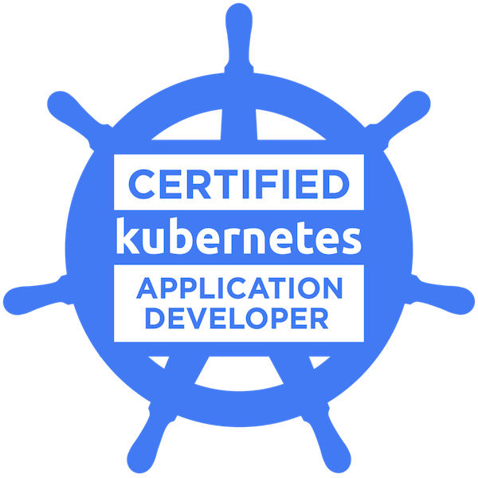
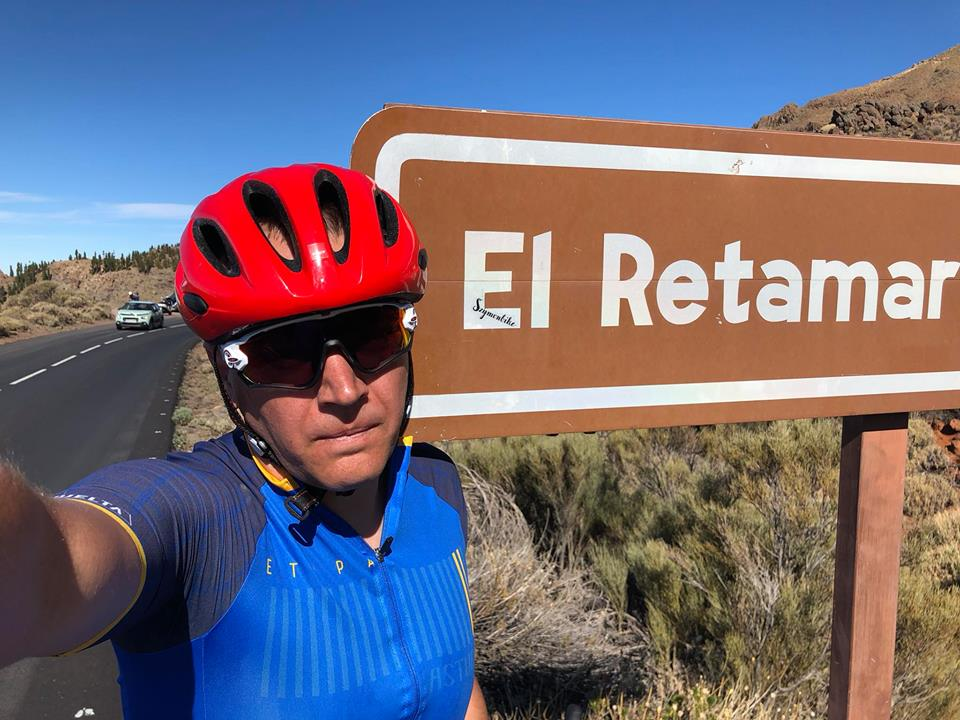
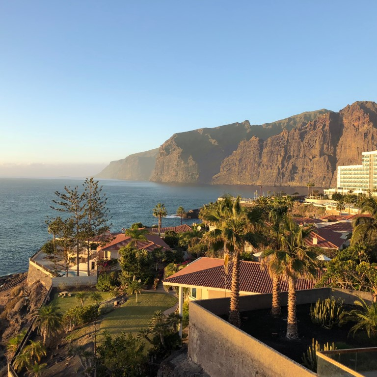
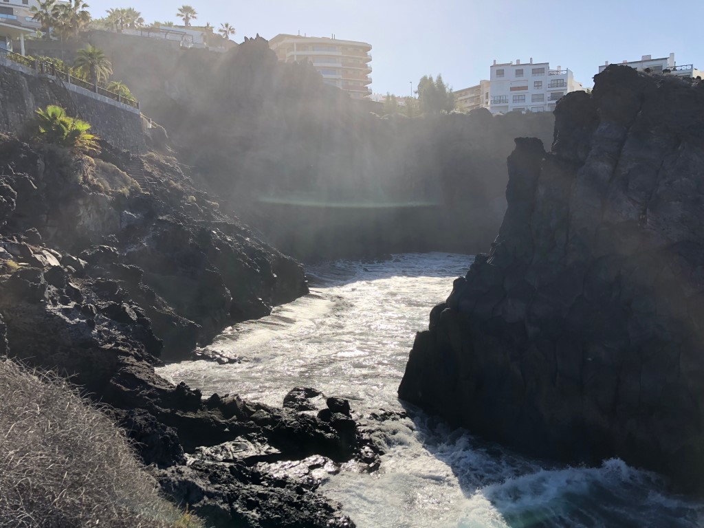
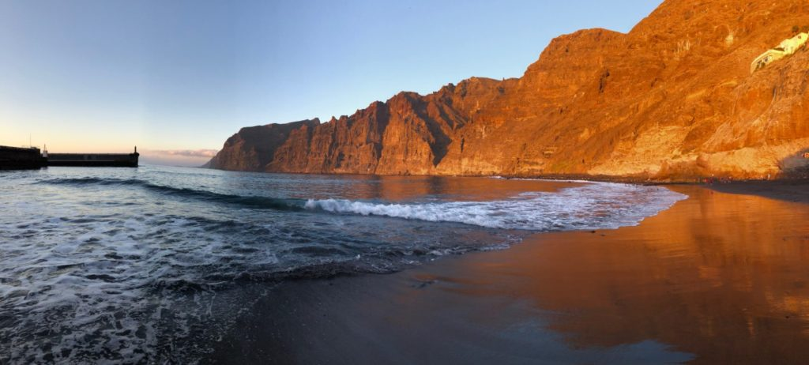
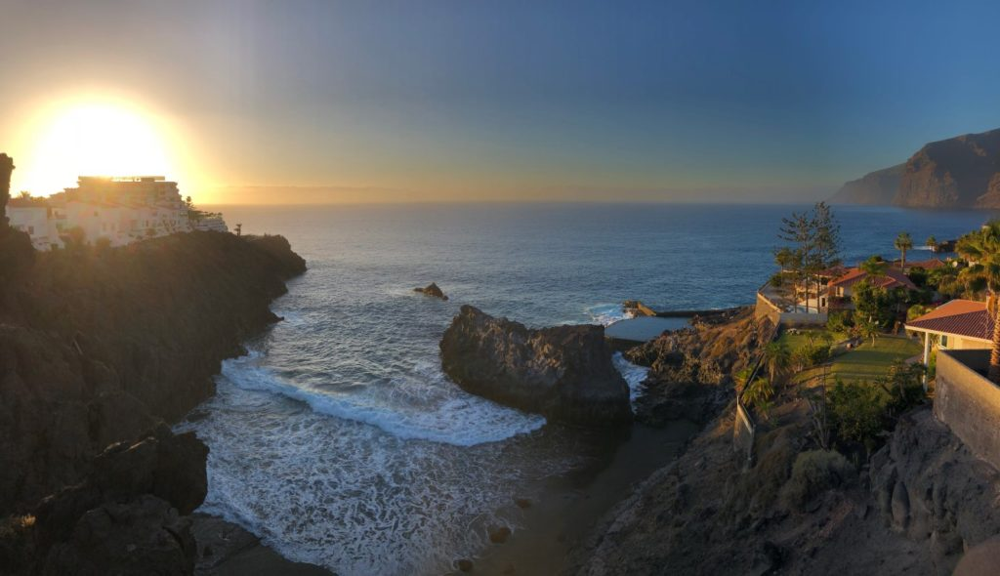
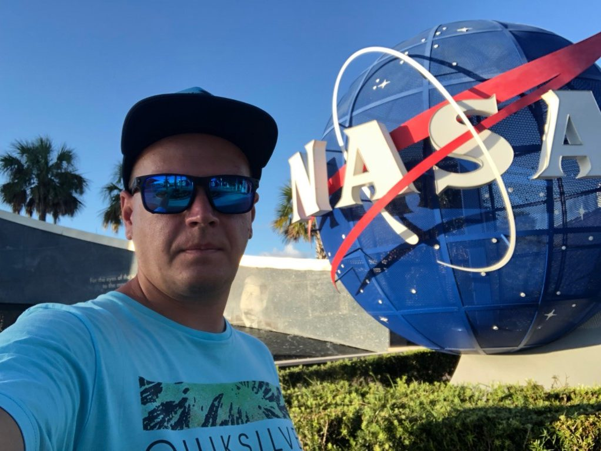

# Hello World. Welcome to [sysadminas] Cloud Blog.

## Intro

Let me shortly introduce my self. My name is Andrej I'm Cloud Engineer from Vilnius, Lithuania.
I'm working in IT industry for the last 15 years. I started my IT journey as support guy raised to the admin and now I'm in the cloud :). IT is my biggest passion because as for me it is the world where you every day could learn something new and interesting. Working as IT means you should constantly learn and grow your competence in order to be competitive and be able to accept new technological challenges

As you probably already understood my blog will be mainly about IT technologies. Here I will share with you my experience and things which were helpful for me and could be helpful for you in your IT duties. Why do I need this? As someone said:
>"Sharing is caring”.

One more reason for blogging is that this a way how you can collaborate with other peoples who are interested in the same things. Also I think that writing will help me to improve my English skills (please don’t judge me to much for mistakes).

# Skills

Currently I'm focusing on the Microsoft Azure, Kubernetes and IaC (`terraform`, `ansible`, `ARM Templates`) however for this 15 years I spent a lot of time as a Microsoft Windows administrator. These are the main areas where I willing to be helpful:

* Azure infrastructure administrator (Microsoft Certified: Azure Administrator Associate)
* Kubernetes administrator (Linux Foundation: Certified Kubernetes Administrator, Certified Kubernetes Application Developer)
* Hashicorp "Consul" service mesh
* Windows server administrator (Microsoft Certified: Solutions Associate: Windows Server 2012)
* Scripting and IaC (Powershell, Azure CLI, Azure ARM templates, Terraform, Ansible)
* Azure DevOps
* Backup administration (Veeam B&R, Data Protection Manager)
* Virtualization (Hyper-Vm, VMWare),
* Linux administration skills (Debian, Ubuntu)
* Other (MSSQL, MS System Center Configuration Manager)

As probably everyone in IT I constantly learning and proving my knowledge by passing various certification exams. Here are my certification achievements:

 

## Hobbies

Working in IT is not the only thing I like to do. One of my favorites hobbies is a triathlon. For those who don’t know what it is, triathlon is a combination of three sports swim, bike, run. I discovered this sport a few years ago and I really like it. There are different distances in triathlon, but probably most popular is an IRONMAN (IM). Completing IM means that you should swim 3.9km then bike 180 km and as the cherry on the cake run a marathon 42.2 km. I already completed half IM distance and full IM is on my to do list. Doing three sports is much more funnier than one.

As many others in the world I also really like to travel. I think that traveling is the thing which anyone of us should constantly do because when you travel you freeing your mind you visit new places and can discover things that really could inspire you or even change you live in way you ever can’t imagine. You always meet new peoples from whom you can learn something new. Each trip is always a new adventure. Personally I always comeback from my trips recharged and at least till now I only had positive emotions.

 
 
---

---

> “The world is a book and those who do not travel read only one page.” – Augustine of Hippo

You definitely can expect some blog posts about my trips.

## Few more words

At the end I want to say that I’m always ready to help you in your IT questions and hope that my following posts will be helpful and interesting for you guys. If you have any questions do not hesitate and contact me via social media or email.

<!-- Links -->
[sysadminas]: https://sysadminas
