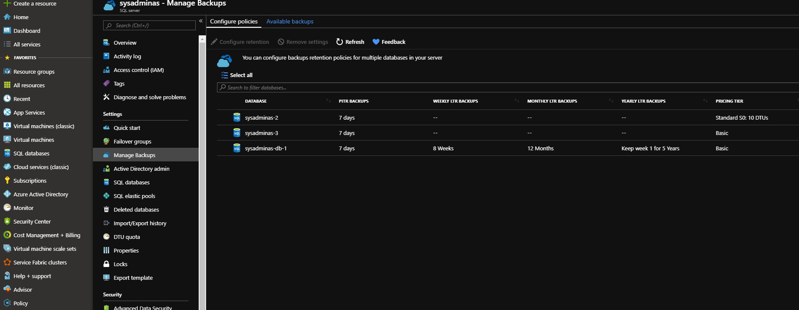
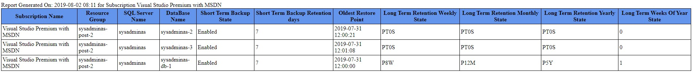

Hi All,

This post series might be useful for those who are using Azure SQL DB’s PaaS solutions and want to collect information about databases backup status and setup protection for them in automated way.

Every organization and it’s admins should take care of their data safety. If your data stored in the cloud giants like Microsoft, Amazon, or Google data centers you probably for 99% safe from hardware failures, but application level error still may occur and in such cases backup is a life saver and indeed it should be configured for all your productions systems.

By default Azure SQL Database creates only short terms backups and can keeps them from 7 to 35 days. This type of backups uses Azure read-access geo-redundant storage (RA-GRS) to ensure that they will be accessible even if the whole Azure data center is unavailable. You also can have long term backups (LTB) configured and keep these backups up to 10 years. Very important note here is that if you delete your Azure SQL server all DB’s will be deleted as well and if you will not have configured LTB for this server then you will no longer be able to restore your databases from that deleted server.

In this post I will going to show you how to check the backup state for your Azure SQL Databases and generate an automated report which will contain data from all Azure SQL servers in your entire subscription. You can check and configure your Azure SQL databases backup status in Azure portal by selecting your Azure SQL server and then Manage Backups blade:



As you can see I have three databases. Two of them have only default automatic short term backup configured and one DB have default short and long term backup which I configured manually. Checking backup state using portal is suitable if this is one time task and you have only few servers. But that if you have 10 or 100 Azure SQL servers and should check this state constantly to be sure that your data is protected properly? Here is the lazy sysadmin rule comes into play 😁:

> “If you have to do something twice, automate it”

So I wrote a simple PowerShell script which will collect data from all Azure SQL servers in defined subscription and prepare a html report. Script requires one parameter which is your azure subscription name.

```powershell
<#
.SYNOPSIS
Azure SQL databases backup state inventory
 
.DESCRIPTION
Script will go through the all resource groups in your subscription and search for the SQL database server and DB's. Then will check backup retention and status of each DB.
The output will be html file. Which will be created in the  directory from which script is executed.
 
.EXAMPLE
.\Azure-SQL-Backup-State.ps1 -SubscriptionName "Visual Studio Premium with MSDN" 
 
.NOTES
Make sure you have installed AZ powershell module installed. 
Make sure you have appropriate persmissions to you Azure subscription
Use "Install-Module az -AlloweClobber -Force" to install the module
#>

PARAM(
    [string] [Parameter(Mandatory = $True, HelpMessage = "Choose subscription you want be inventoried")] $SubscriptionName
    )
#Variables
$ReportDate = (Get-Date).ToString("yyyy-MM-dd HH:mm")
$ReportHeader = @"
<style>
TABLE {border-width: 1px; border-style: solid; border-color: black; border-collapse: collapse;}
TH {border-width: 1px; padding: 3px; border-style: solid; border-color: black; background-color: #6495ED;}
TD {border-width: 1px; padding: 3px; border-style: solid; border-color: black;}
</style>
"@
#Login to Azure
Login-AzAccount
 
#Select Azure Subscription
Get-AzSubscription -SubscriptionName $SubscriptionName | Select-AzSubscription
 
#Collect Data
$AzureSQLBackupInventory = @()
$AzureSQLServers = Get-AzResource  | Where-Object ResourceType -EQ Microsoft.SQL/servers
foreach ($AzureSQLServer in $AzureSQLServers){
    $AzureSQLServerDataBases = Get-AzSqlDatabase -ServerName $AzureSQLServer.Name -ResourceGroupName $AzureSQLServer.ResourceGroupName | Where-Object DatabaseName -NE "master"
        foreach ($AzureSQLServerDataBase in $AzureSQLServerDataBases) {
            $DBLevelInventory =  @()
            $BackupState = Get-AzSqlDatabaseGeoBackupPolicy  -ServerName $($AzureSQLServerDataBase.ServerName) -DatabaseName $($AzureSQLServerDataBase.DatabaseName) -ResourceGroupName $($AzureSQLServerDataBase.ResourceGroupName) | Select-Object -ExpandProperty State
            $ShortTermBackupRetention = Get-AzSqlDatabaseBackupShortTermRetentionPolicy -ServerName $($AzureSQLServerDataBase.ServerName) -DatabaseName $($AzureSQLServerDataBase.DatabaseName) -ResourceGroupName $($AzureSQLServerDataBase.ResourceGroupName) | Select-Object -ExpandProperty RetentionDays
            $LongTermRetention = Get-AzSqlDatabaseBackupLongTermRetentionPolicy -ServerName $($AzureSQLServerDataBase.ServerName) -DatabaseName $($AzureSQLServerDataBase.DatabaseName) -ResourceGroupName $($AzureSQLServerDataBase.ResourceGroupName)
            $LongTermRetentionWeekly = $LongTermRetention | Select-Object -ExpandProperty WeeklyRetention
            $LongTermRetentionMonthly = $LongTermRetention | Select-Object -ExpandProperty MonthlyRetention
            $LongTermRetentionYearly = $LongTermRetention | Select-Object -ExpandProperty YearlyRetention
            $LongTermWeeksOfYear = $LongTermRetention | Select-Object -ExpandProperty WeekOfYear
            $DBLevelInventory = New-Object -TypeName psobject
                $DBLevelInventory | Add-Member -MemberType NoteProperty -Name "Subscription Name" -Value $SubscriptionName
                $DBLevelInventory | Add-Member -MemberType NoteProperty -Name "Resource Group" -Value $AzureSQLServerDataBase.ResourceGroupName
                $DBLevelInventory | Add-Member -MemberType NoteProperty -Name "SQL Server Name" -Value $AzureSQLServerDataBase.ServerName
                $DBLevelInventory | Add-Member -MemberType NoteProperty -Name "DataBase Name" -Value $AzureSQLServerDataBase.DatabaseName 
                $DBLevelInventory | Add-Member -MemberType NoteProperty -Name "Short Term Backup State" -Value $BackupState
                $DBLevelInventory | Add-Member -MemberType NoteProperty -Name "Short Term Backup Retention days" -Value $ShortTermBackupRetention
                $DBLevelInventory | Add-Member -MemberType NoteProperty -Name "Oldest Restore Point" -Value $AzureSQLServerDataBase.EarliestRestoreDate
                $DBLevelInventory | Add-Member -MemberType NoteProperty -Name "Long Term Retention Weekly State" -Value $LongTermRetentionWeekly
                $DBLevelInventory | Add-Member -MemberType NoteProperty -Name "Long Term Retention Monthly State" -Value $LongTermRetentionMonthly
                $DBLevelInventory | Add-Member -MemberType NoteProperty -Name "Long Term Retention Yearly State" $LongTermRetentionYearly
                $DBLevelInventory | Add-Member -MemberType NoteProperty -Name "Long Term Weeks Of Year State" -Value $LongTermWeeksOfYear
                $AzureSQLBackupInventory+=$DBLevelInventory
                        
        }
}
#Generate Report
$AzureSQLBackupInventory | ConvertTo-Html -PreContent  "Report Generated On: $($ReportDate) for Subscription $($SubscriptionName)" -Head $ReportHeader  | Out-File .\Azure-SQL_Report_$($SubscriptionName).html -Force
```

After the script finishes his job you will get the html file which will look like:



That’s it for today in the second part of Azure SQL DB backups series we will review how to configure long term backups for our Azure SQL databases.

I hope this will be informative and would like to thank you for reading. See you soon 🤜🤛.