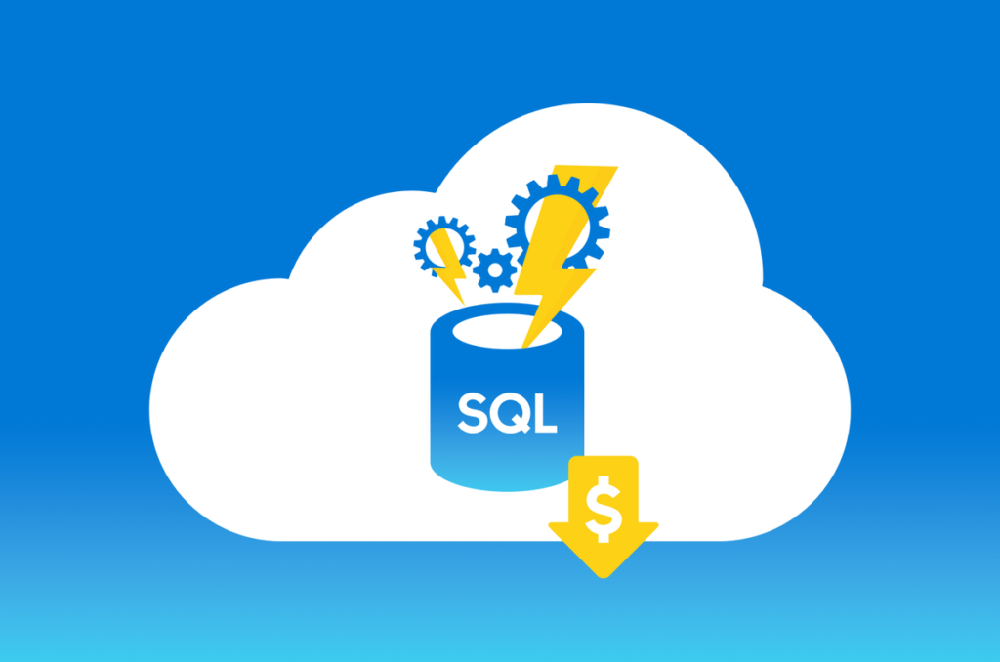

In previous two parts of Azure SQL DB backups series we reviewed how to get the current state of our backup retention and how to configure backup retention policy according our needs. Using powershell definitely makes things easier and helps us in case we need to apply configuration for a big amount of Azure SQL servers and databases, but we still have to do a manual which is running a script. And what if every week or even day our Azure SQL servers will have new DB’s created? For us this means we constantly will need to run our script in order to apply our backup retention policy for newly created databases. To skip all manual activities we can use Azure automation and a bit modified powershell script version from the [previous post]. So let’s fully automate Azure SQL DB backups and make sure that we will drink coffee and watch YouTube instead of manually running scripts 😎.

First thing that we will need is to create a new Azure automation account. This can be simply done from azure portal. Go to “Create new resource”, search for “Automation” click “Create” then fill all required fields and click “Create” again:

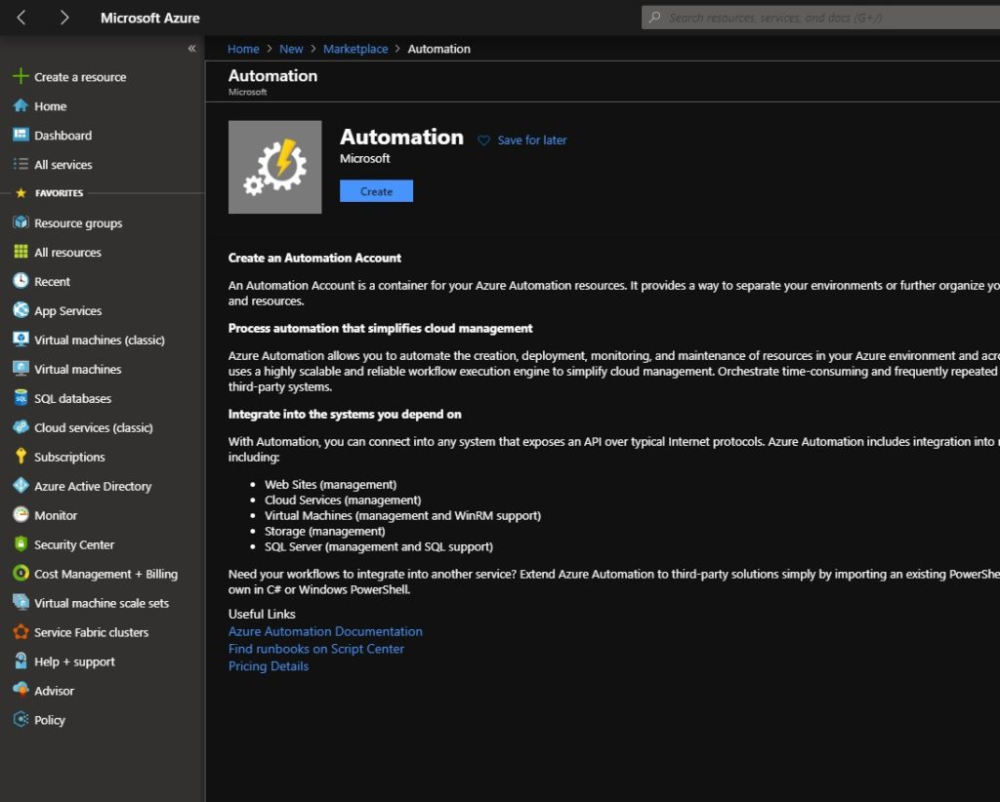

you also could achieve same using powershell and AZ.* modules. Just login to your Azure account choose appropriate subscription and run:

```powershell
New-AzAutomationAccount -ResourceGroupName "Your Resource Group Name Here" -Name "Automation Account Name Here"  -Location "West Europe"
```

As result we will now have automation account created:
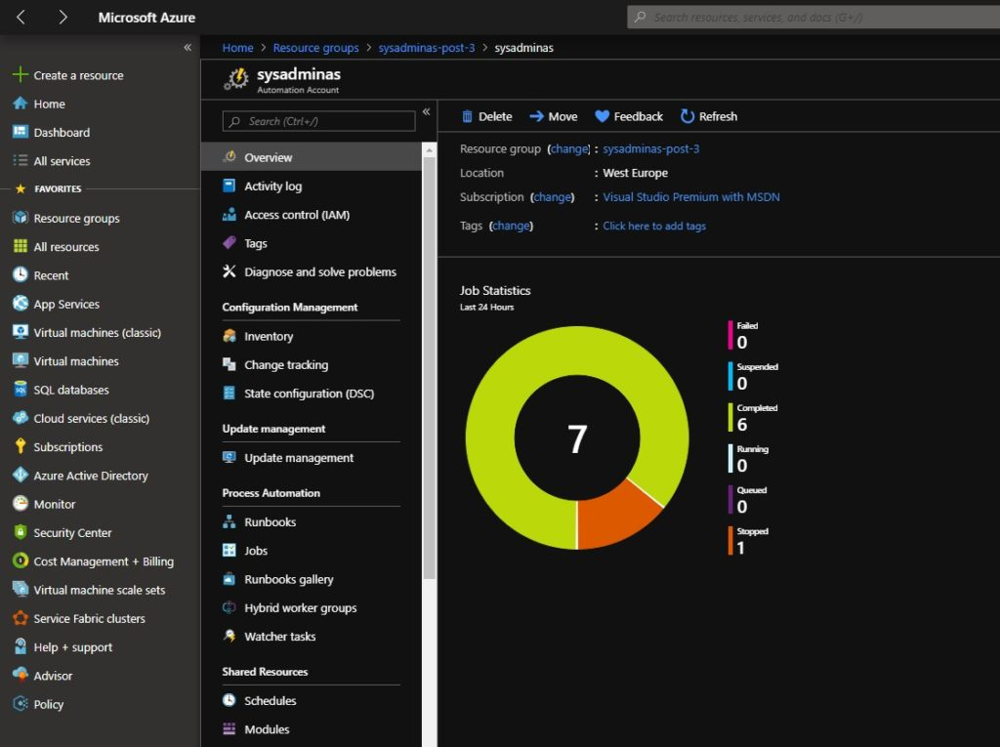

Next thing which is needed for our setup is a “Run as account”. According [MS documentation]:
> Authentication for managing resources in Azure with the Azure cmdlets. When you create a Run As account, it creates a new service principal user in Azure Active Directory and assigns the Contributor role to this user at the subscription level. Also to create or update a Run As account, you must have specific privileges and permissions. A Global Administrator in Azure Active Directory and an Owner in a subscription can complete all the tasks

<i class="far fa-sticky-note"></i> **Note:** Make sure you have appropriate permission to create a Run as accounts.
{: .notice--info}
{: .text-justify}

Personally I found for myself that the easiest way to create a run as account is to use Azure portal. For this go to your Azure automation account and open a “Run as accounts” blade then select “Create Azure Run As Account”:

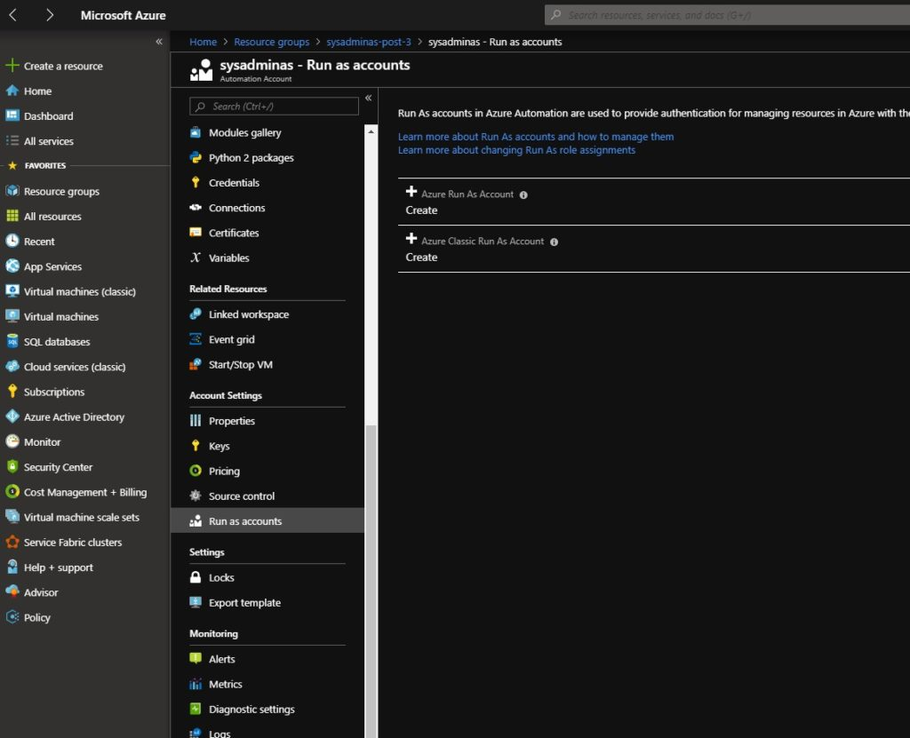

Azure Run As Account is now created:

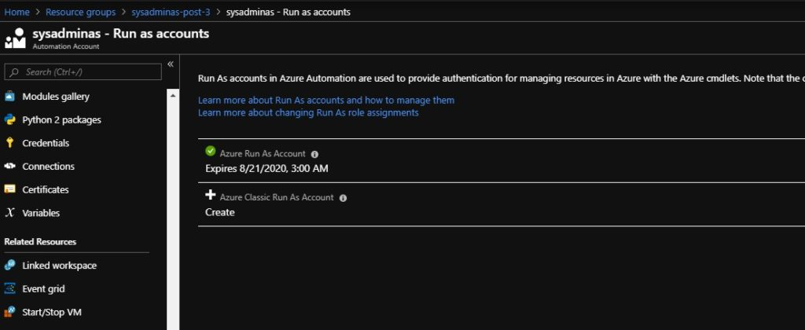

Do not forget to renew a Run As Account self signed certificate when needed. This can be done by selecting Run As Account and pressing Renew Certificate:

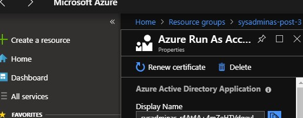

As I mentioned earlier after the Run As account being created you will see a new Azure AD user (service principal) who have Contributor role assigned on a subscription level. You can check this in Azure portal by going to the subscriptions Access control (IAM) blade Role assignments tab

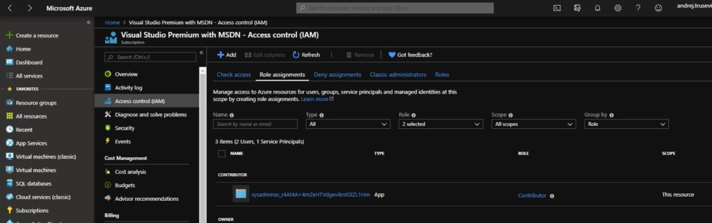

There are script provided by Microsoft which is designed to accomplish same task and create Run as account with powershell, but this script is quite complex and you need to provide a bunch of parameters also as for me creating Run as account typically very rare task and doesn’t needed to be automated unless you want to have your Azure infrastructure coded and be able to rebuild everything in one click 😉. [Here] you can find how to create a run as account in a scripted way. Same link have references how to setup automatic run as account certificate renewal which is indeed a good thing and will drop off some duties from admin as well.

By default when you create Azure automation account it have only AzureRM.* powershell modules imported. Our script uses AZ.* modules (I guess that at some moment only AZ.* powershell modules will remain supported) so we need to prepare our automation account and import AZ modules into it.

> You can’t use both AzureRM.* and Az.* modules in one script when you running it in the Azure automation environment. So make sure that script which you are planning to combine with Azure automation are written using only one of them otherwise you RunBook will fail.

Microsoft recommends to import only those modules which are needed to run your script successfully. For Azure SQL backups configuration task we will need Az.Accounts, Az.sql, Az.Resources, Az.Profile modules. Some modules have dependencies to other modules so in our case make sure that you import Az.Accounts module first. To import modules go to your automation account and choose “Modules” blade:

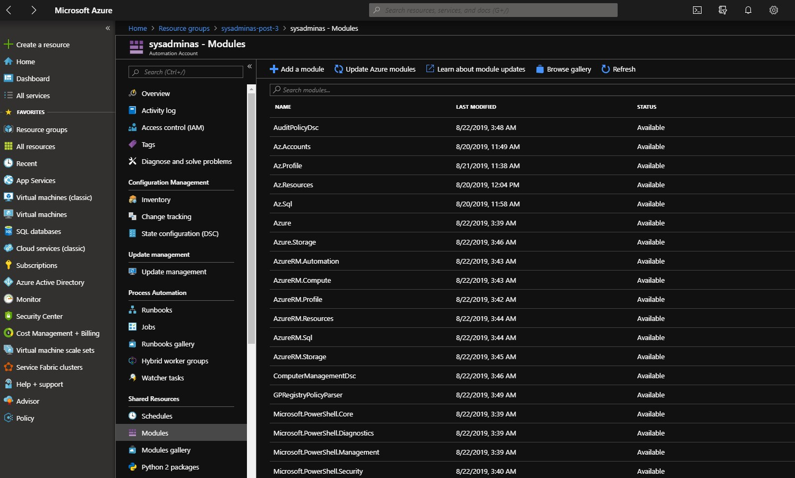

Then select “Browse gallery”, search for required module and press “Import”. Repeat this steps for all required modules.

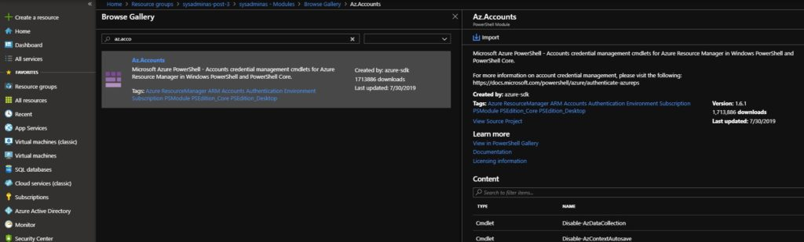

We now have in place our automation account we also created a Run as account for it and imported all required modules. Now we are ready to create a runbook which will execute our script. To create a runbook go to you Automation account choose a “Runbooks” blade and press “Create a runbook”. Then define a name for your runbook and set runbook type to powershell, optionally add a description and press “Create”:

Then our runbook will be immediately created and opened for us. Click “Edit” and copy our script to a runbook.

```powershell
<#
.SYNOPSIS
  Configure Backups for Azure SQL DataBases. Script is created to be used together with Azure automation powershell RunBook
.DESCRIPTION
 Script will go through the all resource groups in your subscription and search for the SQL database server and DB's. Then it will set short term and  LTR backups for each database.
 In order to auto apply configuration for all newly created DB's you need to schedule a RunBook which will constantly execute this script according your created scheduler
.PARAMETER RetentionDays
    How long would you like daily short term backups to be kept? (Available days values 7, 14, 21, 28, 35). 
    Basic pricing tier DB's will remain configured with 7 days Short Term retention as other values are not supported for this SKU.
.PARAMETER WeeklyRetention
    How long (in Weeks) would you like Weekly backups to be kept? (Must be a number between 1 and 520)
.PARAMETER MonthlyRetention
     How long (in Months) would you like Monthly backups to be kept? (Must be a number between 1 and 120)
.PARAMETER YearlyRetention
    How long (in Years) would you like Yearly backups to be kept? (Must be a number between 1 and 10)
.PARAMETER WeekOfYear
    Which weekly backup of the year would you like to retain as yearly backup? (Must be a number between 1 and 52)
 
.INPUTS
 
.OUTPUTS
  
.NOTES
  Version:        1.0
  Author:         Andrej Trusevic
  Creation Date:  2019-08-21
   
  Make sure you have imported these modules into your Azure automation account: Az.Accounts, Az.sql, Az.Resources, Az.Profile
.EXAMPLE
#>
 
 
PARAM(
    [int] [ValidateSet(7, 14, 21, 28, 35)] [Parameter(Mandatory = $True, HelpMessage = "How long would you like daily short term backups to be kept? (available days values 7, 14, 21, 28, 35). Basic pricing tier DB's will remain configured with 7 days Short Term retention as other values are not supported for this SKU.")] $RetentionDays,
    [int] [ValidateRange(1,520)] [Parameter(Mandatory = $True, HelpMessage = "How long (in Weeks) would you like Weekly backups to be kept? (Must be a number between 1 and 520)")] $WeeklyRetention,
    [int] [ValidateRange(1,120)] [Parameter(Mandatory = $True, HelpMessage = "How long (in Months) would you like Monthly backups to be kept? (Must be a number between 1 and 120)")] $MonthlyRetention,
    [int] [ValidateRange(1,10)] [Parameter(Mandatory = $True, HelpMessage = "How long (in Years) would you like Yearly backups to be kept? (Must be a number between 1 and 10)")] $YearlyRetention,
    [int] [ValidateRange(1,52)] [Parameter(Mandatory = $True, HelpMessage = "Which weekly backup of the year would you like to retain as yearly backup? (Must be a number between 1 and 52)")] $WeekOfYear
    )
 
    $connectionName = "AzureRunAsConnection"
    try
    {
        # Get the connection "AzureRunAsConnection "
        $servicePrincipalConnection=Get-AutomationConnection -Name $connectionName        
     
        "Logging in to Azure..."
        Add-AzAccount `
            -ServicePrincipal `
            -TenantId $servicePrincipalConnection.TenantId `
            -ApplicationId $servicePrincipalConnection.ApplicationId `
            -CertificateThumbprint $servicePrincipalConnection.CertificateThumbprint 
    }
    catch {
        if (!$servicePrincipalConnection)
        {
            $ErrorMessage = "Connection $connectionName not found."
            throw $ErrorMessage
        } else{
            Write-Error -Message $_.Exception
            throw $_.Exception
        }
    }
     
#Set backup configuration for database
$AzureSQLServers = Get-AzResource  | Where-Object ResourceType -EQ Microsoft.SQL/servers
foreach ($AzureSQLServer in $AzureSQLServers){
    $AzureSQLServerDataBases = Get-AzSqlDatabase -ServerName $AzureSQLServer.Name -ResourceGroupName $AzureSQLServer.ResourceGroupName | Where-Object DatabaseName -NE "master"
    foreach ($AzureSQLServerDataBase in $AzureSQLServerDataBases) {
        #Set Short Term Retention Policy for database
        if ($AzureSQLServerDataBase.SkuName -NotLike "Basic") {
            Set-AzSqlDatabaseBackupShortTermRetentionPolicy -RetentionDays $RetentionDays -ServerName $($AzureSQLServerDataBase.ServerName) -DatabaseName $($AzureSQLServerDataBase.DatabaseName) -ResourceGroupName $($AzureSQLServerDataBase.ResourceGroupName) | Out-Null # Remove out null for debugging purposes;
            Write-Output "Short Term Backup is now configured for $($AzureSQLServerDataBase.DataBaseName)"
            }else {
            Write-Output "!!!Short Term Backup configuration was not changed for $($AzureSQLServerDataBase.DataBaseName) database due to Basic SKU"
            }       
        #Set Long Term Retention Policy for database
        Set-AzSqlDatabaseBackupLongTermRetentionPolicy -WeeklyRetention "P$($WeeklyRetention)W" -MonthlyRetention "P$($MonthlyRetention)M" -YearlyRetention "P$($YearlyRetention)Y" -WeekOfYear $WeekOfYear -ServerName $($AzureSQLServerDataBase.ServerName) -DatabaseName $($AzureSQLServerDataBase.DatabaseName) -ResourceGroupName $($AzureSQLServerDataBase.ResourceGroupName) | Out-Null # Remove out null for debugging purposes;  
        Write-Output "Long Term Backup is now configured for $($AzureSQLServerDataBase.DataBaseName)"            
    }    
}
```

As you can see script is pretty much the same as in [part #2] except few additional steps required for login a run as account to Azure. The result in edit pane should look like this:


Then you complete editing a runbook click “Save” and “Publish”.
Our runbook is already published and we now can set it be executed periodically. For this we need to create a schedule based on which our runbook will be executed. In your automation account go to the “Schedules” blade and click “Add a schedule”. Then configure it according your requirements and press “Create”.


As you can see my schedule is configured to run once per week on Sundays at 6:32 PM.
We are almost done the only thing which remains is to assign recently created scheduler to our runbook and set a parameters which are required in the script. To do it you need to go to your runbook and select “Add a schedule”

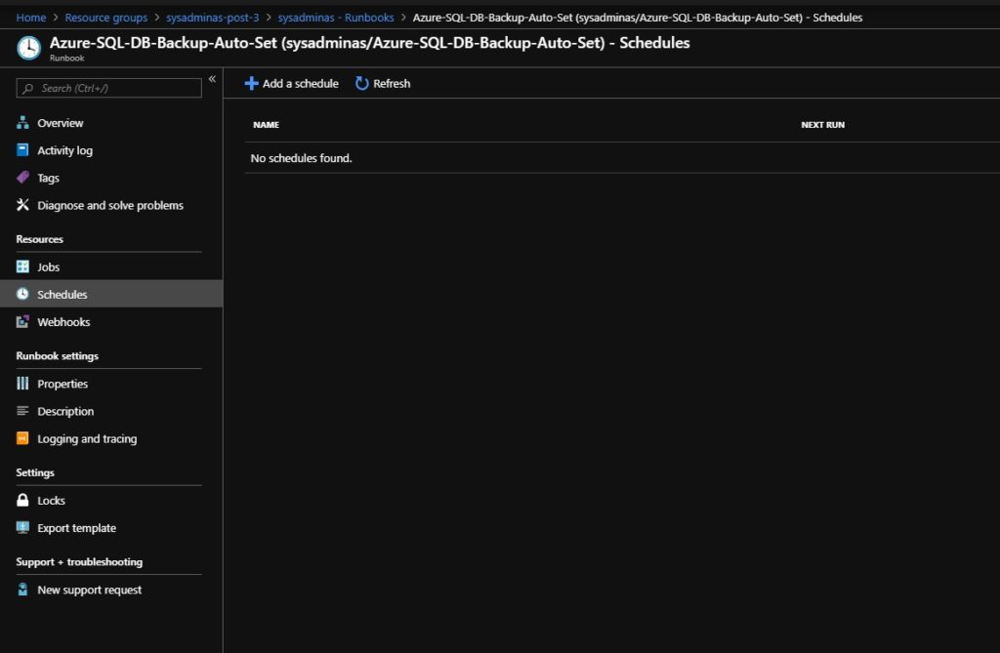

Then go to the “Link a schedule to your runbook” blade and select your created schedule (you can use same schedule for different runbooks).

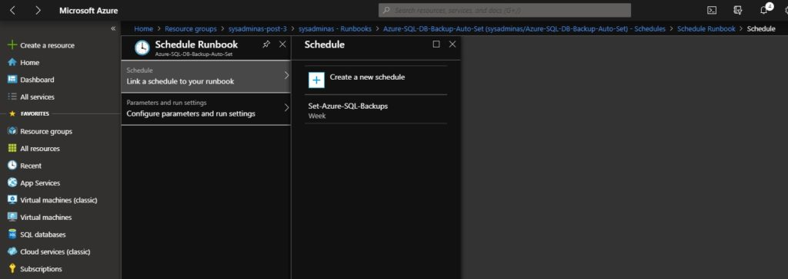

Schedule is linked, now select a “Configure parameters and run settings” blade and set script parameters which will suite your backup retention needs

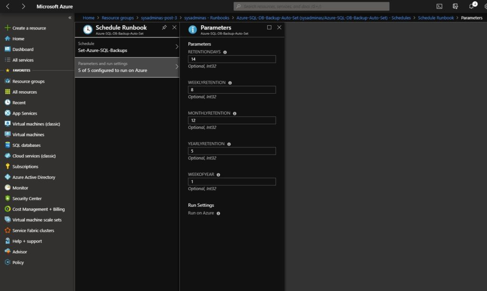

In my case short term backups will be saved for 14 days, weekly backups will be saved for the last 8 weeks (1 recovery point (RP) per week), monthly backups will be saved for the last 12 weeks (1 RP per month), yearly backups will be saved for the last 5 years (1RP per year), weekly backup which will be created at the first week of the year will be saved as yearly backup.

Click OK and save your “Schedule Runbook” settings.
That’s it our runbook is now scheduled to run periodically and will configure a backups for all Azure SQL DB’s in subscription without our intervention. If needed you can review jobs and logs from your automation account “Jobs” blade or in a particular runbook “Jobs” blade. Here is how the job log looks like:

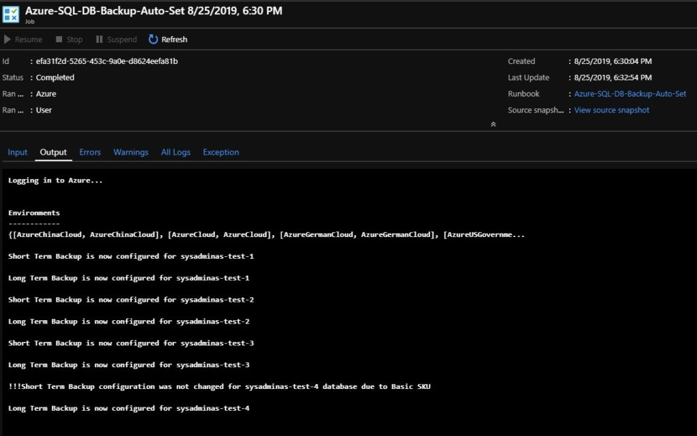

I hope this will be informative to you and feel free to ask questions if needed. Thank you !!!
See you 🤜🤛

<!-- Links -->
[previous post]: https://sysadminas.eu/Part-2-Azure-SQL-DB-backups-Configure-the-backups/
[MS documentation]: https://docs.microsoft.com/en-us/azure/automation/manage-runas-account
[Here]: https://docs.microsoft.com/en-us/azure/automation/manage-runas-account
[part #2]: https://sysadminas.eu/Part-2-Azure-SQL-DB-backups-Configure-the-backups/