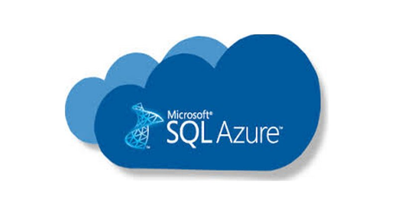
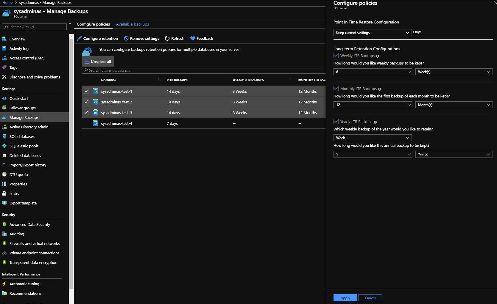

Hi all,
Today we will continue to work with Azure SQL DB backups and will look how to configure a backups according our needs. I already mentioned that short term backup is enabled by default for all Azure SQL Db’s. Default retention period for short term or in other words Point In Time (PiTR) backups is 7 days however you can adjust this up to 35 days. You only can use 7, 14, 21, 28 or 35 days values for your short term backup.

Short term backups might be enough for test databases, but most probably for production environment you will need to have long term retention (LTR) backup policy implemented. Microsoft let’s you to configure a long term backups and keep them up to 10 years. According the official Microsoft [Documentation] :

>If you delete the Azure SQL server that hosts SQL databases, all elastic pools and databases that belong to the server are also deleted and cannot be recovered. You cannot restore a deleted server. But if you configured long-term retention, the backups for the databases with LTR will not be deleted and these databases can be restored

So LTR backups could save you in such rare cases then someone with high privileges (accidentally or may be not 😈) deletes the entire Azure SQL server or a resource group.

So let’s take a look how to adjust Azure SQL database backup according your needs. The simplest way which is OK for one time task is to use Azure resource manager portal where you should select your Azure SQL server and then go to the Manage Backup blade. After this select your database(-s) and choose “Configure retention” just like here:



This method might suit you if you do not have a lot of SQL servers in your subscription, but if you do, you definitely should go with more automated way. As usually PowerShell could help a lot. Here is the script I wrote and want to share with you:

```powershell
<#
.SYNOPSIS
  Configure Backups for Azure SQL Databases
.DESCRIPTION
 Script will go through the all resource groups in your subscription and search for the SQL database server and DB's. Then it will set short term and  LTR backups for each database.
.PARAMETER SubscriptionName
    Name of the subscription against which you would like to run a script
.PARAMETER RetentionDays
    How long would you like daily short term backups to be kept? (Available days values 7, 14, 21, 28, 35)
    Basic pricing tier DB's will remain configured with 7 days Short Term retention as other values are not supported for this SKU.
.PARAMETER WeeklyRetention
    How long (in Weeks) would you like Weekly backups to be kept? (Must be a number between 1 and 520)
.PARAMETER MonthlyRetention
     How long (in Months) would you like Monthly backups to be kept? (Must be a number between 1 and 120)
.PARAMETER YearlyRetention
    How long (in Years) would you like Yearly backups to be kept? (Must be a number between 1 and 10)
.PARAMETER WeekOfYear
    Which weekly backup of the year would you like to retain as yearly backup? (Must be a number between 1 and 52)
 
.INPUTS
 
.OUTPUTS
  
.NOTES
  Version:        1.1
  Author:         Andrej Trusevic
  Creation Date:  2019-08-22
   
  Make sure you have installed AZ powershell module installed. Use "Install-Module az -AlloweClobber -Force" to install the module
  Make sure you have appropriate permissions to you Azure subscription
   
.EXAMPLE
  .\Azure-SQL-Backup-Config-Set.ps1 -SubscriptionName "Visual Studio Premium with MSDN"  -RetentionDays 14 -WeeklyRetention 8 -MonthlyRetention 12 -YearlyRetention 5 -WeekOfYear 1
#>
 
 
PARAM(
    [string] [Parameter(Mandatory = $True, HelpMessage = "Name of the subscription against which you would like to run a script")] $SubscriptionName,
    [int] [ValidateSet(7, 14, 21, 28, 35)] [Parameter(Mandatory = $True, HelpMessage = "How long would you like daily short term backups to be kept? (available days values 7, 14, 21, 28, 35). Basic pricing tier DB's will remain configured with 7 days Short Term retention as other values are not supported for this SKU.")] $RetentionDays,
    [int] [ValidateRange(1,520)] [Parameter(Mandatory = $True, HelpMessage = "How long (in Weeks) would you like Weekly backups to be kept? (Must be a number between 1 and 520)")] $WeeklyRetention,
    [int] [ValidateRange(1,120)] [Parameter(Mandatory = $True, HelpMessage = "How long (in Months) would you like Monthly backups to be kept? (Must be a number between 1 and 120)")] $MonthlyRetention,
    [int] [ValidateRange(1,10)] [Parameter(Mandatory = $True, HelpMessage = "How long (in Years) would you like Yearly backups to be kept? (Must be a number between 1 and 10)")] $YearlyRetention,
    [int] [ValidateRange(1,52)] [Parameter(Mandatory = $True, HelpMessage = "Which weekly backup of the year would you like to retain as yearly backup? (Must be a number between 1 and 52)")] $WeekOfYear
    )
 
#Login to Azure
Login-AzAccount
 
#Select Azure Subscription
Get-AzSubscription -SubscriptionName $SubscriptionName | Select-AzSubscription
 
#Set backup configuration for database
$AzureSQLServers = Get-AzResource  | Where-Object ResourceType -EQ Microsoft.SQL/servers
foreach ($AzureSQLServer in $AzureSQLServers){
    $AzureSQLServerDataBases = Get-AzSqlDatabase -ServerName $AzureSQLServer.Name -ResourceGroupName $AzureSQLServer.ResourceGroupName | Where-Object DatabaseName -NE "master"
        foreach ($AzureSQLServerDataBase in $AzureSQLServerDataBases) {
            #Set Short Term Retention Policy for database
            if ($AzureSQLServerDataBase.SkuName -NotLike "Basic") {
                Set-AzSqlDatabaseBackupShortTermRetentionPolicy -RetentionDays $RetentionDays -ServerName $($AzureSQLServerDataBase.ServerName) -DatabaseName $($AzureSQLServerDataBase.DatabaseName) -ResourceGroupName $($AzureSQLServerDataBase.ResourceGroupName) | Out-Null # Use -WhatIf if you want to check what will happens during command execution remove Out-Null for debugging
                Write-Output "Short Term Backup is now configured for $($AzureSQLServerDataBase.DataBaseName)"
            }else {
                Write-Output "!!!Short Term Backup configuration was not changed for $($AzureSQLServerDataBase.DataBaseName) database due to Basic SKU"
            }
            #Set Long Term Retention Policy for database (If you do not need Long Term backup for your DB's simply comment next 2 lines)
            Set-AzSqlDatabaseBackupLongTermRetentionPolicy -WeeklyRetention "P$($WeeklyRetention)W" -MonthlyRetention "P$($MonthlyRetention)M" -YearlyRetention "P$($YearlyRetention)Y" -WeekOfYear $WeekOfYear -ServerName $($AzureSQLServerDataBase.ServerName) -DatabaseName $($AzureSQLServerDataBase.DatabaseName) -ResourceGroupName $($AzureSQLServerDataBase.ResourceGroupName) | Out-Null # Use -WhatIf if you want to check what will happens during command execution remove Out-Null for debugging 
            Write-Output "Long Term Backup is now configured for $($AzureSQLServerDataBase.DataBaseName)"
        }
}
```
All parameters and examples are provided in script description so I will not repeat same here 🙂

There are few things to keep in mind before you configure the backups:

You can’t control exact time when backup job for your database will be started
If you have configured short term backups and retention value is higher than the new one which you plan to set all backups for this DB older than the new value will be not available. For example your have configured 35 days retention policy for your short term DB backups if you change retention to 14 days all backup older than 14 days will be deleted.
Basic pricing tier DB’s will remain configured with 7 days Short Term retention as other values are not supported for this SKU. However it looks that you can configure long term backups for this pricing tied DB’s.
Personally I from some moment started to use Azure CLI instead of PowerShell az module because as for me Azure CLI performs much faster than PS also it’s looks more interactive. However there are some areas in Azure where PowerShell still have more possibilities than CLI. To be honest I didn’t find a smooth way how to do same Azure SQL DB backup configuration with CLI. Also I think that ideal solution for this would be to use Azure policy which you could assign to required scope (management group, subscription or resource group), but unfortunately there is no such built-in policy exist yet.

In the next part of Azure SQL DB backups blog series we will try to minimize manual work and will use Azure automation to schedule our backup configuration script as this will ensure that newly created DB’s will be covered with our backup policy.

So that’s all for today. Thanks everyone for reading. I hope this will be useful for you!!! Feel free to ask questions if needed.

Bye 🤜🤛

<!-- Links -->
[Documentation]: https://docs.microsoft.com/en-us/azure/sql-database/sql-database-automated-backups