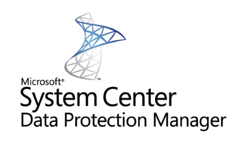
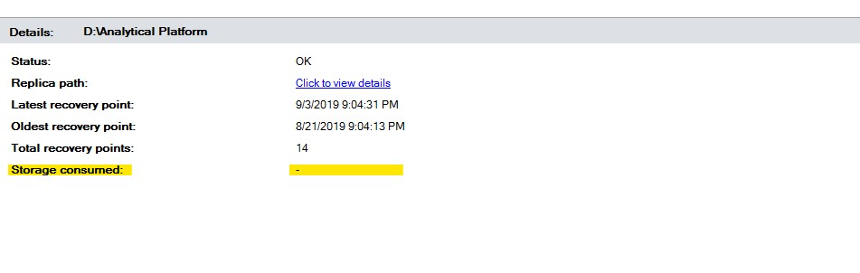

This post might be useful for those of you who are using Microsoft Data Protection 2016 and higher with it’s Modern Backup Storage which is based on ReFS file system.

Since Data Protection Manager (DPM) 2016 version Microsoft introduced their [Modern Backup Storage] (MBS) which is based on ReFS file system. They claims that MBS significantly improves DPM’s performance comparing to the traditional NTFS storage and older DPM versions:

> Modern Backup Storage (MBS), delivering 50% storage savings, 3x faster backups, and efficient backup storage utilization with Workload Aware Storage.

In company which I work for we are used DPM 2016 for ~ 3 years whithout any major issues. Initially our DPM 2016 was installed on Win2012R2 OS so we were not able to use MBS because this type of storage is based on ReFS block cloning and VHDX technology and requires at least Win2016 OS. Recently we migrated all data source to the new DPM 1807 (we can’t use latest DPM 2019 as we still have windows 2008R2 which is not supported to be protected) servers which are installed on Windows 2016 servers. Together with this we started to use Modern Backup Storage. Very soon after migration we faced performance issues with one of our DPM servers. The problem was that at some point backup jobs on server hangs and do nothing. The only way to fix this issues was to reset a VM. I started to search how to fix this issue and the first thing that I have found is that many users are reporting various problems related to the MBS and ReFS. [Here] is probably the main topic on Microsoft forum which is related to MBS and ReFS performance problems. I have read a lot of various forum topics, blogs and would like to share several things that I have found and which could be helpful in case you also experiencing performance issues on your DPM server:

## Tip 1

First thing which is recommended to do is to adjust some ReFS related registry keys. Here are those which I have edited/added on our DPM servers:

```powershell

[HKEY_LOCAL_MACHINE\SYSTEM\CurrentControlSet\Control\FileSystem]
 
RefsCheckpointSampleInterval REG_DWORD 0x00000001 (1) 
 
RefsContainerRotationSampleInterval REG_DWORD 0x00000001 (1)
 
RefsDisableCachedPins REG_DWORD 0x00000001 (1)
 
RefsDisableLastAccessUpdate REG_DWORD 0x00000001 (1)
 
RefsEnableInlineTrim REG_DWORD 0x00000001 (1)
 
RefsEnableLargeWorkingSetTrim REG_DWORD 0x00000001 (1)
 
RefsNumberOfChunksToTrim REG_DWORD 0x00000010 (16)
 
RefsProcessedDeleteQueueEntryCountThreshold REG_DWORD 0x0000800 (2048)
 
RefsDisableAsyncDelete REG_DWORD 0x00000001 (1)
 
RefsDisableDeleteNotification REG_DWORD 0x00000001​ (1)

```

<i class="far fa-sticky-note"></i> **Note:** Do not forget to backup your registry keys before doing any changes. You also will need to reboot your DPM server for changes to be applied.. 
{: .notice--info}
{: .text-justify}

## Tip 2

Next thing which is according Microsoft support guys can have positive impact on performance is to disable size auto update for your data sources. For this you need to run this command on your DPM server and then restart DPM services:

```cmd
"C:\Program Files\Microsoft System Center\DPM\DPM\bin\Manage-DPMDSStorageSizeUpdate.ps1" StopSizeAutoUpdate
```

Disabling this has one small disadvantage which is that you will no longer see the storage consumed information for you protected items:



If you want to enable it back run this command and restart DPM services again:

```cmd
"C:\Program Files\Microsoft System Center\DPM\DPM\bin\Manage-DPMDSStorageSizeUpdate.ps1" StartSizeAutoUpdate
```

## Tip 3

I also recommend to give as much RAM to your DPM servers as you can. Believe me you will face issues with DPM much rare after this change.

## Tip 4

The last thing which is actually helped to resolve our issue is to remove the antivirus from DPM servers. If you are required to have antivirus installed you may add a whole DPM installation folder to exceptions and exclude this folder from scanning. In my particular case we discovered that Symantec is blocking DPM file “\System Volume Information\DpmFilterTrace.txt”. After I uninstalled SEP from DPM servers issues never reoccurred.

## Summary

Summarizing. To be honest I can’t say that after migrating to the MBS and ReFS all DPM jobs runs much faster, performance is pretty much the same, but indeed with this type of new backup storage we saving a lot more space than previously and backups consumes ~30% less space. Also we noticed that tape backup for our file server (~ 8TB and more than 50 million files) runs 3 times faster than before. Unfortunately there are still some issue exist related to the Modern Backup Storage. For example sometimes backup job may fail with error “The VHD containing the replica or one of it’s snapshots could not be mounted or unmounted. (ID 40002)”. My research shows that this issue is fixed in [DPM 2016 UR 7], but there is still no fix for newer DPM versions (1801, 1807, 2019) For me it’s really strange why Microsoft is not releasing a fix for such long time sometimes it feels like MS is really more focused on Azure and cloud technologies 🙂 rather than on-premises stuff.

I hope this post will be helpful for you and would like to thank you for reading.

Bye 🤜🤛

<!-- Links -->
[Modern Backup Storage]: https://techcommunity.microsoft.com/t5/System-Center-Blog/Introducing-DPM-2016-Modern-Backup-Storage/ba-p/351650

[Here]: https://social.technet.microsoft.com/Forums/en-US/7e4e4da4-1168-46cd-900f-9ca2bc364d5a/dpm-2016-mbs-performance-downward-spiral?forum=dataprotectionmanager

[DPM 2016 UR 7]: https://support.microsoft.com/en-us/help/4494084/update-rollup-7-for-system-center-2016-data-protection-manager