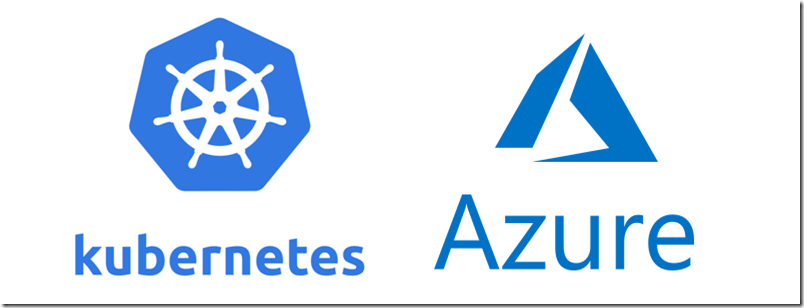
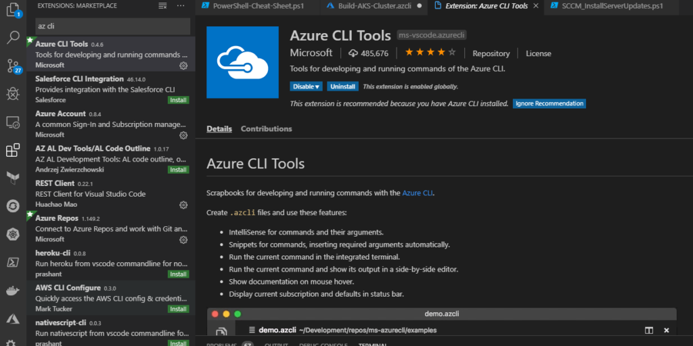
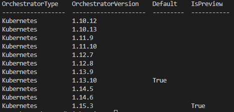
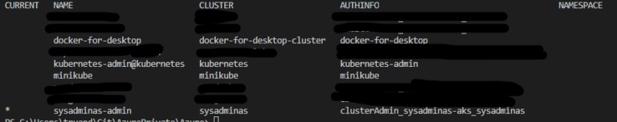
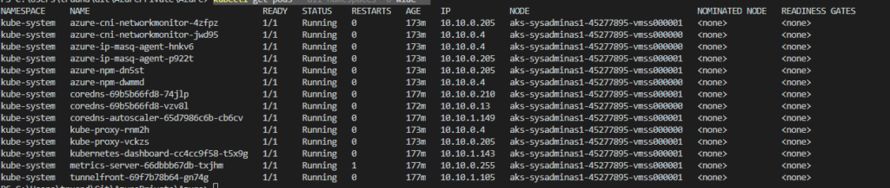
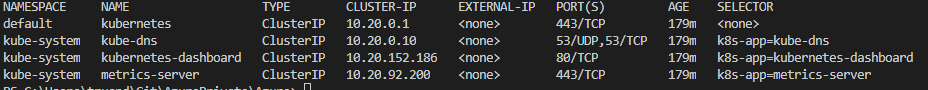
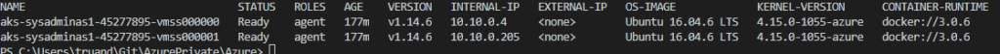
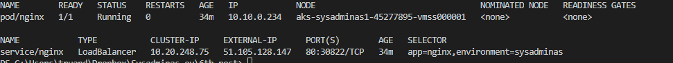
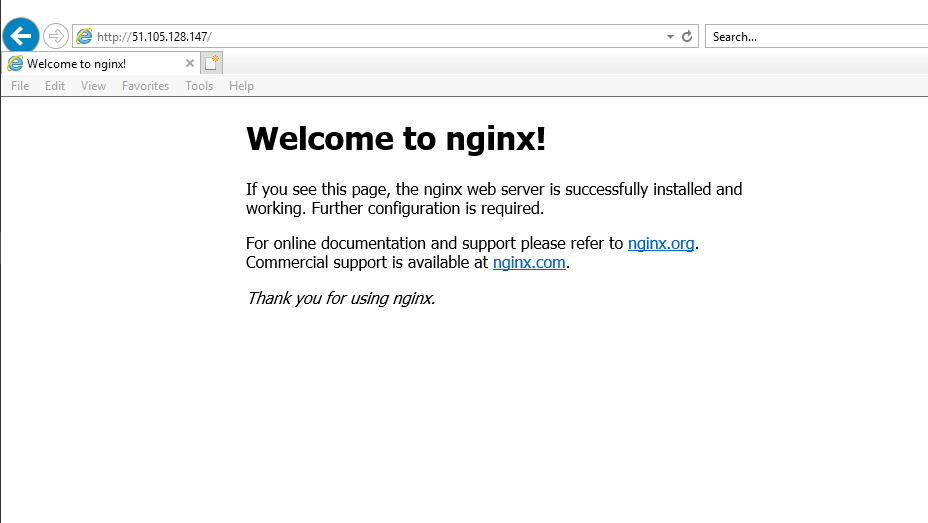

<i class="far fa-sticky-note"></i> **Note:** This post was updated on 2021-01-10 to suit latest AKS releases and capabilities.
{: .notice--info}
{: .text-justify}



This is a first part of my Azure Kubernetes Services blog series. In this post we will take a look how to create an AKS cluster and deploy first application.

Probably all of you at least once heard about Kubernetes (K8S) which is for sure most popular container orchestration platform. All major cloud players like Google, AWS and Microsoft are offering Kubernetes services in their environment. If I’m not mistaken first K8S release was in 2015 and since that moment it becomes more and more popular not only in cloud environment but on-premises as well. I will not going to explain all Kubernetes components and concepts as this will require to write a book. Kubernetes are quite complex solution and really huge topic and definitely requires some time to become familiar. For those of you who are just starting a Kubernetes journey I can recommend few resources which helped me a lot to understand this technology. Here is my top resources:

* https://kubernetes.io/docs/home/ – This is a home of Kubernetes and here you will find all answers for your questions.

* https://www.manning.com/books/kubernetes-in-action – This is Holly Bible of Kubernetes and probably one of the best books about Kubernetes. Highly recommended.

* https://docs.microsoft.com/en-us/azure/aks/ – Microsoft documentation related to AKS.

* https://github.com/kelseyhightower/kubernetes-the-hard-way – Learn how to deploy Kubernetes in a hard way.

* https://github.com/kubernetes/minikube – if you do not have possibilities to deploy K8S in the cloud you can use Minikube and deploy mini Kubernetes cluster on your own laptop in a minutes. This will be very useful for training and learning purposes.

* https://github.com/David-VTUK/CKA-StudyGuide – will be useful in preparation for Certified Kubernetes Administrator (CKA) exam.

* https://www.udemy.com/certified-kubernetes-administrator-with-practice-tests/ – this is not free but quite good online courses designed to prepare for CKA. The price is really low currently only 11.99 Eu/.

* https://github.com/mvallim/kubernetes-under-the-hood – good resource to understand how everything works in K8S.

In this blog series I would like to focus on various infrastructure activities such as AKS cluster deployment, updating, monitoring and maintenance and etc. So let’s get started.

First thing which will be necessary to have is Azure CLI. This will be a main tool which we will use for AKS cluster deployment. To install or update your Azure CLI simply run this PowerShell command on your management machine:

```powershell
Invoke-WebRequest -Uri https://aka.ms/installazurecliwindows -OutFile .\AzureCLI.msi; Start-Process msiexec.exe -Wait -ArgumentList '/I AzureCLI.msi /quiet'
```

Probably a bit out of topic, but I highly recommend you to start using [VS Code] for all your scripting and development task. It’s already few year when VS Code is a #1 tool in my admin tasks. Particularly for Azure CLI it has awesome extension called “Azure CLI Tools” which helps a lot in Azure CLI scripts writing:



VS code has a lot of extensions for different programming and scripting languages and will be super handy for your daily tasks and it’s absolutely free 😉.

So we now have Azure CLI installed on our system. Next thing which also will be needed in order to interact with Kubernetes cluster is a Kubectl tool which is a command line interface for running commands against Kubernetes clusters. There are several ways how to install Kubectl. For example you can download the latest Kubectl executive from HERE put it into appropriate path and for easier use configure the system path environment variable. You also can use package management tool like [Chocolatey] and install kubectl using it with command:

```powershell
choco install kubernetes-cli
```
Chocolatey is a package management tool for windows like apt or yum in Linux. I have found this tool pretty useful as it allows quickly install and update various applications without searching and downloading them in browser. Try it you will definitely 👍 it.

For simplicity this time we will use Azure CLI command which also can install Kubectl. Launch your preferred cli tool (CMD, PowereShell etc.) and run:

```bash
#Install kubectl
az aks install-cli

#Check the client version
kubectl version --client --short
```

We also going to install aks-preview extension for az aks subgroup. This will allow us to use additional options during cluster creation. Use the command bellow to install extension:

```bash
az extension add --name aks-preview
```

One of the things which we should decide before cluster creation is a version of Kubernetes what we would like to use in our deployment. By using Azure CLI command provided below you will get the list of available versions in the selected location as well as information about which version is default (if you will not specify a version during the cluster creation this version will be used) and which version is in preview state:

```bash
# Get available Kubernetes version in particular location
az aks get-versions --location "West Europe" -o table
```



For cluster creation we will use a az aks create command. aks create subgroup have a plenty of available parameters and this could help you to initially configure your cluster very precisely. However only two parameters (–name (name of your cluster) and –resource-group (resource group where you want to deploy AKS cluster) are required to be specified. You can examine all available options by running:

```bash
# List all available options ans some examples
az aks create --help
```

As I said almost all parameters are not required but be aware that lot of them could not be changed after the deployment and if you will not specify them then default values will be taken, so plan your deployment accordingly. Also it is worth to mention that big part of listed options are related to the AKS network. In AKS we have two types of networking which is default AKS Kubernetes network plugin “kubenet” and more advanced “azure” network plugin. The main differences between them according [MS docs] are:

* With kubenet, nodes get an IP address from a virtual network subnet. Network address translation (NAT) is then configured on the nodes, and pods receive an IP address “hidden” behind the node IP. This approach reduces the number of IP addresses that you need to reserve in your network space for pods to use.

* With [Azure Container Networking Interface (CNI)], every pod gets an IP address from the subnet and can be accessed directly. These IP addresses must be unique across your network space, and must be planned in advance. Each node has a configuration parameter for the maximum number of pods that it supports. The equivalent number of IP addresses per node are then reserved up front for that node. This approach requires more planning, and often leads to IP address exhaustion or the need to rebuild clusters in a larger subnet as your application demands grow.

For initial deployment it is very important to choose appropriate VM size for your cluster nodes because you can’t change size after the deployment (this I think will be changed add some point). The good thing is that already now AKS have multiple node pools feature in preview. This will allow you to add additional node pools to your cluster and when you adding a new pool you can choose some other VM size for that pool nodes and then you can deploy your pods accordingly on those nodes which will suit application requirements. We will cover AKS node pools in upcoming posts. You can use these CLI commands to get info about available VM sizes:

```bash
# Use this command to list all available VM sizes in a selected location. 
az vm list-skus --location westeurope --query "[].{Name:name, Size:size, Tier:tier}" --output table

# Use this command to get detailed info of particular VM size 
az vm list-skus --location westeurope --query "[?name=='Standard_D2_v2']"
```

We are almost ready to start an AKS cluster deployment and run our Azure CLI script. This is a script which you can use to deploy and AKS from scratch:

```bash
#Define Variables
GROUP_NAME="sysadminas-aks"
NODE_GROUP_NAME="sysadminas-aks-nodes"
SUBSCRIPTION="Visual Studio Premium with MSDN" # Subscription where resource will be deployed
LOCATION="West Europe" # Azure Region for you resources
AKS_CLUSTER_NAME="sysadminas" # Your AKS cluster name
COUNT_OF_NODES="2" # How many nodes will be in your cluster
NODE_POOL_NAME="default" # Name for your nodes pool
K8S_VERSION="1.14.6" # Version of kubernetes in your cluster
VM_SIZE="Standard_B2s" # Size for VM's in you cluster 
CLUSTER_VNET_NAME="sysadminas-k8s-vnet" # Vnet name which will be used for your cluster 
CLUSTER_SUBNET_NAME="sysadminas-K8S-Subnet" # Subnet name which will be used for your cluster
ADMIN_USER="sysadminas" # Local admin username on your cluster nodes
ADMIN_GROUP_NAME="aks-admins" # AAD admin Group which will have cluster admin permissions assigned

# Login to azure 
az login --username andrej@sysadminas.eu

# Select appropriate subsription
az account set --subscription $SUBSCRIPTION

# Create a resource group 
az group create --location $LOCATION --name $GROUP_NAME

# Create virtual network for Kubernetes cluster
az network vnet create --name $CLUSTER_VNET_NAME --address-prefixes 10.0.0.0/8 --resource-group $GROUP_NAME 

# Create a Subnet for Kubernetes nodes and pods
az network vnet subnet create --vnet-name $CLUSTER_VNET_NAME --address-prefixes 10.10.0.0/16 --name $CLUSTER_SUBNET_NAME --resource-group $GROUP_NAME

# Select subnet ID and save it as variable
VNET_SUBNET_ID=$(az network vnet subnet show --vnet-name $CLUSTER_VNET_NAME --name $CLUSTER_SUBNET_NAME --resource-group $GROUP_NAME --query id)
VNET_GROUP_SCOPE=$(az group show --name $GROUP_NAME --query id --output tsv)
 
# Select AAD Admin Group ID and save it as a variable
$AAD_ADMIN_GROUP_ID=$(az ad group list --filter "displayname eq 'aks-admins'" --query [].objectId -o tsv)

# Assign a Network Contributor role for AKS Service principal. Scope is a resource group where our vNet sits.
az role assignment create --assignee $AKS_SP_APP_ID --scope $VNET_GROUP_SCOPE --role "Network Contributor"

# Create AKS cluster 
az aks create --enable-rbac --enable-aad \
    --uptime-sla "Free" \
    --resource-group $GROUP_NAME \
    --aad-admin-group-object-ids $AAD_ADMIN_GROUP_ID \
    --node-resource-group $NODE_GROUP_NAME \
    --node-osdisk-size 50 \
    --name $AKS_CLUSTER_NAME \ 
    --nodepool-name $NODE_POOL_NAME \ 
    --admin-username $ADMIN_USER \
    --node-vm-size $VM_SIZE \
    --node-count $COUNT_OF_NODES \ 
    --kubernetes-version $K8S_VERSION \ 
    --network-plugin azure \
    --load-balancer-sku standard \ 
    --vm-set-type VirtualMachineScaleSets \ 
    --docker-bridge-address 172.17.0.1/16 \
    --vnet-subnet-id $VNET_SUBNET_ID \
    --service-cidr 10.20.0.0/16 \
    --dns-service-ip 10.20.0.10 \
    --max-pods 100 \
    --network-policy azure \ 
    --enable-managed-identity \  
    --verbose

# Get Kuberenetes Credetentials
az aks get-credentials --resource-group sysadminas-aks --name sysadminas --admin
```

As you may noticed we deploying our cluster with advanced networking so we also creating a Vnet and subnet in it for the cluster nodes and pods. For advanced networking we also defined a CIDR for Kubernetes services as well as a CIDR for the Docker bridge network address. Make sure that advanced network parameters for your deployment planned accordingly and matches Microsoft recommendations.

After the several minutes our cluster should be deployed and ready for use. Before we will be able to interact with our cluster via “kubectl” we need to add a context to our kubeconfig file (default location of kubeconfig file %userprofile%\.kube\config ). To do this we will run CLI command:

```bash
# Get AKS cluster credentials and add to kubeconfig
az aks get-credentials --resource-group sysadminas-aks --name sysadminas --admin
```

Next it might be needed to change current context to the newly added. Normally if you never been connected to any Kubernetes cluster from your management device this previously added context will be set as current automatically. To view all possible contexts execute:

```bash
# List contexts
kubectl config get-contexts
```



To start using needed context run:

```bash
# Set context to use 
kubectl config use-context "Put-Name-of-your-context-Here"
```

Now we are ready to take a look on our cluster from Kubernetes point of view. For example let’s check for existing nodes, pods and services and ensure that their IP addresses are configured according the parameters we used during the cluster deployment:

```bash
# Get the pods info from all namespaces
kubectl get pods --all-namespaces -o wide
```



```bash
# Get the services info from all namespaces
kubectl get services --all-namespaces -o wide
```



```bash
# Get the nodes info 
kubectl get nodes -o wide
```



As you can see everything is looks correct and we can do deployments to our cluster. As example we will take probably most popular image which is NGINX web server. First save this as NGINX.yml file

```yaml
apiVersion: v1
kind: Namespace
metadata:
  name: sysadminas 
---
apiVersion: v1
kind: Pod
metadata:
  namespace: sysadminas
  name: nginx
  labels:
    app: nginx
    environment: sysadminas
spec:
  containers:
  - image: nginx
    name: nginx
    ports:
    - containerPort: 80
      protocol: TCP    
---
kind: Service
apiVersion: v1
metadata:
  name:  nginx
  namespace: sysadminas
spec:
  selector:
    app: nginx
    environment: sysadminas
  type:  LoadBalancer
  ports:
  - port:  80
    targetPort:  80
```

Then run:

```bash
# Create resources using NGINX.yml manifest
kubectl create -f NGINX.yml
```

This will create a namespace a pod and service for our application. You can qucikly review the deployment by running:

```bash
# Get all resources from particular namespace 
kubectl get all -n sysadminas -o wide
```



Our service type is a LoadBalancer so we can check our application from external source reaching it by service External-IP. In my case this will be http://51.105.128.147



As you can see we get a default nginx page so we successfully deployed and app on our AKS cluster and exposed it to the external world.

To remove the test application and it’s dependencies run:

```bash
# Delete namespace and resources in it
kubectl delete namespace sysadminas
```
So, that’s it for today I hope this will be informative to you. See you soon in the next post where we will continue to overview Azure Kubernetes Services 🤜🤛

<!-- Links -->
[VS Code]: https://code.visualstudio.com/
[HERE]: https://storage.googleapis.com/kubernetes-release/release/v1.16.0/bin/windows/amd64/kubectl.exe
[Chocolatey]: https://chocolatey.org/
[MS docs]: https://docs.microsoft.com/bs-latn-ba/azure/aks/configure-azure-cni
[Azure Container Networking Interface (CNI)]: https://github.com/Azure/azure-container-networking/blob/master/docs/cni.md