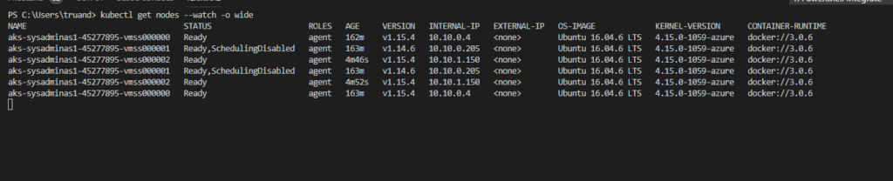
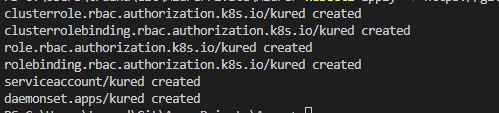
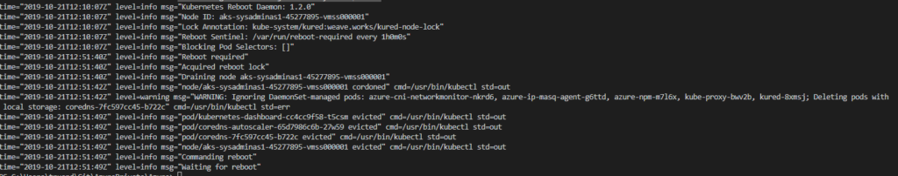

In the second part of AKS series I would like to take a look on how to upgrade AKS clusters kubernetes orchestrators and how to deal with OS updates. 
[In the previous part of AKS blog] series we created an AKS cluster and deployed simple application. In order to keep your Kubernetes system up to date, be able to use latest features and have all latest security fixes we as cluster admins should constantly update our Kubernetes version and also make sure that our K8S nodes operating system is patched and safe. So today we will overview how to deal with these two processes in AKS environment.
We will start from Kubernetes orchestrators version upgrade. Let’s clarify a bit K8S versioning, according official documentation Kubernetes versions are expressed as x.y.z, where x is the major version, y is the minor version, and z is the patch version. The Kubernetes project maintains release branches for the most recent three minor releases. At time of me writing this blog post latest minor version is 1.16 that means K8S versions 1.15 and 1.14 are also supported. Now let’s check current K8S version in our AKS cluster:

```bash
# Check AKS Kubernetes version using Azure CLI
az aks show --resource-group $GROUPNAME --name $AKS_CLUSTER_NAME --query "kubernetesVersion" --output table

# Check Kubernetes version using kubectl
kubectl get nodes -o wide
# or 
kubectl version --short 
```


As you can see K8S version in my cluster is 1.14.6. Where 1 – is a major version, 14 – is a minor version and 6 – is a patch version. Unlike on premises Kubernetes clusters we can’t upgrade AKS Kubernetes to any version we want. For example currently it’s not possible to upgrade AKS to latest version 1.16.x. In AKS we only can choose from the versions which are at the moment available in our Azure location. As my cluster located in “West Europe” I’m going to check available versions in this region:

```bash
# Shows available Kubernetes versions
az aks get-versions --location "West Europe" --query "orchestrators" --output table
```

Here is the result for my cluster location:


As you can see the latest available version for my AKS cluster is 1.15.4 which is marked as preview version. The important thing to keep in mind when preparing for Kubernetes version update is that you cannot skip minor version during upgrade process. That means if your current Kubernetes version is 1.13.11 you can’t upgrade directly to 1.15.3 version and you first should upgrade to 1.14.6. In AKS cluster you can check to which version you can upgrade from your current version by running:

```bash
# Shows available versions and possible upgrades
az aks get-versions --location "West Europe" --output table 
```

The output for command provided above will be like this:


According the output I can directly upgrade my cluster to version 1.14.7, 1.15.3(preview) or 1.15.4(preview). As this cluster is created only for demo purposes I will upgrade it to the latest available version which is 1.15.4 (preview). For production environment this definitely not recommended to land on a preview version.

<i class="far fa-sticky-note"></i> **Note:** Before you start the upgrade process make sure that your cluster is not overloaded and have enough compute resource otherwise upgrade process may fail.
{: .notice--info}
{: .text-justify}

To start an upgrade process execute:

```bash
# Start cluster upgrade to version 1.15.4
az aks upgrade --resource-group sysadminas-aks --name sysadminas --kubernetes-version 1.15.4
```

Then you start an upgrade process you may notice that nodes count in your cluster will be increased by one. This is expected behavior because according [MS documentation] during the upgrade process, AKS adds a new node to the cluster that runs the specified Kubernetes version, then carefully [cordon and drains] one of the old nodes to minimize disruption to running applications. When the new node is confirmed as running application pods, the old node is deleted. This process repeats until all nodes in the cluster have been upgraded. You can follow the upgrade process by running `kubectl` command:

```bash
# Watch Kubernetes nodes status
kubectl get nodes --watch -o wide
```



After the 10-15 minutes upgrade process was finished. If we now check the version of our cluster it should be 1.15.4


<i class="far fa-sticky-note"></i> **Note:** Microsoft claims that there is a total allowed time for a cluster upgrade to complete. This time is calculated by taking the product of 10 minutes * total number of nodes in the cluster. So my 2 node cluster upgrade process should succeed in 20 minutes.
{: .notice--info}
{: .text-justify}

We now have our Kubernetes version up to date, but how about OS updates of our AKS cluster nodes? You can view OS and Kernel version with `kubectl`

```bash
#Get Kubernetes nodes wide info
kubectl get node -o wide
```


It’s essential thing to have installed all latest security patches and keep our environment protected and safe. For Linux based AKS nodes Microsoft automatically applies updates. These update include OS security fixes and kernel updates. AKS Linux nodes uses Ubuntu VM’s and OS is configured to auto check and update nodes every night. As expected such kind of updates may require a node reboot and this process is not automated and should be handled by AKS cluster admin. The simplest way is to use [Kured].

Kured (Kubernetes Reboot Daemon) is a Kubernetes daemonset that performs safe automatic node reboots when the need to do so is indicated by the package management system of the underlying OS. What Kured do:

* Watches for the presence of a reboot sentinel e.g. /var/run/reboot-required
* Utilises a lock in the API server to ensure only one node reboots at a time
* Optionally defers reboots in the presence of active Prometheus alerts or selected pods
* Cordons & drains worker nodes before reboot, uncordoning them after

Installation of Kured is pretty simple just deploy a manifest file by executing:

```bash
# Deploy kured Daemon set:
kubectl apply -f https://github.com/weaveworks/kured/releases/download/1.5.0/kured-1.5.0-dockerhub.yaml
```

This will create a several resources in your cluster “kube-system” namespace:



Kured deployed as daemonset so this means each node will have one kured pod running on it.


You also can do some additional [configurations] changes before deployment. Kured checks your nodes for pending reboot every 1 hour. If reboot is required your node will be cordoned (new pods can’t be scheduled any more on that node) and then drained (existing pods will be safely evicted from the node) after this node will be rebooted and uncordoned (node returned to a normal state and new pods can be scheduled). If needed you can review the logs of your Kured pods:

```bash
# Get previuos kured container logs, generated prior reboot. In my case pod name is "kured-fq2j2". Yours will be different. 
# -p=true - prints the logs for the previous instance of the container in a pod if it exists
kubectl logs  kured-fq2j2 -n kube-system -p=true
```

This command will show logs which were generated by Kured pod till the node was rebooted



As you can see Kured detected a required reboot drained the node and initiated a node reboot. After reboot Kured container is also restarted.
We can retrieve actual logs from all kured pod by running this simple script:

```bash
PODS=($(kubectl get pods -n kured -o name))
for pod in "${PODS[@]}"
do
 echo "*************************************"$pod"********************************************"
 kubectl logs "$pod" -n kured
 echo "***************************************************************************************"
done
```


From logs we see that after reboot our node was automatically uncordoned by Kured and pods can be scheduled on that node again.

We now have completely up to date AKS cluster and ready to safely host applications 😎

This is pretty much all for today. I hope this will be informative to you and would like to thank you for reading.

See you 🤜🤛

<!-- Links -->
[In the previous part of AKS blog]: https://sysadminas.eu/
[Official Documentation Kubernetes]: https://kubernetes.io/docs/setup/release/version-skew-policy/#supported-versions
[MS documentation]: https://docs.microsoft.com/en-us/azure/aks/upgrade-cluster
[cordon and drains]: https://kubernetes.io/docs/tasks/administer-cluster/safely-drain-node/
[Kured]: https://github.com/weaveworks/kured
[configurations]: https://github.com/weaveworks/kured#configuration
