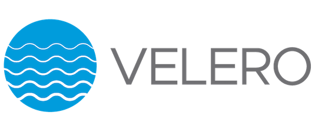


In the third part of Azure AKS series we will overview how we can backup our Kubernetes cluster using Velero.

Backup is essential part of any IT system and Kubernetes is not exception. If your application is stateless you probably may survive without backups of your AKS environment as you can simply redeploy your application from yaml manifest files, but if you have a lot of them or you application are stateful and uses some persistent storage you definitely need a backup to be able to restore your data to the particular point in time and be sure that you will not loose everything in case of accidental deletion or other possible failures. To be honest at this time I don’t know many backup solutions for AKS or Kubernetes it self, but at least one is exist and it’s [Velero].
Velero (formerly Heptio Ark) gives you tools to back up and restore your Kubernetes cluster resources and persistent volumes. Velero consists of two parts:

* A server that runs on you cluster
* A command-line that runs locally

If you would like to get detailed explanation how Velero works please refer to the original [project documentation]

## Install Velero CLI

Let’s start with installing Velero. First thing which will be needed is a Velero command-line utility. Download appropriate version and extract it to the desired folder then for simplicity add this location to system path environment variables. This will allow us to use Velero utility without specifying each time a path to Velero executable.

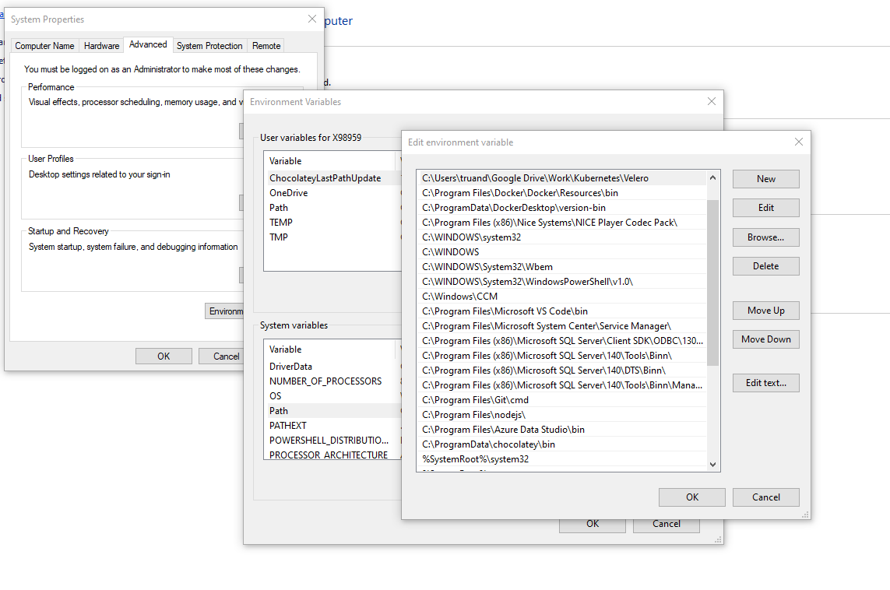

After you do this you should be able to use Velero cmd from anywhere using your favorite shell:

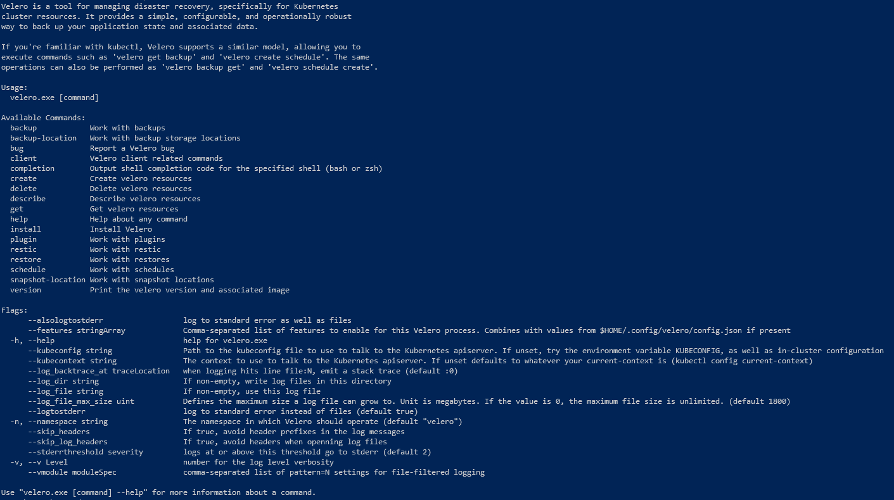

## Install Velero

Based on Velero documentation I prepared a single script which will prepare all required Azure resources and install Velero server on your Azure AKS cluster:

```bash
#Define Variables
USERNAME="admin@sysadminas.eu" # User for authenticate in azure
SUBSCRIPTION="Visual Studio Premium with MSDN" # Subscription where resource will be deployed
VELERO_RESOURCE_GROUP_NAME="Velero-Sysadminas-Backup" # Resource group where storage account will be created and used to store a backups
VELERO_STORAGE_ACCOUNT_NAME="velerosysadminas" # Storage account name for Velero backups 
VELERO_BLOB_CONTAINER_NAME="velerocontainer" # Blob container for Velero backups
LOCATION="WestEurope" # Azure region for your resources
VELERO_SP_NAME="SysadminasVelero" # A name for Velero Azure AD service principal name
AKS_RESOURCE_GROUP="MC_sysadminas-aks_sysadminas_westeurope" # Name of the auto-generated resource group that is created when you provision your cluster in Azure
 
# Login to Azure
az login --username $USERNAME
# Select appropriate subscription 
az account set --subscription $SUBSCRIPTION
# Create a resource group for Velero
az group create --location $LOCATION --name $VELERO_RESOURCE_GROUP_NAME
# Create Storage account for Velero
az storage account create --name $VELERO_STORAGE_ACCOUNT_NAME \
    --resource-group $VELERO_RESOURCE_GROUP_NAME \ 
    --location $LOCATION \
    --kind StorageV2 \
    --sku Standard_LRS \ 
    --encryption-services blob \ 
    --https-only true \
    --access-tier Hot
# Create a storage blob container 
az storage container create --name $VELERO_BLOB_CONTAINER_NAME --public-access off --account-name $VELERO_STORAGE_ACCOUNT_NAME
# Create Azure AD service principal with contributor role for Velero and query it's password to a variable
$VELERO_SP_APP_PASSWORD = az ad sp create-for-rbac --name $VELERO_SP_NAME --role "Contributor" --query 'password' --output tsv
# Save Velero service principal application ID to a variable
$VELERO_SP_APP_ID =  az ad sp list --display-name $VELERO_SP_NAME --query [0].appId --output tsv
# Save Subscription ID as a variable
$SUBSCRIPTION_ID = az account show --subscription $SUBSCRIPTION --query id --output tsv
# Save Tenant ID as a variable
$SUBSCRIPTION_TENANT_ID = az account show --subscription $SUBSCRIPTION --query tenantId --output tsv
 
# Create a credentials file for Velero
Echo "AZURE_SUBSCRIPTION_ID=$SUBSCRIPTION_ID" >> credentials-velero
Echo "AZURE_TENANT_ID=$SUBSCRIPTION_TENANT_ID" >> credentials-velero
Echo "AZURE_CLIENT_ID=$VELERO_SP_APP_ID" >> credentials-velero
Echo "AZURE_CLIENT_SECRET=$VELERO_SP_APP_PASSWORD" >> credentials-velero
Echo "AZURE_RESOURCE_GROUP=$AKS_RESOURCE_GROUP" >> credentials-velero
 
# Install Velero on your AKS cluster.
velero install --provider azure 
  --bucket $VELERO_BLOB_CONTAINER_NAME \
  --secret-file ./credentials-velero \
  --plugins velero/velero-plugin-for-microsoft-azure:v1.0.0 \ 
  --backup-location-config resourceGroup=$VELERO_RESOURCE_GROUP_NAME,storageAccount=$VELERO_STORAGE_ACCOUNT_NAME \
  --snapshot-location-config apiTimeout="5m",resourceGroup=$VELERO_RESOURCE_GROUP_NAME,subscriptionId=$SUBSCRIPTION_ID 
```

After successful script execution a new namespace called “velero” will be created in your cluster. Run the command bellow to make sure that resources are deployed and they are in running state.

```bash
kubectl get all -n velero
```

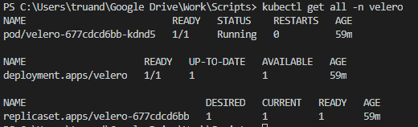

Use next command to check the deployment logs and make sure that there is no errors during deployment:

```bash
kubectl logs deployment/velero -n velero
```

## Stateless application backup & restore

OK, we now have Velero deployed in our AKS cluster and can try to test our backup solution. For testing purposes lets deploy NGINX stateless application. We already know how to do it from my first AKS series blog post. Save the following configuration into nginx-stateless-test.yaml (make sure to change labels, namespace name etc. ) in desired directory:

```yaml
apiVersion: v1
kind: Namespace
metadata:
  name: sysadminas  
---
apiVersion: v1
kind: Pod
metadata:
  namespace: sysadminas
  name: nginx
  labels:
    app: nginx
    environment: sysadminas
spec:
  containers:
  - image: nginx
    name: nginx
    ports:
    - containerPort: 80
      protocol: TCP   
--- 
kind: Service
apiVersion: v1
metadata:
  name:  nginx
  namespace: sysadminas
spec:
  selector:
    app: nginx
    environment: sysadminas
  type:  LoadBalancer
  ports:
  - port:  80
    targetPort:  80
```

Run this command to deploy the manifest file:

```bash
kubectl apply -f nginx.yaml
```

Now let’s run our first velero backup by executing:

```bash
velero backup create sysadminas-backup --include-namespaces sysadminas
```

To check the status of your backup use following command

```bash
velero backup describe sysadminas-backup
```

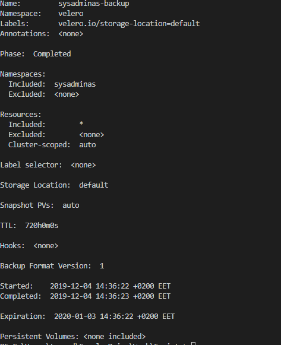

As you can see my backup status is completed after this you should be able to see your backup files in the storage account blob container which was created earlier.

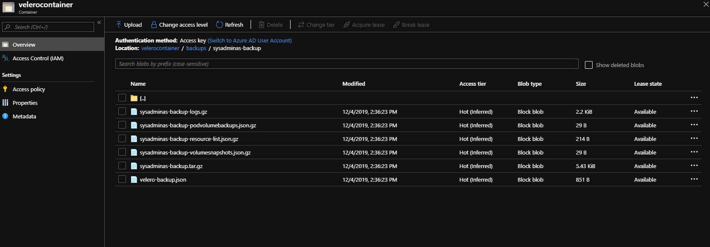

To retrieve detailed backup logs run:

```bash
velero backup logs sysadminas-backup
```

We already have a backup so now it’s time to test it and try restore procedure. First let’s delete our namespace including all resources by running:

```bash
kubectl delete namespace sysadminas
```

Now if we run kubectl get all -n sysadminas no resources will be found. To execute restore procedure run:

```bash
velero restore create --from-backup sysadminas-backup
```

To view the restore state run (your time stamp will be different):

```bash
velero restore describe sysadminas-backup-20191204150845
```

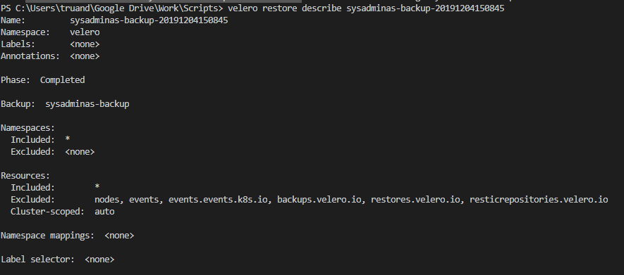

After restore completion you will see your namespace and resources available again in AKS cluster (of course load balancer service IP’s will be different, so it might require some changes on DNS after restore).

## Stateful application backup & restore

Now let’s take a look on a bit difficult example and try deploy and then backup/restore a stateful application. We will take same NGINX application, but this time we will also use a persistent volume which will be mounted to our container image. In AKS environment default storage class for persistent volume claim is a standard Azure managed disk. We will mount volume to /usr/share/nginx/html path this is a default directory NGINX serves files from. Then we will copy our custom index.html file to this path, this also means index.html file will be copied to our persistent volume as well. This way we will be able to check if our persistent volume data will be backed up and restored with Velero. So let’s deploy the application, for this save a configuration provided below as nginx-stateful-test.yaml.

```yaml
apiVersion: v1
kind: Namespace
metadata:
  name: sysadminaspv  
---
apiVersion: v1
kind: PersistentVolumeClaim
metadata:
  name: nginx-pvc
  namespace: sysadminaspv
spec:
  accessModes:
  - ReadWriteOnce
  storageClassName: default
  resources:
    requests:
      storage: 5Gi 
---
apiVersion: v1
kind: Pod
metadata:
  namespace: sysadminaspv
  name: nginx
  labels:
    app: nginx
    environment: sysadminaspv
spec:
  containers:
  - image: nginx
    name: nginx
    resources:
      requests:
        cpu: 100m
        memory: 128Mi
      limits:
        cpu: 250m
        memory: 256Mi
    volumeMounts:
    - mountPath: "/usr/share/nginx/html"
      name: volume
    ports:
    - containerPort: 80
      protocol: TCP
  volumes:
    - name: volume
      persistentVolumeClaim:
        claimName: nginx-pvc    
--- 
kind: Service
apiVersion: v1
metadata:
  name:  nginx
  namespace: sysadminaspv
spec:
  selector:
    app: nginx
    environment: sysadminaspv
  type:  LoadBalancer
  ports:
  - port:  80
    targetPort:  80
```

Next deploy the manifest by running:

```bash
kubectl apply -f nginx-stateful-test.yaml
```

As result you should have these resources deployed in the “sysadminaspv” namespace:

```bash
kubectl get pvc,pods,service -n sysadminaspv
```

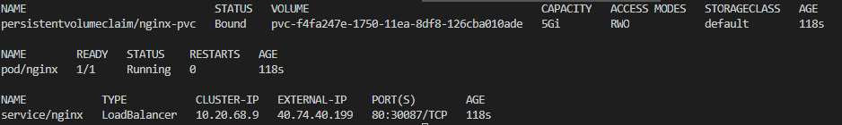

If we try to hit our NGINX web server on http://40.74.40.199 we will get an error:

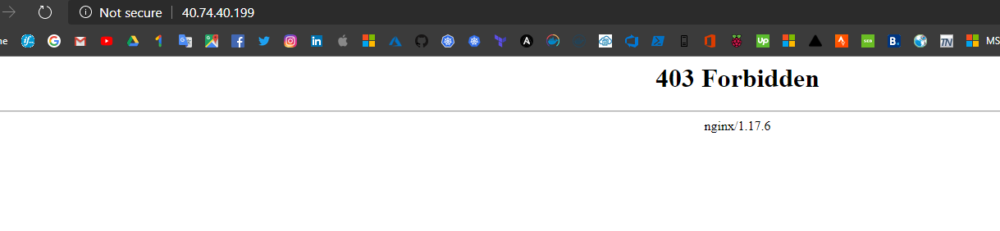

This is because default directory from where NGINX serves files is empty because it’s actually our persistent volume (Azure managed disk). You may see azure disk resource created in yours AKS automatic resource group:

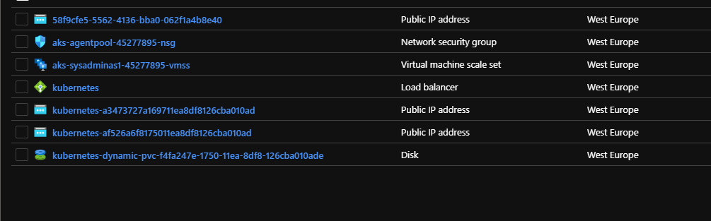

Ok now let’s add some files to our persistent volume. For this lets first create simple index.html with some custom content in it:

```html
<!DOCTYPE html>
<html>
<body style="background-color:blue;">
<font size="24">We are testing Velero backups for Kubernetes!</font>
<font size="24"><marquee>http://sysadminas.eu</marquee></font>
</body>
</html>
```

Next we need to copy this file to our NGINX container usr/share/nginx/html. To achieve this run the following command:

```bash
kubectl cp index.html sysadminaspv/nginx:/usr/share/nginx/html/
```

Now if we hit same http://40.74.40.199 we will see a different result 😊:

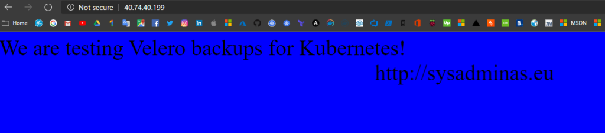

So the last, but not least is to backup and restore our namespace and check if our file will be restored. First lets run a Velero backup and check the results.

```bash
# Run the backup
backup create sysadminaspv-backup --include-namespaces sysadminaspv
```

To check the backup results and get more details run:

```bash
velero backup describe sysadminaspv-backup --details
```

The result will be something similar to:

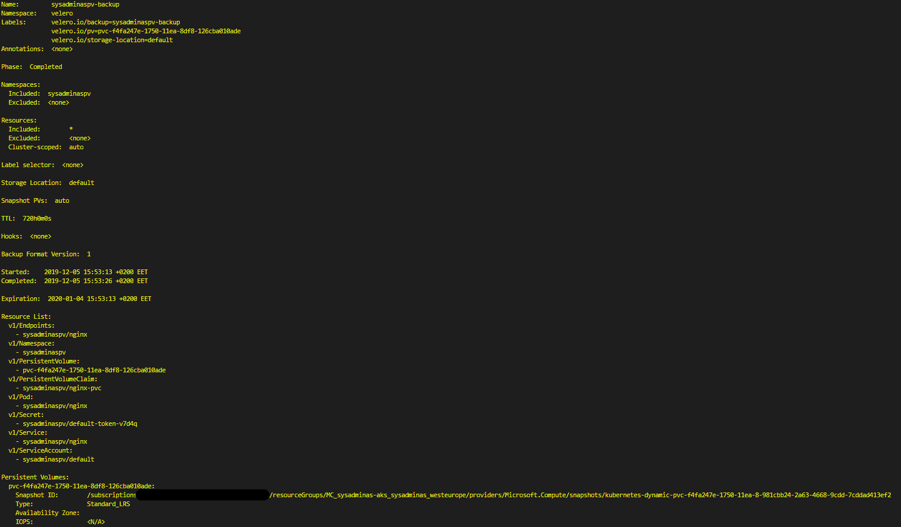

As you can see backup process created a snapshot for our azure managed disk. You also may see this additional snapshot resource in your Velero backup resource group:

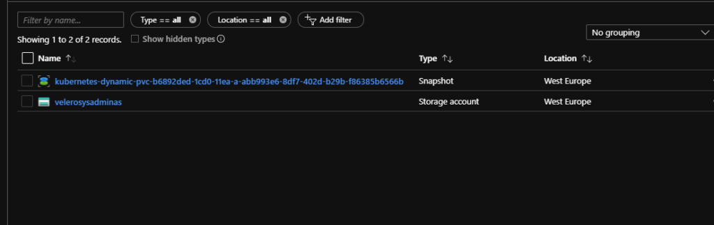

Now let’s delete a “sysadminaspv” namespace and run Velero restore from the recent backup.

```bash
# Delete namespace
kubectl delete namespace sysadminaspv
 
# Run restore
velero restore create --from-backup sysadminaspv-backup
```

When restore procedure will be finished you will see you namespace and all resources, including persistent volume claim, back to your cluster

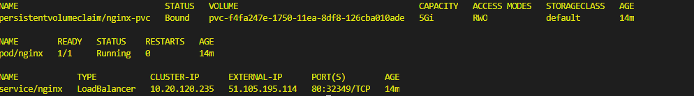

And if you will try to hit a page on it’s new address http://51.105.195.114/ (address changed after restoration) you will see the same custom index.html file 😎

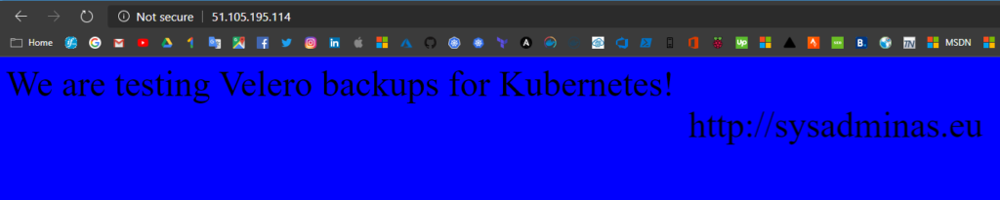

You actually can do restore to a different cluster all you need to do is to deploy Velero and point to the same backup storage account container. This way will allow you migrate your data from one cluster to another or easily restore you data to the new cluster in case of disaster.

This is pretty much all what I wanted to say today. I hope this will be useful for you. See you soon, cheers 🤜🤛

<!-- Links -->
[Velero]: https://velero.io/
[project documentation]: https://velero.io/docs/
[my first AKS series blog post]: https://sysadminas.eu/Part-1-AKS/
