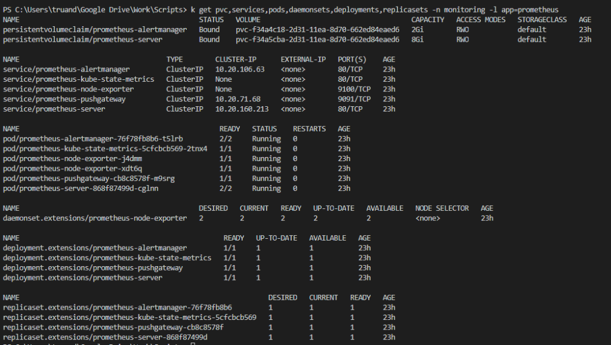
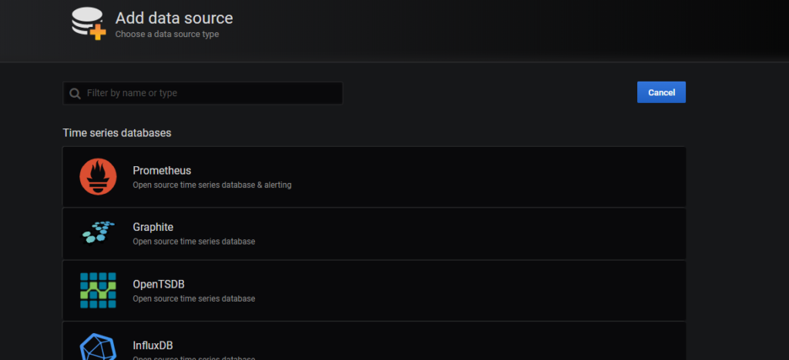
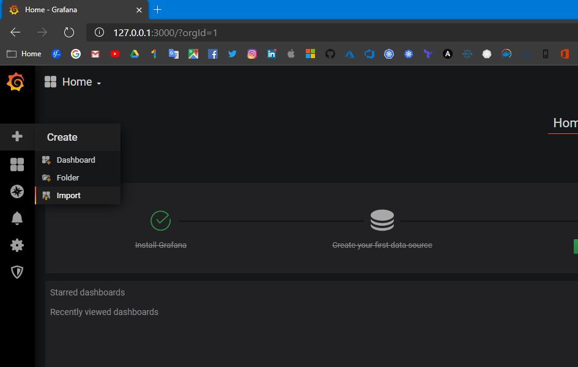
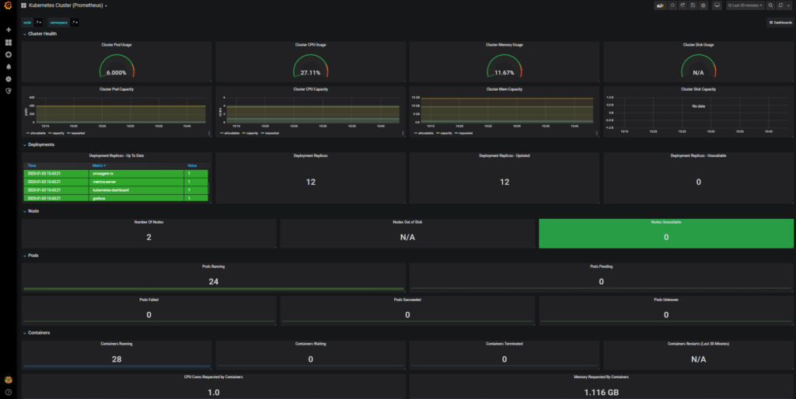

n 4th AKS series blog post we will take a look on how to monitor your Azure Kubernetes Cluster using two different solutions. One is Azure Monitor for Containers and the other is popular tandem `Prometheus` and `Grafana`.

Monitoring is a very important part of any IT ecosystem and Kubernetes is not exclusion. It’s necessary to know and make sure that:

* AKS cluster nodes not overloaded and you have enough cpu and memory on the nodes
* Pods are not failing and containers successfully running
* AKS storage is not approaching it’s capacity limits
* You have some metrics history like network, CPU, RAM, Disk usage and etc. for troubleshooting and observing purposes
* You have some history about your containers statuses (fails, terminations, restarts and etc.)
* You will be notified in a preferred way (email, slack chat, teams and etc.) in case if something will went wrong on your cluster.

For myself I discovered two possible ways on how to monitor your AKS cluster they actually can live in parallel or even could be connected together:

* Azure Monitor for containers
* Prometheus and Grafana

We will take a look on how to setup both solutions so let’s not waste time and go forward.

## Azure Monitor for containers

First we will take a look on how to use Azure built in capabilities to get some monitoring data about our AKS cluster. You can enable Azure monitor for your AKS cluster at any time either during initial deployment or after that. We already know how to deploy an AKS cluster from the [1st post of AKS series] so we will enable Azure Monitor for container on already existing cluster. First we need to have a deployed Azure Log Analytics workspace (of course you can use already existing workspace) and then configure our cluster by pointing it to this Log Analytics workspace. Here is the Azure CLI script which will help you to achieve this goal:

```bash
AKS_CLUSTER_NAME="sysadminas" # Your AKS cluster name
AKS_CLUSTER_NAME_RESOURCE_GROUPNAME="sysadminas-aks" # Your AKS cluster resource group name
SUBSCRIPTION = "Visual Studio Premium with MSDN" # Subscription where resource will be deployed
LOG_ANALYTICS_RESOURCE_GROUP_NAME = "sysadminas-aks" # Resource group where Log Analytics workspaces will be deployed
LOG_ANALYTICS_WORKSPACE_NAME = "sysadminas-oms" # Name for your Log Analytics resource
LOCATION = "westeurope" # Azure region for your resources
 
# Login to azure 
az login --username admin@sysadminas.eu
 
# Select appropriate subsription
az account set --subscription $SUBSCRIPTION
 
# Create Azure log analytics workspace 
az monitor log-analytics workspace create --resource-group $LOG_ANALYTICS_RESOURCE_GROUP_NAME --workspace-name $LOG_ANALYTICS_WORKSPACE_NAME --location $LOCATION
 
# Retrieve Log Analytics workspace ID and save it as a variable
$LOG_ANALYTICS_WORKSPACE_ID = az monitor log-analytics workspace list --resource-group $LOG_ANALYTICS_RESOURCE_GROUP_NAME --query [0].id -o tsv
 
# Enable Azure Container Service for existing cluster 
az aks enable-addons --addons monitoring --name $AKS_CLUSTER_NAME --resource-group $AKS_CLUSTER_NAME_RESOURCE_GROUPNAME --workspace-resource-id $LOG_ANALYTICS_WORKSPACE_ID
```

If you implementing this only for testing purposes make sure to change Log Analytic plan to free in order to avoid increased bills 🙂


Run the following command and you will see that there are few additional resource created and running on you AKS cluster:

```bash
kubectl get all -n kube-system -l component=oms-agent -o wide
```


After several minutes you should be able to observe results collected by recently installed oms agents. For this go to Azure Monitor and select Container blade in Insights section and then select your cluster


You can get a lot of useful information such compute load, controlers, pods, containers status and their configuration and a lot more, you also can view containers logs which might be very handy for troubleshooting. You also can start using Azure Monitor Alert which could trigger notification or some actions based on your provided rules. These rules can be based on different cluster metrics or logs. Here some possible views:


Additionally you may create your own or use some precreated interactive reports called [Workbooks] they combine text, analytics query’s, Azure Metrics, and parameters into rich interactive reports. This is also a good way to share info with other teams:


In Azure AKS master node (as well as etcd) is hidden from user and we can’t connect or use it directly (only through the API), but one thing which we could do additionally is to enable Kubernetes master node logs in Azure Kubernetes Service (AKS). For this go to your AKS cluster resource group and select Diagnostic settings blade. Then click on your cluster and select Add diagnostic setting:


Then select which log and where you would like to save them, I suggest to use same Log Analytics Workspace what we used for Azure Container Monitor:


When you will configure this after a while you should be able to query appropriate information using Kusto query language. Simply go to the Azure Monitor, choose Logs blade and construct your query:

```kusto
AzureDiagnostics | where Category == "kube-apiserver"
or Category == "kube-audit" 
or Category == "kube-scheduler"
or Category == "cluster-scheduler"
or Category == "cluster-controller-manager"
or Category == "cluster-autoscaler"
```


## Prometheus and Grafana

OK, seems that we covered Azure Monitor solution for AKS and now we can move to some third party tools.

As I said earlier we will use [Prometheus] and [Grafana] as alternate monitoring solution for AKS clusters. To keep our solution implementation as simple as possible this time we will use HELM for provisioning both mentioned components. Helm is a package manager for Kubernetes and if you work with K8S you will start to use it at some point that’s for sure. I will not gonna cover all the aspects of Helm, but will show all the necessary steps you need to do in order to deploy Grafana and Prometheus. Anyway I highly recommend to become familiar with Helm if you are not [https://helm.sh/docs/] is the right point to start. Please refer to the [https://helm.sh/docs/intro/install/] to see how install Helm on your system.

When we have Helm installed we need to add and then update a Helm charts repository. For this run:

```bash
# Add Helm repository where "stable" is the name of repository (you can set any name you like)
helm repo add stable https://charts.helm.sh/stable
 
# Update the repository and make sure we get the latest list of charts 
helm repo update 
```
After this we can install a Prometheus on our AKS cluster. Generally speaking Prometheus will collect various metrics from our cluster. For installation run the following:

```bash
# Create a monitoring namespace 
kubectl create namespace monitoring
 
# Install Prometheus using Helm
helm install prometheus stable/prometheus --namespace monitoring --set rbac.create=true
```

After a while you can review installed components by running

```bash
kubectl get pvc,services,pods,daemonsets,deployments,replicasets -n monitoring -l app=prometheus
```

The output should be similar to this:



As you can see there several different Prometheus components installed on the cluster:

* [Prometheus alert manager]
* [Prometheus kube state metrics]
* [Prometheus node exporters]
* [Prometheus push gateway]
* [Prometheus server]

We now have Prometheus installed and it’s time to install Grafana which is a tool to visualize our metrics collected by Prometheus:

```bash
# Install Grafana using Helm
helm install grafana stable/grafana --namespace monitoring --set persistence.enabled=true,persistence.size=5Gi --set replicas=1
```

We can review installed components with

```bash
kubectl get pvc,services,pods,daemonsets,deployments,replicasets -n monitoring -l app=grafana
```

OK, we have Prometheus and Grafana installed and it time to connect them together. For this we first need to connect to Grafana web UI. In this tutorial I’m not going to expose Grafana’s service to the external world (if you want to do so change the Grafana’s Kubernetes service type from ClusterIP to LoadBalance) so we will use Kubernetes port forwarding feature to be able to connect to Grafana directly from management PC. For this run the following:

```bash
# Retrieve name of the pod which runs Grafana container image and save it as variable
$GRAFANA_POD_NAME=$(kubectl get pods --namespace monitoring -l "app=grafana,release=grafana" -o jsonpath="{.items[0].metadata.name}")
# Run port forward command this will allow us to access Grafana web UI from our management PC using http://127.0.0.1:3000/ and do further configurations
kubectl --namespace monitoring port-forward $GRAFANA_POD_NAME 3000
```

Also we need to retrieve admin password which is saved as a Kubernetes secret and encoded in base64 format. If you on Linux system run:

```bash
kubectl get secret --namespace monitoring grafana -o jsonpath="{.data.admin-password}" | base64 --decode ; echo
```

If you a windows guy run the following command and decode output value on [this page]

```powershell
kubectl get secret --namespace monitoring grafana -o jsonpath="{.data.admin-password}" 
```

So, port forwarding is running and we already have have admin credentials this mean we are ready to connect to Grafana web UI from our management PC on [http://127.0.0.1:3000/login]:


After the login we need to add our Prometheus server as a data source. We will use a Prometheus Kubernetes service IP to construct Prometheuse server URL required for Data Source configuration. To get the appropriate IP run:

```bash
kubectl get svc -n monitoring  -l app=prometheus,component=server
```


As you can see in my case 10.20.1.21 is the internal Prometheus server service IP and we will use it in further configuration steps.
So next press the “Add data source icon” and select Prometheus as source type:




Then in data source configuration set the Name for this data source and URL of your Prometheus server in my case the URL will be [http://10.20.1.21] where 10.20.1.21 is the internal Prometheus server Kubernetes service IP. Press Save & test.


Now it’s time to add some dashboards. You can create your own or use power of community and download already prepared dashboard templates from [https://grafana.com/grafana/dashboards?search=kubernetes] then you can easily import them:




Select template:


Choose one of selected templates:


After the successful import enjoy the view 😎:



So this is pretty much all for today from me about AKS monitoring. I hope this will be informative for you and would like to Thank You for reading.

See you soon 🤜🤛

<!-- Links -->
[1st post of AKS series]: https://sysadminas.eu/Part-1-AKS/
[Workbooks]: https://docs.microsoft.com/en-us/azure/azure-monitor/app/usage-workbooks
[Prometheus]: https://prometheus.io/
[Grafana]: https://grafana.com/
[https://helm.sh/docs/]: https://helm.sh/docs/
[https://helm.sh/docs/intro/install/]: https://helm.sh/docs/intro/install/
[Prometheus alert manager]: https://github.com/prometheus/alertmanager
[Prometheus kube state metrics]: https://github.com/kubernetes/kube-state-metrics
[Prometheus node exporters]: https://github.com/prometheus/node_exporter
[Prometheus push gateway]: https://github.com/prometheus/pushgateway
[Prometheus server]: https://github.com/prometheus/prometheus
[this page]: https://www.base64decode.org/
[http://127.0.0.1:3000/login]: http://127.0.0.1:3000/login
[http://10.20.1.21]: http://10.20.1.21
[https://grafana.com/grafana/dashboards?search=kubernetes]: https://grafana.com/grafana/dashboards?search=kubernetes