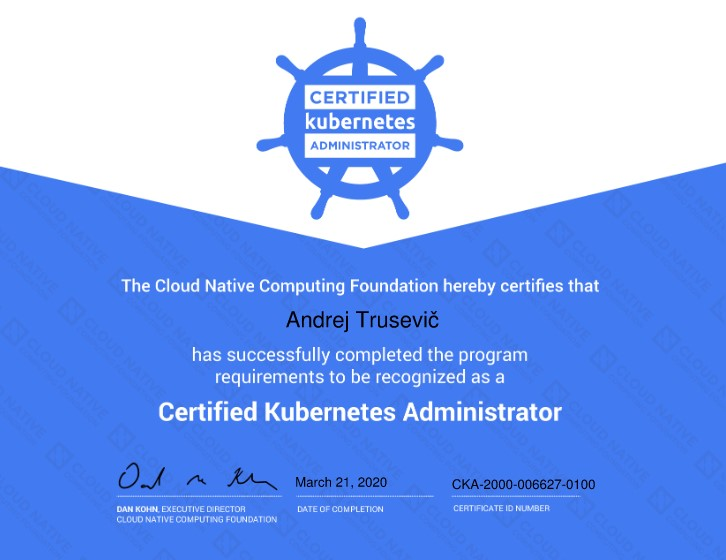
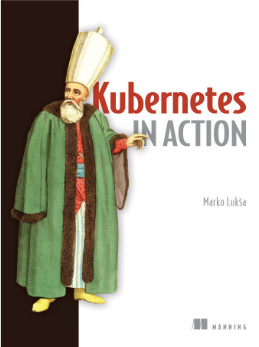

Hi, today I want to share 10 advises on how to prepare and pass the Certified Kubernetes Administrator exam.

It was quite silent on my blog for a few months and one of the reasons for this is that I took my time to prepare for a Certified Kubernetes Administrator exam. Few days ago I successfully completed my journey and unlocked this achievement so now I officially can call my self as a Certified K8S Admin.

In this post i will share some advises and hope they will be helpful in your CKA journey.

## 1. Decide do you really need this

First of all you should decide do you really need to have exactly this certification and what benefit you will get by achieving it maybe it might be better to invest you time in some other certification which will give more benefit to you and your company. There are a lot of learning paths in different areas like Azure, Google, AWS, RedHat and much more so you for sure have a huge choice. However Kubernetes is probably most hyped technology at the moment and having proved knowledge on K8S will always be a great benefit for you as employee.

## 2. Register for exam

So you have now decided to get the CKA certification the next thing you should do is register for exam. Why now? Registering for exam in the very beginning of your learning path will keep you motivated and having a deadline will force you to learn. At least such approach works for me. I use this method not only in learning but in sports as well. I registering for races very early (paying money of course) and this keeps me motivated and forces to train on those days when would better prefer to lay on sofa. CKA exam is not cheap typically it costs ~ 300$, but very often Linux Foundation launches promos and you can save up to 10-30% of exam costs. So go ahead and register for exam here on [Linux Foundation].

## 3. Find the right learning materials

Congratulations you now registered for exam and you are one step closer on becoming CKA admin. It’s time to start learning. There are a lot of various training sources exist, but I would like to point those which I have used and they worked for me for 100%. My Kubernetes journey started from this [book]:

In this book you will find almost everything you need to go from zero to hero in Kubernetes.

I also bought a [CKA training course from Udemy]. I paid for it only ~ 15 $, but I can say that it’s probably best course on CKA. Each aspect of CKA is covered here and you not only get the theory part but also a real practical web based environment where you should do some exercises and will get the answers in the real time. So make a time plan and start learning. From my experience I could say that I tried to dedicate at least one hour per day for CKA learning since I registered for exam and it took me ~ 2 month to fully prepare and feel confident.

You also should use official Kubernetes documentation during you preparation and make sure you can easily navigate through it and quickly find one or another topic this is necessary skill because you will be allowed to use [K8S documentation] during the exam.

## 4. Practice, Practice, Practice

CKA certification exam is fully practical so knowing the theory is not enough. You should be able to apply theory part in practice. I mean you must to do all the tasks starting from creating the resources and finishing with bootstrapping or troubleshooting the broken clusters. You should be able to use both imperative and declarative methods for deploying and updating cluster resources. You also need be confident with one the Linux text editors like vim or nano to be able quickly edit *.yaml resource definition files. Also practice to troubleshoot Linux services, check the journal events and be familiar with docker. For mastering your kubectl skills you can quickly install a [Minikube] on your laptop or use web based learning environments such as [Katacoda]. Also if choose to use Udemy CKA training course you will able to use their [KodeKloud] environment for practice.

## 5. Ask community if needed

Even after completing the training course or reading K8S books some quiestions may stay unanswered. To close those ones I encourage you to use https://discuss.kubernetes.io or go to the [kubernetes slack channel] which even has separate thread for CKA exam discussion. I’m pretty sure you will find the answers for all you questions here. Kubernetes community is awesome.

## 6. Evaluate your knowledge level

When you will complete your learning and will fill confident with practice part of kubernetes it’s time to evaluate your knowledge to be sure that you are really ready for the last step. There are a lot of resources on the github with various kubernetes tasks created specially for practice CKA exam. Again if you will choose Udemy course you will have possibilities to use their exam emulator where you will be asked to complete some exercises in a limited amount of time. You also will get the score immediately after completing the exam. Most probably other training resources also have such training exams opportunities. Also during this exam emulation part try to use only official kubernetes.io documentation.

## 7. Make it bit easier legally

As I already mentioned you will be able to use official kubernetes documentation so I highly recommend to create a CKA bookmarks and use them during the exam this way you will be able to quickly find particular topic and save time on searching. For me this tip was very useful.

## 8. Taking an exam, what to expect?

First of all carefully read and understand these official CNCF exam documentation. Make sure the place where you will take a exam will meet all the requirements. From my personal experience you may expect questions related to:

* ETCD
* Daemonsets
* Deployments
* Static pods
* Secrets
* Volumes
* Troubleshooting cluster nodes
* Creating new clusters with kubeadm
* Kubernetes DNS
* Init containers
* Know how to filter and sort kubernetes resources

You will have 3 hours to complete exam and I can say that you should be quick and know the material * very well in order to complete all the exercises in time. If you fill that you are struggling with the question I would recommend better flag it and return later if you will have time. Personally I completed all tasks exactly in 3 hours maybe only few minutes were left.

## 9. It’s OK to fail

Unlike Microsoft exams I had previously you will not get the result immediately after completing the CKA exam and it can take up to 36 hours till you get a email with your score. This waiting period was a bit nervous for me 🤞. I received an email ~ after 30 hours and it was success with total score 89% to pass the exam your score should be minimum 74% . However if you will not pass during the first attempt do not despair CKA exam is not easy and I think this is absolutely normal to fail and retake. Next time you will know what to expect and also you will be able to take your time to improve those areas where you struggled during the first attempt. It also worth to mention that second try will be given to you for free.

## 10. The last, but not least

Last thing I want to share with you is a google sheet where i collected a lot of information like commands cheat sheet, all exam objectives with appropriate links to the documentation, links to other CKA related blogs, all my CKA bookmarks and more. I hope this will make your CKA journey a bit easier. You can view the file [HERE].

I wish you good luck and I’m pretty sure you will soon join the CKA admin club 🤜🤛.

<!-- Links -->
[Linux Foundation]: https://training.linuxfoundation.org/certification/certified-kubernetes-administrator-cka-jp/
[book]: https://www.manning.com/books/kubernetes-in-action
[CKA training course from Udemy]: https://www.udemy.com/course/certified-kubernetes-administrator-with-practice-tests/
[K8S documentation]: https://kubernetes.io/docs/home/
[Minikube]: https://kubernetes.io/docs/tasks/tools/install-minikube/
[Katakoda]: https://www.katacoda.com/courses/kubernetes
[KodeKloud]: https://kodekloud.com/
[https://discuss.kubernetes.io]: https://discuss.kubernetes.io
[kubernetes slack channel]: https://slack.k8s.io/
[CNCF exam documentation]: https://training.linuxfoundation.org/cncf-certification-candidate-resources/
[HERE]: https://drive.google.com/open?id=1mYzfkxu1Iaup3KgO7zhbz7C4nFadSEvogo-lDaFIXK0