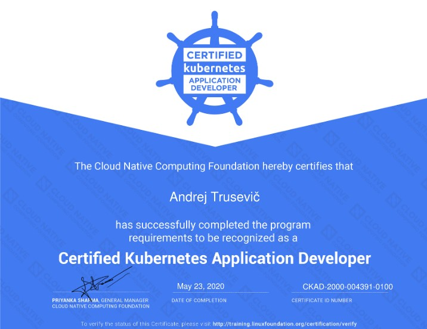

Hi there! In this post I would like to share my experience on completing CKAD Certified Kubernetes Application Developer exam.

In my previous post I shared some tips which were helped me to pass the CKA exam. Right after passing the CKA I decided to do not stop on it add collect full Kubernetes certification bundle. In different data sources (other blogs, training materials) I few times heard that CKAD is much easier than CKA and it will be just an “easy addon”. Also although exam is called “Application Developer” you do not need to have any developer skills to pass it is not about application development, but more about how to configure and run your application in Kubernetes environment. So I registered for the CKAD exam pretty much right after passing the CKA. This time I had no plan on how to preparing for the exam and the only thing I did was that I bought Kubernetes Certified Application Developer online training from udemy.com. Same as CKA online training course CKAD also includes practice tests. I completely skipped the theory part and focused only on the practice tests. I did tests everyday for the last two weeks before the exam.

CKAD exam is one hour shorter than CKA. Personally I had 19 questions to complete in 2 hours some question are quite complex and contains several task so to be able to to do all the tasks in time you need:

* fast typing skills
* familiarity with vim or nano editor
* quickly navigate through the [kubernetes.io] documentation
* know the basic bash commands
* know the kubernetes material very well

Personally I was not able to complete all the questions in time and at least two questions remained absolutely untouched. I also not agree with statements that CKAD is an easy add on to the CKA, because it’s really hard exam with complex questions where you have less time and this factor adds more pressure. After completing the CKA I was pretty much sure I will pass the exam. but I can’t say the same about the CKAD. After the 30 hours of nervous results waiting I received congrats from CNCF as I successfully passed the exam with 80 % score (66% is a passing score for the CKAD).

Summarizing all the things I can say that if you passed CKA you will most probably pass the CKAD, but do not expect it will be super easy. Make sure to train fast kubectl’ing 😁. CKAD excludes some cluster infrastructure tasks like cluster troubleshooting or bootstrapping but includes additional topics like:

* Multi-container pods
* Liveness and Readiness probes
* Jobs and Cron jobs

Make sure you are familiar with these things as well. Also make sure that your training lab is on the same level as the current exam kubernetes version as it might be major difference in kubectl command arguments and some of them may not work on newer versions.

So I wish you a good luck in your Kubernetes journey and see you soon in the next post 🤜🤛

<!-- Links -->
[kubernetes.io]: https://kubernetes.io
