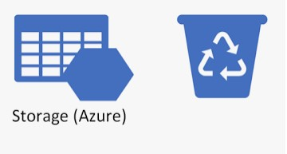

Hi All, in this post I wanna share a small script which you can use as part of your Azure automation and automatically set desired [soft delete] retention for blobs in all azure storage accounts across entire subscription. Soft delete is storage account data protection feature which may protect your storage blob data from accidental deletion or incorrect modification by user or application. By default soft delete is not enabled on newly created storage accounts. For sure for business critical application it's vital to have such feature enabled. In this DevOps era many different teams may provision azure resources, including storage accounts, by their self and for sure not all will take in to account such things as data safety, so we as Azure admins can take care of this and with help of Azure automation enable it by default for all existing and newly create storage accounts.

In one of my [previous posts] I have provided detailed instructions on how to use Azure automation account and schedule your script for scheduled run. So you can easily adopt same for the following script:

```powershell
<#
.SYNOPSIS
    Enable soft delete for all storage accounts across the subscription 
.DESCRIPTION
    Script is created to be used in conjunction with Azure Automation and will enable soft delete option for all storage accounts in the subscription
.INPUTS

.PARAMETER RetentionDays
    Number of days to keep deleted blobs for. The value must be between 1 and 365

.OUTPUTS
 
.NOTES
    Version:        1.0
    Author:         Andrej Trusevic
    Creation Date:  2021-03-11
  
.EXAMPLE
#>

PARAM(
    [int] [ValidateRange(1,365)] [Parameter(Mandatory = $True, HelpMessage = "Number of days to keep deleted blobs for. The value must be between 1 and 365")] $RetentionDays
    )
    

# Connect to azure with run as account
$connectionName = "AzureRunAsConnection"
try
{
    # Get the connection "AzureRunAsConnection "
    $servicePrincipalConnection=Get-AutomationConnection -Name $connectionName         

    "Logging in to Azure..."
    Add-AzAccount `
        -ServicePrincipal `
        -TenantId $servicePrincipalConnection.TenantId `
        -ApplicationId $servicePrincipalConnection.ApplicationId `
        -CertificateThumbprint $servicePrincipalConnection.CertificateThumbprint 
}
catch {
    if (!$servicePrincipalConnection)
    {
        $ErrorMessage = "Connection $connectionName not found."
        throw $ErrorMessage
    } else{
        Write-Error -Message $_.Exception
        throw $_.Exception
    }
}

# Retrieve all storage accounts
$StorageAccounts = Get-AzStorageAccount | Where-Object {$_.ResourceGroupName -NotLike "*elastic*"}

# Search for accounts where soft delete is not enabled and enabling it.
foreach ($StorageAccount in $StorageAccounts) {
    $SoftDeleteSetting = Get-AzStorageBlobServiceProperty -StorageAccountName $StorageAccount.StorageAccountName $StorageAccount.ResourceGroupName
    if ($SoftDeleteSetting.DeleteRetentionPolicy.Enabled -eq $false ) {
        Write-Output "The following storage account doesn't have soft delete enabled going to enable it..."
        Write-Output "$($StorageAccount.StorageAccountName); $($StorageAccount.ResourceGroupName); $($StorageAccount.Sku.Name); $($StorageAccount.Kind); $($StorageAccount.AccessTier); $($SoftDeleteSetting.DeleteRetentionPolicy.Enabled); $($SoftDeleteSetting.DeleteRetentionPolicy.Days)"
        Enable-AzStorageBlobDeleteRetentionPolicy -ResourceGroupName $StorageAccount.ResourceGroupName -StorageAccountName $StorageAccount.StorageAccountName -RetentionDays $RetentionDays

    }    
}
```

<i class="far fa-sticky-note"></i> **Note:** Make sure you have installed appropriate modules (Az.Accounts, Az.Automation, Az.Profile, Az.Resources, Az.Storage) for your azure automation account.
{: .notice--info}
{: .text-justify}

As you may see script requires one parameters which defines how long (in days) soft-deleted blobs are retained by Azure Storage. You may choose between minimum is 1 day and the maximum is 365.

You also can easily adopt this script for one time execution, just comment `Connect to azure with run as account` area of the script.

I hope this will be useful for you and feel free to leave your questions in the comment. 

Thank you 🤜🤛

<!-- Links -->
[soft delete]: https://docs.microsoft.com/en-us/azure/storage/blobs/soft-delete-blob-overview
[previous posts]: https://sysadminas.eu/Part-3-Azure-SQL-DB-Backups/