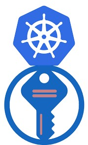
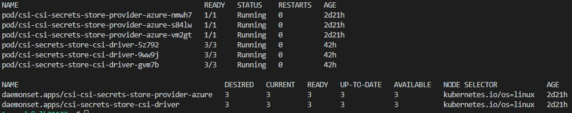
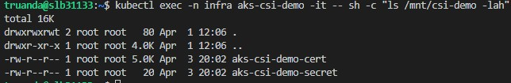
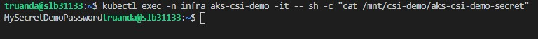
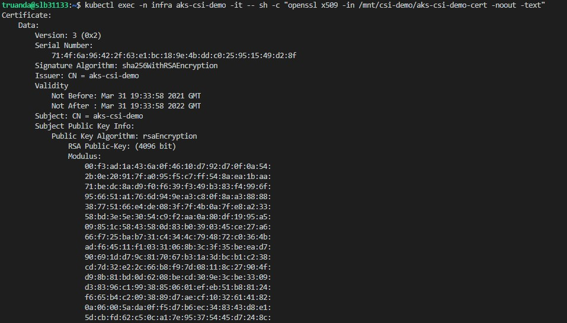
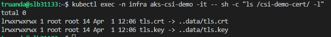

Hi All,

Today I want to share my experience with [Azure Key Vault Provider for Secrets Store CSI Driver]. This is an open source project which allows you to mount your Azure KeyVault secrets, keys or certificates directly in to the container which is running on AKS cluster. Such approach eliminates the need to declaratively create Kubernetes secrets and store sensitive values somewhere in the code, helm charts or pipelines. Also storing sensitive data in native K8S secrets are less secure comparing to the Azure KeyVault. Additionally [Azure Key Vault Provider for Secrets Store CSI Driver] can constantly synchronize data from Key vault store in to the running container, so if you change the value for your key vault secret it will be updated in the container as well without pod restart. [Azure Key Vault Provider for Secrets Store CSI Driver] mounts key vault data into your container as a volume, but if your deployment needs to store the values as environment variables you can automatically create K8S secrets based on data mounted from key vault. This will allow you then to configure your pods to your standard secret which data you can easily present as environment variable or secret type volume. OK let's look how it works.

## Deploy solution

First thing first we need to deploy [Azure Key Vault Provider for Secrets Store CSI Driver] to our AKS cluster. This can be easily done using official project [helm chart]. This helm chart actually contains two charts where sub chart is a [Secret Store CSI Driver] and the main chart is the [Azure Key Vault provider for Secrets Store CSI driver] itself. [Secret Store CSI Driver] - this is kinda standard approach which allows Kubernetes to mount multiple secrets, keys, and certs stored in enterprise-grade external secrets stores into their pods as a volume.

So to deploy a helm chart run the following commands in your shell against your AKS cluster

```bash
# Will create a namespace for our deployment
kubectl create namespace csi
# Will add csi-secrets-store-provider-azure repo to our local helm repository list 
helm repo add csi-secrets-store-provider-azure https://raw.githubusercontent.com/Azure/secrets-store-csi-driver-provider-azure/master/charts
# Will deploy the chart  
helm template csi csi-secrets-store-provider-azure/csi-secrets-store-provider-azure -n csi --set secrets-store-csi-driver.enableSecretRotation="true" --set secrets-store-csi-driver.rotationPollInterval="1m"   
```

As you probably noticed additionally I passed two values to the helm chart

* `secrets-store-csi-driver.enableSecretRotation="true"` enables automatic secret rotation so when I change value in my KeyVault it will be changed in my container as well. 

* `secrets-store-csi-driver.rotationPollInterval="1m"` adjusts how frequently the synchronization between KeyVault and mounted secret will happen.

Result of successful deployment will be two running daemon sets.


Additionally chart will deploy service accounts, custom resource definitions, cluster roles, cluster role bindings. If you want to list all the resources which will be applied during helm chart deployment use the following command helm command:

```bash
helm template csi csi-secrets-store-provider-azure/csi-secrets-store-provider-azure -n csi --set 
secrets-store-csi-driver.enableSecretRotation="true" --set secrets-store-csi-driver.rotationPollInterval="1m" 
```

## Prepare azure environment

We have installed [Secret Store CSI Driver] and Azure KeyVault provider for it. Now let's prepare demo environment on azure. For this I have prepared a bash script which you can easy adjust for your needs. Here I split it into several part just to give more explanation on each step.

First let's define a bunch of variables which we will use in the next steps:

```bash
# Set variables 
export TENANT_ID="xxxxxxx-xxxx-xxxx-xxxx-xxxxxxxxxxxxxx" # Your azure tenant id
export SUBSCRIPTION='My Azure Subscription' # Your azure subscription name
export LOCATION="westeurope" # Azure region where your resources will be deployed
export COMMON_NAME="aks-csi-demo" # A common name which will be used for naming
export GROUP_NAME=aks-csi-demo # A resource group name where we deploy a key vault and managed identity 
export KEYVAULT_NAME=csi-demo-keyvault # A key vault where we will store our secrets
export IDENTITY_NAME=aks-csi-demo-identity # An managed identity name which we will create and use to access our key vault secrets
export AKS_CLUSTER_NODE_GROUP_NAME=aks-nodes-west-dev # Name of the resource group where our AKS cluster VM scale set is running
export SECRET_NAME=aks-csi-demo-secret # Name of azure key vault secret which we will create 
export SECRET_VALUE=MySecretDemoPassword # Value of our azure key vault secret
export CERTIFICATE_SECRET_NAME=aks-csi-demo-cert # Name certificate which will be kept in our key vault as certificate object 
```

In second step we will create a resource group as well as a key vault and managed identity which will be placed in this group. We will use a key vault to store a secrets and a certificate which later will be mapped to our pod. We need [Azure Managed Identity] as it a key element which allows to access azure resource such as a key vault, storage, azure sql and etc. without any credential management process.

```bash
# Create Resources (group, key vault, identity)
az group create --name $GROUP_NAME --location $LOCATION --subscription "$SUBSCRIPTION"
az keyvault create --name $KEYVAULT_NAME --resource-group $GROUP_NAME --location $LOCATION --subscription "$SUBSCRIPTION"
az identity create --name $IDENTITY_NAME --resource-group $GROUP_NAME --location $LOCATION --subscription "$SUBSCRIPTION"
```

Next using `openssl` utility we will create a self signed certificate which we later will import into the key vault certificate store.

```bash
# Create a private key with .pem certificate associated to it 
openssl req -x509 -newkey rsa:4096 -keyout key.pem -out cert.pem -days 365 -subj '/CN=aks-csi-demo'
# According azure key vault requirement we combine our private key and cerrtificate into the single pfx certificate file
openssl pkcs12 -inkey key.pem -in cert.pem -export -out $COMMON_NAME.pfx
```

Now we are ready to create a demo key vault secret and also import recently created certificate into key vault

```bash
# Create a Kevault secret
az keyvault secret set --name $SECRET_NAME --vault-name $KEYVAULT_NAME --value $SECRET_VALUE  
# Create a certificate object in the key vault
az keyvault certificate import --file $COMMON_NAME.pfx --name $CERTIFICATE_SECRET_NAME --vault-name $KEYVAULT_NAME --password $COMMON_NAME
```

<i class="far fa-sticky-note"></i> **Note:** Very important to mark that when you create certificate object in the Azure key Vault an addressable key vault key and secret are also created with the same name. These key and secret are created in the backend so you can't see them in Azure portal. However you can view them with appropriate azure cli commands `az keyvault secret/key/certificate show --vault-name <vault name> --name <cert name>`
{: .notice--info}
{: .text-justify}

Next we need to retrieve the `id` and `clientId` of previously created managed identity and store them as variables. We will use this variables in the next commands and yaml manifests.

```bash
# Retrieve User Assigned Managed Identity Id
IDENTITY_ID=$(az identity show --name $IDENTITY_NAME --resource-group $GROUP_NAME --subscription "$SUBSCRIPTION" --query id -o tsv)
# Retrieve User Assigned Managed Identity Client Id
IDENTITY_CLIENT_ID=$(az identity show --name $IDENTITY_NAME --resource-group $GROUP_NAME --subscription "$SUBSCRIPTION" --query clientId -o tsv)
```

In order to allow our managed identity access key vault data we need to setup appropriate access policies for our key vault.

```bash
# Set key vault policy which allows managed identity to get secrets, keys and certificates.  
az keyvault set-policy --name $KEYVAULT_NAME --key-permissions get --spn $IDENTITY_CLIENT_ID
az keyvault set-policy --name $KEYVAULT_NAME --secret-permissions get --spn $IDENTITY_CLIENT_ID
az keyvault set-policy --name $KEYVAULT_NAME --certificate-permissions get --spn $IDENTITY_CLIENT_ID
```

Last step in azure environment preparation is to assign our managed identity to our AKS cluster's VMSS

```bash
# Retrieve AKS cluster VMSS pool name and save it as a variable
VMSS=$(az vmss list --resource-group $AKS_CLUSTER_NODE_GROUP_NAME --subscription "$SUBSCRIPTION" --query "[].name" -o tsv)
# Assign User Assigned Managed Identity to the aks cluster VMSS
az vmss identity assign --resource-group $AKS_CLUSTER_NODE_GROUP_NAME -n $VMSS --identities $IDENTITY_ID
```

## Configure a SecretProviderClass for your application

So, we deployed  [Azure Key Vault Provider for Secrets Store CSI Driver] and also prepared all required azure components. Now we can move to the next step which is a configuration of SecretProviderClass components required for our app in order to use keyvault secrets.

SecretProviderClass api-resource will become available after [Azure Key Vault Provider for Secrets Store CSI Driver] deployment. With this resource we define:

* which key vault objects should be presented to our AKS cluster

* which identity we will use to retrieve the secrets from the key vault. Here there are 4 possible identity access modes:
  * [Service Principal]

  * [Pod Identity]

  * [User-assigned Managed Identity] - in my example I use this access mode

  * [System-assigned Managed Identity]

* [optional] which of the mounted key vault objects will be mirrored as a native kubernetes secret. In our case we will mirror a key vault certificate (or better say the key vault secret object which is created automatically when we create a key vault certificate object) as a k8s tls secret also we will map as a secret volume in our pod/container. So let's look into the `secretProviderClass` definition details little bit closer:

```yaml
apiVersion: secrets-store.csi.x-k8s.io/v1alpha1 # Api version related to the SecretProviderClass resource 
kind: SecretProviderClass # Resource kind
metadata:
  name:  # Name for our SecretProviderClass 
  namespace: # Namespace where we will deploy the SecretProviderClass 
spec:
  provider: azure # Name of the provider
  parameters:
    usePodIdentity: "false" # Set true if you will use AAD Pod Identity access mode
    useVMManagedIdentity: "true" # We assigned our management identity to our AKS cluster so the value should be true
    userAssignedIdentityID: # Here we paste our identity ID
    keyvaultName: # Name of the keyvault where we store our secrets goes here
    # Next block is the array of key vault keys, secrets or certificates objects which we would like retrieve from key vault   
    objects:  |
      array:
        - |
          objectType: secret # type of Key Vault object this could be secret, key or cert
          objectName: $SECRET_NAME # name of the Key Vault object
        - |
          objectType: secret
          objectName: $CERTIFICATE_SECRET_NAME
    tenantId: $TENANT_ID # tenant id where our key vault is placed  
  secretObjects: # This block is optional and should be defined if we want create a kubernetes secret based on key vault object                           
  - secretName: $CERTIFICATE_SECRET_NAME # The name of the kubernetes secret which will be created 
    type: kubernetes.io/tls # Type of the k8s secret like opaque, tls etc. 
    data: 
    - objectName: $CERTIFICATE_SECRET_NAME # Name of the mounted content to sync. This could be the object name or object alias. The mount is mandatory for the content to be synced as Kubernetes secret.
      key: tls.key
    - objectName: $CERTIFICATE_SECRET_NAME
      key: tls.crt  
```

As I already mentioned when you create certificate object in the Azure key Vault an addressable key vault key and secret are also created in the backend with the same name:
To get the certificate:

```yaml
        array:
          - |
            objectName: certName
            objectType: cert
            objectVersion: ""
```

To get the public key:

```yaml
        array:
          - |
            objectName: certName
            objectType: key
            objectVersion: ""
```

To get the private key and certificate: 

```yaml
        array:
          - |
            objectName: certName
            objectType: secret
            objectVersion: ""
```

<i class="far fa-sticky-note"></i> **Note:** Please keep in mind that if you configuring `spec.secretObjects` k8s secret will be created not directly based on a key vault, but it will be mirrored from the mounted content which you defined in `spec.parameters.objects`. Secret will be created only when the pod mounting the secret will be started.
{: .notice--info}
{: .text-justify}

So we now know how to configure SecretProviderClass and you if following my demo you can simply execute the following to deploy it:

```bash
# Deploy demo secretProviderClass
cat <<EOF | kubectl apply -f -
apiVersion: secrets-store.csi.x-k8s.io/v1alpha1
kind: SecretProviderClass
metadata:
  name: aks-csi-demo
  namespace: infra
spec:
  provider: azure
  parameters:
    usePodIdentity: "false"
    useVMManagedIdentity: "true"
    userAssignedIdentityID: $IDENTITY_CLIENT_ID
    keyvaultName: $KEYVAULT_NAME
    objects:  |
      array:
        - |
          objectType: secret
          objectName: $SECRET_NAME
        - |
          objectType: secret
          objectName: $CERTIFICATE_SECRET_NAME
    tenantId: $TENANT_ID
  secretObjects:                            
  - secretName: $CERTIFICATE_SECRET_NAME
    type: kubernetes.io/tls
    data: 
    - objectName: $CERTIFICATE_SECRET_NAME
      key: tls.key
    - objectName: $CERTIFICATE_SECRET_NAME
      key: tls.crt  
EOF
```

## Deploy your application

The last step is to properly describe our application deployment manifest and deploy it to the cluster. I have added appropriate comments in the yaml bellow:

```yaml
kind: Pod
apiVersion: v1
metadata:
  name: $COMMON_NAME
  namespace: infra
  labels:
    name: $COMMON_NAME
    environment: development
    itSystemCode: unknown
    responsible: andrej.trusevic
spec:
  volumes:
    # Here we describing a csi volume which will be mounted  into our pod 
    - name: $COMMON_NAME # Name of the volume we will refer it in the volumeMounts block of our container(-s)
      csi:
        driver: secrets-store.csi.k8s.io
        readOnly: true
        volumeAttributes:
          secretProviderClass: $COMMON_NAME # Name of the secretProviderClass
    # Here we define standard K8S secret volume which will be created based on our secretObject in secretProviderClass      
    - name: $CERTIFICATE_SECRET_NAME
      secret:
        secretName: $CERTIFICATE_SECRET_NAME 
  containers:
    - name: $COMMON_NAME
      image: andriktr/utils:1.0.1
      volumeMounts:
      # My CSI volume will maped here:
      - name: $COMMON_NAME
        mountPath: "/mnt/csi-demo"
        readOnly: true
      # Secret will be mounted here:               
      - name: $CERTIFICATE_SECRET_NAME
        mountPath: "/csi-demo-cert/"
        readOnly: true  
      resources:
        requests:
          cpu: 100m
          memory: 100Mi
        limits:
          cpu: 200m   
          memory: 300Mi
```

So let's deploy the last peace of puzzle by running the following:

```bash
# Deploy a demo pod 
cat <<EOF | kubectl apply -f -
kind: Pod
apiVersion: v1
metadata:
  name: $COMMON_NAME
  namespace: infra
  labels:
    name: $COMMON_NAME
    environment: development
    itSystemCode: unknown
    responsible: andrej.trusevic
spec:
  volumes:
    - name: $COMMON_NAME
      csi:
        driver: secrets-store.csi.k8s.io
        readOnly: true
        volumeAttributes:
          secretProviderClass: $COMMON_NAME
    - name: $CERTIFICATE_SECRET_NAME
      secret:
        secretName: $CERTIFICATE_SECRET_NAME 
  containers:
    - name: $COMMON_NAME
      image: andriktr/utils:1.0.1
      volumeMounts:
      - name: $COMMON_NAME
        mountPath: "/mnt/csi-demo"
        readOnly: true               
      - name: $CERTIFICATE_SECRET_NAME
        mountPath: "/csi-demo-cert/"
        readOnly: true  
      resources:
        requests:
          cpu: 100m
          memory: 100Mi
        limits:
          cpu: 200m   
          memory: 300Mi
                       
```

<i class="far fa-sticky-note"></i> **Note:** Please make sure that your `SecretProviderClass` and deployment which is using it are stored in the same namespace overwise solution will not work.
{: .notice--info}

Now let's check what we see in our deployed container:



As you can see there two files: 

* `aks-csi-demo-secret` contains the value of our created secret:



* `aks-csi-demo-cert` file is our certificate



For the last let's check the path where we mapped our secret



As expected we have secret data which is in out case tls.crt and tls.key in place and ready to be used.

So, as you can see [Azure Key Vault Provider for Secrets Store CSI Driver] is a easy configurable solution which can make your AKS cluster much more secure also if we look on AKS roadmap `azure secrete stores csi` is currently in development phase and I'm think that this solution will be integrated and become officially support by Microsoft just like [Azure Managed Identity] which is now already in public preview.

I hope this post will be informative for you and would like to Thank You for reading 🤜🤛

<!-- Links -->
[Azure Key Vault Provider for Secrets Store CSI Driver]: https://github.com/Azure/secrets-store-csi-driver-provider-azure
[AKS Managed Identity]: https://docs.microsoft.com/en-us/azure/aks/use-managed-identity
[helm chart]: https://github.com/Azure/secrets-store-csi-driver-provider-azure/tree/master/charts/csi-secrets-store-provider-azure
[Secret Store CSI Driver]: https://secrets-store-csi-driver.sigs.k8s.io/introduction.html
[Azure Managed Identity]: https://docs.microsoft.com/en-us/azure/active-directory/managed-identities-azure-resources/overview
[Service Principal]: https://azure.github.io/secrets-store-csi-driver-provider-azure/configurations/identity-access-modes/service-principal-mode/
[Pod Identity]: https://azure.github.io/secrets-store-csi-driver-provider-azure/configurations/identity-access-modes/pod-identity-mode/
[User-assigned Managed Identity]: https://azure.github.io/secrets-store-csi-driver-provider-azure/configurations/identity-access-modes/user-assigned-msi-mode/
[System-assigned Managed Identity]: https://azure.github.io/secrets-store-csi-driver-provider-azure/configurations/identity-access-modes/system-assigned-msi-mode/