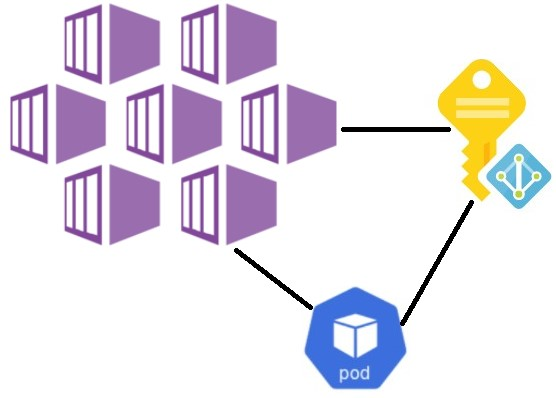
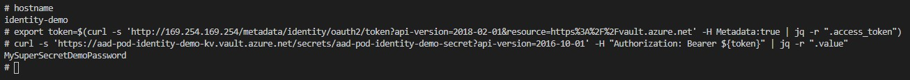
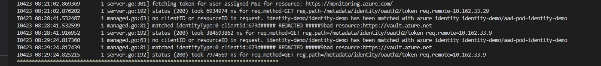
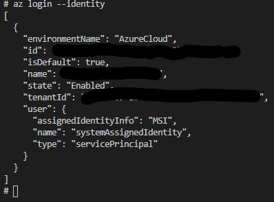
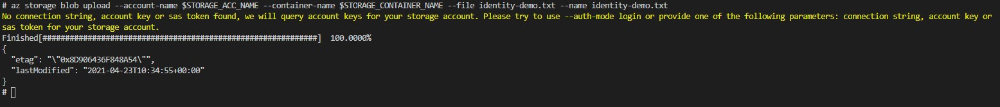

Hi All,
In my [previous post] we reviewed how to integrate Azure Key Vault service into our AKS cluster using
[Azure Key Vault Provider for Secrets Store CSI Driver]. Today I want to show you how we can access our azure key vault secrets or even any other azure services from our pods by using azure managed identities with help of [AAD Pod Managed Identity] solution.

In general [AAD Pod Managed Identity] enables Kubernetes applications to access cloud resources securely with Azure Active Directory. From AKS point of view initially [AAD Pod Managed Identity] solution was positioned as purely open source project which you may install and maintain on your own risk without any official Microsoft support. However recently [AAD Pod Managed Identity] was integrated in to the AKS cluster as addon and it's current status is [public preview].

So let's setup our demo environment and see how it's works. Assuming that you already have a working AKS cluster which uses azure CNI if not you can check how to deploy it in one of my [first AKS series post].

As usually first let's define a several variables which are mostly will be used for resource naming:

```bash
export TENANT_ID="xxxxxxx-xxxx-xxxx-xxxx-xxxxxxxxxxxxxx" # Your azure tenant id
export SUBSCRIPTION='My Azure Subscription' # Your azure subscription name
export LOCATION="westeurope" # Location where azure resource will be placed
export GROUP_NAME="aad-pod-identity-demo" # Name of the resources group where we create demo identity, keyvault and storage acc
export KEYVAULT_NAME="aad-pod-identity-demo-kv" # Name for the demo keyvault
export IDENTITY_NAME="aad-pod-identity-demo-identity" # Name for the demo identity
export STORAGE_ACC_NAME="aadpodidentitydemo" #
export STORAGE_CONTAINER_NAME="pod-identity-demo" 
export AKS_CLUSTER_RESOURCE_GROUP_NAME="aks-west-experimental" # Resource group where our aks cluster is placed
export AKS_CLUSTER_NODE_GROUP_NAME="aks-nodes-west-experimental" # Resource group where aks cluster VMSS placed
export AKS_CLUSTER_NAME="aks-experimental" # Name of our AKS cluster
export SECRET_NAME="aad-pod-identity-demo-secret" # Name of the key vault secret object which we will create for demo purposes
export SECRET_VALUE="MySuperSecretDemoPassword" # Value of our key vault secret object
export POD_IDENTITY_NAME="aad-pod-identity-demo" # Name of the pod identity which will be deployed in the cluster
export POD_IDENTITY_NAMESPACE="identity-demo" # Kubernetes Namespace name where we will deploy our pod identity and demo application which will use it
```

[AAD Pod Managed Identity] is currently in public preview so we need to enable it for our Azuree subscription. This can be done by running the following azure cli command:

```bash
# Register AAD-Pod-Identity preview feature
az feature register --name EnablePodIdentityPreview --namespace Microsoft.ContainerService
```

When we have feature registered we can enable AAD Pod Managed Identity on our cluster by running:

```bash
# Enable AAD-Pod-Identity on the AKS cluster
az aks update --resource-group $AKS_CLUSTER_RESOURCE_GROUP_NAME --name $AKS_CLUSTER_NAME --enable-pod-identity --subscription "$SUBSCRIPTION"
```

After successful execution of previous command your cluster will have a daemon set which ensures a running [Node Managed Identity] (NMI) pod on each node of your cluster in the `kube-system` namespace. When application which is configured to use AAD Pod Identity does a request to the Instance Metadata Service endpoint 169.254.169.254. Requests to this endpoints are intercepted by NMI with help of iptables rules. Then NMI makes an Azure AD Authentication Library call to Azure Active Directory and receives a managed identity token which then provided to our application.

Check that NMI pods are running by executing:

```bash
 kubectl get pods -n kube-system | grep -i nmi
```

Next let's create a couple of Azure resources which will be used in our demo

```bash
# Create Resource Group, KeyVault, Managed Identity, Storage Account and container
az group create --name $GROUP_NAME --location $LOCATION --subscription "$SUBSCRIPTION"

az keyvault create --name $KEYVAULT_NAME --resource-group $GROUP_NAME --location $LOCATION --subscription "$SUBSCRIPTION"
az keyvault secret set --name $SECRET_NAME --vault-name $KEYVAULT_NAME --value $SECRET_VALUE  

az identity create --name $IDENTITY_NAME --resource-group $GROUP_NAME --location $LOCATION --subscription "$SUBSCRIPTION"

az storage account create --name $STORAGE_ACC_NAME --resource-group $GROUP_NAME --location $LOCATION --kind StorageV2 --sku Standard_LRS --encryption-services blob --https-only true --access-tier Hot --subscription "$SUBSCRIPTION"
az storage container create --name $STORAGE_CONTAINER_NAME --public-access off --account-name $STORAGE_ACC_NAME --subscription "$SUBSCRIPTION"
```

Now we need to assign permissions for our newly created Managed Identity which will allow to read a key vault objects or contribute on storage account level:

```bash
# Retrieve User Assigned Managed Identity  
IDENTITY_ID=$(az identity show --name $IDENTITY_NAME --resource-group $GROUP_NAME --subscription "$SUBSCRIPTION" --query id -o tsv)
IDENTITY_CLIENT_ID=$(az identity show --name $IDENTITY_NAME --resource-group $GROUP_NAME --subscription "$SUBSCRIPTION" --query clientId -o tsv)

# Assign keyvault "Get" permission for User Assigned Managed Identity  
az keyvault set-policy --name $KEYVAULT_NAME --key-permissions get --spn $IDENTITY_CLIENT_ID
az keyvault set-policy --name $KEYVAULT_NAME --secret-permissions get --spn $IDENTITY_CLIENT_ID
az keyvault set-policy --name $KEYVAULT_NAME --certificate-permissions get --spn $IDENTITY_CLIENT_ID

# Retrieve az storage account id
STORAGE_ACC_ID=$(az storage account show  --name $STORAGE_ACC_NAME --query id -o tsv)

# Assign Storage account contributor permissions for Managed Identity 
az role assignment create --role "Contributor" --assignee "$IDENTITY_CLIENT_ID" --scope $STORAGE_ACC_ID
```

Additionally we need to assign a `Reader` permission for Managed Identity on the AKS nodes resource group level

```bash
# Retrieve ID of AKS Cluster Nodes Resource Group
AKS_CLUSTER_NODES_GROUP_ID=$(az group show -n $AKS_CLUSTER_NODE_GROUP_NAME -o tsv --query "id")

# Assign permissions
az role assignment create --role "Reader" --assignee "$IDENTITY_CLIENT_ID" --scope $AKS_CLUSTER_NODES_GROUP_ID
```

Azure infrastructure part is prepared let's move to our cluster first we will create a namespace for our demo environment

```bash
cat <<EOF | kubectl apply -f -
apiVersion: v1
kind: Namespace
metadata:
  name: $POD_IDENTITY_NAMESPACE
  labels:
    name: identity-demo
    environment: development
    itSystemCode: demo
    responsible: andrej.trusevic 
EOF
```

Next we need to run the following azure cli command to create a azureidentity and it's dependencies:

```bash
# Create aad-pod-identity, aad-pod-identity-binding and identity role assignment. 
az aks pod-identity add --resource-group $AKS_CLUSTER_RESOURCE_GROUP_NAME --cluster-name $AKS_CLUSTER_NAME --namespace $POD_IDENTITY_NAMESPACE  --name $POD_IDENTITY_NAME --identity-resource-id $IDENTITY_ID
```

This command actually does 3 things for us:

* Creates `azureidentity` resource which describes our Managed Identity:

```yaml
apiVersion: aadpodidentity.k8s.io/v1
kind: AzureIdentity
metadata:
  name: aad-pod-identity-demo
  namespace: identity-demo
spec:
    clientID: <<Redacted>> # Client id of our Managed Identity 
    resourceID: <<Redacted>> # Resource id of our Managed Identity
    type: 0  
```

* Creates `azureidentitybinding` custom resource which describes the identity binding relationship between an AzureIdentity and a pod with a specific selector as part of its label:

```yaml
apiVersion: "aadpodidentity.k8s.io/v1"
kind: AzureIdentityBinding
metadata:
  name: aad-pod-identity-demo-binding # Name of Identity binding
spec:
  azureIdentity: aad-pod-identity-demo # The name of the AzureIdentity that should be assigned to the pod(s) if matching selector is found.
  selector: aad-pod-identity-demo # The selector to identify which pods should be assigned to the AzureIdentity above. It will go through a list of pods and look for value of pod label with key aadpodidbinding that is equal to itself
```

* Assigns our managed identity to the AKS cluster scale set (VMSS).

So, we now ready to deploy our application:

```bash
# Create a demo pod
cat <<EOF | kubectl apply -f -
kind: Pod
apiVersion: v1
metadata:
  name: identity-demo
  namespace: $POD_IDENTITY_NAMESPACE
  labels:
    name: identity-demo
    environment: development
    itSystemCode: demo
    responsible: andrej.trusevic
    aadpodidbinding: $POD_IDENTITY_NAME
spec:
  containers:
    - name: identity-demo
      image: andriktr/utils:1.0.4
      resources:
        requests:
          cpu: 100m
          memory: 100Mi
        limits:
          cpu: 200m   
          memory: 300Mi
EOF
```

As you can see in the definition file to bind our application with earlier created managed identity we add additional label `aadpodidbinding` to our pod `metadata.labels`. Value of this labels is the same as we set for the `--name` argument in`az aks pod-identity add` command executed before. But in general this value should be equal to the `spec.selector` definition of AzureIdentityBinding custom resource.

<i class="far fa-sticky-note"></i> **Note:** Application (which should use ADD Pod Managed Identity) and it's azureIdentity must be in the same namespace.
{: .notice--info}
{: .text-justify}

Everything is in-place now let's test how it works from application environment. Let's jump inside our deployed container by running:

```bash
 kubectl exec -n identity-demo identity-demo -it -- sh
```

Now we can try to get our key vault secret. We can achieve this by running the following curl requests

```bash
# Get the access token and save it as a variable [Run from inside the recently deployed pod]
export token=$(curl -s 'http://169.254.169.254/metadata/identity/oauth2/token?api-version=2018-02-01&resource=https%3A%2F%2Fvault.azure.net' -H Metadata:true | jq -r ".access_token")

# Retrieve the value from keyvault [Run from inside the recently deployed pod]
curl -s 'https://aad-pod-identity-demo-kv.vault.azure.net/secrets/aad-pod-identity-demo-secret?api-version=2016-10-01' -H "Authorization: Bearer ${token}" | jq -r ".value"
```

As you can see we successfully got the value of our secret without providing any credentials



Additionally in the NMI pod logs you can see appropriate entries which are related to our recent request



To grab the logs from all NMI pods in your cluster run the following:

```bash
# Check the NMI pod logs
PODS=($(kubectl get pods -n kube-system -o name | grep -i nmi))
for pod in "${PODS[@]}"
do
 echo "*************************************"$pod"********************************************"
 kubectl logs "$pod" -n kube-system
 echo "***************************************************************************************"
done
```

Now let's do another test and try to access our blob from inside the container. We will use azure cli for it so the first step is to login to azure using identity for this simply run:

```bash
az login --identity
```



We now have logged in into the azure using our managed identity. For testing we will try to upload a file to our storage account blob:

```bash
# Set naming variables for storage account and container
export STORAGE_ACC_NAME="aadpodidentitydemo" 
export STORAGE_CONTAINER_NAME="pod-identity-demo" 

# Create a demo file which will be uploaded to storage account blob
echo "https://sysadminas.eu" > identity-demo.txt

# Upload demo file to the storage account blob
az storage blob upload --account-name $STORAGE_ACC_NAME --container-name $STORAGE_CONTAINER_NAME --file identity-demo.txt --name identity-demo.txt
```

Our file successfully uploaded



As you can see AAD Pod Managed Identity is a solution which could be easily enabled in AKS as a native addon and integrated into your application. This will make K8S cluster and running workload more secure as we can't reach out Azure resources from the apps without storing any credentials somewhere. We also can use AAD Pod Managed Identity in conjunction with [Azure Key Vault Provider for Secrets Store CSI Driver] this will allow us to map keyvault objects into the pods based on `aadpodidentity` selector.

Thats all for today. I hope this post will be informative for you and would like to Thank You for reading 🤜🤛


<!-- Links -->
[previous post]: https://sysadminas.eu/Part-5-AKS/
[Azure Key Vault Provider for Secrets Store CSI Driver]: https://github.com/Azure/secrets-store-csi-driver-provider-azure
[AAD Pod Managed Identity]: https://github.com/Azure/aad-pod-identity
[AKS Managed Identity]: https://docs.microsoft.com/en-us/azure/aks/use-managed-identity
[public preview]: https://docs.microsoft.com/en-us/azure/aks/use-azure-ad-pod-identity
[Node Managed Identity]: https://azure.github.io/aad-pod-identity/docs/concepts/nmi/
[first AKS series post]: https://sysadminas.eu/Part-1-AKS/