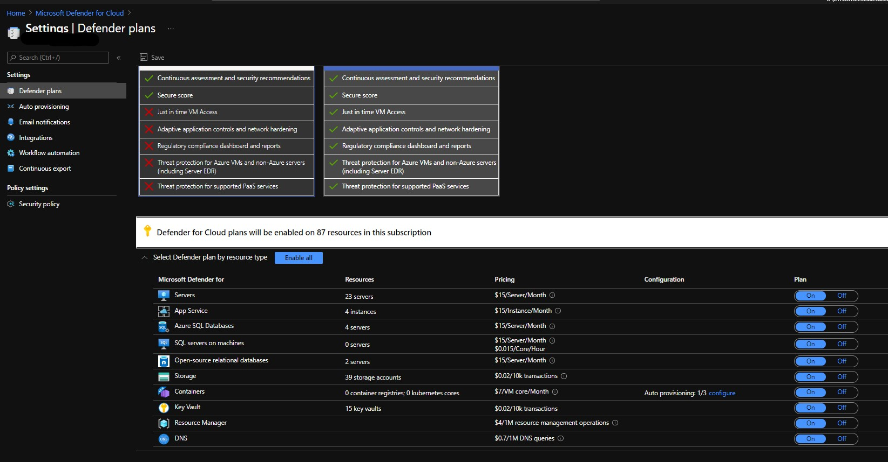
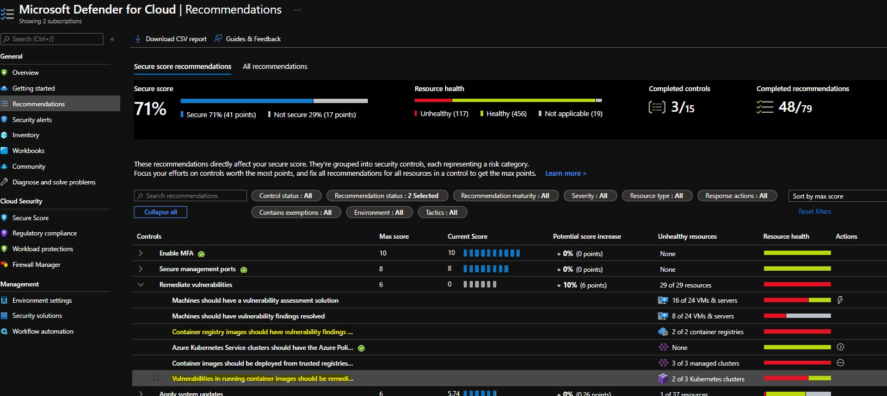

Hello Folks,

In this post I will take a look on how to take care of your Azure Container Registry and keep it secure.

If you use containers in production enterprise environment most probably you will store your images in a private registry which is trusted by your organization. Such approach allows to keep your images secure and prevents potential unexpected compromise. However it also brings a responsibility to manage registry, control access to it, secure it, make sure that outdated vulnerable images are removed and ensure that it is enough free space to push new images.

If your main cloud provider is Azure and your primary managed kubernetes cluster is Azure Kubernetes Service (AKS) then using Azure Container Registry (ACR) most probably will be the best solution as it has direct integration with AKS and allows to pull containers without any image pull secrets. 

Azure Container Registry provided with three different service tiers. Your can review a comparison between them [here](https://docs.microsoft.com/en-us/azure/container-registry/container-registry-skus#service-tier-features-and-limits).

## ACR Cleanup

When I started to look at cleanup solution for our ACR I noticed that some useful features are available only for the Premium tier. For example ACR premium tier unlocks [acr retention](https://docs.microsoft.com/en-us/azure/container-registry/container-registry-retention-policy) feature which removes your image manifests based on their age. This feature is currently in preview and most important that it's only affects untagged images. This means that you first need to untag required images and only after this acr retention policy will do the cleanup. Microsoft documentation provides [some suggestions](https://docs.microsoft.com/en-us/azure/container-registry/container-registry-auto-purge) on how to do purge using `az acr purge` command and scheduling it using `az acr task create`, but this functionality is also currently in preview and doesn't look very flexible.

So I wrote a simple bash script which will do a cleanup for any type of ACR in your subscription. By default it will keep two latest images in each repository.

```bash
#!/bin/bash

# Save subscription as environment variable
export SUBSCRIPTION_NAME="<Your Azure Subscription Name>"

# Set the right subscription
az account set --subscription "$SUBSCRIPTION_NAME"

# Perform ACR cleanup
ACR_LIST=(`az acr list --query [].name --output tsv`)
for ACR in ${ACR_LIST[@]}; do
    echo "ACR: $ACR"
    az acr login --name $ACR
    ACR_REPOS=(`az acr repository list --name $ACR --output tsv`)
    for ACR_REPO in ${ACR_REPOS[@]}; do
        echo "########## ACR_REPO: $ACR_REPO #############"
        ACR_TAGS=(`az acr repository show-tags --name $ACR --repository $ACR_REPO --orderby time_asc --output tsv`)
        if [ ${#ACR_TAGS[@]} -gt 2 ]; then
            unset ACR_TAGS[-1] && unset ACR_TAGS[-1]
            for ACR_TAG in ${ACR_TAGS[@]}; do
                echo "Image $ACR_REPO:$ACR_TAG seems to old. Going to remove it..."
                az acr repository delete --name $ACR --image $ACR_REPO:$ACR_TAG --yes
            done
        else
            echo "Repository $ACR_REPO contains 2 or less images. Nothing to do here..."           
        fi
      echo "###############################################"              
    done        
done
```

In case if you want to run this automatically on a daily basis you can use Azure Devops pipeline to schedule it. Here is the simple example of pipeline YAML which will run this script every day at 12:00 AM.

```yaml
# Make sure your build agent has Azure CLI installed    

pool: my-pool

pr: none
trigger: none

schedules:
- cron: '0 0 * * *'
  displayName: Daily Cleanup Azure Container Registries 
  branches:
    include:
    - dev  
    - master
  always: true


jobs: 
- job: 'CleanUpAzureContainerRegistries'
  displayName: CleanUp Azure Container Registries
  steps:
  - task: AzureCLI@2 
    displayName: Cleanup Registry 
    inputs:
      azureSubscription: 'azure-devops-service-connection' # Azure DevOps Service Connection associated with AAD service principal which has contributor access to the ACR registry
      scriptType: bash
      scriptLocation: inlineScript
      inlineScript: |         
        ACR_LIST=(`az acr list --query [].name --output tsv`)
        for ACR in ${ACR_LIST[@]}; do
            echo "ACR: $ACR"
            az acr login --name $ACR
            ACR_REPOS=(`az acr repository list --name $ACR --output tsv`)
            for ACR_REPO in ${ACR_REPOS[@]}; do
                echo "########## ACR_REPO: $ACR_REPO #############"
                ACR_TAGS=(`az acr repository show-tags --name $ACR --repository $ACR_REPO --orderby time_asc --output tsv`)
                if [ ${#ACR_TAGS[@]} -gt 2 ]; then
                    unset ACR_TAGS[-1] && unset ACR_TAGS[-1]
                    for ACR_TAG in ${ACR_TAGS[@]}; do
                        echo "Image $ACR_REPO:$ACR_TAG seems to old. Going to remove it..."
                        az acr repository delete --name $ACR --image $ACR_REPO:$ACR_TAG --yes
                    done
                else
                    echo "Repository $ACR_REPO contains 2 or less images. Nothing to do here..."           
                fi
              echo "###############################################"              
            done        
        done
```

## Scan ACR Images

In Azure ACR we can use [Microsoft Defender for Containers](https://docs.microsoft.com/en-us/azure/defender-for-cloud/defender-for-containers-introduction?tabs=defender-for-container-arch-aks) to scan images for vulnerabilities. Microsoft Defender for Containers is part of [Microsoft Defender for Cloud](https://docs.microsoft.com/en-us/azure/defender-for-cloud/) which replaces `Azure Security Center` + `Azure Defender`.

Microsoft Defender for Containers - is paid service which helps to protect your ACR and your AKS clusters workload in different aspects. In order to use it you need to [enable](https://docs.microsoft.com/en-us/azure/defender-for-cloud/defender-for-containers-enable?tabs=aks-deploy-portal%2Ck8s-deploy-asc%2Ck8s-verify-asc%2Ck8s-remove-arc%2Caks-removeprofile-api&pivots=defender-for-container-aks#enable-the-plan) it for your subscription.



Please note that when you enable Microsoft Defender for Containers you will be charged:

* For AKS nodes - 7$/VM core/Month
* For ACR images - you will be charged per image

Microsoft Defender for Containers allows to scan your ACR images at [different stages](https://docs.microsoft.com/en-us/azure/defender-for-cloud/defender-for-containers-introduction?tabs=defender-for-container-arch-aks#vulnerability-assessment):

* On push - when you push a new image to the registry.
* Recently pulled - when image has been pulled within last 30 days.
* On import - when you import an image from other registries like Docker Hub, Microsoft Container Registry etc.

Additionally it [scans images at runtime](https://docs.microsoft.com/en-us/azure/defender-for-cloud/defender-for-containers-introduction?tabs=defender-for-container-arch-aks#vulnerability-assessment) which means that you images already running on your cluster will be scanned as well. This feature is currently stated as preview.
In order to review your image scan results and possible remediation you should look into Microsoft defender for Cloud -> Recommendations blade.



* `Container registry images should have vulnerability findings resolved` - contains scan results for Azure Container Registries

* `Vulnerabilities in running container images should be remediated (powered by Qualys)` - contains scan results for images running on your AKS cluster

The best way to ensure that images in your ACR or AKS cluster are not vulnerable is try to catch them before they are pushed to the registry. This could be achieved by integrating image scanning into your CI/CD pipeline. Currently probably most popular scanning tool is [Trivy](https://aquasecurity.github.io/trivy/v0.21.2/) which allows you to scan container images and detect vulnerabilities in them. It also capable to scan filesystem with your IaC configuration like terraform to find potential misconfigurations. Another benefit of the `trivy` is that it is free and scanning process can be easily integrated into CI/CD pipeline. Here is the simple example which you can add/adopt into your CI/CD pipelines:

```yaml
parameters:      
- name: containerImages
  type: object
  default: 
  - 'nginx:1.21.4
  - 'busybox:1.34'
- name: trivyVersion
  default: '0.21.0'

jobs:
  - job: PrepareScanContainerImages
    displayName: Prepare and Scan ${{ parameters.helmReleaseName }} images           
    steps:
      - task: CmdLine@2
        displayName: 'Download and Install Trivy vulnerability scanner'
        inputs:
          script: |
            # sudo apt-get install rpm
            # wget https://github.com/aquasecurity/trivy/releases/download/v${{ parameters.trivyVersion }}/trivy_${{ parameters.trivyVersion }}_Linux-64bit.deb
            # sudo dpkg -i trivy_${{ parameters.trivyVersion }}_Linux-64bit.deb
            curl -sfL https://raw.githubusercontent.com/aquasecurity/trivy/main/contrib/install.sh | sudo sh -s -- -b /usr/local/bin v${{ parameters.trivyVersion }}
            trivy -v      
      - ${{ each image in parameters.containerImages }}:    
        - bash: |
                trivy image --exit-code 0 --severity LOW,MEDIUM ${{ image }}
                trivy image --exit-code 1 --severity HIGH,CRITICAL ${{ image }}
```

The following Azure DevOps pipeline template will download defined trivy version to the build agent and will scan all images defined in `containerImages` parameter and if image contains any `High` or `Critical` vulnerability build will fail.

It's' worth to mention that Microsoft Defender for Containers is also has possibilities to [Identify vulnerable container images in your CI/CD workflows](https://docs.microsoft.com/en-us/azure/defender-for-cloud/defender-for-containers-introduction?tabs=defender-for-container-arch-aks#identify-vulnerable-container-images-in-your-ci-cd-workflows) this feature actually also powered by [Trivy](https://github.com/aquasecurity/trivy) and it is currently stated as preview. After reading the [documentation](https://docs.microsoft.com/en-us/azure/defender-for-cloud/defender-for-container-registries-cicd#set-up-vulnerability-scanning-of-your-cicd-workflows) for me it looks a bit more complicated comparing to the example above.

## Make your ACR really private

Last but not least thing is to make sure that ACR is reachable only from desired network addresses. This allows to protect your ACR from the outside world. Ideally you should [configure access to your ACR using private endpoint](https://docs.microsoft.com/en-us/azure/container-registry/container-registry-private-link). Fully disabling public access to your ACR will require you to have Azure Express Route or VPN gateway connection to the VNet where private endpoint for ACR will be located overwise you will be unable to access your ACR from on-premise network. IF your AKS cluster (or any other source which should have possibilities to access ACR) is deployed in separate VNet from your ACR you will need to have a peering connection between them. Also your AKS VNet should be linked with ACR private DNS zone.

I have created terraform configuration which you can use to create ACR with private endpoint. It also deploys all required dependencies like private dnz zone, private dnz zone virtual network links, VNet peering etc.

You can find the configuration in my git [repository](https://github.com/andriktr/private-azure-acr)
Please follow the [README](https://github.com/andriktr/private-azure-acr/blob/main/README.md) for complete details on how to configure and deploy it.

If ACR private endpoint is not suitable for your environment it's also possible to restrict public access to the ACR by whitelisting only certain IP addresses or IP ranges. This approach is less secure as traffic from and to ACR will go through public internet instead of private connection.

<i class="far fa-sticky-note"></i> **Note:** Network access control and Private endpoints are only available for Premium tier ACR's.
{: .notice--info}
{: .text-justify}

So that's it for this post. I hope it will be helpful.

Merry Christmas and happy new year! 🥳

Thank you 🤜🤛

<!-- Links -->
