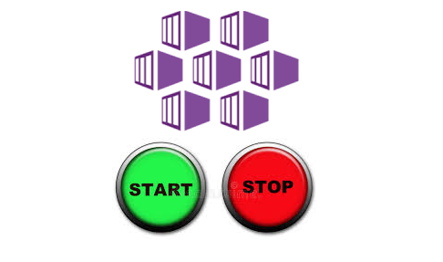

Hello Folks,

Today I want to share a quick solution which will help you to start/stop your AKS cluster with Azure CLI and DevOps. Cloud service might be quite expensive especially if you have a large clusters with big amount of nodes. Typically in enterprise area you will have separate clusters for different environments. Obviously production cluster should always be running however development or stage clusters might be stopped. Azure provides ability to not stop whole aks cluster which will deallocate node pool VMSS instances as well as aks cluster master node which is out of our control. This will help to minimize costs for the cluster.

For myself I have found that the easiest solution would be to use Azure DevOps scheduled pipeline which will run twice per day and will start/stop aks cluster. This solution is quite simple and will help to reduce costs for the cluster. So here a azure devops pipeline `YAML` file which you can reuse in your environment.

```yaml
pool: my-build-pool

pr: none
trigger: none

schedules:
- cron: '0 08,18 * * 1,2,3,4,5' # every work day at 8:00 and 18:00
  displayName: Daily Dev Cluster Stop 
  branches:
    include:
    - dev
  always: true

parameters:
  - name: cluster_name
    default: 
  - name: cluster_resource_group
    default: 
  - name: azure_devops_service_connection_name
    default:   
   
stages:
- stage: StopStartAKSCluster
  displayName: Start/Stop AKS Cluster
  jobs:
  - job: StopStartAKSCluster
    displayName: Start/Stop AKS Cluster
    steps:  
    - task: AzureCLI@2
      displayName: Install aks-extension 
      inputs:
        azureSubscription: '${{ parameters.azure_devops_service_connection_name }}'
        scriptType: bash
        scriptLocation: inlineScript
        inlineScript: |
          az extension add --name aks-preview
    - task: AzureCLI@2
      displayName: Get current power status of the cluster
      inputs:
        azureSubscription: '${{ parameters.azure_devops_service_connection_name }}'
        scriptType: bash
        scriptLocation: inlineScript
        inlineScript: |
          powerStatus=`az aks show --resource-group ${{ parameters.cluster_resource_group }} --name ${{ parameters.cluster_name}} --query agentPoolProfiles[0].powerState.code -o tsv`
          echo $powerStatus
          echo "##vso[task.setvariable variable=powerStatus;]$powerStatus"      
    - task: AzureCLI@2
      displayName: Power on/off the cluster.
      inputs:
        azureSubscription: '${{ parameters.azure_devops_service_connection_name }}'
        scriptType: bash
        scriptLocation: inlineScript
        inlineScript: |
          status=$(powerStatus)
          if [ $status == "Stopped" ]
          then
            echo "Cluster status is $(powerStatus), starting it..."
            az aks start --resource-group ${{ parameters.cluster_resource_group }} --name ${{ parameters.cluster_name}} --verbose          
          else
            echo "Cluster status is $(powerStatus), going to stop it..."
            az aks stop --resource-group ${{ parameters.cluster_resource_group }} --name ${{ parameters.cluster_name}} --verbose
          fi    
```

As you can see pipeline will start/stop aks cluster based on the schedule and current status of the cluster.

I hope this quick solution will be helpful for you and save you some time and money 😉.

See you in the next post.

Thank you 🤜🤛
