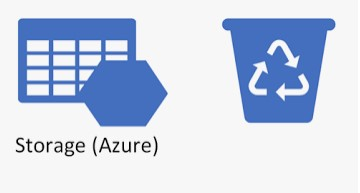

Hello everyone,
A while ago in my blog I have written a [post] about [Azure Storage Blob soft delete] option and a script which can be used to automatically set this `soft delete` option on demand or on a schedule basis using Azure automation. Since then Microsoft introduced a new option in Azure Storage called [Azure Storage Container soft delete]. This option is similar to the `soft delete` option in Azure Storage Blob, but it works for entire storage container where your blob data is stored. So with `soft delete` for blob you can recover individual blobs and with `soft delete` for container you can recover entire container with all its blobs. So I decided to improve my script which will now work for both `soft delete` options and additionally it will skip the storage account which has a particular tag i.e. `SoftDelete`: `False`.

```powershell
<#
.SYNOPSIS
    Enable soft delete (blob and container) for all storage accounts across the subscription. 
.DESCRIPTION
    Script is created to be used in conjunction with Azure Automation and will enable soft delete option for all storage account in the subscription.
    By default storage accounts which has a tag `SoftDelete` set to `False` will be skipped and if SoftDelete is enabled for this account, then script will disable it.
    If you wan to run script once comment out Connect to azure with run as account script block.
.INPUTS

.PARAMETER RetentionDays
    Number of days to keep deleted blobs for. The value must be between 1 and 365. Default is 14 days.
.PARAMETER TagName
    Name of the tag to be used to filter out storage accounts for which soft delete should not be enabled. Default is `SoftDelete`
.PARAMETER TagValue
    Value of the tag to be used to filter out storage accounts for which soft delete should not be enabled. Default is `False`

.OUTPUTS
 
.NOTES
    Version:        1.0
    Author:         Andrej Trusevic
    Creation Date:  2022-03-31
  
.EXAMPLE
#>

PARAM(
    [int] [ValidateRange(1,365)] [Parameter(Mandatory = $True, HelpMessage = "Number of days to keep deleted storage blobs and containers for. The value must be between 1 and 365")] $RetentionDays = 14,
    [string] [Parameter(Mandatory = $True, HelpMessage = "Tag Name based on which soft delete will be skipped for storage account" )] $TagName = "SoftDelete",
    [string] [Parameter(Mandatory = $True, HelpMessage = "Tag Value based on which soft delete will be skipped for storage account")] $TagValue = "False"
    )
    

# Connect to azure with run as account
$connectionName = "AzureRunAsConnection"
try
{
    # Get the connection "AzureRunAsConnection "
    $servicePrincipalConnection=Get-AutomationConnection -Name $connectionName         

    "Logging in to Azure..."
    Add-AzAccount `
        -ServicePrincipal `
        -TenantId $servicePrincipalConnection.TenantId `
        -ApplicationId $servicePrincipalConnection.ApplicationId `
        -CertificateThumbprint $servicePrincipalConnection.CertificateThumbprint 
}
catch {
    if (!$servicePrincipalConnection)
    {
        $ErrorMessage = "Connection $connectionName not found."
        throw $ErrorMessage
    } else{
        Write-Error -Message $_.Exception
        throw $_.Exception
    }
}

# Get All Storage Accounts
$StorageAccounts = Get-AzResource -ResourceType "Microsoft.Storage/storageAccounts"

foreach ($StorageAccount in $StorageAccounts) {
    # Get soft delete settings
    $SoftDeleteSetting = Get-AzStorageBlobServiceProperty -StorageAccountName $StorageAccount.Name -ResourceGroupName $StorageAccount.ResourceGroupName -WarningAction SilentlyContinue
    # Disable soft delete options if they are enabled and "SoftDelete: False" tag is set
    if ($StorageAccount.Tags[$Tag] -eq $TagValue) {
        if ($SoftDeleteSetting.ContainerDeleteRetentionPolicy.Enabled -eq $True) {
            Write-Host "Soft Delete should be disabled for storage account: $($StorageAccount.Name), but it has container soft delete enabled. Disabling container soft delete..."
            Disable-AzStorageContainerDeleteRetentionPolicy -StorageAccountName $StorageAccount.Name -ResourceGroupName $StorageAccount.ResourceGroupName
        }    
        if ($SoftDeleteSetting.DeleteRetentionPolicy.Enabled -eq $True) {
            Write-Host "Soft Delete should be disabled for storage account: $($StorageAccount.Name), but it has blob soft delete enabled. Disabling blob soft delete..."
            Disable-AzStorageDeleteRetentionPolicy -StorageAccountName $StorageAccount.Name -ResourceGroupName $StorageAccount.ResourceGroupName
        }
        if ($SoftDeleteSetting.DeleteRetentionPolicy.Enabled -ne $True -And $SoftDeleteSetting.ContainerDeleteRetentionPolicy.Enabled -ne $True) {
            Write-Host "Soft Delete should be disabled for storage account: $($StorageAccount.Name) skipping it..."
        } 
    # Enable soft delete options if they are disabled and "SoftDelete: False" tag is not set                     
    } else {
        if ($SoftDeleteSetting.ContainerDeleteRetentionPolicy.Enabled -ne $True) {
            Write-Host "Soft Delete should be enabled for storage account: $($StorageAccount.Name), but it has container soft delete disabled. Enabling container soft delete..."
            Enable-AzStorageContainerDeleteRetentionPolicy -StorageAccountName $StorageAccount.Name -ResourceGroupName $StorageAccount.ResourceGroupName -RetentionDays $RetentionDays
        }    
        if ($SoftDeleteSetting.DeleteRetentionPolicy.Enabled -ne $True) {
            Write-Host "Soft Delete should be enabled for storage account: $($StorageAccount.Name), but it has container soft delete disabled. Enabling container soft delete..."
            Enable-AzStorageDeleteRetentionPolicy -StorageAccountName $StorageAccount.Name -ResourceGroupName $StorageAccount.ResourceGroupName -RetentionDays $RetentionDays
        }
        if ($SoftDeleteSetting.DeleteRetentionPolicy.Enabled -eq $True -And $SoftDeleteSetting.ContainerDeleteRetentionPolicy.Enabled -eq $True) {
            Write-Host "Soft Delete already enabled for storage account: $($StorageAccount.Name) skipping it..."
        }
    }
}
```

Sure in perfect case it would be nice to have an azure policy which would automatically enable soft delete for all storage accounts in the subscription. But currently there is no such policy in Azure. So ideal solution for now would be to schedule this script via azure automation and run it on a daily basis. If you forgot how to schedule automation jobs here is a one my [previous blog posts] where you will find how to do this

<i class="far fa-sticky-note"></i> **Note:** If you will use Azure Automation to run this script on a schedule basis make sure you have installed and updated appropriate modules (Az.Accounts, Az.Automation, Az.Profile, Az.Resources, Az.Storage) for your azure automation account.
{: .notice--info}
{: .text-justify}

Script requires three parameters to be set:

- **RetentionDays** - Number of days to keep deleted blobs for. The value must be between 1 and 365. Default is `14` days.
- **TagName** - Name of the tag to be used to filter out storage accounts for which soft delete should not be enabled. Default is `SoftDelete`
- **TagValue** - Value of the tag to be used to filter out storage accounts for which soft delete should not be enabled. Default is `False`

<i class="far fa-sticky-note"></i> **Note:** Please keep in mind that if your storage account has a tag specified and already has any of soft delete options enabled script will disable them.
{: .notice--info}
{: .text-justify}

You also can easily adopt this script for one time execution, just comment `Connect to azure with run as account` area of the script.

I hope this will be useful for you and feel free to leave your questions in the comments.

Thank you 🤜🤛

<!-- Links -->
[Azure Storage Blob soft delete]: https://docs.microsoft.com/en-us/azure/storage/blobs/soft-delete-blob-overview
[Azure Storage Container soft delete]: https://docs.microsoft.com/en-us/azure/storage/blobs/soft-delete-container-overview
[post]: https://sysadminas.eu/Az-Storage-Soft-Delete/
[previous blog posts]:https://sysadminas.eu/Part-3-Azure-SQL-DB-Backups/