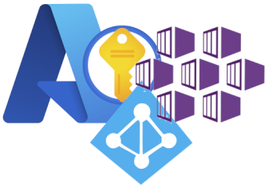
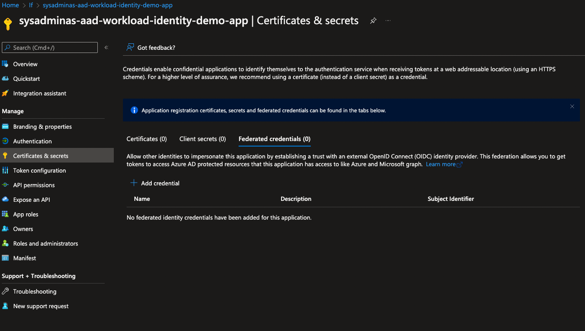
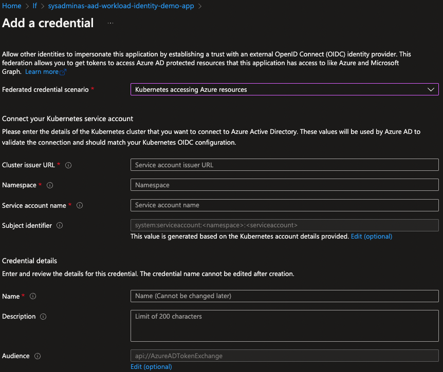
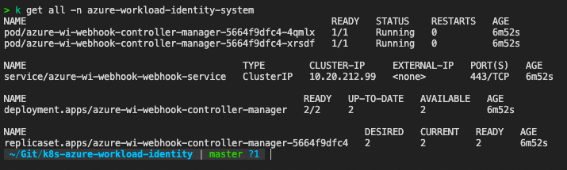
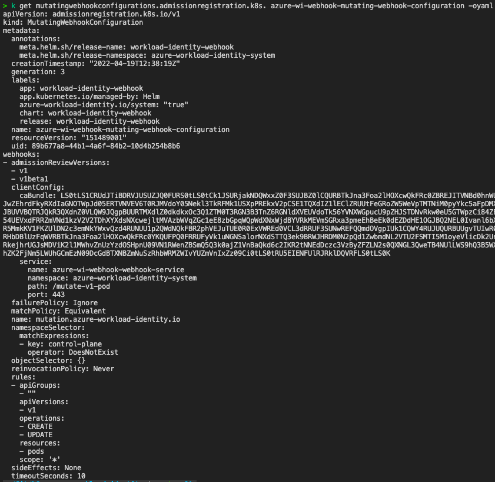
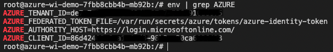
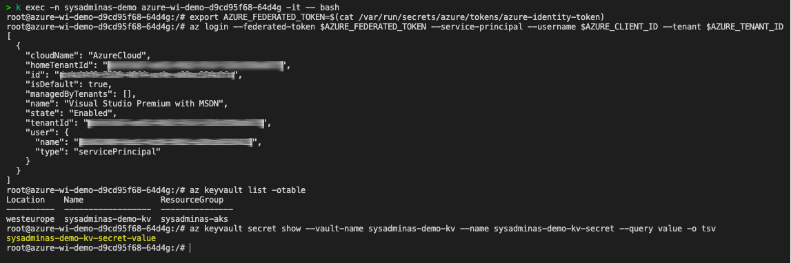

Hi All,

In one of [previous AKS series posts] I have written about AAD Pod Identity which is used to securely access Azure resources from a Pod running in a AKS cluster. Today I'm gonna talk about improved AAD pod identity solution called [Azure AD Workload Identity](https://azure.github.io/azure-workload-identity/docs/introduction.html). According the statements in official docs [Azure AD Workload Identity](https://azure.github.io/azure-workload-identity/docs/introduction.html) has several advantages over AAD Pod Identity:

* Removes the scale and performance issues that existed for identity assignment

* Supports Kubernetes clusters hosted in any cloud or on-premises

* Supports both Linux and Windows workloads

* Removes the need for Custom Resource Definitions and pods that intercept Instance Metadata Service (IMDS) traffic

* Avoids the complication and error-prone installation steps such as cluster role assignment from the previous iteration.

Currently solution only supports AAD applications and does not support Azure Managed Identity, but this limitation will be removed in the future.

So lets dive into the details and configure AKS cluster and a demo application with Azure AD Workload Identity.

First thing first we need to enable OIDC Issuer URL of the provider which allows the API server to discover public signing keys. Currently this feature is in preview, so before enable it on the cluster level we need to register `EnableOIDCIssuerPreview` feature flag and then refresh `Microsoft.ContainerService` provider.

<i class="far fa-sticky-note"></i> **Note:** Make sure you have selected correct Azure subscription before running this commands.
{: .notice--info}
{: .text-justify}

```bash
# Enable OIDC Issuer Preview feature flag
az feature register --name EnableOIDCIssuerPreview --namespace Microsoft.ContainerService
# Check the registration status
az feature list -o table --query "[?contains(name, 'Microsoft.ContainerService/EnableOIDCIssuerPreview')].{Name:name,State:properties.state}"
# Refresh Microsoft.ContainerService provider when feature flag state is ready
az provider register --namespace Microsoft.ContainerService
# Install and Update Azure CLI aks-preview extension
az extension add --name aks-preview
az extension update --name aks-preview
```

Now lets define a common environment variables which will be used in our setup.

```bash
# A Common Location for Azure Resources which will be created
export LOCATION="westeurope"
# Your Azure Tenant ID
export TENANT_ID= #<tenant-id>
# Your Azure Subscription ID
export SUBSCRIPTION_NAME="Visual Studio Premium with MSDN"
# Your AKS Cluster Resource Group Name 
export AKS_CLUSTER_RESOURCE_GROUP="sysadminas-aks"
# Your AKS Cluster Name
export AKS_CLUSTER_NAME="sysadminas"
# A Key Vault Name where secrert for demo purposes will be stored
export KEYVAULT_NAME="sysadminas-demo-kv"
# A Key Vault Secret Name where secret value for demo purposes will be stored
export KEYVAULT_SECRET_NAME="sysadminas-demo-kv-secret"
# A Key Vault Secret Value for demo purposes
export KEYVAULT_SECRET_VALUE="sysadminas-demo-kv-secret-value"
# Azure AD Application Name which's service principal will have associated permissions to access a key vault
export AZURE_AD_APPLICATION_NAME="sysadminas-aad-workload-identity-demo-app"
# Kubernetes Namespace where demo resources will be created
export NAMESPACE="sysadminas-demo"
# Kubernetes Service Account Name which will be used to run the demo application
export SERVICE_ACCOUNT_NAME="sysadminas-demo-sa"
```

Next we need to enable OIDC Issuer URL on the AKS cluster level for this we need to execute the following commands:

```bash
# Select appropriate Azure subscription
az account set --subscription $SUBSCRIPTION_NAME
# Enable OIDC Issuer URL on the AKS cluster level
az aks update -n $AKS_CLUSTER_NAME -g $AKS_CLUSTER_RESOURCE_GROUP --enable-oidc-issuer
```

If you use terraform for you cluster deployment you can enable OIDC Issuer URL on the cluster level using [oidc_issuer_enabled](https://registry.terraform.io/providers/hashicorp/azurerm/latest/docs/resources/kubernetes_cluster#oidc_issuer_enabled) setting which is available starting from [3.1.0](https://github.com/hashicorp/terraform-provider-azurerm/releases/tag/v3.1.0) version of the azurerm terraform provider.

Now let's create a Key Vault and a secret in it which will be used by the demo application.

```bash
# Create a Key Vault
az keyvault create --name $KEYVAULT_NAME --resource-group $AKS_CLUSTER_RESOURCE_GROUP --location $LOCATION --subscription "$SUBSCRIPTION_NAME"
# Create a secret in the Key Vault
az keyvault secret set --name $KEYVAULT_SECRET_NAME --vault-name $KEYVAULT_NAME --value $KEYVAULT_SECRET_VALUE  
```

After this we need to create an Azure AD Application and a service associated to it. Also we need to create a key vault policy assignment for the service principal to access the Key Vault secrets. 

```bash
# Create an Azure AD Application and save the Application ID as environment variable
AZURE_AD_APP=$(az ad app create --display-name $AZURE_AD_APPLICATION_NAME --query appId -o tsv)
# Create a service principal for the Azure AD Application 
az ad sp create --id $AZURE_AD_APP
# Save the service principal application ID as environment variable
export AZURE_AD_APP_ID=$(az ad sp list --display-name $AZURE_AD_APPLICATION_NAME --query '[].appId' -o tsv)
# Save Application Object ID as environment variable
export AZURE_AD_APP_OBJECT_ID=$(az ad app list --display-name $AZURE_AD_APPLICATION_NAME --query '[].objectId' -o tsv)
# Get a keyvault id and save it as environment variable
export KEYVAULT_ID=$(az keyvault show --name $KEYVAULT_NAME --resource-group $AKS_CLUSTER_RESOURCE_GROUP --query id -o tsv)
# Create a role assigment on a keyvault for the service principal
az role assignment create --role "Reader" --assignee $AZURE_AD_APP_ID --scope $KEYVAULT_ID
# Create a key vault policy assignment for the service principal to access the Key Vault secrets
az keyvault set-policy -n $KEYVAULT_NAME --spn $AZURE_AD_APP_ID --secret-permissions get
```

So we almost finished the setup on the Azure side. The only thing left is to configure federation on AAD application. This is kind of relationship between AAD application, Kubernetes cluster and Kubernetes service account under which our deployment will be running. Where 3 different ways how you can configure federation on AAD application:

1. Using a portal by navigating to [Azure Active Directory](https://portal.azure.com), selecting the application `certificate & secrets` blade. Then choose `Federated credentials` and click `Add Credential` button.



After this select `Kubernetes accesing Azure resources` and fill the required fields with appropriate values and click `Save` button.

<i class="far fa-sticky-note"></i> **Note:** You can retrieve your `Cluster issuer URL` by running the following command
{: .notice--info}
{: .text-justify}

```bash
export CLUSTER_ISSUER_URL=$(az aks show -n $AKS_CLUSTER_NAME -g $AKS_CLUSTER_RESOURCE_GROUP  --query "oidcIssuerProfile.issuerUrl" -otsv)
```



2. Second approach is to send api request to micsofort graf via Azure CLI.

```bash
# Reauthenticate to Azure CLI to make su device is managed to be able to send api request to microsoft graph
az login --scope https://graph.microsoft.com//.default 
# Send a request to the Azure AD Application to configure federation
cat <<EOF > body.json
{
  "name": "kubernetes-federated-credential",
  "issuer": "$CLUSTER_ISSUER_URL",
  "subject": "system:serviceaccount:$NAMESPACE:$SERVICE_ACCOUNT_NAME",
  "description": "Kubernetes service account federated credential",
  "audiences": [
    "api://AzureADTokenExchange"
  ]
}
EOF

az rest --method POST --uri "https://graph.microsoft.com/beta/applications/$AZURE_AD_APP_OBJECT_ID/federatedIdentityCredentials" --body @body.json
```

3. Third and the last method is to use [azwi](https://azure.github.io/azure-workload-identity/docs/installation/azwi.html) CLI to configure federation on AAD application.

This CLI tool is part of the Azure AD Workload Identity](https://azure.github.io/azure-workload-identity/docs/introduction.html) project. `AZWI` cli helps with the following steps:

* Generate the JWKS document from a list of public keys
*  Streamline the creation and deletion of the following resources:
   * AAD applications
   * Kubernetes service accounts
   * Federated identities
   * Azure role assignments

If you on MAC OS like me you can install `AZWI` cli by running the following command:

```bash
brew install Azure/azure-workload-identity/azwi
```

If you on any other OS download appropriate version of `AZWI` cli from [here](https://github.com/Azure/azure-workload-identity/releases/)

Next run the following command to configure federation on the AAD application:

```bash
azwi serviceaccount create phase federated-identity \
  --aad-application-name "$AZURE_AD_APPLICATION_NAME" \
  --service-account-namespace $NAMESPACE \
  --service-account-name "$SERVICE_ACCOUNT_NAME" \
  --service-account-issuer-url "$CLUSTER_ISSUER_URL"
```

Now let's move on to the Kubernetes side. 
First we need to deploy a Mutating Admission Webhook which is used by Azure AD Workload Identity to project a signed service account token to your workload’s volume and inject the following properties to pods with a service account that is configured to use the webhook: 

Environment variable | Description
-------------------- | ------------
AZURE_AUTHORITY_HOST | The Azure Active Directory (AAD) endpoint.
AZURE_CLIENT_ID | The application/client ID of the Azure AD application.
AZURE_TENANT_ID | The tenant ID of the Azure account.
AZURE_FEDERATED_TOKEN_FILE | The path of the projected service account token file.

Volume | Description
------- | -----------
azure-identity-token | The projected service account volume.

VolumeMount | Description
-------------- | -----------
/var/run/secrets/azure/tokens/azure-identity-token | The path of the projected service account token file.

The webhook allows pods to use a service account token projected to a well-known volume path to exchange for an Azure AD access token by leveraging the above properties with the Azure Identity SDKs or the Microsoft Authentication Library (MSAL).

We can easily deploy a Mutating Admission Webhook using a Helm chart.

```bash
# Retrieve Azure Tenant ID value will be passed to the helm chart
export AZURE_TENANT_ID="$(az account show -s $SUBSCRIPTION_NAME --query tenantId -otsv)"
# Add azure workload identity repo to the list
helm repo add azure-workload-identity https://azure.github.io/azure-workload-identity/charts
# Update repos with the latest changes
helm repo update
# Install the Mutating Admission Webhook Helm chart
helm install workload-identity-webhook azure-workload-identity/workload-identity-webhook \
   --namespace azure-workload-identity-system \
   --create-namespace \
   --set azureTenantID=$AZURE_TENANT_ID
```

After helm chart is installed we can see a few additional pods runnign in the cluster to perform the webhook work.



Also a new mutating webhook configuration is created:



As you can see in the screen bellow each `CREATE` and `UPDATE` API request for the `PODS` will be forwarded to `azure-wi-webhook-webhook-mutating-service` which exposes our azure-wi-webhook-controller-manager deployment where request will be modified by adding environment variables and volumes with volume mounts and then will be sent back to API for final completion.

We almost finished with setup we now need to create a service account with appropriate annotation `azure.workload.identity/client-id: $AZURE_AD_APP_ID` and then configure our application deployment to use this service account.


```bash
# Create a demo namespace
kubectl create namespace $NAMESPACE
# Create a demo service account
cat <<EOF | kubectl apply -f -
apiVersion: v1
kind: ServiceAccount
metadata:
  annotations:
    azure.workload.identity/client-id: $AZURE_AD_APP_ID
  labels:
    azure.workload.identity/use: "true"
  name: $SERVICE_ACCOUNT_NAME
  namespace: $NAMESPACE
EOF
```

Here we are adding only one annotation `azure.workload.identity/client-id: $AZURE_AD_APP_ID` to our service account which is required additionally we can add more optional annotations which. All available service account annotations can be viewed in [Azure Workload Identity Docs](https://azure.github.io/azure-workload-identity/docs/topics/service-account-labels-and-annotations.html#annotations)

Now we can create a deployment with the service account we just created.

```bash
# Create a demo application deployment
cat <<EOF | kubectl apply -f -
apiVersion: apps/v1
kind: Deployment
metadata:
  name: azure-wi-demo
  labels:
    app: azure-wi-demo
  namespace: $NAMESPACE 
spec:
  replicas: 1
  selector:
    matchLabels:
      app: azure-wi-demo
  template:
    metadata:
      labels:
        app: azure-wi-demo
    spec:
      serviceAccount: $SERVICE_ACCOUNT_NAME
      containers:
        - name: azure-wi-demo
          image: andriktr/utils:1.0.8
EOF
```

Very common case is when your deployment contains several containers and obviously not all of them need to use `azure workload identity` functionality. In this case you may add annotation `azure.workload.identity/skip-containers` and specify a comma separated list of container names that should not be configured with `azure workload identity`.

Our pod is now ready and running. Let's check what we see inside the container.

```bash
kubectl exec -n sysadminas-demo <<your pod name>> -it -- bash
```

First lets check the environment variables:



Next we can grab a `federated token file` save it as environment variable and use it to authenticate with Azure AD. Run these command from the container:

```bash
# Grab federated token and save it as environment variable
export AZURE_FEDERATED_TOKEN=$(cat /var/run/secrets/azure/tokens/azure-identity-token)
# Login to Azure with federated token
az login --federated-token $AZURE_FEDERATED_TOKEN --service-principal --username $AZURE_CLIENT_ID --tenant $AZURE_TENANT_ID
# List all available key vaults
az keyvault list -otable
# Grab a secret value from a key vault secret
az keyvault secret show --vault-name sysadminas-demo-kv --name sysadminas-demo-kv-secret --query value -o tsv
```

And here is the result of the commands listed above:



Of course in normal case you would not need to run these commands in order to get the secret value instead depending on your application code you should use [Microsoft Authentication Library (MSAL)](https://azure.github.io/azure-workload-identity/docs/topics/language-specific-examples/msal.html) to achieve the same result from your application code. Here is another docs about ho to [Use Azure AD workload identity for Kubernetes in a .NET Standard application](https://docs.microsoft.com/en-us/samples/azure-samples/azure-ad-workload-identity/azure-ad-workload-identity/)

So, this is it for now. I hope you found this article helpful and if you have any questions or suggestions please feel free to contact me.

Thank you 🤜 🤛

<!-- Links -->
[previous AKS series posts]: https://sysadminas.eu/Part-6-AKS/