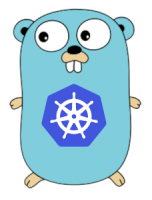
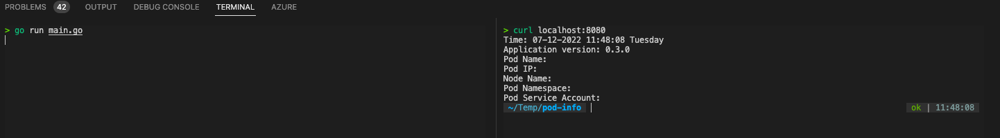
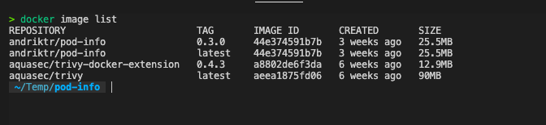
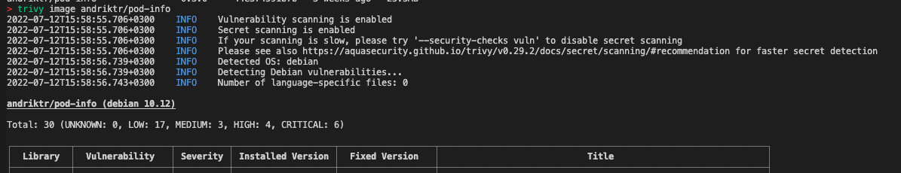
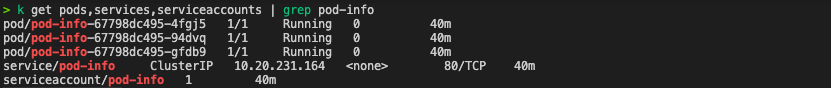
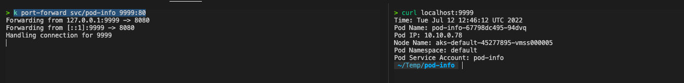

Hi All,

In this post we will try to write first super simple Go app and deploy it to our k8s cluster.

Go programming language is one of most popular programming languages in the world. It is a great language to learn. Main benefit of Go is that it is easy to learn and it is very fast. Also Go has big and active developer community so you may expect to get help if you struggle with your project. As you probably know Kubernetes is written in Go as well as many other great applications.

If you like me also just starting your Go lang journey I can recommend a few resources that will help you to get started with Go.

* [Official Go Documentation](https://go.dev/doc/)

* [Golang Tutorial for Beginners](https://www.youtube.com/watch?v=yyUHQIec83I&t)

* [Learn Go Programming - Golang Tutorial for Beginners](https://www.youtube.com/watch?v=YS4e4q9oBaU&t)

* [Golang playground](https://go.dev/play/)

So let's get started. First things first we need to install Go language. If you on macOS you can install Go with following command:

```bash
# Install Go with Homebrew
brew install go
# Confirm Go version
go version
```

For all other platforms please follow the official [installation guide](https://golang.org/doc/install/)

Next let's create our new Go project. First we need to create a directory for our project.

```bash
# Create a directory for our project
mkdir pod-info
# Change directory to our project
cd pod-info
# Create a new Go project
go mod init pod-info
```

As result we will have `go.mod` file in our project directory.

Now let's create a `main.go` file. 

```bash
# Create a `main.go` file
touch main.go
```

And add our application code to it

```go
package main

import (
	"fmt"
	"log"
	"net/http"
	"os"
	"time"
)

func handler(w http.ResponseWriter, r *http.Request) {
	var appVersion string = "0.3.0"

	var podName string = os.Getenv("POD_NAME")
	var nodeName string = os.Getenv("NODE_NAME")
	var podIp string = os.Getenv("POD_IP")
	var podNamespace string = os.Getenv("POD_NAMESPACE")
	var podServiceAccount string = os.Getenv("POD_SERVICE_ACCOUNT")
	currentTime := time.Now()

	fmt.Fprintf(w, "Time: %s\n", currentTime.Format("01-02-2006 15:04:05 Monday"))
	fmt.Fprintf(w, "Application version: %s\n", appVersion)
	fmt.Fprintf(w, "Pod Name: %s\n", podName)
	fmt.Fprintf(w, "Pod IP: %s\n", podIp)
	fmt.Fprintf(w, "Node Name: %s\n", nodeName)
	fmt.Fprintf(w, "Pod Namespace: %s\n", podNamespace)
	fmt.Fprintf(w, "Pod Service Account: %s\n", podServiceAccount)
}

func main() {
	http.HandleFunc("/", handler)
	log.Fatal(http.ListenAndServe(":8080", nil))
}
```

As you can see the code is very simple. We just need to import some packages and create a function that will be called when someone will call our web application. The function will print out information about pod as well as date/time and application version. All information (except current date time) will be gathered from container environment variables. Our web application will be available on port 8080.

Now let's test our application locally to make sure it works before we wrap it into a Docker image. For this first we need to run:

```bash
go run main.go
```

Then in your browser (alternatively you can use parallel terminal with curl) hit [http://localhost:8080/](http://localhost:8080/) and you should see info similar to mine.



As you can see our application is working fine. You may notice that `Pod information` and `Node name` are not shown this is because we do not have appropriate environment variables locally. In Kubernetes these values will be set automatically in our deployment.

OK we are done with our first Go app code. Now let's wrap it into a Docker image.

First we need to create a Dockerfile.

```bash
# Create a Dockerfile
touch Dockerfile
```

Now let's add some instructions to our Dockerfile.

```Dockerfile
# syntax=docker/dockerfile:1
##
## Build
##
FROM golang:1.18-buster AS build

WORKDIR /app

COPY go.mod ./
RUN go mod download

COPY *.go ./

RUN go build -o /pod-info

##
## Deploy
##
FROM gcr.io/distroless/base-debian10

WORKDIR /

COPY --from=build /pod-info /pod-info

EXPOSE 8080

USER nonroot:nonroot

ENTRYPOINT ["/pod-info"]
```

We are creating our image in two steps first we use a `golang:1.18-buster` as a build image where we will build our application. Then we use `gcr.io/distroless/base-debian10` as a deploy image which will be used to deploy our application. The `gcr.io/distroless/base-debian10` image a distroless image which has a minimal set of packages installed this hugely minimizes the size of our image as well as potential attack surface. We will run our application under non root user which also is a security best practice.

Now let's create an actual Docker image and push it to our registry.

```bash
docker build --platform linux/amd64 -t andriktr/pod-info:0.3.0 .
docker image push andriktr/pod-info:0.3.0
```

Now our image has minimal size::



If we scan our images with `trivy` it has less vulnerabilities than the full distro images:



Now it is time to deploy our application. For this we will use the following kubernetes resources and put them in a `pod-info.yaml` file.

```yaml:
apiVersion: v1
kind: Service
metadata:
  name: pod-info
spec:
  selector:
    app: pod-info
  ports:
    - protocol: TCP
      port: 80
      targetPort: 8080
---
apiVersion: v1
kind: ServiceAccount
metadata:
  name: pod-info
---
apiVersion: apps/v1
kind: Deployment
metadata:
  name: pod-info
spec:
  replicas: 3
  selector:
    matchLabels:
      app: pod-info
  template:
    metadata:
      name: pod-info
      labels:
        app: pod-info
    spec:
      containers:
        - name: pod-info
          image: andriktr/pod-info:0.2.1
          ports:
            - containerPort: 8080
              name: http
          env:
          - name: NODE_NAME
            valueFrom:
              fieldRef:
                fieldPath: spec.nodeName
          - name: POD_NAME
            valueFrom:
              fieldRef:
                fieldPath: metadata.name                
          - name: POD_NAMESPACE
            valueFrom:
              fieldRef:
                fieldPath: metadata.namespace
          - name: POD_IP
            valueFrom:
              fieldRef:
                fieldPath: status.podIP
          - name: POD_SERVICE_ACCOUNT
            valueFrom:
              fieldRef:
                fieldPath: spec.serviceAccountName
      serviceAccountName: pod-info
```

We deploy a `service` to expose our application on port 80. We also creating a `service account` which will be used to run our POD. Last peace is deployment itself where we use our image. To expose pod information we use [pod fields as environment variable](https://kubernetes.io/docs/tasks/inject-data-application/environment-variable-expose-pod-information/#use-pod-fields-as-values-for-environment-variables)

Let's deploy the application and check how it works.

```bash
# Deploy kubernetes resources
kubectl apply -f pod-info.yaml
```

As result we have following resources in the cluster:



Last thing we need to do is to check how our application is working in the cluster. We exposed application via `service`, so we can use `kubectl port-forward` to access it from our local machine.

```bash
kubectl port-forward svc/pod-info 9999:80
```

Then if you hit [http://localhost:9999/](http://localhost:9999/) in browser or `curl` you should see the following:



Seems like everything is working fine and we have our application running in the cluster.

You can find all the the source file in the [Pod-Info repository](https://github.com/andriktr/pod-info)

I hope this post was informative and useful for you and would like to THANK YOU for reading it.

See you 🤜 🤛