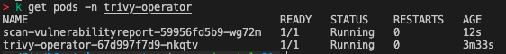
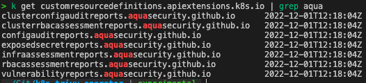
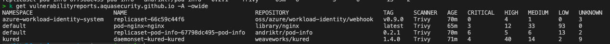
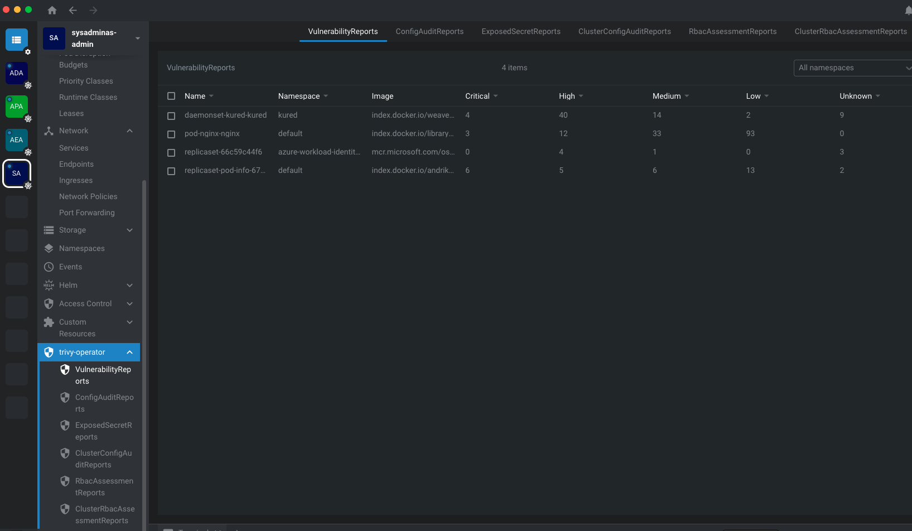
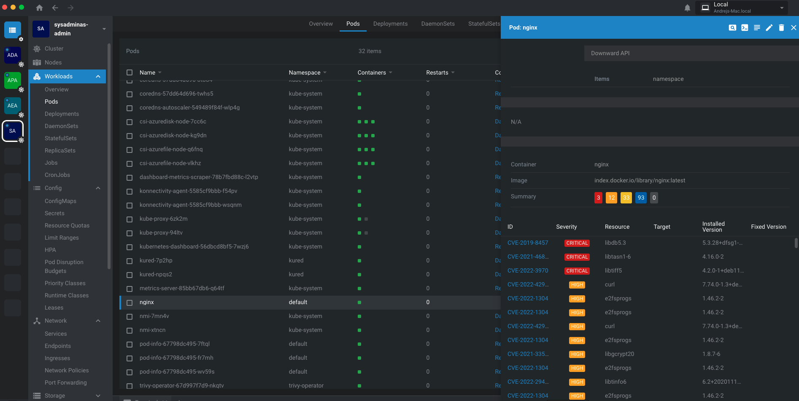
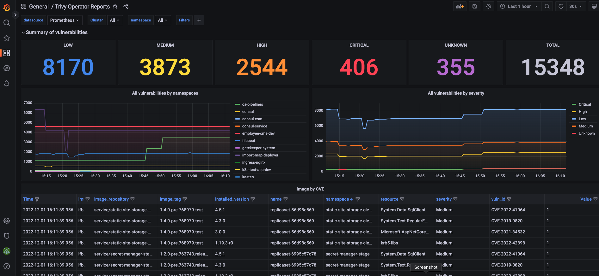

Hi All,

In todays post I would like to talk about [trivy-operator](https://github.com/aquasecurity/trivy-operator). Trivy-operator is a Kubernetes operator which can provide:

* Vulnerability reports for container images running in your cluster

* Configuration Audit reports for your cluster

* Exposed secret reports for your cluster

* RBAC Assessment reports for your cluster

* Cluster RBAC Assessment reports for your cluster

It is based on Trivy (I wrote about `trivy` in one of my [previous post](https://sysadminas.eu/ACR-Manage-and-Secure/#scan-acr-images) already), a simple and comprehensive vulnerability scanner for containers and other artifacts. Trivy is a static analysis tool that detects vulnerabilities of OS packages (Alpine, RHEL, CentOS, etc.) and application dependencies (Bundler, Composer, npm, yarn, etc.) in container images. Both `trivy` and `trivy-operator` are open source projects and are developed by [Aqua Security](https://www.aquasec.com/).

In terms of Kubernetes `trivy-operator` is a deployment which runs in your cluster which watches your namespaces and scans target workloads like pod, replicasets, statefulsets, daemonsets, jobs, cronjobs, secrets, roles, rolebindings, clusterroles, clusterrolebindings.

Trivy-operator deployment process is pretty straightforward. However in terms of AKS if we use Azure Container Registry (ACR) as private registry for images used in our cluster we need to use `Azure Pod Identity` in order to make `trivy-operator` able to scan these images and access ACR. If you are not familiar with `Azure Pod Identity` I would recommend to read my [previous post](https://sysadminas.eu/Part-6-AKS/) about it.

So let's get started and jump into our demo. First thing first let's define a common variables which we will use in our setup.

```bash
# Azure Tenant ID
export AZ_TENANT_ID="<Your Azure Tenant ID goes here>"
# Azure Subscription Name
export AZ_SUBSCRIPTION_NAME="Visual Studio Premium with MSDN"
# Location
export AZ_LOCATION="westeurope"
# AKS Cluster Name
export AKS_RESOURCE_GROUP="sysadminas-aks"
# AKS Cluster Name 
export AKS_CLUSTER_NAME="sysadminas"
# AKS Cluster Node Resource Group Name
export AKS_NODE_RESOURCE_GROUP="sysadminas-aks-nodes"
# Resource Group for ACR
export ACR_RESOURCE_GROUP="sysadminas-aks"
# Name of the ACR used in AKS cluster
export ACR_NAME="sysadminas"
# Name of the Azure managed identity which will be used by trivy-operator
export AZ_IDENTITY_NAME="sysadminas-trivy-operator-identity"
# Name of K8S namespace where deployment 
export NAMESPACE="trivy-operator"
```

Next ensure that our AKS cluster has `Azure Pod Identity` addon enabled. To do that we need to run following command:

```bash
# Enable Azure Pod Identity (it safe to run it even if it is already enabled)
az aks update --enable-pod-identity --subscription $AZ_SUBSCRIPTION_NAME --resource-group $AKS_RESOURCE_GROUP --name $AKS_CLUSTER_NAME
```

Now we need to create a new Azure managed identity which will be used by `trivy-operator` to access ACR. Also we will assign identity to the AKS cluster scale set. To do that we need to run following command:

```bash
# Create Azure managed identity
az identity create --name $AZ_IDENTITY_NAME --subscription $AZ_SUBSCRIPTION_NAME --resource-group $AKS_RESOURCE_GROUP  --location $AZ_LOCATION
# Get Azure managed identity resource ID and save it as a variable
export IDENTITY_ID=$(az identity show --name $AZ_IDENTITY_NAME --resource-group $AKS_RESOURCE_GROUP --subscription "$AZ_SUBSCRIPTION_NAME" --query id -o tsv)
# Get Azure managed identity client ID and save it as a variable
export IDENTITY_CLIENT_ID=$(az identity show --name $AZ_IDENTITY_NAME --resource-group $AKS_RESOURCE_GROUP --subscription "$AZ_SUBSCRIPTION_NAME"  --query clientId -o tsv)
# Get AKS cluster scale set name and save it as a variable
export AKS_SCALE_SET=$(az vmss list --resource-group $AKS_NODE_RESOURCE_GROUP --subscription "$AZ_SUBSCRIPTION_NAME" --query "[].name" -o tsv)
# Assign Azure managed identity to the AKS cluster scale set
az vmss identity assign --resource-group $AKS_NODE_RESOURCE_GROUP -n $AKS_SCALE_SET --identities $IDENTITY_ID --subscription "$AZ_SUBSCRIPTION_NAME"
# Get ACR resource ID and save it as a variable
export ACR_RESOURCE_ID=$(az acr show --name $ACR_NAME --resource-group $ACR_RESOURCE_GROUP --subscription "$AZ_SUBSCRIPTION_NAME" --query id -o tsv)
# Assign ACR pull role to the Azure managed identity
az role assignment create --role acrpull --assignee $IDENTITY_CLIENT_ID --scope $ACR_RESOURCE_ID --subscription "$AZ_SUBSCRIPTION_NAME"
```

OK, we seems finished with Azure side of things and now we can switch to Kubernetes side. Let's create a namespace for `trivy-operator` as well as azure identity and binding for it:

```bash
# create namespace for trivy-operator
kubectl create namespace $NAMESPACE
```

```bash
# create azure identity for trivy-operator
cat <<EOF | kubectl apply -f -
apiVersion: aadpodidentity.k8s.io/v1
kind: AzureIdentity
metadata:
  name: $AZ_IDENTITY_NAME
  namespace: $NAMESPACE
spec:
    clientID: $IDENTITY_CLIENT_ID
    resourceID: $IDENTITY_ID
    type: 0 
EOF
```

```bash
# create azure identity binding for trivy-operator
cat <<EOF | kubectl apply -f -
apiVersion: "aadpodidentity.k8s.io/v1"
kind: AzureIdentityBinding
metadata:
  name: $AZ_IDENTITY_NAME
  namespace: $NAMESPACE 
spec:
  azureIdentity: $AZ_IDENTITY_NAME  
  selector: $AZ_IDENTITY_NAME
EOF
```

Now we can configure and deploy `trivy-operator`. First let's add Helm repository which contains `trivy-operator` chart and pull it to our local machine:

```bash
# add Helm repository
helm repo add aqua https://aquasecurity.github.io/helm-charts/
# update Helm repositories
helm repo update
# pull trivy-operator chart to local machine
helm pull aqua/trivy-operator --untar
```

Next let's configure `trivy-operator` chart by creating our own `values.yaml` file to override some of defaults. We will save our settings into the separate file:

```bash
touch trivy-operator-values.yaml
cat <<EOF >> trivy-operator-values.yaml
excludeNamespaces: "kube-system"

operator:
  # scanJobsConcurrentLimit the maximum number of scan jobs create by the operator
  scanJobsConcurrentLimit: 2  
  # scanJobsRetryDelay the duration to wait before retrying a failed scan job
  scanJobsRetryDelay: 60s
  # infraAssessmentScannerEnabled the flag to enable infra assessment scanner
  infraAssessmentScannerEnabled: false
  # metricsVulnIdEnabled the flag to enable metrics about cve vulns id
  # be aware of metrics cardinality is significantly increased with this feature enabled.
  metricsVulnIdEnabled: true

# Prometheus ServiceMonitor configuration (enable this if you use Prometheus Operator and want to scrape metrics from trivy-operator)
serviceMonitor:
  # enabled determines whether a serviceMonitor should be deployed
  enabled: true
  # The namespace where Prometheus expects to find service monitors
  namespace: "kube-prometheus-stack"
  interval: "60s"
  # Additional labels for the serviceMonitor
  labels:
    release: kube-prometheus-stack

trivyOperator:
  # Our AAD Pod Identity selector which we set in AzureIdentityBinding
  scanJobPodTemplateLabels: "aadpodidbinding=sysadminas-trivy-operator-identity"

trivy:
  # resources resource limits (During my tests I have noticed that default values may be not enough for trivy to scan images)) 
  resources:
    limits:
      cpu: 2000m
      memory: 2000M
EOF
```

Now we are ready to deploy `trivy-operator`:

```bash
# Run helm template to generate Kubernetes manifests
helm template trivy-operator trivy-operator --namespace $NAMESPACE --values trivy-operator-values.yaml
# Run helm install/upgrade --dry-run --debug to see what will be deployed
helm upgrade -i --dry-run --debug trivy-operator trivy-operator --namespace $NAMESPACE --values trivy-operator-values.yaml
# Run helm install/upgrade to deploy trivy-operator
helm upgrade -i trivy-operator trivy-operator --namespace $NAMESPACE --values trivy-operator-values.yaml
```

Once we have deployed `trivy-operator` it immediately starts scanning all selected workloads in the cluster. Also once you spin up new pod, replicasets, deployment, etc. it will be scanned automatically.
Trivy-operator scan jobs in kubernetes are represented as `jobs.batch` objects. Kubernetes `jobs.batch` creates a pod and runs it until it completes. Once the job is completed, the pod is deleted.



So we have deployed `trivy-operator` and it is scanning our cluster. But how can we see the results of the scan? Currently I see three options:

1. Use built in trivy-operator reports which which in kubernetes are represented as custom resources:



For example to view vulnerabilities report from all namespaces we can run:

```bash
kubectl get vulnerabilityreports.aquasecurity.github.io -A -owide
```

This results in to the following output:



To view more details we can use:

```
kubectl describe vulnerabilityreports.aquasecurity.github.io -n <<namespace>>
```

2. Second approach is to install [Lens](https://k8slens.dev/) which is super cool Kubernetes IDE. Lens is a desktop application which allows you
to manage Kubernetes clusters. It is available for Windows, MacOS and Linux. Once you install Lens you can connect to your cluster and see and manage all the resources in the cluster. Lens has an extensions for
tryvi-operator which allows you to see the results of the scan in it's UI.

You can see the results of the scan as a combined report: 



Or if you click on the pod you can see the vulnerabilities for the specific pod:



If you have not tried Lens yet, I highly recommend it. It is awesome and very useful tool.

3. Third method is to use [Prometheus](https://prometheus.io/) to scrape metrics from `trivy-operator` and visualize them in Grafana.

To use this option make sure you have enabled `serviceMonitor` and `operator.metricsVulnIdEnabled` in `trivy-operator-values.yaml`. After this save and import the following [json](https://drive.google.com/file/d/1BvbQc3QCSVeiRMjHaqmPO0691XhPf_Ef/view?usp=sharing) dashboard into Grafana.

As result you will able to see the following dashboard:



That's it! We have deployed `trivy-operator` and it is scanning our cluster. We also can see results of the scan using different tools.
Definitely `trivy-operator` is a great tool to scan your cluster and find vulnerabilities in your workloads.
I hope this post was helpful and you will find it useful.

See you 🤜 🤛, bye!
