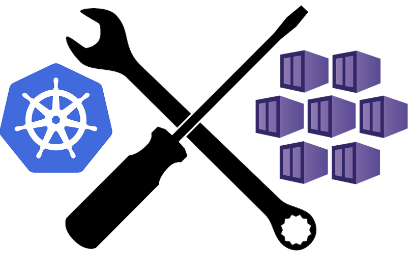

Hi All,

Kubernetes has become the de facto standard for container orchestration. It is a powerful tool that can help you manage your containerized applications. However, it is not a silver bullet. It is a complex system that requires a lot of attention and care. In this post I try to overview some tools and general best practices which IMO are must have for successful Kubernetes (AKS) journey.

## Infrastructure as Code

In current DevOps era infrastructure as code is a must have for any serious IT project. It allows you to automate the deployment of your infrastructure and to manage it in a consistent and repeatable way. It also allows you to version control your infrastructure and to track changes. If we talk about AKS specifically there are a bunch of different tools which you can use for IaC accomplishment. You can use Azure CLI, Terraform, ARM templates, Ansible, Azure Bicep, Powershell etc. Each of these tools has its own pros and cons, but personally I prefer to use Hashicorp's [Terraform](https://www.terraform.io/) which is one of the most popular and easy to use IaC languages in todays DevOps market. Terraform covers all the major cloud providers and much more. You can find more information about Terraform and AKS [here](https://registry.terraform.io/providers/hashicorp/azurerm/latest/docs/resources/kubernetes_cluster).
Having your infrastructure as code is a great decision, but keep in mind that cloud providers constantly evolving and changing their API's. So the code which you wrote X days ago may not work today. So you need to have a constant automated way to test your code on a regular basis. In case of AKS infrastructure from my experience I can recommend to have some kind of experimental environment which should be deployed using exact same code as was used for dev/prod environments. Then you should have an automated process for example a CI/CD pipeline which will regularly redeploy this experimental environment from scratch and will run some smoke tests. It's quite easy to achieve with Terraform and Azure DevOps. By having such setup you will be sure that your IaC code is working and you will be able to redeploy/update other business critical environments. Also such approach may help you to test new features and new versions of your infrastructure before rolling them out to more important environments.  

## Cluster maintenance and management

When we have our Kubernetes cluster up and running we need to have right tools to manage it. There are allot of tools which can help you with that and here are some of them which I use and recommend.

### Kubectl

[kubectl](https://kubernetes.io/docs/reference/kubectl/overview/) - is a number 1 command-line tool for controlling Kubernetes clusters. It allows you to run commands against Kubernetes clusters. You can use it to deploy applications, inspect and manage cluster resources, and view logs. It is a must have tool for any Kubernetes cluster.

### Lens

[Lens](https://k8slens.dev/) - It is a desktop application that allows you to manage your Kubernetes clusters. It is a great tool for developers and DevOps engineers. It has a lot of useful features like cluster management, monitoring, debugging, and more. It is available for Windows, Mac, and Linux.

### Kube-node_shell

[kube-node_shell](kubectl-node_shell) - is a simple tool that allows you to run commands on your Kubernetes nodes. It is a great tool for troubleshooting and debugging. It is a must have tool for any Kubernetes cluster.

### K9S

[k9s](https://github.com/derailed/k9s) - provides a terminal UI to interact with your Kubernetes clusters. The aim of this project is to make it easier to navigate, observe and manage your applications in the wild. K9s continually watches Kubernetes for changes and offers subsequent commands to interact with your observed resources.

### Kured

[kured/kubereboot](https://github.com/kubereboot/kured) - is a Kubernetes DaemonSet that performs safe automatic node reboots when required. It is a great tool for cluster maintenance and management. In terms of AKS it is a must have tool because node updates are managed automatically by Azure however you as a cluster administrator is responsible for the nodes reboot and kured/kubereboot can help you with that.

## Networking

Another very important and probably most dificult part of Kubernetes ecosystem is networking. It is crucial to have a secure, reliable, easy configurable connections from and to applications running in your cluster.

### Ingress Controller

If you plan to expose your applications outside of your cluster you may need to have an Ingress controller. There are a lot of Ingress controllers like Nginx, Traefik, HAProxy, Kong etc. Personally I use open source version of ingress for official k8s repo [ingress-nginx](https://github.com/kubernetes/ingress-nginx). I choose it because it is highly supported by community easy to use and configure. As alternative you may consider to use [Azure Application Gateway Ingress Controller](https://learn.microsoft.com/en-us/azure/application-gateway/tutorial-ingress-controller-add-on-new) which is more native for AKS. Also there other NGINX ingress version officially distributed by NGINX/F5 [F5 NGINX Ingress Controller for Kubernetes](https://www.nginx.com/products/nginx/kubernetes-ingress-controller/) whey offer free and paid versions.
[Here](https://blog.palark.com/wp-content/uploads/2019/10/kubernetes-ingress-comparison.png) you can find some comparison between top ingress controllers.

### Service Mesh

A service mesh is a dedicated infrastructure layer that adds features to a network between services. It allows to control traffic and gain insights throughout the system. Observability, traffic shifting (for canary releasing), resiliency features (such as circuit breaking and retry/timeout) and automatic mutual TLS can be configured once and enforced in a decentralized fashion. In contrast to libraries, which are used for similar functionality, a service mesh does not require code changes. Instead, it adds a layer of additional containers that implement the features reliably and agnostic to technology or programming language. There are a lot of service meshes like Istio, Linkerd, Consul, Open Service Mesh etc. Currently I'm using [Consul](https://www.consul.io/) which is quite is very powerful service mesh with a lot of different features. Main benefit of Consul is that it can be used not only for K8S service but with any other service outside the cluster. However be ready to spend some time in Consul documentation in order to understand how everything works. In terms of AKS the only one officially supported service mesh is [Open Service Mesh(OSM)](https://openservicemesh.io/). OSM is driven by Microsoft and can be enabled as add-on. If you want to get more info about service meshes including detailed comparison of various solutions I encourage you to check the [following source](https://servicemesh.es/).

## High Availability

### Autoscaling

In all production environments high availability is a critical requirement. First things which is needed to achieve high availability in AKS and make sure that your pods will be scheduled is to have autoscaling enabled and properly configured. You can find more information about AKS autoscaling [here](https://learn.microsoft.com/en-us/azure/aks/cluster-autoscaler). Autoscaling is a great tool for high availability it will make sure that you have enough compute resource to run your applications. Down scaling will ensure that you will not pay for unused resources. 

### Horizontal Pod Autoscaler

Horizontal Pod Autoscaler automatically scales the number of pods in a replication controller, deployment, replica set or stateful set based on observed CPU utilization (or, with custom metrics support, on some other application-provided metrics). You can find more information about HPA [here](https://kubernetes.io/docs/tasks/run-application/horizontal-pod-autoscale/). HPA is a great tool for high availability it will make sure that you have enough compute resource to run your applications.

### Descheduler

Scheduling in Kubernetes is the process of binding pending pods to nodes, and is performed by a component of Kubernetes called kube-scheduler. The scheduler's decisions, whether or where a pod can or can not be scheduled, are guided by its configurable policy which comprises of set of rules, called predicates and priorities. The scheduler's decisions are influenced by its view of a Kubernetes cluster at that point of time when a new pod appears for scheduling. As Kubernetes clusters are very dynamic and their state changes over time, there may be desire to move already running pods to some other nodes for various reasons:

Some nodes are under or over utilized.
The original scheduling decision does not hold true any more, as taints or labels are added to or removed from nodes, pod/node affinity requirements are not satisfied any more.
Some nodes failed and their pods moved to other nodes.
New nodes are added to clusters.
Consequently, there might be several pods scheduled on less desired nodes in a cluster. [Descheduler](https://github.com/kubernetes-sigs/descheduler), based on its policy, finds pods that can be moved and evicts them. Please note, in current implementation, descheduler does not schedule replacement of evicted pods but relies on the default scheduler for that.

### KEDA

[KEDA](https://github.com/kedacore/keda) allows for fine-grained autoscaling (including to/from zero) for event driven Kubernetes workloads. KEDA serves as a Kubernetes Metrics Server and allows users to define autoscaling rules using a dedicated Kubernetes custom resource definition. For [AKS KEDA](https://learn.microsoft.com/en-us/azure/aks/keda-about) can be enabled as add-on.

## Monitoring and Logging

### Kube-capacity

[kube-capacity](https://github.com/robscott/kube-capacity) - kube-capacity is a simple CLI tool (it's like a kubectl top, but more advanced version) that provides an overview of the resource requests, limits, and utilization in your cluster. It is a great tool for monitoring your cluster and to see how much resources you have available and utilized.

### Kube-prometheus-stack

[kube-prometheus-stack](https://github.com/prometheus-community/helm-charts/tree/main/charts/kube-prometheus-stack) - kube-prometheus-stack is a collection of Kubernetes manifests, Grafana dashboards, and Prometheus rules combined with documentation and scripts to provide easy to operate end-to-end Kubernetes cluster monitoring with Prometheus using the Prometheus Operator.

### Filebeat and Fluentd

[filebeat](https://www.elastic.co/guide/en/beats/filebeat/current/filebeat-overview.html) - Filebeat is a lightweight shipper for forwarding and centralizing log data. It is a great tool for collecting the logs from your pods and sending them to the central location such as ElasticSearch. As alternative you can consider to use [Fluentd](https://www.fluentd.org/). 

### Azure Monitor

For AKS monitoring you can combine existing tools with built-in Azure monitoring solutions such as [Azure Monitor](https://learn.microsoft.com/en-us/azure/aks/monitor-aks) and [Azure Monitor for containers](https://docs.microsoft.com/en-us/azure/azure-monitor/insights/container-insights-overview). You can also use [Azure Workbooks](https://learn.microsoft.com/en-us/azure/azure-monitor/visualize/workbooks-overview) to create custom dashboards and [Azure Alerts](https://docs.microsoft.com/en-us/azure/azure-monitor/platform/alerts-overview) to create alerts and be notified when something goes wrong.

## CI/CD

### Azure DevOps

[Azure DevOps](https://azure.microsoft.com/en-us/products/devops/#overview) is a great tool for CI/CD. You can use it to build, test and deploy your application image to AKS according best Git practices.

### Helm

There are couple of different template languages for Kubernetes such as [Helm](https://helm.sh/), [Kustomize](https://kustomize.io/, [Kapitan](https://github.com/kapicorp/kapitan). However Helm is the most popular one. Helm helps you manage Kubernetes applications — Helm Charts help you define, install, and upgrade even the most complex Kubernetes application. Helm can be easily integrated in any CI/CD solution   like Azure DevOps Pipelines. Also almost all serious application providers offer Helm charts for their applications.

### ArgoCD

Both [ArgoCD](https://argoproj.github.io/argo-cd/) continuous delivery. Comparing to Azure DevOps Pipelines ArgoCD works in pull mode. It means that ArgoCD will pull the latest version of your application from the repository and deploy it to the cluster. ArgoCD syncs the cluster state with the desired state defined in the Git repository. Also ArgoCD supports not only plain yaml files but Helm charts. Competitor of ArgoCD is [Flux](https://fluxcd.io/) it has less UI and it is more CLI oriented.

## Security

### Kyverno

[Kyverno](https://kyverno.io/) is a policy engine designed for Kubernetes. Using Kyverno, you can enforce policies that are impossible using native Kubernetes admission controls. Using kyverno you can control your cluster easily and effectively. All pod security best practices can be implemented using Kyverno policies. Even more you can write policies which will generate new resources like quotas, network policies, limitranges, etc. this help automate your cluster management. Comparing tools like [OPA Gatekeeper](https://github.com/open-policy-agent/gatekeeper) Kyverno is a winner IMO, because writing policies in kyverno is much easier and do not require familiarity with Rego language also Kyverno allows to generate new resources based on policies.

### Azure Policy

In case if Open Source tools are not allowed by your company when your choice for AKS cluster protection should be [Azure Policy for Kubernetes](https://learn.microsoft.com/en-us/azure/governance/policy/concepts/policy-for-kubernetes) which are based on OPA Gatekeeper engine. 

In my case I merge Kyverno and Azure Policy together. I use Kyverno for in all modes (enforce, audit, generate) and Azure Policy for audit only.

### Azure Workload Identity

In order to securely access Azure resources such as Azure Key Vault or Storage Accounts from your AKS cluster using [Azure Workload Identity](https://learn.microsoft.com/en-us/azure/aks/workload-identity-overview) is a must. It allows you to securely access Azure resources from your AKS cluster pods without using any credentials.

### Trivy-operator

The [Trivy-Operator](https://github.com/aquasecurity/trivy-operator) leverages trivy security tools by incorporating their outputs into Kubernetes CRDs (Custom Resource Definitions) and from there, making security reports accessible through the Kubernetes API. This way users can find and view the risks that relate to different resources in what we call a Kubernetes-native way.
The Trivy operator automatically updates security reports in response to workload and other changes on a Kubernetes cluster, generating the following reports:

* Vulnerability Scans: Automated vulnerability scanning for Kubernetes workloads.
* ConfigAudit Scans: Automated configuration audits for Kubernetes resources with predefined rules or custom Open Policy Agent (OPA) policies.
* Exposed Secret Scans: Automated secret scans which find and detail the location of exposed Secrets within your cluster.
* RBAC scans: Role Based Access Control scans provide detailed information on the access rights of the different resources installed.
* K8s core component infra assessment scan Kubernetes infra core components (etcd,apiserver,scheduler,controller-manager and etc) setting and configuration.
* Compliance reports NSA, CISA Kubernetes Hardening Guidance v1.1 cybersecurity technical report is produced.

### Private container registry

If you really aware about your cluster security and container images you should use a private container registries instead of public ones. In terms of Azure and AKS you can use [Azure Container Registry](https://docs.microsoft.com/en-us/azure/container-registry/container-registry-intro) which can be easily attached to your AKS cluster. Please note that even if you use private container registry you should still use image scanning tools like [trivy](https://github.com/aquasecurity/trivy) and integrate this process into your CI/CD pipeline. This will help you to find and prevent vulnerabilities in your container images before you push them to the registry and deploy to the cluster.

### Microsoft Defender for Cloud

[Microsoft Defender for Cloud](https://learn.microsoft.com/en-us/azure/defender-for-cloud/) also has some features which can help you to secure your cluster and prevent misconfigurations. The following features are available:

* Protects Kubernetes clusters running on Azure Kubernetes Service and Kubernetes on-premises/IaaS
* Identifies misconfigurations in Kubernetes clusters
* Vulnerability assessment for images stored in ACR registries
* Vulnerability assessment for images running in Azure Kubernetes Service
* Run-time threat protection for nodes and clusters
* Provides guidelines to help investigate and mitigate identified threats

Azure defender for cloud support most of major cloud providers as well as on-premises Kubernetes clusters. You can find more details [here](https://learn.microsoft.com/en-us/azure/defender-for-cloud/supported-machines-endpoint-solutions-clouds-containers?tabs=azure-aks&WT.mc_id=Portal-Microsoft_Azure_Security#supported-features-by-environment).

### Falco

[Falco](https://falco.org/) is a runtime security tool that helps you to monitor your Kubernetes cluster. Falco is a Cloud Native Computing Foundation (CNCF) project. Falco is a behavioral activity monitor designed to detect anomalous activity in your applications. You can use Falco to monitor run-time security of your Kubernetes applications and internal components. Falco allows you to continuously monitor and detect container, application, and host-level anomalous activity. Falco leverages the rules engine and Lua scripting engine to define and execute rules. Falco is a great tool for detecting threats and vulnerabilities in your cluster.

## Disaster Recovery

Having a disaster recovery plan is a critical peace of infrastructure puzzle in any organization. First thing first we already have our infrastructure defined in the code this will help us to easily rebuild everything in case of disaster, misconfigurations, malicious actions, etc. When in terms of AKS or Kubernetes we simply need to redeploy our applications to the fresh cluster as probably most of microservices running in k8s are typically stateless. However I'm more than sure that you will have some stateful apps as well. For such cases we need to have a regular backups which will save us in case of disaster or if for some reason our application data will become inconsistent. For this I can highly recommend [Kasten or K10](https://kasten.io). I strongly believe that K10 currently is Nr.1 backup solution for Kubernetes environments. If your clusters are not large enough (up to 5 nodes) you can use Kasten for free. For larger infrastructures be ready to pay some $$$. Also as alternative you can consider to use [Velero](https://velero.io/) which is also a great tool for backup and restore your Kubernetes workloads.

## Costs

Last but not least we need to be able to evaluate our infrastructure costs and split them by different teams, projects, departments, etc. One of the tools which can be helpful is [Kubecost](https://docs.kubecost.com/). This tools helps you monitor and manage cost and capacity in Kubernetes environments and has integration with major cloud providers.

## Conclusion

Kubernetes is a great tool for building and managing containerized applications. However it's not enough to just deploy a cluster and run your applications. You need to add some work in order to have well managed, secure and cost-effective ecosystem.

I hope this post will be helpful for you and would like to thank you for reading it.

See you 🤜 🤛, bye!
