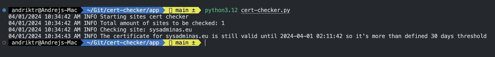
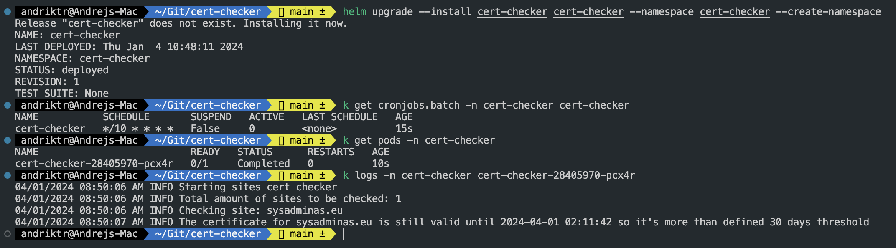

Hi All,
In one of my previous posts I wrote about how to write and deploy your first Golang app to K8S. In this post we will write a Python app and deploy it to Kubernetes cluster. Even if you not a developer (I'm also not) you for 100% have heard about Python. Python is probably one of the most popular programming languages in the world. It is used in many different areas, from web development to data science. Python is a very powerful language, and it is very easy to learn especially when Chat GPT comes to the rescue. Knowing Python for you as a DevOps engineer, K8S operator or SysAdmin is a huge advantage which can make your life easier and your work more efficient. In this post we will write a simple beginner oriented Python application which will go through the list of the website addresses and check a expire date of the SSL certificates. If the certificate is about to expire in less than 30 days, the application will send an email to the administrator. The application will be deployed to Kubernetes cluster which will as a deployment.

## Prerequisites

In order to develop and test python application you need to have Python installed on your machine. If you are on macOS you can install Python with Homebrew:

```bash
# Install Python with Homebrew
brew install python
# Confirm Python version
python --version
```

For all other platforms please follow the official [installation guide](https://www.python.org/downloads/)

## Python application code

When you have Python installed on your machine you can start writing your first Python application. I'm positioning myself as a Python beginner, so code might not be the super optimized and there might be some areas for improvement, but in general it does the job it's easy to understand and results are satisfying. So here is the code (let's name app `cert-checker.py`):

```python
import datetime
import ssl
import socket
import logging
import sys
import time
import os
import subprocess
import yaml
import smtplib
import warnings

from email.mime.text import MIMEText
from email.mime.multipart import MIMEMultipart
from email.mime.application import MIMEApplication

logging.basicConfig(level=logging.INFO , stream=sys.stdout, format='%(asctime)s %(levelname)s %(message)s', datefmt='%d/%m/%Y %I:%M:%S %p')
# Suppress the DeprecationWarning
warnings.filterwarnings("ignore", category=DeprecationWarning)

# Comment out the following lines if you want to run the app locally and uncomment the lines below them if you want to run the app in a container
email_alerts_enabled = os.environ["EMAIL_ALERTS_ENABLED"]
from_email = os.environ["FROM_EMAIL"]
smtp_server = os.environ["SMTP_SERVER"]
config_file_path = os.environ["CONFIG_FILE_PATH"]

# Uncomment the following lines if you want to run the app locally and comment out the lines above them if you want to run the app in a container
# email_alerts_enabled = "true"
# from_email = "from_email"
# smtp_server = "smtp_server"
# config_file_path = "config_file_path"


logging.info(f"Starting sites cert checker")
def email_alert(to_email, from_email, smtp_server, host, port, site_status, expiration_date):
    msg = MIMEMultipart()
    msg['To'] = to_email
    msg['From'] = from_email
    msg['Subject'] = f"CERTIFICATE EXPIRATION ALERT For {host}:{port}"
    if site_status == "near_expiration":
          body_text_html_part_1 = f"<p>Hello,<br>The certificate for <span style=\"color:yellow\"><b>{host}:{port}</b></span> will expire on <span style=\"color:yellow\"><b>{expiration_date}</b></span>.</p>"
          body_text_html_part_2 = "<p>Please take appropriate action to renew the certificate before it expires.</p>"
          body_html = MIMEText("<html><body><p>" + body_text_html_part_1 + "</p><p>" + body_text_html_part_2 + "</p></body></html>", "html")
    if site_status == "expired":
          body_text_html_part_1 = f"<p>Hello,<br>The certificate for <span style=\"color:red\"><b>{host}:{port}</b></span> is expired on {expiration_date}</p>"
          body_text_html_part_2 = "<p>Please take immediate appropriate action to renew the certificate.</p>"
          body_html = MIMEText("<html><body><p>" + body_text_html_part_1 + "</p><p>" + body_text_html_part_2 + "</p></body></html>", "html")
    if site_status == "error" or site_status == "unreachable" or site_status == "non_ssl_site":
          body_text_html_part_1 = f"<p>Hello,<br>There was an error (status code: <span style=\"color:red\"><b>{site_status}</b></span>) checking the certificate for <span style=\"color:red\"><b>{host}:{port}</b></span> please double check if site is reachable and certificate is readable.</p>"
          body_text_html_part_2 = "<p>Please take immediate appropriate action to fix the issue.</p>"
          body_html = MIMEText("<html><body><p>" + body_text_html_part_1 + "</p><p>" + body_text_html_part_2 + "</p></body></html>", "html")
    msg.attach(body_html)
    logging.info(f"----- Sending alert to {to_email}-----")
    server = smtplib.SMTP(smtp_server)
    try:
        server.sendmail(from_email, to_email, msg.as_string())
        server.quit()
    except Exception as e:
        logging.error(f"Error sending email: {e}")
        raise Exception(f"Error sending email") from e

def check_site_availability(host, port):
    try:
        # First, try to establish an SSL connection
        sock = socket.create_connection((host, port), timeout=10)
        context = ssl.SSLContext(ssl.PROTOCOL_TLS)
        context.verify_mode = ssl.CERT_REQUIRED
        context.check_hostname = True
        context.load_default_certs()
        conn = context.wrap_socket(sock, server_hostname=host)
        conn.close()
        return "available"
    except ssl.SSLError as e:
        # If the SSL connection fails with an SSLError, check the message of the exception
        if "certificate verify failed" in str(e):
            # This means the site is an SSL site but has an untrusted certificate
            return "untrusted_certificate"
        else:
            # This means the site is not an SSL site, try to establish a non-SSL connection
            try:
                sock = socket.create_connection((host, port), timeout=10)
                sock.close()
                return "non_ssl_site"
            except Exception:
                # If the non-SSL connection also fails, the site is unreachable
                return "unreachable"
    except Exception:
        # If the SSL connection fails with a different exception, the site is unreachable
        return "unreachable"
            
def site_cert_checker(host, port, validity_threshold):
     try:
          cmd = f"echo | openssl s_client -servername {host} -connect {host}:{port} 2>/dev/null | openssl x509 -noout -enddate 2>/dev/null"
          result = subprocess.check_output(cmd, shell=True).decode().strip()
          expiration_date_str = result.split("=")[1]
          expiration_date = datetime.datetime.strptime(expiration_date_str, '%b %d %H:%M:%S %Y %Z')           
          #Calculate the date 30 days from now
          threshold_date = datetime.datetime.utcnow() + datetime.timedelta(days=validity_threshold)
          current_date = datetime.datetime.utcnow()
          # Check if the certificate will expire in less than 30 days
          if expiration_date < threshold_date:
               logging.warning(f"The certificate for {host} will expire on {expiration_date}")
               site_status = "near_expiration"
          elif expiration_date < current_date:
               logging.error(f"The certificate for {host} is expired!")
               site_status = "expired"                
          else:
               logging.info(f"The certificate for {host} is still valid until {expiration_date} so it's more than defined {validity_threshold} days threshold")
               site_status = "valid"
     except subprocess.CalledProcessError as e:
          logging.exception(f"Error checking site {host}: {e}")
          site_status = "error"
     return site_status, expiration_date

def main():
     # In case you want to inspect the container, uncomment the following line this will give you 20 minutes to inspect the container then 
     # main code will start running. It's useful for debugging purposes for example if you want to check if the config file is mounted correctly.
     #time.sleep(1200)
     
     with open(config_file_path, 'r') as f:
        data = yaml.safe_load(f)
        sites = data.get('sites', [])
        logging.info(f"Total amount of sites to be checked: {len(sites)}")
        for site in sites:
            host, port, validity_threshold, to_email = site['name'], site['port'], site['threshold'], site['email']
            logging.info(f"Checking site: {host}")
            site_availability = check_site_availability(host, port)
            if site_availability != "unreachable" and site_availability != "non_ssl_site":
               site_status, expiration_date = site_cert_checker(host, port, validity_threshold)
               if email_alerts_enabled == "true":
                    for email in to_email:
                         if site_status == "near_expiration":
                              email_alert(email, from_email, smtp_server, host, port, site_status, expiration_date)
                         if site_status == "expired":
                              email_alert(email, from_email, smtp_server, host, port, site_status, expiration_date)
                         if site_status == "error":
                              email_alert(email, from_email, smtp_server, host, port, site_status, "N/A")             
            else:
                if site_availability == "unreachable":
                    logging.error(f"Site {host} is unreachable!")
                    site_status = site_availability
                    if email_alerts_enabled == "true":
                         for email in to_email:
                              email_alert(email, from_email, smtp_server, host, port, site_status, "N/A")
                    continue
                if site_availability == "non_ssl_site":
                    logging.error(f"Site {host} is not an SSL site!")
                    site_status = site_availability
                    if email_alerts_enabled == "true":
                         for email in to_email:
                              email_alert(email, from_email, smtp_server, host, port, site_status, "N/A")
                    continue
if __name__ == "__main__":
     main()
```

## Run the application locally

As you can see the code is pretty simple and should be easy to understand if you have some basic Python knowledge. Any way let's shortly describe what the code does:

* First of all we import all the necessary modules. Then we define some variables which will be used later in the code. Then we define a function which will send an email alert to the responsible person(-s).

* Then we define a function which will check if the site is available.

* Next we define a function which will check the certificate expiration date.

* Then we define a main function which will be the main entry point of our application. In the main function we read the config file which is a `sitse.yaml` file containing the list of the sites to be checked. The structure of the `sites.yaml` file is the following:

```yaml
sites:
  - name: site1.com
    port: 443
    threshold: 30
    email:
      - email1@domain.com
      - email2@domain.com
```

Then we iterate through the list of the sites and check the certificate expiration date. If the certificate is expire or about to expire in less than 30 days, the application will send an email to the responsible email address(-es) defined in the `sites.yaml` file.
Also if the site is unreachable or not an SSL site the application will send appropriate email alert to the responsible person(-s) email address(-es) defined in the `sites.yaml` file. Optionally you can enable or disable email alerts by setting the `EMAIL_ALERTS_ENABLED` environment variable to `true` or `false`. If you set it to `false` the application will not send any email alerts and will output all the logs to the console only.

We now have to steps completed. We have Python installed on our machine and we have a Python application code ready. Now let's specify the requirements for our application and create a `requirements.txt` file which will contain all the necessary modules which our application needs to run. The `requirements.txt` file will look like this:

```txt
PyYAML
```

In our case we need only one module which is `PyYAML` which is a YAML parser and emitter for Python. Also we do not specify the version of the module, so the latest version will be installed. In case you want to specify the version of the module you can do it like this:

```txt
PyYAML==5.4.1
```

To install the module specified in the `requirements.txt` file you can run the following command:

```bash
pip install -r requirements.txt
```

Now we have all the necessary prerequisites to run our application locally. Application is meant to be run in a container, but with simple comment/uncomment of the lines in the code you can run it locally. To run the application locally adjusting the following lines in the code:

```python
# Comment out the following lines if you want to run the app locally and uncomment the lines below them if you want to run the app in a container
email_alerts_enabled = os.environ["EMAIL_ALERTS_ENABLED"]
from_email = os.environ["FROM_EMAIL"]
smtp_server = os.environ["SMTP_SERVER"]
config_file_path = os.environ["CONFIG_FILE_PATH"]

# Uncomment the following lines if you want to run the app locally and comment out the lines above them if you want to run the app in a container
# email_alerts_enabled = "true"
# from_email = "from_email"
# smtp_server = "smtp_server"
# config_file_path = "config_file_path"
```

Then create a `sites.yaml` and put it in the CONFIG_FILE_PATH directory. The `sites.yaml` file should be formatted as follows:

```yaml
sites:
  - name: sysadminas.eu
    port: 443
    threshold: 30
    email:
      - andriktr@gmail.com
```

Then run the application with the following command:

```bash
python cert-checker.py
```

If everything is configured correctly application will process and output the logs to the console and send email alert if conditions are met. The output in the console will look like this (here we are checking [sysadminas.eu](sysadminas.eu) site certificate):



## Deploy the application to Kubernetes cluster

OK we now tested application locally and it works as expected. Our aim is to deploy the application to Kubernetes cluster. So let's do it. First let's wrap our application in a Docker container. To do that we need to create a `Dockerfile` which will look like this:

```dockerfile
FROM python:3.12-slim

RUN apt-get update && apt-get install -y curl openssl

RUN mkdir /app

WORKDIR /app

COPY requirements.txt .

RUN python -m pip install --upgrade pip
RUN pip install --no-cache-dir -r requirements.txt && rm requirements.txt

USER 1000

COPY cert-checker.py .

CMD ["python", "cert-checker.py"]
```

In the `Dockerfile` we are using the official Python 3.12 slim image as a base image. Then we install `curl` (having curl might be useful for debugging purposes) and `openssl` (openssl is required for `site_cert_checker` function where it used to check certificate) packages. Then we create a directory for our application and set it as a working directory. Next we copy the `requirements.txt` file to the working directory and install all the necessary modules. Also we set USER to 1000 as per best security practices. Then we copy the `cert-checker.py` file to the working directory and set the entry point of the container to run the `cert-checker.py` file. Now we can build our Docker image with the following command:

```bash
# Build Docker image
docker build -t andriktr/cert-checker:0.1.0 --no-cache --pull --platform linux/amd64 .
# Push Docker image to Docker Hub
docker push andriktr/cert-checker:0.1.0
```

Best way to deploy our application to Kubernetes cluster is to use Helm chart. I have already written a Helm chart for this application which you can find [here](https://github.com/andriktr/cert-checker/tree/main/cert-checker). Easiest way would be to clone the [cert-checker repository](https://github.com/andriktr/cert-checker.git), adjust the values in the `values.yaml` file and run helm command for deployment. So let's do it.

```bash
# Clone the repository
git clone https://github.com/andriktr/cert-checker.git
```

Now let's adjust the values in the [values.yaml](https://github.com/andriktr/cert-checker/blob/main/cert-checker/values.yaml) file. You can find the description of the values in the [README.md](https://github.com/andriktr/cert-checker#configure-cert-checker-helm-chart) file.

Once ready we can test and deploy the Helm chart with the following commands:

```bash
# Test cert-checker Helm chart
helm upgrade --install cert-checker cert-checker --namespace cert-checker --create-namespace --dry-run --debug

# Deploy cert-checker Helm chart
helm upgrade --install cert-checker cert-checker --namespace cert-checker --create-namespace
```

Once you run the above commands you should see a cronjob created in the `cert-checker` namespace which will spin up a pod according the schedule specified in the `values.yaml` file. 



Repository [cert-checker](https://github.com/andriktr/cert-checker.git) contains all the necessary files and instructions to test and deploy the application either locally or to Kubernetes cluster. Feel free to use it and adjust it according to your needs.

I hope you will find this post useful and it will help you in your day to day work.

See you in the next post 🤜 🤛, bye!
