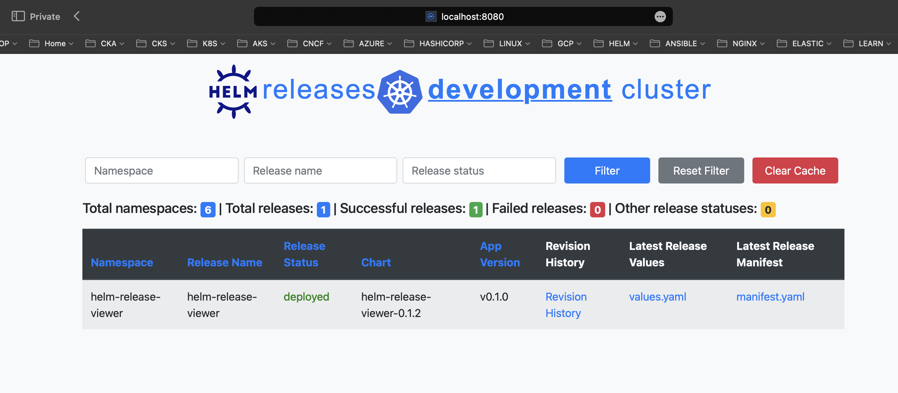
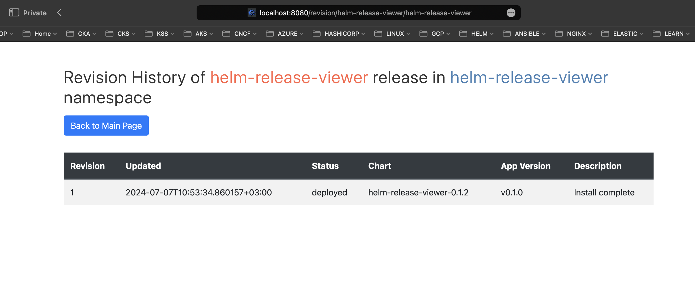
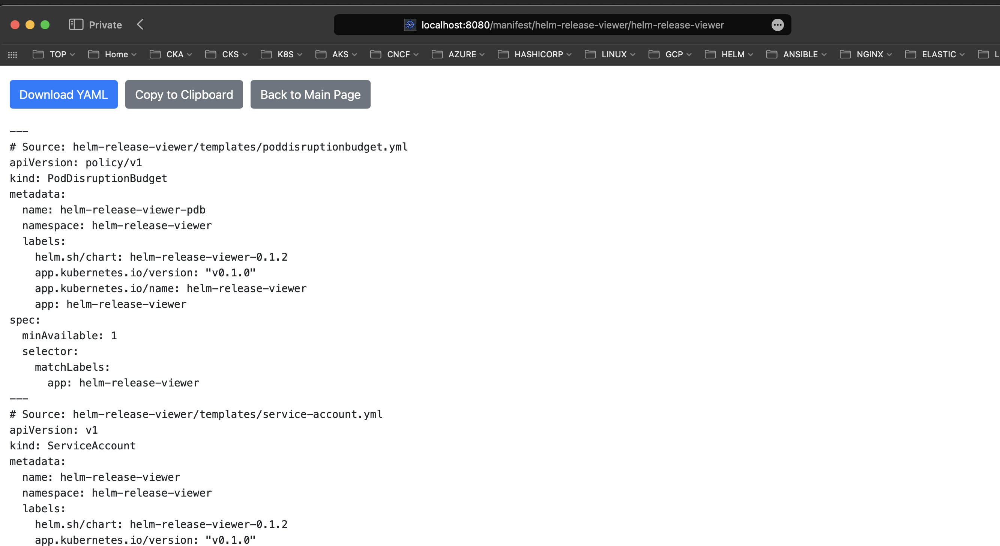
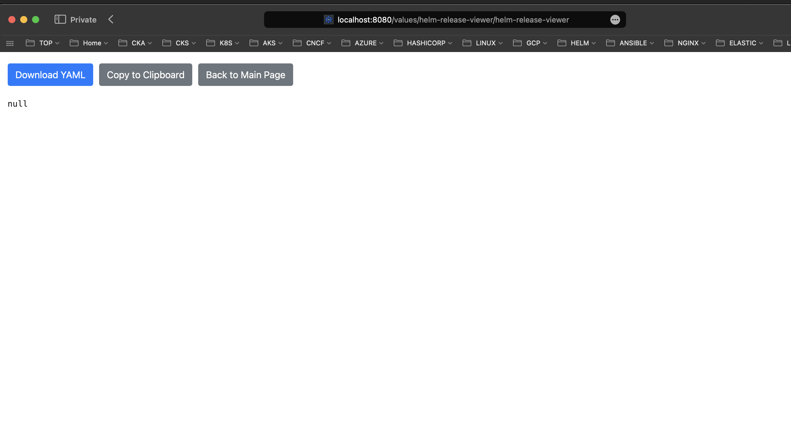

Hello everyone!

It's has been a while since my last post, but now I'm back on track and hopefully will be able to post more frequently. Today I want to share with you a tool that I have been working on for the past few weeks. It's called Helm Release Viewer. Helm Release Viewer is a web-based UI  that allows you to view the status of your Helm releases in a Kubernetes cluster. It provides a simple and intuitive interface that allows you to see the status of all your releases at a glance. You can filter the releases by namespace, release name, or status, and you can also view information about each release like release revision history, values and manifest files. Helm release viewer is built using Python, Flask, Jinja2 and Gunicorn it can be easily packaged as a Docker image or you can run it locally. Packaging it as a Docker image and having a Helm chart allows you to deploy it in your Kubernetes cluster in a matter of minutes. Helm Release Viewer is open source and available on GitHub at [Helm Release Viewer](https://github.com/andriktr/helm-release-viewer) repository.

Now let's quickly deploy Helm Release Viewer in our Kubernetes cluster. The easiest way to deploy a Helm Release Viewer is to use the Helm chart that I have already created. Raw chart templates are available in the Helm Release Viewer repository and it also automatically being packaged and published to github pages of the repository. So to install Helm Release Viewer in your Kubernetes cluster you can use the following commands:

```bash
# Add Helm Release Viewer Helm repository to your Helm
helm repo add helm-release-viewer https://sysadminas.eu/helm-release-viewer
# Update Helm repositories
helm repo update
# List and Test Helm Release Viewer Helm chart
helm template helm-release-viewer/helm-release-viewer
helm upgrade --install helm-release-viewer helm-release-viewer/helm-release-viewer --namespace helm-release-viewer --create-namespace --dry-run
# Install Helm Release Viewer Helm chart
helm upgrade --install helm-release-viewer helm-release-viewer/helm-release-viewer --namespace helm-release-viewer --create-namespace 
```

Please keep in mind that you can also customize the Helm Release Viewer deployment by providing your own values file. You can find possible configuration options in the [Helm Release Viewer helm chart configuration section](https://github.com/andriktr/helm-release-viewer?tab=readme-ov-file#configure-helm-release-viewer-chart). You can pass your custom values by providing a values file with the `--values` flag. For example:

```bash
helm upgrade --install helm-release-viewer helm-release-viewer/helm-release-viewer --namespace helm-release-viewer --create-namespace --values my-values.yaml
```

or you can also pass the values directly in the command line using the `--set` flag. For example:

```bash
helm upgrade --install helm-release-viewer helm-release-viewer/helm-release-viewer --namespace helm-release-viewer --create-namespace --set deploymwnt.image.tag=latest
```

Successful installation of Helm Release Viewer Helm chart will output message similar to the following:

```text
Thank you for installing Helm Release Viewer!
UI normally can be accessed:
 * Locally by running: 
   kubectl port-forward --namespace default svc/helm-release-viewer 8080:80
   and then opening 
   http://localhost:8080 in your web browser
 * Via the internet using the following ingress resource:
   - Hostname: https://helm-release-viewer.mydomain.com/
```


⚠️ **Important:** Usage of ingress is optional however it is highly recommended if you are planning to use Helm Release Viewer in a production environment and you will need more than one replica of the Helm Release Viewer pod. Ingress allows most easiest way to configure sticky sessions which in current version of Helm Release Viewer is required to make sure that filtering and sorting works correctly in multi-replica environment.

⚠️ **Important:** Also by default helm chart is configured to create `ClusterRole` and `ClusterRoleBinding` which gives Helm Release Viewer service account almost full access to the cluster. However you can easily switch to read only access by changing appropriate values in the `values.yaml` file. Also instead of use predefined read only or full access cluster roles you can specify your own cluster role permissions in the `values.yaml` file. All these option can be defined in the `values.yaml` rbac section.

⚠️ **Important:** Helm Release Viewer selects and analyzes all namespaces in the cluster, but you can also limit it to the some specific namespaces by passing the label selector to the environment variable `SELECTORS` in the deployment. For example, to limit the namespaces to only those that have the label `app: myapp` you add to `deployment.additionalEnvs` new env `SELECTORS` and set the value to `app=myapp`. You can also pass multiple selectors separated by a comma. For example, to limit the namespaces to only those that have the label `app: myapp` and `env: production` you set `deployment.additionalEnv` `SELECTORS` to `app=myapp,env=production`.

For complete details on how to configure Helm Release Viewer Helm chart please refer to the [Helm Release Viewer Helm chart configuration section](https://github.com/andriktr/helm-release-viewer?tab=readme-ov-file#configure-helm-release-viewer-chart).

As deployment notes suggest depending on your configuration you can access Helm Release Viewer UI either by port-forwarding the service to your local machine or by using the ingress resource. Of course if your service is exposed via NodePort or LoadBalancer you can also access it using the external IP address of the service.

In my case I deployed Helm Release Viewer in my local kind cluster and I will access it by port-forwarding. In my case service is configured to listen on port 80 which is default value in your case it might be different. To access Helm Release Viewer UI by port-forwarding run the following command:

```bash
kubectl port-forward --namespace default svc/helm-release-viewer 8080:80
```

and then open [http://localhost:8080](http://localhost:8080) in your web browser Helm Release Viewer UI welcomes you with the following screen:



As you can see in my environment I have only one release and it's helm-release-viewer itself. If needed you can filter/search data by namespace, release name or status also sorting by various columns available. Additionally it is possible to view the release revision history, values and manifest files by clicking on appropriate column in the table:

Revision History:


Manifest:


Values (As I did not provide any values file to the Helm Release Viewer deployment it uses default values which are defined in the `values.yaml` file of the Helm chart. As consequence `helm get values` command will not return any values so this is why you see empty values in the screenshot above however if you provide your own values file you will see the values that you have provided):



You also can run application locally in this case your current kubectl context will be used to fetch the data from the cluster. You can pass applications parameters by setting appropriate environment variables.

Name | Description | Default
--- | --- | ---
SELECTORS | A comma separated list of labels (key=value) to select releases only from specific namespaces | None
ENVIRONMENT | The environment in which the application is running. Environment will be displayed on home page | ""
CACHE_TTL | The time in seconds to keep the helm releases in cache | 300
CACHE_SIZE | The maximum number of entries to keep in cache | 50000
APP_PORT | The port on which the application will run | 8080
APP_WARMUP_INTERVAL | The time in seconds to automatically hit the home page to warm up the cache | 300
LOG_LEVEL | The log level for the application | info
IN_CLUSTER | If set to true, the application will use the in-cluster configuration to interact with the Kubernetes cluster | true

To run the application locally you need to perform the following steps:

1. Clone the repository

```bash
git clone https://github.com/andriktr/helm-release-viewer.git
```

2. Change to the `app` directory

```bash
cd helm-release-viewer/app
```

3. Install the required dependencies by running `pip install -r requirements.txt`

```bash
pip install -r requirements.txt
```

4. Set the `IN_CLUSTER` environment variable to `false` and if needed set other environment variables

```bash
export IN_CLUSTER=false
```

5. Run the application

```bash
python helm_release_viewer.py
```

6. Access the application by opening [http://localhost:8080](http://localhost:8080) in your web browser

To make the application faster and more responsive I have implemented a simple caching mechanism that caches helm releases for specified time. You can configure the cache time and cache size by passing CACHE_TTL and CACHE_SIZE environment variables to the deployment. As my testing show this significantly improves the performance of the application in large clusters with hundreds of namespaces and releases. Additionally to the caching data from namespace is being fetched in parallel which also improves the performance of the application.

Additionally a warm-up mechanism is implemented which fetches all the data from the cluster on the application start-up and does it regularly in the background. This allows to have the data ready when the user opens the application. It also useful in large clusters where fetching all the data can take some time.

So this is the first version of Helm Release Viewer and I have some ideas on how to improve it. I'm planning to add more features like uninstalling releases or rolling back them to desired revision. If you have any ideas or suggestions on how to improve Helm Release Viewer please let me know by creating an issue in the [Helm Release Viewer GitHub repository](https://github.com/andriktr/helm-release-viewer/issues). Also if you would like to contribute to the project you are more than welcome to do so. I'm open to any suggestions and contributions.

I really hope that you will find Helm Release Viewer useful especially if you prefer UI over CLI. I'm looking forward to hearing your feedback and suggestions.

Thank you for reading and stay tuned for more posts!