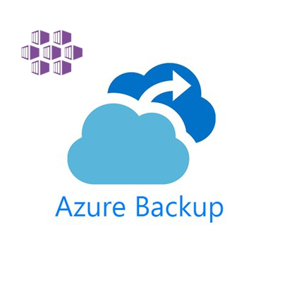

Hello everyone,  in this post we will discuss possible solutions to backup and restore your workload running on Azure Kubernetes Service (AKS) clusters especially using Azure Backup for AKS. Recently Microsoft moved Azure Backup for AKS to GA and it is now available for production workloads. Azure Backup for AKS is a managed service that allows you to backup and restore your Kubernetes cluster resources and persistent volumes. It is a fully managed service that provides backup and restore capabilities for your Kubernetes cluster resources and persistent volumes. Azure Backup for AKS is built on Velero, an open-source project that provides backup and restore capabilities for Kubernetes resources and persistent volumes. From my personal experience I can say that Azure Backup for AKS performs well (We use it on 3 separate clusters since it was in private preview) and till now we have not faced any serious issues.

## Initial Setup

You can setup Azure Backup for AKS in a different ways, for example using Azure Portal, Azure CLI, Azure PowerShell, ARM templates, Terraform, etc. We will focus on how to configure Azure Backup for AKS using Terraform.

```terraform

```

## Adding/Removing namespace to/from backup

For official documentation you can refer to [Azure Backup for AKS](https://docs.microsoft.com/en-us/azure/aks/backup).
