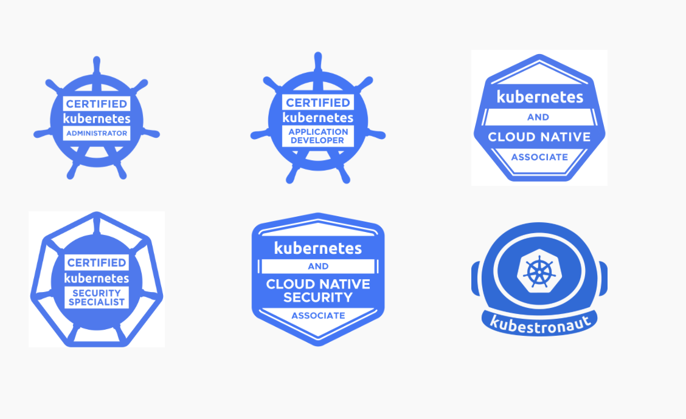

Hello everyone!

Few days ago I have finished my Kubernetes certification journey and after renewing my CKA, CKAD, CKS certification and additionally passing KCNA and KCSA exams I can officially and proudly call myself a [Kubestronaut](https://www.cncf.io/training/kubestronaut).

What is a Kubestronaut? Kubestronaut is relatively new program announced by CNCF at Kubecon 2024 in Paris. It is a program for Kubernetes professionals who have passed all Kubernetes certifications and have proven their knowledge and skills in Kubernetes ecosystem. Every one who has passed all 5 Kubernetes certifications (CKA, CKAD, CKS, KCNA, KCSA) will be recognized as a Kubestronaut. Worth to mention that Kubestronaut is not only a title, but in addition to that every Kubestronaut will get a special badge and an exclusive Kubestronaut jacket. Also Kubestronauts will get discount for all CNCF events and certifications.

If you ask is it hard to become a Kubestronaut I would say that it is not easy, but it is definitely worth it not only because of the title, but also because of the knowledge and experience you will gain during the learning process and this is probably the most important thing. I hold some k8s certifications like CKA, CKAD, CKS from 2020/21 and I worked with k8s even before that, but still I can say that I have learned some new things and improved my skills during the preparation for re-certification and new exams. Kubernetes is a fast evolving technology and it is important to keep up with the latest updates and new features.

Now let's talk about exams a little bit.

[CKA or Certified Kubernetes Administrator](https://training.linuxfoundation.org/certification/certified-kubernetes-administrator-cka/) - this one is the most popular Kubernetes certification and it's my favorite one. In my opinion it is a must have certification for every Kubernetes administrator/cluster operator. It is a hands-on exam where you need to solve multiple tasks in a real Kubernetes clusters. You maybe asked to create and configure different types of resources, troubleshoot issues with cluster, perform kubernetes version updates in other words all you can expect in a real world scenario. Also some task may require a knowledge of linux administration i.e. checking logs, editing files enabling/disabling services, viewing processes, networking etc. The exam is 2 hours long and you may need to solve 15-20 tasks. Keep in mind that each task may have some so called sub-tasks so you need to act fast. From my experience I can say that this exam is not easy, but not hardest one. If you have experience with Kubernetes and have linux administration skills with few weeks of honest preparation you can pass it. Make sure to take a practice exercises and mock exams before the real exam they really well shows how good you are prepared. Then you register for the exam you will get a free retake as well as a 2 free practice exams for [killer.sh](https://killer.sh) platform. For training I can recommend Kodekloud's CKA course + Mock exam labs. To be honest for re-certification I have used only killer.sh exam simulator and it was enough for me to pass the exam with 90% score.

> killer.sh provides a real exam experience and it's tasks in many cases are even harder than the real exam tasks. They have practice exams for CKA, CKAD and CKS certifications and with which exam you will register you will get 2 free practice exams for that certification. Each practice exam is valid for 36 hours and you also have possibility to reset the lab if you want to start from scratch. I highly recommend killer.sh platform for training and preparation for CKA, CKAD and CKS certifications.

[CKAD or Certified Kubernetes Application Developer](https://training.linuxfoundation.org/certification/certified-kubernetes-application-developer-ckad/) - this exam is more oriented for developers who deploy, maintain and troubleshoot applications in Kubernetes. Here you can expect tasks like creating and configuring different types of resources, running and configuring application, login, debugging app issues etc. Main difference from CKA is that you can't expect tasks related to cluster administration like troubleshooting, upgrading clusters or configuring kubelet. Same as CKA this exam is hands-on and you need to solve multiple tasks in a real Kubernetes clusters. The exam is also 2 hours long and you may need to solve 15-20 tasks. From my experience I can say that this exam is easier than CKA in terms of tasks complexity and difficulty, but it is may require more typing (i.e. creating and configuring yaml manifest for k8s resources) and due to that you may need to act fast what could consequently lead to more mistakes. My general advice would be to do not start your Kubernetes certification journey with CKAD, but start with CKA and then go for CKAD in this case with your CKA knowledge you should be able to pass CKAD without any special preparation (just additionally take a look on things like cronjobs, jobs, init containers, liveness and readiness probes etc.). Same as for CKA for re-certification I have used only killer.sh platform and it was enough for me to pass the exam with 89% score. As I mentioned any CKA training course with small addons should be enough for CKAD as well, but you can also take a look on Kodekloud's CKAD course + Mock exam labs.

[CKS or Certified Kubernetes Security Specialist](https://training.linuxfoundation.org/certification/certified-kubernetes-security-specialist/) - this exam is around Kubernetes security and it's covers various security aspects of Kubernetes clusters. Here you can expect tasks like securing cluster components i.e. api-server, etcd or kubelet, configuring audit logging, network policies, pod security standards, apparmor profiles, runtime classes etc. Searching for vulnerabilities, analyzing runtime security or performing static analysis of Dockerfiles or Kubernetes manifests and applying best practices also could be in exam. The exam is 2 hours long and you may need to solve 15-20 tasks. From my experience I can say that this exam is the hardest one from all Kubernetes certifications. It requires a deep knowledge of Kubernetes security and a lot of practice. I have used killer.sh platform for training and was able to solve practice exams with 100% score in less than 2 hours, but to be honest the real exam was more challenging for me and I failed it with 60% (required to pass is 67%)on my first attempt during re-certification (Initially in 2021 I passed exam on my first attempt). Worth to mention that during preparation for CKS re-certification I not only used killer.sh platform, but also watched complete [CKS course from killer.sh on Youtube](https://www.youtube.com/watch?v=d9xfB5qaOfg&t=30533s). I can say that I failed the exam not because of lack of knowledge, but because of lack of time. Some of the tasks are quite complex and may require some time to solve them and double check what you did it right and related components are working as expected after your changes. Once I failed the exam I have used my free retake and scheduled retry right after 3 days and this time I was able to pass it with 69% score. I can't say what I'm satisfied with this score as I'm confident that I know the topic well and can perform better. I'm just need bit more time to solve and double check all tasks. So my advice for CKS would be to have as much practice as possible and to be fast in solving tasks and if you are really don't know how to solve some task just mark it for later review and go to the next one. I also think that more complex tasks have more weight in terms of score so make sure to not skip and solve them at least partially as I think that even partially solved task will give you some points.

These 3 CKA|CKAD|CKS exams are proctored exams and you need to take them online with a proctor watching you via webcam. You need to have a good internet connection, a quiet private room and a computer with a webcam. You can't use any additional monitors, mobile phones, books or notes during the exam. During CKA|CKAD|CKAD you are allowed to use [kubernetes.io/docs](kubernetes.io/docs) + some other additional resources depending on the exam. Personally I never had any technical issues with the exam environment or proctoring, just make sure that your PC and environment meets all the requirements. I also recommend to use at least 27 inch monitor as it will be much more comfortable compared to 14-15 inch laptop screen. You exam score will be available after 24 hours after the exam. And if you will not pass you will get a top 3 domains where you need to improve your knowledge.

My recommended learning resources for CKA, CKAD and CKS certifications:

- [killer.sh](https://killer.sh) - practice exams for CKA, CKAD and CKS certifications. Highly recommended!
- [Kodekloud](https://kodekloud.com/courses?title=CKA) - CKA,CKAD course and Mock exams. Highly recommended!
- [CKS course from killer.sh on Youtube](https://www.youtube.com/watch?v=d9xfB5qaOfg&t=30533s) - Is a must watch for CKS exam.
- [Killercoda](https://killercoda.com/killer-shell-cka) - Practice tasks for CKA exam.
- [CKA Mock exams](https://github.com/ViktorUJ/cks/tree/master/tasks/cka/mock)
- [CKAD Mock exams](https://github.com/ViktorUJ/cks/tree/master/tasks/ckad/mock)
- [CKS Mock exams](https://github.com/ViktorUJ/cks/tree/master/tasks/cks/mock)

Also keep in mind that Kubernetes is a fast evolving technology and exam domains may change from time to time. Make sure to check the official exam page for the latest updates and exam domains. For example soon there will be a new version of CKA and CKS exams with new domains and tasks. In CKA exam we will have some tasks related to Helm and in CKS exam we will have Cilium related tasks.

[KCNA or Kubernetes and Cloud Native Associate](https://training.linuxfoundation.org/certification/kubernetes-and-cloud-native-associate/) - this exam is an entry level certification for Kubernetes and Cloud Native technologies. It is a multiple choice exam and you need to answer 60 questions in 90 minutes. The exam covers various topics from Kubernetes basics + plus some additional questions on other CNCF projects like Prometheus. From my experience I can say that this exam is not hard and if you already have passed exams like CKA or CKAD you should be able to pass it without any special preparation. If you want to be super confident you can take a look on [KCNA course from kodekloud](https://learn.kodekloud.com/user/courses?search=KCNA) and also take a Mock exam provided by same course. Personally I didn't take any special preparation and only tried to take the Mock exam which I passed with no issues during first attempt. I passed the real exam with 89% score and it took me less than 30 minutes to answer all questions.

[KCSA or Kubernetes and Cloud Native Security Associate](https://training.linuxfoundation.org/certification/kubernetes-and-cloud-native-security-associate/) - this exam is also considered as an entry level certification for Kubernetes and Cloud Native technologies, but it is focused on security aspects. It is a multiple choice exam and you need to answer 60 questions in 90 minutes. The exam covers various topics from Kubernetes security basics + plus some general cybersecurity questions for example be familiar with STRIDE model or 4C's. Comparing to KCNA this exam is a bit harder and requires some readings, but in general you can pass it if you have CKS certification even without any special preparation. Unlike KCNA at current moment there is no official training courses for KCSA, but I can recommend to take a look on this [blog post](https://medium.com/@wattsdave/kubernetes-cloud-native-security-associate-kcsa-study-notes-and-exam-prep-f4c8f84d1c4f) where you can find some useful notes for KCSA exam. I passed the real exam with 91% was not expecting to get such a high score, but I'm happy with the result.

During KCNA and KCSA exams you are not allowed to use any additional resources like it is allowed for CKA, CKAD and CKS exams. For KCNA and KCSA in my case score was emailed to me immediately after the exam.

CNCF exams are not cheap and it hurts especially if you need to take multiple exams and you are not sponsored by your employer. But good thing is that CNCF provides a free retake for all exams and with some exams (like CKA, CKAD, CKS) you also get a free practice tests on killer.sh platform. Very often there are some discounts available especially on days like cyber Monday there usually you can get a 60% discount for all exams. Also worth to mention that CNCF certification are valid for 2 years and after that you need to re-certify. Keep in mind that when you buy an exam you will have 1 year to take it including free retake.

In conclusion I would like to say that Kubernetes is a great technology and it is worth to learn it as it opens a lot of opportunities in IT career. Kubernetes is a fast evolving technology and it is important to keep up with the latest updates and new features and learning and passing Kubernetes certifications is a great way to stay up to date with. If you are interested in Kubernetes certification and Cloud Native technologies I would recommend to start with CKA and CKAD certifications and then go for CKS, KCNA and KCSA. It is not easy, but it is definitely worth it. And remember like in many other live aspect it not about the destination, but more about the journey so it's not only about certifications, but also about the knowledge and experience you will gain during the learning process.

If you have any questions or need some help with Kubernetes certifications feel free to contact me. I will be happy to help you of course if it will not violate the CNCF NDA.

Thank you for reading and good luck and let's do some Kubernetes!!!
