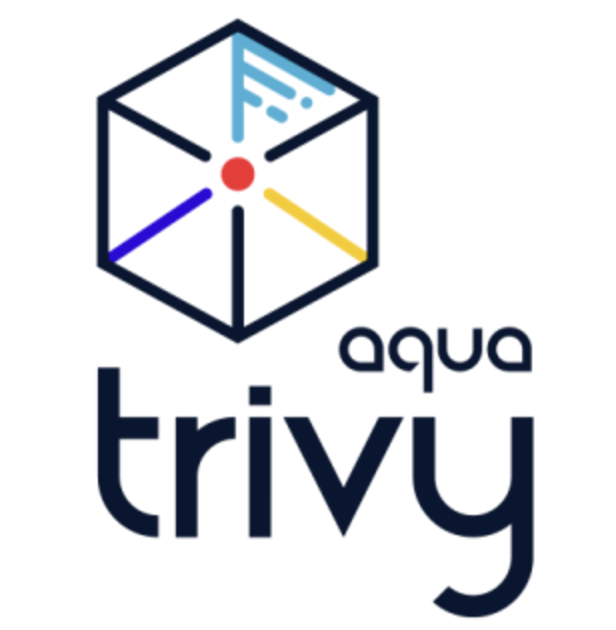

Those of you who are using [Trivy](https://github.com/aquasecurity/trivy) in your CI/CD pipelines to scan container images for vulnerabilities, you might have noticed that already for some time `trivy image` command may fail with the following error:

```log
2024-10-29T09:07:18.631+0200	FATAL	init error: DB error: failed to download vulnerability DB: database download error: OCI repository error: 1 error occurred:
	* GET https://ghcr.io/v2/aquasecurity/trivy-db/manifests/2: TOOMANYREQUESTS: retry-after: 825.911µs, allowed: 44000/minute
```

This issue is caused by the rate limiting of the GitHub Container Registry (GHCR) and for the last few months, it started to appear very frequently. For more details you can check the [GitHub Issue](https://github.com/aquasecurity/trivy/discussions/7668). My solution for this problem is to host the Trivy DB in a private container registry in my case in Azure Container Registry (ACR) which actually an OCI registry. The DB can be updated on a schedule or on-demand using a Azure DevOps pipelines or just a simple bash script and cron jobs. If you wonder how we can keep the DB in container registry the answer is simple using the [OCI Artifacts](https://opencontainers.org/). Actually OCI registry is a storage for OCI artifacts and this can be anything like images, Helm charts or even videos. So here is the `azure-pipelines.yml` file which I use to update the Trivy DB in ACR:

```yaml
pr: none
trigger: none

schedules:
- cron: '0 2 * * *' # Run every day at 2:00 UTC
  displayName: Daily Trivy DB Update and Upload for Dev Azure Container Registry

parameters:      
- name: orasVersion
  default: '1.2.0'
- name: jqVersion
  default: '1.7.1'
- name: containerRegistryServiceConnection
  default: 'Azure DevOps Service Connection Name for ACR'
- name: containerRegistryName
  default: 'youracr.azurecr.io'

stages:
- stage: 'Update_Trivy_DB'
  displayName: Update Trivy DB
  jobs:
    - job: DownloadAndUpdateTrivyDB
      displayName: Download and Update for $ environment
      parameters:
      - name: containerRegistryName
        value: 'youracr.azurecr.io'
      steps:
        - task: CmdLine@2
          displayName: 'Download and Install ORAS'
          inputs:
            script: |
              curl -sLO "https://github.com/oras-project/oras/releases/download/v${{ parameters.orasVersion }}/oras_${{ parameters.orasVersion }}_linux_amd64.tar.gz"
              mkdir -p oras-install/
              tar -zxf oras_${{ parameters.orasVersion }}_*.tar.gz -C oras-install/
              sudo mv oras-install/oras /usr/local/bin/
              rm -rf oras_${{ parameters.orasVersion }}_*.tar.gz oras-install/
              oras version
        - task: CmdLine@2
          displayName: 'Download and Install jq'
          inputs:
            script: |
              curl -sL -o jq "https://github.com/jqlang/jq/releases/download/jq-${{ parameters.jqVersion }}/jq-linux-amd64"
              chmod +x jq
              sudo mv jq /usr/local/bin/
              jq --version    
        - task: Docker@2
          displayName: Login to Container Registry
          inputs:
            command: login
            containerRegistry: ${{ parameters.containerRegistryServiceConnection }}
        - task: Bash@3
          displayName: Download and Update Trivy databases
          inputs:
            workingDirectory: '$(System.DefaultWorkingDirectory)'
            targetType: 'inline'
            script: |  
              # Function to retry a command if it fails
              retry() {
                local n=1
                local max=5
                local delay=5
                while true; do
                  "$@" && break || {
                    if [[ $n -lt $max ]]; then
                      ((n++))
                      echo "Command failed. Attempt $n/$max:"
                      sleep $delay;
                    else
                      echo "The command has failed after $n attempts."
                      return 1
                    fi
                  }
                done
              }
              
              # Pull the trivy-db image from ghcr.io with retry logic
              retry oras pull ghcr.io/aquasecurity/trivy-db:2

              # Push the trivy-db image to registry
              oras push --export-manifest manifest.json ${{ parameters.containerRegistryName }}/trivy/trivy-db:2 db.tar.gz
              
              # Update the mediaType of the manifest 
              jq '.layers[0].mediaType="application/vnd.aquasec.trivy.db.layer.v1.tar+gzip"' manifest.json > trivy_db_manifest.json
              
              # Push the updated manifest to registry
              oras manifest push ${{ parameters.containerRegistryName }}/trivy/trivy-db:2 trivy_db_manifest.json

              # Clean up
              rm -f db.tar.gz manifest.json trivy_db_manifest.json

              # Pull the trivy-java-db image from ghcr.io with retry logic
              retry oras pull ghcr.io/aquasecurity/trivy-java-db:1

              # Push the trivy-java-db image to registry and export the manifest
              oras push --export-manifest manifest.json ${{ parameters.containerRegistryName }}/trivy/trivy-java-db:1 javadb.tar.gz
              
              # Update the mediaType of the manifest
              jq '.layers[0].mediaType="application/vnd.aquasec.trivy.db.layer.v1.tar+gzip"' manifest.json > trivy_javadb_manifest.json
              
              # Push the updated manifest to registry
              oras manifest push ${{ parameters.containerRegistryName }}/trivy/trivy-java-db:1 trivy_javadb_manifest.json

              # Clean up
              rm -f javadb.tar.gz manifest.json trivy_javadb_manifest.json

        - task: Bash@3
          displayName: Logout of Container Registry
          inputs:
            targetType: 'inline'
            script: |
              docker logout ${{ parameters.containerRegistryName }}
```

In simple words pipeline does the following:

1. Downloads the ORAS and jq binaries which are needed for the script
2. Logs in to the Azure Container Registry
3. Pulls the Trivy DB images from GHCR
4. Pushes the images to ACR and exports the manifest
5. Updates the mediaType of the manifest
6. Pushes the updated manifest to ACR
7. Repeats the same procedure twice once for the regular Trivy DB and once for the Java Trivy DB
8. Logs out of the Azure Container Registry

If you will use the above pipeline make sure to replace the parameters with your values. The pipeline is scheduled to run every day at 2:00 UTC. Make sure to use correct Azure DevOps Service Connection of type Docker Registry for the ACR also associated Azure entraID service principal should have the correct PUSH permissions on the ACR.

If you need a more simple bash script version of the above pipeline you can use the following script:

```bash

#!/bin/bash

# Make sure oras and jq are installed on the client

# Login to Azure Container Registry
az acr login --name youracr.azurecr.io

# Pull the trivy-db image from ghcr.io
oras pull mirror.gcr.io/aquasecurity/trivy-db:2
# Push the trivy-db image to registry
oras push --export-manifest manifest.json youracr.azurecr.io/trivy/trivy-db:2 db.tar.gz
# Update the mediaType of the manifest 
jq '.layers[0].mediaType="application/vnd.aquasec.trivy.db.layer.v1.tar+gzip"' manifest.json > trivy_db_manifest.json
# Push the updated manifest to registry
oras manifest push youracr.azurecr.io/trivy/trivy-db:2 trivy_db_manifest.json
# Clean up
rm -f db.tar.gz manifest.json trivy_db_manifest.json

# Pull the trivy-java-db image from ghcr.io
oras pull ghcr.io/aquasecurity/trivy-java-db:1
# Push the trivy-java-db image to registry and export the manifest
oras push --export-manifest manifest.json youracr.azurecr.io/trivy/trivy-java-db:1 db.tar.gz
# Update the mediaType of the manifest
jq '.layers[0].mediaType="application/vnd.aquasec.trivy.db.layer.v1.tar+gzip"' manifest.json > trivy_java_db_manifest.json
# Push the updated manifest to registry
oras manifest push youracr.azurecr.io/trivy/trivy-java-db:1 trivy_java_db_manifest.json
# Clean up
rm -f db.tar.gz manifest.json trivy_java_db_manifest.json
```

Once you have the Trivy DB in your ACR you can use your regular `trivy image` command but with additional `--db-repository=youracr.azurecr.io/trivy/trivy-db:2` and  `--java-db-repository=youracr.azurecr.io/trivy/trivy-java-db:1`

Important to note that in [one of the latest PR's](https://github.com/aquasecurity/trivy/pull/7679) this issue is fixed and mirror.gcr.io is now used as a default DB repository, but your will still benefit from hosting the DB in your private registry as you will have more control over the DB updates and you will not be affected by any potential rate limiting. DB download process should be faster as less concurrent downloads will be made compared to the public registry. And of course keeping and using data in/from private registry is more secure.

I hope this post was useful for you and you will find it helpful. If you have any questions or suggestions feel free to contact me and I will be happy to discuss it with you.
