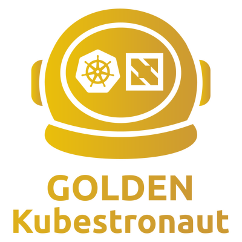

Hello everyone!

I'm incredibly excited to share that I have just achieved the [Golden Kubestronaut](https://www.cncf.io/training/kubestronaut/) status — the highest recognition in the CNCF certification landscape! This is a milestone I've been working towards for quite some time and I'm happy to share the full journey with you.

As you may remember from my [previous post about Kubestronaut](https://sysadminas.eu/Kubestronaut/), I became a Kubestronaut in September 2024 after completing all five Kubernetes certifications (CKA, CKAD, CKS, KCNA, KCSA). This time around the journey was even more ambitious — requiring me to pass all remaining CNCF certifications plus the Linux Foundation Certified System Administrator (LFCS) exam on top of what I already had.

## What is Golden Kubestronaut?

The Golden Kubestronaut program was announced by CNCF at KubeCon + CloudNativeCon Europe in London on April 1, 2025. It is the highest tier of recognition in the CNCF ecosystem, awarded to professionals who have successfully completed every CNCF certification plus the LFCS exam. What makes this program special compared to the regular Kubestronaut status is that once you earn it, the title is yours **for life** — you don't need to recertify to keep it.

The program requires the following certifications on top of the five Kubestronaut ones (CKA, CKAD, CKS, KCNA, KCSA):

- **LFCS** - Linux Foundation Certified System Administrator
- **PCA** - Prometheus Certified Associate
- **ICA** - Istio Certified Associate
- **CCA** - Cilium Certified Associate
- **CAPA** - Certified Argo Project Associate
- **CGOA** - Certified GitOps Associate
- **CBA** - Certified Backstage Associate
- **OTCA** - OpenTelemetry Certified Associate
- **KCA** - Kyverno Certified Associate
- **CNPA** - Certified Cloud Native Platform Engineering Associate

In total that is **15 certifications** to achieve Golden Kubestronaut status. Quite a list, but every single one of them is worth it!

## KodeKloud — Your Best Friend for This Journey

Before diving into the individual exams I want to give a special shout-out to [KodeKloud](https://kodekloud.com/). If I had to recommend a single learning platform for the Golden Kubestronaut path, it would be KodeKloud without hesitation. They have dedicated courses for every CNCF certification covered here — complete with structured theory, hands-on labs, and mock exams. The quality is consistently high across all courses and the hands-on lab environments are particularly valuable because they let you practice in real clusters without having to set up your own infrastructure. Whether you are a complete beginner to a specific technology or just need to fill in a few gaps before an exam, KodeKloud will get you there. I used it extensively throughout my Golden Kubestronaut journey and can recommend it wholeheartedly.

## The Additional Certifications

If you have already completed your Kubestronaut journey like I did, you just need to knock out the remaining certifications. Here are my thoughts on each of them.

### LFCS — Linux Foundation Certified System Administrator

[LFCS](https://training.linuxfoundation.org/certification/linux-foundation-certified-sysadmin-lfcs/) is a hands-on, performance-based exam testing your Linux system administration skills. You can expect tasks covering Linux file system management, user and group administration, service configuration, networking, and basic security hardening. The exam is 2 hours long and has a similar feel to the CKA exam in terms of format — a terminal-based environment where you need to perform real tasks.

Do not underestimate this exam. Even with years of Linux experience and having passed CKA and CKS, I found LFCS to be genuinely challenging. The breadth of topics is wide and some tasks can catch you off guard if you have gaps in areas you don't use day-to-day. Make sure to thoroughly review systemd service management, networking configuration, storage and LVM management, user/group administration, simple apache or nginx configs as well as essential commands like `find`, `mount` etc. Dedicated preparation is strongly recommended regardless of your Linux background — the KodeKloud LFCS course is a great structured option here.

### PCA — Prometheus Certified Associate

[PCA](https://training.linuxfoundation.org/certification/prometheus-certified-associate/) is a multiple choice exam (60 questions, 90 minutes) covering the fundamentals of Prometheus — the de facto standard for monitoring in the cloud native world. The exam is split across five domains: observability concepts, Prometheus architecture and configuration, PromQL, alerting, and exporters.

If you use Prometheus in your daily work this exam will feel very familiar. The most important topic to master is PromQL — make sure you understand how to write queries, use functions like `rate()`, `increase()`, `histogram_quantile(`, and how to apply label selectors and aggregation operators correctly. Also pay attention to the observability concepts domain as it covers broader topics like SLOs, SLIs, and SLAs which you need to understand well. For learning resources I recommend the [Prometheus official documentation](https://prometheus.io/docs/) and the KodeKloud PCA course.

### ICA — Istio Certified Associate

[ICA](https://training.linuxfoundation.org/certification/istio-certified-associate-ica/) is a hands-on, performance-based exam similar in format to CKA and CKAD. You will be working in a real Kubernetes environment with Istio pre-installed, solving 15-20 practical tasks in 2 hours. The exam covers traffic management (35%), securing workloads (25%), troubleshooting (20%), and installation/upgrades/configuration (20%).

This is one of the most challenging of the additional certifications given its hands-on nature. Traffic management is the dominant topic so make sure you have solid hands-on experience with VirtualService, DestinationRule, and Gateway resources. For security, focus on mTLS and AuthorizationPolicy. You are allowed to use [Istio documentation](https://istio.io/latest/docs/) during the exam which is a big help. Make sure you are comfortable in navigating the documentation and you know how to quickly find the resources example you need. As with CKA/CKAD I highly recommend practicing in a real cluster before attempting this one — reading alone is not enough.

### CCA — Cilium Certified Associate

[CCA](https://training.linuxfoundation.org/certification/cilium-certified-associate/) is a multiple choice exam focused on Cilium — the eBPF-based networking, observability, and security solution for Kubernetes. The exam covers Cilium architecture, network policies, Hubble observability, and cluster mesh.

Cilium has been gaining a lot of traction recently especially since it became a CNCF graduation project and was added as a topic to the updated CKS exam. If you have been keeping up with the Kubernetes ecosystem Cilium should not be a stranger to you. The [official Cilium documentation](https://docs.cilium.io/) is your main resource for preparation. Yes it questions/answers multiple choice exam, but I can assure that it was most difficult multiple choice exam I have taken in my entire IT career. The questions are very detailed and require a deep understanding of Cilium concepts and features to answer correctly. Make sure to read the documentation carefully and understand how Cilium works under the hood — this is not an exam you can pass with just surface-level knowledge.

### CAPA — Certified Argo Project Associate

[CAPA](https://training.linuxfoundation.org/certification/certified-argo-project-associate-capa/) is a multiple choice exam covering the Argo project suite — Argo Workflows, Argo CD, Argo Rollouts, and Argo Events. It is not easy, but if you have experience with Argo CD and Argo Workflows it should be manageable without to much extra preparation. The exam covers Argo architecture, core concepts, and common use cases for each of the four projects. For Argo CD focus on understanding application manifests, sync policies, and how to troubleshoot common issues. For Argo Workflows make sure you understand how to define workflows, use templates, and manage workflow execution. The [official Argo documentation](https://argoproj.github.io/) is comprehensive and the KodeKloud CAPA course provides a great structured introduction to the entire Argo ecosystem.

### CGOA — Certified GitOps Associate

[CGOA](https://training.linuxfoundation.org/certification/certified-gitops-associate-cgoa/) is a beginner-level multiple choice exam focused on GitOps principles and practices. It is one of the easiest exams in the entire Golden Kubestronaut set — especially if you have done CAPA first.

The exam covers GitOps principles as defined by the [OpenGitOps](https://opengitops.dev/) project, GitOps patterns, and common tooling. Understanding the four core GitOps principles and the difference between push-based and pull-based deployment models is the bulk of what you need. If you work with Argo CD or Flux regularly you may be able to pass this one with minimal extra preparation.

### CBA — Certified Backstage Associate

[CBA](https://training.linuxfoundation.org/certification/certified-backstage-associate-cba/) is a multiple choice exam covering Backstage — the open source developer portal framework originally created by Spotify and now a CNCF project. The exam covers Backstage architecture, the software catalog, TechDocs, software templates (scaffolding), and the plugin ecosystem.

Backstage was probably the technology I was least familiar with before starting the Golden Kubestronaut journey. But the concepts are not overly complex and with some reading and hands-on practice you can get up to speed relatively quickly. The [official Backstage documentation](https://backstage.io/docs/overview/what-is-backstage) is your best friend here and the KodeKloud CBA course provides a great structured introduction to the platform.

### OTCA — OpenTelemetry Certified Associate

[OTCA](https://training.linuxfoundation.org/certification/opentelemetry-certified-associate-otca/) is a multiple choice exam covering OpenTelemetry — the CNCF observability framework for traces, metrics, and logs. The exam covers OTel architecture, instrumentation, the collector (receivers, processors, exporters), and how to work with all three telemetry signals. Exam may fill challenging due to the a lot of different terminology like spans, metrics types, context propagation, bagage, etc.

OpenTelemetry is increasingly becoming the standard for observability in cloud native environments so this is a very practical and relevant certification. Focus on understanding the three pillars of observability (traces, metrics, logs), the OTel collector architecture, and how to instrument applications with OTel SDKs. The [official OpenTelemetry documentation](https://opentelemetry.io/docs/) is comprehensive and the KodeKloud OTCA course is a solid structured option.

### KCA — Kyverno Certified Associate

[KCA](https://training.linuxfoundation.org/certification/kyverno-certified-associate-kca/) is a multiple choice exam focused on Kyverno — a policy engine designed specifically for Kubernetes. The exam covers Kyverno architecture, policy writing (validate, mutate, generate policies), admission webhooks, and policy exceptions.

Kyverno is a fantastic tool for enforcing security and compliance policies in Kubernetes clusters and I've been using it in production for a while now, so this one felt very natural to me. If you have experience writing Kyverno policies you will do well here. For those new to Kyverno the [official Kyverno documentation](https://kyverno.io/docs/) is excellent.

### CNPA — Certified Cloud Native Platform Engineering Associate

[CNPA](https://training.linuxfoundation.org/certification/certified-cloud-native-platform-engineering-associate-cnpa/) is a multiple choice easy exam covering platform engineering concepts and practices in a cloud native context. The exam focuses on Internal Developer Platforms (IDPs), the CNCF platform engineering landscape, and developer experience. Platform engineering has become one of the hottest topics in the industry so this is a timely and relevant certification. The [CNCF Platform Engineering whitepaper](https://tag-app-delivery.cncf.io/whitepapers/platforms/) is essential reading before taking this exam. Unlike all other multiple choice exams in the Golden Kubestronaut journey, CNPA has ~ 90 questions instead of 60, but the exam time is prolonged accordingly.

## Tips for the Golden Kubestronaut Journey

Having gone through the entire journey from zero to Golden Kubestronaut here are some tips that might help you:

**1. Don't rush.** The journey to Golden Kubestronaut is a marathon, not a sprint. Take your time to properly learn each technology rather than just cramming for the exam. The knowledge you gain along the way is far more valuable than the badge itself.

**2. Leverage your existing knowledge.** Many of the CNCF associate certifications build on each other. Your Kubernetes knowledge from CKA/CKAD/CKS will help significantly with ICA, CCA, KCA and others. Don't underestimate how much you already know.

**3. Use KodeKloud.** As mentioned above, KodeKloud is the single best resource for this entire journey. Their courses cover virtually every certification you need, and the combination of structured theory and real hands-on labs is exactly the right formula for passing both multiple choice and performance-based exams.

**4. Practice with real tools.** Set up a local Kubernetes cluster (kind or minikube) and actually install and use each technology. Hands-on experience is invaluable even for multiple choice exams because it gives you the intuition to eliminate wrong answers confidently. For ICA this is absolutely mandatory — you cannot pass it by reading alone.

**5. Watch for CNCF discounts.** CNCF and Linux Foundation regularly offer discounts especially around Black Friday / Cyber Monday (up to 60% off). Buy exam bundles when discounts are available to save significant money — with 15 certifications to collect this adds up quickly.

## New Exam Requirement

Since 2026 March 1st one more exam has been added to the Golden Kubestronaut requirements — the [Certified Cloud Native Platform Engineer (CNPE)](https://training.linuxfoundation.org/certification/certified-cloud-native-platform-engineer-cnpe/) which is an advanced hands-on exam focused on platform engineering concepts and practices. Here you need to demonstrate your ability to use a variety of CNCF tools tools like Kubernetes, Argo CD, Backstage, Kyverno, OpenTelemetry, Crossplane, etc to build and operate a cloud native platform. I have not taken this one yet but as far as I heard it is quite interesting, but at the same time very challenging.

## Conclusion

Achieving Golden Kubestronaut has been  challenging and rewarding certification journey. It required learning and demonstrating proficiency across the broadest possible slice of the CNCF ecosystem — from core Kubernetes to service mesh, observability, security policies, GitOps, developer portals and platform engineering.

What I love most about this program is that it pushes you to explore technologies you might not encounter in your day-to-day work. Even if you never work with Backstage or Argo Events professionally, understanding these tools makes you a much more well-rounded cloud native engineer and opens your eyes to solutions for problems you didn't know could be solved this elegantly.

If you are currently on your Kubestronaut journey and wondering whether to go for Golden Kubestronaut as well — I say absolutely go for it! It is a lot of work, but the CNCF ecosystem is rich and fascinating and there is something genuinely satisfying about seeing how all the pieces fit together into a coherent cloud native platform story.

**And remember: once a Golden Kubestronaut, always a Golden Kubestronaut!**

If you have any questions about the journey or any of the individual certifications feel free to reach out. I will be happy to help!

Thank you for reading and let's keep learning!!!
