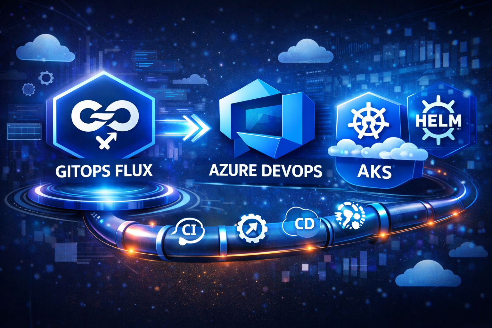

Over the past few months I have been building and operating a GitOps platform for Kubernetes clusters running on Azure. The driving motivation was a shift away from push-based CI/CD pipelines — where pipelines hold cluster credentials and `kubectl apply` changes directly — toward a pull-based model where an in-cluster operator continuously reconciles the live state against what Git says it should be. This post is a practical walkthrough of how I implemented that shift using Flux CD, the Flux Operator, Helm, and Azure DevOps.

If you are already familiar with basic GitOps concepts and want to see how things connect in a production-grade setup — including image scanning, signing, private registry mirroring, and a multi-environment onboarding model — this is the post for you.

## Why GitOps?

GitOps is a way of managing infrastructure and application delivery where Git is the single source of truth. Any desired state change is made via a pull request, and an in-cluster operator continuously reconciles the live state against what Git says it should be. The key properties, as defined by the [OpenGitOps](https://opengitops.dev/) principles, are:

- **Declarative** — the entire desired state is described declaratively
- **Versioned and immutable** — Git history is the canonical audit trail
- **Pulled automatically** — an agent in the cluster pulls state from Git (no external push into the cluster)
- **Continuously reconciled** — if live state drifts from desired state, the agent corrects it

For Kubernetes this model fits perfectly. Every resource is a YAML manifest, Git provides versioning and review workflows via pull requests, and controllers like Flux watch the repository and apply changes automatically. The alternative — pushing manifests from a CI/CD pipeline with `kubectl apply` — requires the pipeline to have cluster credentials, creates a push-based model that bypasses drift detection, and gives you no built-in reconciliation if someone applies something directly to the cluster.

With the "why" clear, let me walk through how these principles are put into practice: what the repository looks like, how the pipeline fits in, and where Flux takes over.

## Architecture Overview

### Flux Architecture

Flux CD is a set of Kubernetes controllers, each responsible for a specific piece of the GitOps loop. Understanding what each controller does makes the rest of the setup much easier to reason about:

- **source-controller** — watches Git repositories, Helm repositories, OCI registries, and S3-compatible buckets. It fetches content and makes it available as an in-cluster artifact that other controllers consume. This is the only controller that talks to external sources.
- **kustomize-controller** — watches `Kustomization` CRDs and applies the manifests they point to (plain YAML, Kustomize overlays, or files that happen to contain `HelmRelease` objects). It handles decryption, dependency ordering, health checks, and pruning of removed resources.
- **helm-controller** — watches `HelmRelease` CRDs and manages the full Helm lifecycle: install, upgrade, rollback, and uninstall. It reads chart artifacts from source-controller and renders them server-side.
- **notification-controller** — handles inbound webhooks (to trigger reconciliation) and outbound event notifications (Slack, Teams, GitHub commit status, etc.).
- **image-reflector-controller** and **image-automation-controller** — together they implement image update automation: scanning a registry for new tags and writing the updated tag back to Git.

These controllers communicate through the Kubernetes API only; they never talk directly to each other. source-controller produces `Artifact` objects; kustomize-controller and helm-controller consume them. This loose coupling means you can enable only the controllers you need.

### Platform Layout

The platform manages multiple Kubernetes environments. The branch-to-environment mapping is straightforward:

| Git Branch     | Environment  |
| -------------- | ------------ |
| `experimental` | experimental |
| `dev`          | dev          |
| `master`       | prod         |

Any push to these branches triggers an Azure DevOps pipeline that handles the infrastructure layer: scanning and mirroring Flux controller images to a private Azure Container Registry (ACR), deploying the Flux Operator via Helm, and applying the `FluxInstance` CRD that tells Flux how to configure itself. Once Flux is running, it takes over and continuously reconciles everything under `clusters/<env>/systems/`. No pipeline trigger required for day-to-day system changes.

```text
Git Push / PR
     │
     ├── clusters/*/flux-instance.yaml           clusters/*/systems/** (PR only)
     │   clusters/*/flux-operator-values.yaml              │
     │   flux-operator/**                                  │
     ▼                                                     ▼
azure-pipelines.yaml                        azure-pipelines-systems.yaml
     │                                                     │
     ├── [On PR] Validate stage                [On PR] Validate stage
     │     ├── Scan Flux images (Trivy)            └── kubectl apply --dry-run=server
     │     ├── Helm dry-run of Flux Operator              clusters/<env>/systems/
     │     └── kubectl dry-run of FluxInstance
     │
     └── [On push] Apply stage
           ├── Scan images (Trivy)
           ├── Mirror images to private ACR (crane)
           ├── Sign images (Cosign)
           ├── Helm upgrade --install Flux Operator
           └── kubectl apply FluxInstance
                     │
                     ▼
              Flux Operator reconciles FluxInstance
                     │
                     ▼
              Flux controllers deployed in cluster
                     │
                     ▼
              Flux syncs clusters/<env>/systems/ from Git
                     │
                     ├── Reconciles GitRepository sources (system repos)
                     └── Reconciles Kustomization → HelmRelease or plain YAML
```

### Repository Structure

The `k8s-gitops` repository is the single source of truth for the platform layer. Its layout reflects the branch-per-environment model directly:

```text
k8s-gitops/
├── azure-pipelines.yaml               # Main pipeline — triggers and environment wiring
├── azure-pipelines-systems.yaml       # Systems manifest validation pipeline — PR-only
├── ci-cd-templates/                   # Reusable Azure DevOps pipeline templates
│   ├── flux.yaml                      # Top-level: validate (on PR) + apply (on push)
│   ├── flux-operator.yaml             # Helm deploy/upgrade of Flux Operator
│   ├── flux-instance.yaml             # kubectl apply of FluxInstance CRD
│   ├── flux-images.yaml               # Mirror → scan → sign each Flux image
│   ├── scan-image.yaml                # Trivy vulnerability scan step
│   ├── sign-image.yaml                # Cosign image signing step
│   └── systems-validate.yaml          # kubectl dry-run validation of systems/ manifests
├── clusters/
│   ├── experimental/
│   │   ├── flux-instance.yaml         # FluxInstance spec for this environment
│   │   ├── flux-operator-values.yaml  # Helm values for Flux Operator
│   │   └── systems/                   # Flux-managed resources (reconciled by Flux, not the pipeline)
│   │       └── <system>.yaml          # One file per system — GitRepository + Kustomization
│   ├── dev/
│   └── prod/
└── flux-operator/                     # Helm chart for the Flux Operator (vendored)
```

The key separation is between `clusters/<env>/flux-instance.yaml` and `clusters/<env>/systems/`:

- `flux-instance.yaml` and `flux-operator-values.yaml` are managed by the Azure DevOps pipeline — they define Flux itself.
- Everything under `systems/` is managed by Flux directly — the pipeline never touches it.

## Flux Operator and FluxInstance CRD

One of the first architectural decisions was how to install and lifecycle-manage Flux itself. The traditional approach — `flux bootstrap` — generates YAML and commits it to your repo. It works, but upgrading Flux means re-running bootstrap or hand-editing generated files. There is no declarative upgrade path.

The [Flux Operator](https://fluxoperator.dev/) solves this. It introduces a `FluxInstance` CRD that lets you declare Flux's desired state the same way you declare anything else in Kubernetes. The operator reads the spec and takes care of deploying, configuring, and upgrading the Flux controllers. You never run `flux bootstrap` again.

Installing the Flux Operator is a single Helm command:

```bash
helm upgrade --install flux-operator ./flux-operator \
  --namespace flux-system \
  --create-namespace \
  -f ./clusters/<env>/flux-operator-values.yaml
```

Once the operator is running, you apply the `FluxInstance` manifest:

```yaml
apiVersion: fluxcd.controlplane.io/v1
kind: FluxInstance
metadata:
  name: flux
  namespace: flux-system
spec:
  distribution:
    version: "2.8.3" # Flux version to deploy
    registry: "myacr.azurecr.io/fluxcd" # Private ACR where images are mirrored
    variant: "upstream-alpine" # Required when using a private registry
  components:
    - source-controller
    - kustomize-controller
    - helm-controller
    - notification-controller
    - image-reflector-controller
    - image-automation-controller
  sync:
    kind: GitRepository
    provider: azure # Azure DevOps authentication
    url: "https://dev.azure.com/my-org/my-project/_git/k8s-gitops"
    ref: "refs/heads/experimental"
    path: "clusters/experimental/systems" # Flux watches this path
  kustomize:
    patches: [...] # Workload identity patches (see below)
```

The `spec.distribution` block is the key part. When you increment the version number and apply the manifest, the Flux Operator reconciles the change and upgrades all controllers automatically. No manual rollout, no bootstrap re-run. The operator also handles the case where the controllers drift from the declared state and corrects them.

All six Flux controllers are deployed: `source-controller`, `kustomize-controller`, `helm-controller`, `notification-controller`, `image-reflector-controller`, and `image-automation-controller`.

## Azure Workload Identity — Secretless Git Authentication

Flux's `source-controller` needs to pull from Azure DevOps Git repositories. The naive approach is to create a Personal Access Token (PAT), store it as a Kubernetes secret, and reference it in the `GitRepository` spec. This works but PATs expire, need rotation, and storing credentials in the cluster creates a credential management burden.

The better approach is [Azure Workload Identity](https://azure.github.io/azure-workload-identity/docs/). The idea is to federate a Kubernetes service account with an Azure Managed Identity. When the `source-controller` pod authenticates to Azure DevOps, it uses the federated credential, with no secrets stored anywhere.

The setup involves three steps:

**1. Create a Managed Identity with a federated credential:**

```bash
# Create the managed identity
az identity create \
  --name aks-dev-flux-source-controller \
  --resource-group my-cluster-rg \
  --subscription "my-subscription"

# Create the federated credential linking it to the source-controller service account
az identity federated-credential create \
  --name aks-dev-flux-federated-credential \
  --identity-name aks-dev-flux-source-controller \
  --resource-group my-cluster-rg \
  --issuer <AKS_OIDC_ISSUER_URL> \
  --subject system:serviceaccount:flux-system:source-controller
```

**2. Grant the identity read access to your Azure DevOps project** — a project administrator adds it to the Readers group in Project Settings → Permissions.

**3. Patch the `source-controller` service account and deployment** via `FluxInstance.spec.kustomize.patches`:

```yaml
kustomize:
  patches:
    - patch: |-
        apiVersion: v1
        kind: ServiceAccount
        metadata:
          name: source-controller
          annotations:
            azure.workload.identity/client-id: <AZURE_CLIENT_ID>
            azure.workload.identity/tenant-id: <AZURE_TENANT_ID>
      target:
        kind: ServiceAccount
        name: source-controller
    - patch: |-
        apiVersion: apps/v1
        kind: Deployment
        metadata:
          name: source-controller
        spec:
          template:
            metadata:
              labels:
                azure.workload.identity/use: "true"
      target:
        kind: Deployment
        name: source-controller
```

The Flux Operator applies these patches when it deploys the controllers, so the workload identity configuration is fully declarative and version-controlled alongside everything else.

## CI/CD Pipeline: Images, Scanning, Signing

The entry point for the whole Flux infrastructure pipeline is `azure-pipelines.yaml`. It triggers on pushes to the three environment branches (or on PRs touching those paths) and calls the `flux.yaml` template once per environment, passing the image list and environment-specific parameters:

```yaml
# azure-pipelines.yaml
name: k8s-gitops-flux

trigger:
  branches:
    include:
      - experimental
      - master
      - dev
  paths:
    include:
      - clusters/*/flux-instance.yaml
      - clusters/*/flux-operator-values.yaml
      - flux-operator/*

pool: my-linux-agents

parameters:
  - name: helmReleaseName
    default: "flux-operator"
  - name: helmReleaseNamespace
    default: "flux-system"
  - name: helmChartPath
    default: "./flux-operator"
  - name: helmCreateNamespace
    type: boolean
    default: true

stages:
  # Experimental cluster CI/CD
  - template: ci-cd-templates/flux.yaml
    parameters:
      environment: "experimental"
      branch: "experimental"
      serviceConnection: "k8s-rbac-experimental-ado-sc"
      helmReleaseName: ${{ parameters.helmReleaseName }}
      helmReleaseNamespace: ${{ parameters.helmReleaseNamespace }}
      helmChartPath: ${{ parameters.helmChartPath }}
      helmValuesFilePath: "./clusters/experimental/flux-operator-values.yaml"
      helmCreateNamespace: ${{ parameters.helmCreateNamespace }}
      containerImages:
        - ghcr.io/controlplaneio-fluxcd/flux-operator:v0.45.1
        - ghcr.io/fluxcd/helm-controller:v1.5.3
        - ghcr.io/fluxcd/image-automation-controller:v1.1.1
        - ghcr.io/fluxcd/image-reflector-controller:v1.1.1
        - ghcr.io/fluxcd/kustomize-controller:v1.8.2
        - ghcr.io/fluxcd/notification-controller:v1.8.2
        - ghcr.io/fluxcd/source-controller:v1.8.1

  # Dev cluster CI/CD
  - template: ci-cd-templates/flux.yaml
    parameters:
      environment: "dev"
      branch: "dev"
      serviceConnection: "k8s-rbac-dev-ado-sc"
      helmReleaseName: ${{ parameters.helmReleaseName }}
      helmReleaseNamespace: ${{ parameters.helmReleaseNamespace }}
      helmChartPath: ${{ parameters.helmChartPath }}
      helmValuesFilePath: "./clusters/dev/flux-operator-values.yaml"
      helmCreateNamespace: ${{ parameters.helmCreateNamespace }}
      containerImages:
        - ghcr.io/controlplaneio-fluxcd/flux-operator:v0.45.1
        - ghcr.io/fluxcd/helm-controller:v1.5.3
        - ghcr.io/fluxcd/image-automation-controller:v1.1.1
        - ghcr.io/fluxcd/image-reflector-controller:v1.1.1
        - ghcr.io/fluxcd/kustomize-controller:v1.8.2
        - ghcr.io/fluxcd/notification-controller:v1.8.2
        - ghcr.io/fluxcd/source-controller:v1.8.1

  # Production cluster CI/CD
  - template: ci-cd-templates/flux.yaml
    parameters:
      environment: "prod"
      branch: "master"
      serviceConnection: "k8s-rbac-prod-ado-sc"
      helmReleaseName: ${{ parameters.helmReleaseName }}
      helmReleaseNamespace: ${{ parameters.helmReleaseNamespace }}
      helmChartPath: ${{ parameters.helmChartPath }}
      helmValuesFilePath: "./clusters/prod/flux-operator-values.yaml"
      helmCreateNamespace: ${{ parameters.helmCreateNamespace }}
      containerImages:
        - ghcr.io/controlplaneio-fluxcd/flux-operator:v0.45.1
        - ghcr.io/fluxcd/helm-controller:v1.5.3
        - ghcr.io/fluxcd/image-automation-controller:v1.1.1
        - ghcr.io/fluxcd/image-reflector-controller:v1.1.1
        - ghcr.io/fluxcd/kustomize-controller:v1.8.2
        - ghcr.io/fluxcd/notification-controller:v1.8.2
        - ghcr.io/fluxcd/source-controller:v1.8.1
```

The `containerImages` list is what the `flux-images.sh` script generates — on every upgrade you replace this block and nothing else.

One of the things that took the most thought was the image management story. Flux controller images come from `ghcr.io/fluxcd` (upstream) or `ghcr.io/controlplaneio-fluxcd` (enterprise). Pulling images directly from public registries in production clusters is a risk: rate limits, availability dependencies, no supply chain verification. The solution is to mirror all images to a private ACR on every release.

The pipeline handles this for each image:

**1. Scan with Trivy** — before copying anything, the source image is scanned for vulnerabilities. In `audit` mode the pipeline logs findings without failing; switching to `enforce` mode fails the pipeline on HIGH or CRITICAL CVEs. The Trivy database itself is hosted in private ACR to avoid GHCR rate limiting (I wrote about this in a [previous post](https://sysadminas.eu/Host-Trivy-DB-in-ACR/)).

**2. Mirror with crane** — `crane copy` copies the image directly between registries without pulling it locally. Critically, it preserves the full OCI manifest index, so the digest in ACR is identical to the upstream digest. This matters for Cosign signature verification — the signature is tied to the digest. The Flux Operator uses the digest for flux-controller images by default, so the mirrored image must have the same digest for the signature to be valid. If signature verification fails, the pipeline fails. The same signature verification is enforced in the cluster before allowing the workload to run, thanks to Kyverno.

```bash
crane copy \
  ghcr.io/fluxcd/source-controller:v1.4.3 \
  myacr.azurecr.io/fluxcd/source-controller:v1.4.3
```

**3. Sign with Cosign** — after copying, the image is signed using a key stored in Azure Key Vault. The signature is pushed to ACR alongside the image. Signing only runs on push (not on PRs), and after signing the pipeline verifies the signature before proceeding.

All of this runs for every image in the `containerImages` list defined in `azure-pipelines.yaml`. When upgrading Flux, a helper script generates the updated image list:

```bash
./scripts/flux-images.sh v2.8.3 v0.45.1
```

The script uses the `flux` CLI and `yq` to produce a ready-to-paste `containerImages` block. You replace the list in `azure-pipelines.yaml`, update `spec.distribution.version` in each `FluxInstance`, open a PR to `experimental`, validate, then promote to `dev` and `master`.

The pipeline templates are split into focused reusable files:

| Template                | Purpose                                                                               |
| ----------------------- | ------------------------------------------------------------------------------------- |
| `flux.yaml`             | Top-level orchestration — delegates to validate or apply based on trigger             |
| `flux-validate.yaml`    | PR: scan images, Helm dry-run, kubectl dry-run of FluxInstance                        |
| `flux-apply.yaml`       | Push: scan + mirror + sign images, Helm upgrade, apply FluxInstance                   |
| `flux-images.yaml`      | Processes each image: Trivy → crane → Cosign                                          |
| `flux-operator.yaml`    | Helm upgrade/install of the Flux Operator                                             |
| `flux-instance.yaml`    | Apply FluxInstance, wait for Ready condition                                          |
| `common-tools.yaml`     | Install kubectl, kubelogin, yq, trivy, crane, cosign, helm — with SHA256 verification |
| `systems-validate.yaml` | PR-only: `kubectl apply --dry-run=server` of systems manifests                        |

Every tool installation in `common-tools.yaml` downloads from the official release URL and verifies the SHA256 checksum before installing. If the checksum does not match, the step fails immediately. A small but important supply chain control.

Here is how the three core image pipeline templates look in practice.

**`ci-cd-templates/flux-images.yaml`** — iterates over the image list and calls scan → copy → sign for each one:

```yaml
parameters:
  - name: containerImages
    type: object
    default: []
  - name: containerRegistryName
    default: ""
  - name: containerRegistryServiceConnection
    default: ""
  - name: scanMode
    default: "audit" # switch to 'enforce' to fail on HIGH/CRITICAL
  - name: scanImages
    type: boolean
    default: false
  - name: signImages
    type: boolean
    default: false
  - name: environment
    default: ""
  - name: imageSignerServiceConnection
    default: ""

steps:
  - task: Docker@2
    displayName: "Login to Container Registry"
    inputs:
      command: login
      containerRegistry: ${{ parameters.containerRegistryServiceConnection }}

  - ${{ each image in parameters.containerImages }}:
      - bash: |
          IMAGE_PATH=$(echo "${{ image }}" | cut -d'/' -f2-)
          TARGET_IMAGE="${{ parameters.containerRegistryName }}/$IMAGE_PATH"
          echo "##vso[task.setvariable variable=TARGET_IMAGE;]$TARGET_IMAGE"
        displayName: "Prepare target image name ${{ image }}"

      - ${{ if eq(parameters.scanImages, true) }}:
          - template: scan-image.yaml
            parameters:
              image: ${{ image }}
              scanMode: ${{ parameters.scanMode }}

      - bash: |
          crane copy ${{ image }} $(TARGET_IMAGE)
        displayName: "Copy ${{ image }}"
        condition: and(succeeded(), not(startsWith(variables['Build.SourceBranch'], 'refs/pull')))

      - ${{ if ne(parameters.signImages, false) }}:
          - template: sign-image.yaml
            parameters:
              image: $(TARGET_IMAGE)
              serviceConnection: ${{ parameters.imageSignerServiceConnection }}
              environment: ${{ parameters.environment }}

  - task: Docker@2
    displayName: "Logout of Container Registry"
    condition: always()
    inputs:
      command: logout
      containerRegistry: ${{ parameters.containerRegistryServiceConnection }}
```

**`ci-cd-templates/scan-image.yaml`** — runs Trivy with two modes: audit (log only) and enforce (fail on HIGH/CRITICAL):

```yaml
parameters:
  - name: image
    type: string
    default: ""
  - name: containerRegistryName
    default: ""
  - name: scanMode
    type: string
    default: "audit"

steps:
  - bash: |
      trivy image \
        --scanners vuln \
        --ignore-unfixed \
        --pkg-types os \
        --exit-code 0 \
        --db-repository=${{ parameters.containerRegistryName }}/trivy/trivy-db:2 \
        --java-db-repository=${{ parameters.containerRegistryName }}/trivy/trivy-java-db:1 \
        ${{ parameters.image }}
    condition: eq('${{ parameters.scanMode }}', 'audit')
    displayName: "Scan ${{ parameters.image }} (audit)"

  - bash: |
      # LOW/MEDIUM — informational only
      trivy image --exit-code 0 --severity LOW,MEDIUM \
        --ignore-unfixed --pkg-types os \
        --db-repository=${{ parameters.containerRegistryName }}/trivy/trivy-db:2 \
        ${{ parameters.image }}

      # HIGH/CRITICAL — fail the pipeline
      trivy image --exit-code 1 --severity HIGH,CRITICAL \
        --ignore-unfixed --pkg-types os \
        --db-repository=${{ parameters.containerRegistryName }}/trivy/trivy-db:2 \
        ${{ parameters.image }}
    condition: eq('${{ parameters.scanMode }}', 'enforce')
    displayName: "Scan ${{ parameters.image }} (enforce)"
```

**`ci-cd-templates/sign-image.yaml`** — resolves the digest via `az acr`, signs with `cosign` using an Azure Key Vault key, then immediately verifies the signature:

```yaml
parameters:
  - name: image
    type: string
    default: ""
  - name: serviceConnection
    type: string
    default: ""
  - name: environment
    type: string
    default: ""

steps:
  - task: AzureCLI@2
    displayName: "Sign ${{ parameters.image }}"
    inputs:
      azureSubscription: "${{ parameters.serviceConnection }}"
      scriptType: bash
      scriptLocation: inlineScript
      inlineScript: |
        REGISTRY=$(echo "${{ parameters.image }}" | cut -d'/' -f1)
        REPOSITORY=$(echo "${{ parameters.image }}" | cut -d'/' -f2- | cut -d':' -f1)
        TAG=$(echo "${{ parameters.image }}" | grep -o ':[^@]*$' | cut -d':' -f2)

        IMAGE_DIGEST=$(az acr repository show \
          --name $REGISTRY \
          --image $REPOSITORY:$TAG \
          --query "digest" -o tsv)

        if [ "${{ parameters.environment }}" == "prod" ]; then
          KV_NAME="my-prod-keyvault"
          KV_KEY="my-prod-cosign-key"
        else
          KV_NAME="my-dev-keyvault"
          KV_KEY="my-dev-cosign-key"
        fi

        cosign sign \
          --key azurekms://$KV_NAME.vault.azure.net/$KV_KEY \
          $REGISTRY/$REPOSITORY@$IMAGE_DIGEST \
          --upload=true --yes=true --tlog-upload=false

  - task: AzureCLI@2
    displayName: "Verify ${{ parameters.image }} signature"
    inputs:
      azureSubscription: "${{ parameters.serviceConnection }}"
      scriptType: bash
      scriptLocation: inlineScript
      inlineScript: |
        if [ "${{ parameters.environment }}" == "prod" ]; then
          SECRET_NAME="cosign-public-key-prod"
          KV_NAME="my-prod-keyvault"
        else
          SECRET_NAME="cosign-public-key-dev"
          KV_NAME="my-dev-keyvault"
        fi

        az keyvault secret show \
          --vault-name $KV_NAME --name $SECRET_NAME \
          --query value -o tsv > cosign.pub

        cosign verify \
          --key cosign.pub \
          ${{ parameters.image }} \
          --private-infrastructure=true
```

**`ci-cd-templates/flux.yaml`** — top-level orchestrator: routes to validate on PRs and to apply on push:

```yaml
parameters:
  - name: branch
    default: ""
  - name: environment
    default: ""
  - name: serviceConnection
    default: ""
  - name: containerImages
    type: object
    default: []
  - name: scanMode
    default: "audit"
    values: [audit, enforce]
  - name: helmReleaseName
    default: ""
  - name: helmReleaseNamespace
    default: ""
  - name: helmChartPath
    default: ""
  - name: helmValuesFilePath
    default: ""
  - name: helmArgs
    type: object
    default: []
  - name: helmCreateNamespace
    type: boolean
    default: true

stages:
  - stage: "ValidateFluxConfiguration_in_${{ parameters.environment }}_cluster"
    displayName: Validate Flux configuration in ${{ parameters.environment }} cluster
    condition: startsWith(variables['Build.SourceBranch'], 'refs/pull')
    jobs:
      - template: flux-validate.yaml
        parameters:
          environment: ${{ parameters.environment }}
          serviceConnection: ${{ parameters.serviceConnection }}
          containerImages: ${{ parameters.containerImages }}
          scanImages: true
          scanMode: ${{ parameters.scanMode }}
          signImages: false
          helmReleaseName: ${{ parameters.helmReleaseName }}
          helmReleaseNamespace: ${{ parameters.helmReleaseNamespace }}
          helmChartPath: ${{ parameters.helmChartPath }}
          helmValuesFilePath: ${{ parameters.helmValuesFilePath }}
          helmArgs: ${{ parameters.helmArgs }}
          helmCreateNamespace: ${{ parameters.helmCreateNamespace }}

  - stage: "ApplyFluxConfiguration_to_${{ parameters.environment }}_cluster"
    displayName: Apply Flux configuration to ${{ parameters.environment }} cluster
    condition: eq(variables['Build.SourceBranchName'], '${{ parameters.branch }}')
    jobs:
      - template: flux-apply.yaml
        parameters:
          environment: ${{ parameters.environment }}
          serviceConnection: ${{ parameters.serviceConnection }}
          containerImages: ${{ parameters.containerImages }}
          scanImages: true
          scanMode: ${{ parameters.scanMode }}
          signImages: true
          helmReleaseName: ${{ parameters.helmReleaseName }}
          helmReleaseNamespace: ${{ parameters.helmReleaseNamespace }}
          helmChartPath: ${{ parameters.helmChartPath }}
          helmValuesFilePath: ${{ parameters.helmValuesFilePath }}
          helmArgs: ${{ parameters.helmArgs }}
          helmCreateNamespace: ${{ parameters.helmCreateNamespace }}
```

**`ci-cd-templates/flux-validate.yaml`** — PR validation job: scan images, Helm dry-run, FluxInstance dry-run. Note the per-environment ACR and service connection variables resolved at job level:

```yaml
jobs:
  - job: ValidateFluxConfiguration
    displayName: Validate Flux configuration in ${{ parameters.environment }} cluster
    variables:
      - name: containerRegistryName
        ${{ if eq(parameters.environment, 'prod') }}:
          value: myacr-prod.azurecr.io
        ${{ if ne(parameters.environment, 'prod') }}:
          value: myacr-dev.azurecr.io
      - name: containerRegistryServiceConnection
        ${{ if eq(parameters.environment, 'prod') }}:
          value: acr-prod-sc
        ${{ if ne(parameters.environment, 'prod') }}:
          value: acr-dev-sc
      - name: imageSignerServiceConnection
        ${{ if eq(parameters.environment, 'prod') }}:
          value: image-signing-prod-sc
        ${{ if ne(parameters.environment, 'prod') }}:
          value: image-signing-dev-sc
    steps:
      - template: common-tools.yaml

      - template: flux-images.yaml
        parameters:
          environment: ${{ parameters.environment }}
          containerRegistryName: ${{ variables.containerRegistryName }}
          containerRegistryServiceConnection: ${{ variables.containerRegistryServiceConnection }}
          imageSignerServiceConnection: ${{ variables.imageSignerServiceConnection }}
          containerImages: ${{ parameters.containerImages }}
          scanImages: ${{ parameters.scanImages }}
          signImages: ${{ parameters.signImages }} # false on PR
          scanMode: ${{ parameters.scanMode }}

      - template: flux-operator.yaml
        parameters:
          environment: ${{ parameters.environment }}
          serviceConnection: ${{ parameters.serviceConnection }}
          helmReleaseName: ${{ parameters.helmReleaseName }}
          helmReleaseNamespace: ${{ parameters.helmReleaseNamespace }}
          helmChartPath: ${{ parameters.helmChartPath }}
          helmValuesFilePath: ${{ parameters.helmValuesFilePath }}
          helmDryRun: true # dry-run only on PR

      - template: flux-instance.yaml
        parameters:
          environment: ${{ parameters.environment }}
          serviceConnection: ${{ parameters.serviceConnection }}
          waitTimeout: "3m"
```

**`ci-cd-templates/flux-apply.yaml`** — push apply job: same structure as validate but `signImages: true` and `helmDryRun: false`:

```yaml
jobs:
  - job: ApplyFluxConfiguration
    displayName: Apply Flux configuration to ${{ parameters.environment }} cluster
    variables:
      - name: containerRegistryName
        ${{ if eq(parameters.environment, 'prod') }}:
          value: myacr-prod.azurecr.io
        ${{ if ne(parameters.environment, 'prod') }}:
          value: myacr-dev.azurecr.io
      - name: containerRegistryServiceConnection
        ${{ if eq(parameters.environment, 'prod') }}:
          value: acr-prod-sc
        ${{ if ne(parameters.environment, 'prod') }}:
          value: acr-dev-sc
      - name: imageSignerServiceConnection
        ${{ if eq(parameters.environment, 'prod') }}:
          value: image-signing-prod-sc
        ${{ if ne(parameters.environment, 'prod') }}:
          value: image-signing-dev-sc
    steps:
      - template: common-tools.yaml

      - template: flux-images.yaml
        parameters:
          environment: ${{ parameters.environment }}
          containerRegistryName: ${{ variables.containerRegistryName }}
          containerRegistryServiceConnection: ${{ variables.containerRegistryServiceConnection }}
          imageSignerServiceConnection: ${{ variables.imageSignerServiceConnection }}
          containerImages: ${{ parameters.containerImages }}
          scanImages: ${{ parameters.scanImages }}
          signImages: ${{ parameters.signImages }} # true on push
          scanMode: ${{ parameters.scanMode }}

      - template: flux-operator.yaml
        parameters:
          environment: ${{ parameters.environment }}
          serviceConnection: ${{ parameters.serviceConnection }}
          helmReleaseName: ${{ parameters.helmReleaseName }}
          helmReleaseNamespace: ${{ parameters.helmReleaseNamespace }}
          helmChartPath: ${{ parameters.helmChartPath }}
          helmValuesFilePath: ${{ parameters.helmValuesFilePath }}
          helmDryRun: false # real install on push

      - template: flux-instance.yaml
        parameters:
          environment: ${{ parameters.environment }}
          serviceConnection: ${{ parameters.serviceConnection }}
          waitTimeout: "3m"
```

**`ci-cd-templates/flux-operator.yaml`** — Helm template, dry-run, and upgrade of the Flux Operator; credentials are fetched and cleaned up around the Helm steps:

```yaml
parameters:
  - name: environment
    default: ""
  - name: serviceConnection
    default: ""
  - name: helmReleaseName
    default: ""
  - name: helmReleaseNamespace
    default: ""
  - name: helmChartPath
    default: ""
  - name: helmValuesFilePath
    default: ""
  - name: helmDryRun
    type: boolean
    default: true
  - name: helmCreateNamespace
    type: boolean
    default: true

steps:
  - task: AzureCLI@2
    displayName: "Get AKS credentials"
    inputs:
      azureSubscription: "${{ parameters.serviceConnection }}"
      scriptType: bash
      scriptLocation: inlineScript
      inlineScript: |
        kubelogin remove-cache-dir
        az aks get-credentials \
          --name aks-${{ parameters.environment }} \
          --resource-group aks-rg-${{ parameters.environment }} \
          --overwrite-existing
        kubelogin convert-kubeconfig -l azurecli

  - task: AzureCLI@2
    displayName: "Helm Template ${{ parameters.helmReleaseName }}"
    inputs:
      azureSubscription: "${{ parameters.serviceConnection }}"
      scriptType: bash
      scriptLocation: inlineScript
      inlineScript: |
        helm template ${{ parameters.helmReleaseName }} \
          ./${{ parameters.helmChartPath }} \
          -f ./${{ parameters.helmValuesFilePath }}

  - task: AzureCLI@2
    displayName: "Helm Dry-Run ${{ parameters.helmReleaseName }}"
    condition: eq('${{ parameters.helmDryRun }}', 'true')
    inputs:
      azureSubscription: "${{ parameters.serviceConnection }}"
      scriptType: bash
      scriptLocation: inlineScript
      inlineScript: |
        helm upgrade ${{ parameters.helmReleaseName }} \
          ./${{ parameters.helmChartPath }} \
          -f ./${{ parameters.helmValuesFilePath }} \
          --namespace ${{ parameters.helmReleaseNamespace }} \
          --create-namespace --dry-run --install

  - task: AzureCLI@2
    displayName: "Helm Install ${{ parameters.helmReleaseName }}"
    condition: and(succeeded(), not(startsWith(variables['Build.SourceBranch'], 'refs/pull')))
    inputs:
      azureSubscription: "${{ parameters.serviceConnection }}"
      scriptType: bash
      scriptLocation: inlineScript
      inlineScript: |
        helm upgrade ${{ parameters.helmReleaseName }} \
          ./${{ parameters.helmChartPath }} \
          -f ./${{ parameters.helmValuesFilePath }} \
          --namespace ${{ parameters.helmReleaseNamespace }} \
          --create-namespace --install --wait

  - task: AzureCLI@2
    displayName: "Cleanup AKS credentials"
    condition: always()
    inputs:
      azureSubscription: "${{ parameters.serviceConnection }}"
      scriptType: bash
      scriptLocation: inlineScript
      inlineScript: |
        kubelogin remove-cache-dir
        kubectl config delete-context aks-${{ parameters.environment }} 2>/dev/null || true
        kubectl config delete-cluster aks-${{ parameters.environment }} 2>/dev/null || true
        echo "Credentials cleaned up ✓"
```

**`ci-cd-templates/flux-instance.yaml`** — validates the `FluxInstance` spec using the `flux-operator` CLI, applies it, and waits for the `Ready` condition. Skips the apply step on PRs:

```yaml
parameters:
  - name: environment
    default: ""
  - name: serviceConnection
    default: ""
  - name: waitTimeout
    default: "3m"

steps:
  - task: AzureCLI@2
    displayName: "Get AKS credentials"
    inputs:
      azureSubscription: "${{ parameters.serviceConnection }}"
      scriptType: bash
      scriptLocation: inlineScript
      inlineScript: |
        kubelogin remove-cache-dir
        az aks get-credentials \
          --name aks-${{ parameters.environment }} \
          --resource-group aks-rg-${{ parameters.environment }} \
          --overwrite-existing
        kubelogin convert-kubeconfig -l azurecli

  - task: AzureCLI@2
    displayName: "Install flux-operator CLI"
    inputs:
      azureSubscription: "${{ parameters.serviceConnection }}"
      scriptType: bash
      scriptLocation: inlineScript
      inlineScript: |
        VERSION=$(yq '.image.tag' ./clusters/${{ parameters.environment }}/flux-operator-values.yaml)
        VERSION_NO_V="${VERSION#v}"
        curl -s -O -L "https://github.com/controlplaneio-fluxcd/flux-operator/releases/download/${VERSION}/flux-operator_${VERSION_NO_V}_linux_amd64.tar.gz"
        curl -s -O -L "https://github.com/controlplaneio-fluxcd/flux-operator/releases/download/${VERSION}/flux-operator_${VERSION_NO_V}_checksums.txt"
        grep "flux-operator_${VERSION_NO_V}_linux_amd64.tar.gz" flux-operator_${VERSION_NO_V}_checksums.txt | sha256sum --check
        tar -xzf flux-operator_${VERSION_NO_V}_linux_amd64.tar.gz -C /tmp flux-operator
        sudo mv /tmp/flux-operator /usr/local/bin/flux-operator
        flux-operator version --client

  - task: AzureCLI@2
    displayName: "Validate FluxInstance on ${{ parameters.environment }}"
    inputs:
      azureSubscription: "${{ parameters.serviceConnection }}"
      scriptType: bash
      scriptLocation: inlineScript
      inlineScript: |
        INSTANCE_FILE="./clusters/${{ parameters.environment }}/flux-instance.yaml"
        flux-operator build instance -f $INSTANCE_FILE
        kubectl apply -f $INSTANCE_FILE --dry-run=server

  - task: AzureCLI@2
    displayName: "Apply FluxInstance on ${{ parameters.environment }}"
    condition: and(succeeded(), not(startsWith(variables['Build.SourceBranch'], 'refs/pull')))
    inputs:
      azureSubscription: "${{ parameters.serviceConnection }}"
      scriptType: bash
      scriptLocation: inlineScript
      inlineScript: |
        INSTANCE_FILE="./clusters/${{ parameters.environment }}/flux-instance.yaml"
        APPLY_OUTPUT=$(kubectl apply -f $INSTANCE_FILE)
        echo "$APPLY_OUTPUT"

        if echo "$APPLY_OUTPUT" | grep -q "unchanged"; then
          READY=$(kubectl get fluxinstance flux -n flux-system \
            -o jsonpath='{.status.conditions[?(@.type=="Ready")].status}')
          if [ "$READY" != "True" ]; then
            kubectl wait fluxinstance/flux --for=condition=Ready \
              --namespace flux-system --timeout=${{ parameters.waitTimeout }}
          else
            echo "FluxInstance already Ready ✓"
          fi
        else
          kubectl wait fluxinstance/flux --for=condition=Ready \
            --namespace flux-system --timeout=${{ parameters.waitTimeout }}
        fi

        kubectl -n flux-system get fluxinstance flux
        kubectl -n flux-system get pods

  - task: AzureCLI@2
    displayName: "Cleanup AKS credentials"
    condition: always()
    inputs:
      azureSubscription: "${{ parameters.serviceConnection }}"
      scriptType: bash
      scriptLocation: inlineScript
      inlineScript: |
        kubelogin remove-cache-dir
        kubectl config delete-context aks-${{ parameters.environment }} 2>/dev/null || true
        kubectl config delete-cluster aks-${{ parameters.environment }} 2>/dev/null || true
        echo "Credentials cleaned up ✓"
```

**`ci-cd-templates/common-tools.yaml`** — installs every tool the pipeline needs with SHA256 checksum verification on each download:

```yaml
parameters:
  - name: kubectlVersion
    default: "v1.32.9"
  - name: kubeLoginVersion
    default: "v0.2.10"
  - name: yqVersion
    default: "v4.52.4"
  - name: trivyVersion
    default: "0.69.3"
  - name: cosignVersion
    default: "v2.6.1"
  - name: craneVersion
    default: "v0.20.3"
  - name: helmVersion
    default: "v3.18.4"

steps:
  - task: KubectlInstaller@0
    displayName: Install kubectl ${{ parameters.kubectlVersion }}
    inputs:
      kubectlVersion: ${{ parameters.kubectlVersion }}

  - bash: |
      set -euo pipefail
      curl -fsSL "https://github.com/Azure/kubelogin/releases/download/${{ parameters.kubeLoginVersion }}/kubelogin-linux-amd64.zip" -o kubelogin-linux-amd64.zip
      curl -fsSL "https://github.com/Azure/kubelogin/releases/download/${{ parameters.kubeLoginVersion }}/kubelogin-linux-amd64.zip.sha256" -o kubelogin-linux-amd64.zip.sha256
      sha256sum --check kubelogin-linux-amd64.zip.sha256
      unzip kubelogin-linux-amd64.zip && sudo mv bin/linux_amd64/kubelogin /usr/local/bin
      kubelogin --version
    displayName: Install kubelogin ${{ parameters.kubeLoginVersion }}

  - bash: |
      set -euo pipefail
      curl -fsSL "https://github.com/aquasecurity/trivy/releases/download/v${{ parameters.trivyVersion }}/trivy_${{ parameters.trivyVersion }}_Linux-64bit.tar.gz" -o trivy.tar.gz
      curl -fsSL "https://github.com/aquasecurity/trivy/releases/download/v${{ parameters.trivyVersion }}/trivy_${{ parameters.trivyVersion }}_checksums.txt" -o trivy_checksums.txt
      grep "trivy_${{ parameters.trivyVersion }}_Linux-64bit.tar.gz" trivy_checksums.txt | sha256sum --check
      tar -xzf trivy.tar.gz trivy && sudo mv trivy /usr/local/bin/trivy
      trivy -v
    displayName: Install Trivy ${{ parameters.trivyVersion }}

  - bash: |
      set -euo pipefail
      curl -fsSL "https://github.com/mikefarah/yq/releases/download/${{ parameters.yqVersion }}/yq_linux_amd64" -o yq_linux_amd64
      curl -fsSL "https://github.com/mikefarah/yq/releases/download/${{ parameters.yqVersion }}/checksums-bsd" -o yq_checksums-bsd
      grep "^SHA256 (yq_linux_amd64)" yq_checksums-bsd | awk '{print $NF "  yq_linux_amd64"}' | sha256sum --check
      sudo mv yq_linux_amd64 /usr/local/bin/yq && sudo chmod +x /usr/local/bin/yq
      yq --version
    displayName: Install yq ${{ parameters.yqVersion }}

  - bash: |
      set -euo pipefail
      curl -fsSL "https://github.com/google/go-containerregistry/releases/download/${{ parameters.craneVersion }}/go-containerregistry_Linux_x86_64.tar.gz" -o crane.tar.gz
      curl -fsSL "https://github.com/google/go-containerregistry/releases/download/${{ parameters.craneVersion }}/checksums.txt" -o crane_checksums.txt
      grep "go-containerregistry_Linux_x86_64.tar.gz" crane_checksums.txt | sha256sum --check
      tar -xzf crane.tar.gz crane && sudo mv crane /usr/local/bin/crane
      crane version
    displayName: Install crane ${{ parameters.craneVersion }}

  - bash: |
      set -euo pipefail
      curl -fsSL "https://get.helm.sh/helm-${{ parameters.helmVersion }}-linux-amd64.tar.gz" -o helm.tar.gz
      curl -fsSL "https://get.helm.sh/helm-${{ parameters.helmVersion }}-linux-amd64.tar.gz.sha256sum" -o helm.tar.gz.sha256sum
      sha256sum --check helm.tar.gz.sha256sum
      tar -xzf helm.tar.gz linux-amd64/helm && sudo mv linux-amd64/helm /usr/local/bin/helm
      helm version
    displayName: Install Helm ${{ parameters.helmVersion }}

  - bash: |
      set -euo pipefail
      curl -fsSL "https://github.com/sigstore/cosign/releases/download/${{ parameters.cosignVersion }}/cosign-linux-amd64" -o cosign-linux-amd64
      curl -fsSL "https://github.com/sigstore/cosign/releases/download/${{ parameters.cosignVersion }}/cosign_checksums.txt" -o cosign_checksums.txt
      grep "cosign-linux-amd64$" cosign_checksums.txt | sha256sum --check
      sudo mv cosign-linux-amd64 /usr/local/bin/cosign && sudo chmod +x /usr/local/bin/cosign
      cosign version
    displayName: Install Cosign ${{ parameters.cosignVersion }}
```

## Systems Validation Pipeline

There are actually two pipelines. The main `azure-pipelines.yaml` handles Flux infrastructure (operator, FluxInstance, images). A separate `azure-pipelines-systems.yaml` validates system manifests on PRs.

When someone opens a PR that touches `clusters/<env>/systems/`, this pipeline runs `kubectl apply --dry-run=server` against the live cluster for the target environment. Server-side dry-run is important — it catches errors that client-side validation misses, like referencing a CRD that does not exist in the cluster or a resource that would conflict with an existing one.

Only the stage matching the PR target branch runs. A PR targeting `dev` validates `clusters/dev/systems/` only — not experimental or prod.

```yaml
# azure-pipelines-systems.yaml
name: k8s-gitops-systems-validate

trigger: none # no push trigger — PR only via branch policy

pool: my-linux-agents

stages:
  - stage: ValidateExperimental
    displayName: Validate systems manifests in experimental
    condition: eq(variables['System.PullRequest.TargetBranch'], 'refs/heads/experimental')
    jobs:
      - template: ci-cd-templates/systems-validate.yaml
        parameters:
          environment: "experimental"
          serviceConnection: "k8s-rbac-experimental-ado-sc"

  - stage: ValidateDev
    displayName: Validate systems manifests in dev
    condition: eq(variables['System.PullRequest.TargetBranch'], 'refs/heads/dev')
    jobs:
      - template: ci-cd-templates/systems-validate.yaml
        parameters:
          environment: "dev"
          serviceConnection: "k8s-rbac-dev-ado-sc"

  - stage: ValidateProd
    displayName: Validate systems manifests in prod
    condition: eq(variables['System.PullRequest.TargetBranch'], 'refs/heads/master')
    jobs:
      - template: ci-cd-templates/systems-validate.yaml
        parameters:
          environment: "prod"
          serviceConnection: "k8s-rbac-prod-ado-sc"
```

The `trigger: none` is intentional — this pipeline is attached as a branch policy in Azure DevOps, not triggered by a push. It only runs when a PR is opened or updated.

Flux does **not** trigger from changes to `clusters/*/systems/`. Those are reconciled directly by Flux on its own interval (every 1–5 minutes depending on the resource). The systems pipeline only validates on PRs — it has no push trigger.

**`ci-cd-templates/systems-validate.yaml`** — fetches cluster credentials, runs `kubectl apply --dry-run=server` against all files in `clusters/<env>/systems/`, then cleans up credentials:

```yaml
parameters:
  - name: environment
    default: ""
  - name: serviceConnection
    default: ""

jobs:
  - job: ValidateSystemsManifests
    displayName: Validate systems manifests in ${{ parameters.environment }} cluster
    steps:
      - template: common-tools.yaml

      - task: AzureCLI@2
        displayName: "Get AKS credentials"
        inputs:
          azureSubscription: "${{ parameters.serviceConnection }}"
          scriptType: bash
          scriptLocation: inlineScript
          inlineScript: |
            kubelogin remove-cache-dir
            az aks get-credentials \
              --name aks-${{ parameters.environment }} \
              --resource-group aks-rg-${{ parameters.environment }} \
              --overwrite-existing
            kubelogin convert-kubeconfig -l azurecli

      - task: AzureCLI@2
        displayName: "Dry-run systems manifests on ${{ parameters.environment }}"
        inputs:
          azureSubscription: "${{ parameters.serviceConnection }}"
          scriptType: bash
          scriptLocation: inlineScript
          inlineScript: |
            set -euo pipefail
            SYSTEMS_PATH="./clusters/${{ parameters.environment }}/systems"
            FILES=$(find "$SYSTEMS_PATH" -name "*.yaml" | sort)

            if [ -z "$FILES" ]; then
              echo "No system files found — nothing to validate"
              exit 0
            fi

            echo "Files to validate:"
            echo "$FILES" | while read -r f; do echo "  → $f"; done

            kubectl apply -f "$SYSTEMS_PATH" --dry-run=server
            echo "Validation passed ✓"

      - task: AzureCLI@2
        displayName: "Cleanup AKS credentials"
        condition: always()
        inputs:
          azureSubscription: "${{ parameters.serviceConnection }}"
          scriptType: bash
          scriptLocation: inlineScript
          inlineScript: |
            kubelogin remove-cache-dir
            kubectl config delete-context aks-${{ parameters.environment }} 2>/dev/null || true
            kubectl config delete-cluster aks-${{ parameters.environment }} 2>/dev/null || true
            echo "Credentials cleaned up ✓"
```

## Onboarding Systems — Three Patterns

The platform supports three onboarding patterns. The platform team's registration step in `k8s-gitops` is identical for all three. The difference is entirely in what the system team places in their own repository.

**Platform team registration** — one file per system, per environment:

```yaml
# clusters/<env>/systems/<system>.yaml
apiVersion: source.toolkit.fluxcd.io/v1
kind: GitRepository
metadata:
  name: k8s-<system>
  namespace: flux-system
spec:
  interval: 1m
  url: https://dev.azure.com/my-org/my-project/_git/k8s-<system>
  ref:
    branch: <env>
  provider: azure
---
apiVersion: kustomize.toolkit.fluxcd.io/v1
kind: Kustomization
metadata:
  name: <system>
  namespace: flux-system
spec:
  interval: 5m
  path: ./environments/<env>/flux
  prune: true
  sourceRef:
    kind: GitRepository
    name: k8s-<system>
```

Flux watches `clusters/<env>/systems/` in the `k8s-gitops` repo. When this file is merged, Flux picks it up on its next reconciliation interval, starts watching the system repo at the specified branch and path, and applies whatever it finds there.

### Pattern A — System Owns Its Own Chart and HelmRelease

Used for platform components (nginx, cert-manager, kured, etc.) and application systems with custom charts. Each system repo co-locates its Helm chart and `HelmRelease`.

```text
k8s-<system>/
├── <chart-dir>/                   # Helm chart co-located in the same repo
│   ├── Chart.yaml
│   ├── templates/
│   └── values.yaml                # base values
└── environments/
    ├── experimental/
    │   ├── values.yaml            # env-specific overrides
    │   └── flux/
    │       └── helmrelease.yaml   # Flux reconciles this path
    ├── dev/
    │   ├── values.yaml
    │   └── flux/
    │       └── helmrelease.yaml
    └── prod/
        ├── values.yaml
        └── flux/
            └── helmrelease.yaml
```

The `HelmRelease` in each environment references the chart by relative path in the same `GitRepository`:

```yaml
apiVersion: helm.toolkit.fluxcd.io/v2
kind: HelmRelease
metadata:
  name: <system>
  namespace: flux-system
spec:
  interval: 10m
  targetNamespace: <system>
  install:
    createNamespace: true
  upgrade:
    cleanupOnFail: true
  chart:
    spec:
      chart: ./<chart-dir>
      reconcileStrategy: Revision
      sourceRef:
        kind: GitRepository
        name: k8s-<system>
        namespace: flux-system
      valuesFiles:
        - ./<chart-dir>/values.yaml
        - ./environments/<env>/values.yaml
```

The `HelmRelease` always lives in `flux-system`. The `targetNamespace` tells `helm-controller` where to actually deploy the chart's resources. Flux auto-creates an internal `HelmChart` object in `flux-system` — you never manage that directly.

### Pattern B — Central Shared Chart, System Owns Only Values

Pattern B is the **standard pattern for business applications**. The platform team maintains a single central Helm chart repo that encapsulates everything a well-behaved application deployment needs: namespace creation, RBAC, NetworkPolicy, ResourceQuota, LimitRange, and default ServiceAccount annotations. Application teams supply only a `HelmRelease` pointing at that central chart with their own values — they never write RBAC YAML, never define quotas, and never touch chart internals.

The platform team registers the central chart repo once in `k8s-gitops` as a shared `GitRepository`, then each business application gets its own `GitRepository` + `Kustomization` registration as usual. In the application repo the `HelmRelease` references the central chart source:

```yaml
apiVersion: helm.toolkit.fluxcd.io/v2
kind: HelmRelease
metadata:
  name: <system>
  namespace: flux-system
spec:
  interval: 10m
  targetNamespace: <system>
  chart:
    spec:
      chart: ./platform-app-chart # chart from the central repo
      sourceRef:
        kind: GitRepository
        name: k8s-platform-charts # central chart GitRepository, registered once
        namespace: flux-system
  values:
    replicaCount: 2
    image:
      repository: myacr.azurecr.io/my-org/<system>
      tag: "1.0.0"
    aadGroupId: "<team-aad-group-id>" # drives RoleBinding generation inside the chart
```

The `aadGroupId` value is the key pattern — the central chart uses it to generate a `RoleBinding` for the team's Azure AD group, scoped to their namespace. Teams get access to their own namespace without ever writing a RBAC manifest. Baseline security posture (NetworkPolicy, LimitRange, default quotas) is inherited from the chart automatically. It enforces baseline security posture across all application teams without manual steps or platform team involvement per namespace.

#### Platform SKUs — Right-Sized Resource Quotas

One extension of the central chart model is **platform SKUs** — a set of pre-defined resource profiles that teams choose from when onboarding. Instead of negotiating ResourceQuota and LimitRange values per team, the platform exposes a small menu of named tiers:

| SKU          | Max Pods | CPU request → limit | Memory request → limit |
| ------------ | -------- | ------------------- | ---------------------- |
| `sku-small`  | 5        | 100m → 1            | 128Mi → 1Gi            |
| `sku-medium` | 15       | 200m → 2            | 256Mi → 4Gi            |
| `sku-large`  | 30       | 500m → 4            | 512Mi → 8Gi            |
| `sku-batch`  | 20       | 500m → 8            | 1Gi → 16Gi             |

Each SKU is a separate Helm chart (or a named values preset inside the central chart). A team references their chosen SKU alongside their app `HelmRelease`:

```yaml
values:
  replicaCount: 2
  image:
    repository: myacr.azurecr.io/my-org/<system>
    tag: "1.0.0"
  aadGroupId: "<team-aad-group-id>"
  sku: sku-medium # injects ResourceQuota + LimitRange for this tier
```

The platform team owns the SKU definitions centrally — if a tier needs tuning, one chart change propagates to every team using that SKU on the next reconciliation. Teams never touch quota YAML and can request a larger SKU via a PR comment rather than a platform ticket.

### Pattern C — Plain YAML or Kustomize (Exception Only)

Pattern C is **not a standard onboarding path** — it is a deliberate escape hatch for the small category of resources that genuinely cannot fit inside a Helm chart: CRDs, ClusterRoles, cross-namespace objects, or anything that must exist before any chart can be installed. The Kustomization points at a path containing plain YAML files or a `kustomization.yaml` overlay, and `kustomize-controller` applies them directly.

If you find yourself reaching for Pattern C for a regular application workload, that is a signal something is missing from the central chart — fix the chart rather than bypassing it. Pattern C should be rare, reviewed carefully, and always additive. It cannot override what a Pattern B chart already manages, and any Pattern C registration requires explicit platform team approval before merging to `k8s-gitops`.

### Choosing a Pattern

| Situation                                                        | Pattern |
| ---------------------------------------------------------------- | ------- |
| System owns a custom Helm chart                                  | A       |
| System uses a platform-provided shared chart                     | B       |
| Exceptional resources only (CRDs, ClusterRoles, cross-namespace) | C       |

## Business Application CI Pipeline

The `k8s-gitops` repo and the Flux infrastructure pipeline are entirely separate from how business applications build and deliver their images. Each application team owns their own Azure DevOps pipeline in their own repo — the platform only defines what must happen before an image is allowed into the cluster.

The contract is simple: every image that lands in production must be scanned, pushed to the private ACR, and signed. How the pipeline is structured internally is up to the team, but these three steps are non-negotiable:

1. **Build or mirror, then scan with Trivy** — application images are typically built from source in the team's own pipeline. Third-party images the application depends on (databases, sidecars, off-the-shelf tools) are mirrored from public registries using `crane copy`. In both cases the image is scanned for HIGH and CRITICAL vulnerabilities before it is pushed to ACR. The pipeline fails if any are found.
2. **Push to private ACR** — all images go to the private registry. `HelmRelease` values and manifests always reference `myacr.azurecr.io/...`, never a public registry directly.
3. **Sign with Cosign** — the image is signed using the shared Azure Key Vault key after pushing. Admission controls in the cluster can verify the signature before allowing the workload to run.

This is where Pattern B closes the loop neatly. The team updates the `image.tag` value in their `HelmRelease` after a successful pipeline run, merges to the environment branch, and Flux picks up the change — no pipeline needs cluster credentials, no `kubectl` is run from CI. The pipeline's only job is to produce a trusted, signed image in ACR. Flux handles the rest.

## Switching from Push Pipelines to GitOps

Before GitOps the deployment model looked like most traditional CI/CD setups: pipelines authenticated to the cluster with a service principal and pushed changes in with `kubectl apply`. It worked, but over time the friction became hard to ignore:

- **Credentials in the pipeline** — every environment required a service connection with cluster-admin or broad RBAC permissions stored in the CI/CD platform. Rotation was manual, scope was wider than needed.
- **No drift detection** — if someone applied a change directly to the cluster, the pipeline had no idea. The next pipeline run would overwrite it, or not, depending on whether that path was touched. There was no continuous reconciliation.
- **Deployment only on trigger** — the cluster state was only as fresh as the last pipeline run. A failed pipeline meant nothing was deployed, with no retry or self-healing.
- **No supply chain controls on images** — images were mirrored or built in the pipeline but without vulnerability scanning or signing. There was no enforcement gate preventing an unscanned or unsigned image from reaching the cluster.
- **Pipeline as the gatekeeper** — every change had to flow through a pipeline, but the pipeline could not tell you whether the cluster had drifted from what it last applied.

The GitOps model inverts this. The cluster reaches out to Git, not the other way around. Credentials stay inside the cluster (and in this setup are federated via Workload Identity — no secrets at all). The operator reconciles continuously, so a drift is corrected within minutes without any human or pipeline intervention. Because everything is declared in Git and reviewed via pull requests, you get a full audit trail for free.

The shift is not just operational; it changes how teams think about deployments. Instead of "run the pipeline to deploy", the mental model becomes "merge to the environment branch and Flux will pick it up". The pipeline still exists, but its job is narrower: validate the infrastructure layer (Flux Operator, FluxInstance), mirror and sign images, and ensure the config is correct before it lands in Git. Day-to-day system changes bypass the pipeline entirely — Flux handles them on its own interval.

## Upgrading Flux

Upgrading Flux in this setup is a four-step process:

1. **Generate the updated image list** using the helper script:

   ```bash
   ./scripts/flux-images.sh v2.9.0 v0.46.0 ./clusters/experimental/flux-operator-values.yaml
   ```

   The script uses the `flux` CLI to resolve controller images for the requested version and reads the operator image repository from the values file. Output looks like this:

   ```text
   ======================================================================
   Add to azure-pipelines.yaml containerImages:
   ----------------------------------------------------------------------
     - myacr.azurecr.io/controlplaneio-fluxcd/flux-operator:v0.46.0
     - ghcr.io/fluxcd/helm-controller:v1.2.0
     - ghcr.io/fluxcd/image-automation-controller:v0.40.0
     - ghcr.io/fluxcd/image-reflector-controller:v0.34.0
     - ghcr.io/fluxcd/kustomize-controller:v1.5.0
     - ghcr.io/fluxcd/notification-controller:v1.5.0
     - ghcr.io/fluxcd/source-controller:v1.5.0
   ======================================================================
   ```

   Here is the full script (`scripts/flux-images.sh`):

   ```bash
   #!/bin/bash
   # Generates the containerImages list for azure-pipelines.yaml when upgrading
   # Flux controllers or the Flux Operator.
   #
   # Usage:
   #   ./flux-images.sh <FLUX_VERSION> <OPERATOR_VERSION> [VALUES_FILE]
   #
   # Prerequisites: flux CLI, yq
   set -euo pipefail

   FLUX_VERSION=${1:-""}
   OPERATOR_VERSION=${2:-""}
   DEFAULT_VALUES=${3:-"values.yaml"}

   [[ -z "$FLUX_VERSION" ]]     && { echo "ERROR: FLUX_VERSION required (e.g. v2.9.0)" >&2; exit 1; }
   [[ -z "$OPERATOR_VERSION" ]] && { echo "ERROR: OPERATOR_VERSION required (e.g. v0.46.0)" >&2; exit 1; }
   [[ ! -f "$DEFAULT_VALUES" ]] && { echo "ERROR: Values file '$DEFAULT_VALUES' not found." >&2; exit 1; }
   command -v flux &>/dev/null   || { echo "ERROR: flux CLI not installed." >&2; exit 1; }
   command -v yq   &>/dev/null   || { echo "ERROR: yq not installed." >&2; exit 1; }

   OPERATOR_REPO=$(yq '.image.repository' "$DEFAULT_VALUES")
   OPERATOR_IMAGE="$OPERATOR_REPO:$OPERATOR_VERSION"

   FLUX_IMAGES=$(flux install \
     --version="$FLUX_VERSION" \
     --components=source-controller,helm-controller,kustomize-controller,notification-controller \
     --components-extra=image-reflector-controller,image-automation-controller \
     --export \
     | grep 'image: ghcr.io/fluxcd/' \
     | awk '{print $2}' \
     | sort -u)

   echo "======================================================================"
   echo "Add to azure-pipelines.yaml containerImages:"
   echo "----------------------------------------------------------------------"
   echo "  - $OPERATOR_IMAGE"
   echo "$FLUX_IMAGES" | while IFS= read -r IMAGE; do echo "  - $IMAGE"; done
   echo "======================================================================"
   echo ""
   echo "Next steps:"
   echo "  1. Copy the image list into azure-pipelines.yaml"
   echo "  2. Update spec.distribution.version in clusters/*/flux-instance.yaml to $FLUX_VERSION"
   echo "  3. Update the operator image tag in clusters/*/flux-operator-values.yaml to $OPERATOR_VERSION"
   echo "  4. git commit + push + open PR to experimental first"
   ```

   Requires the `flux` CLI and `yq` to be installed locally.

2. **Update `azure-pipelines.yaml`** — replace the `containerImages` list for all three environments with the output above.

3. **Update `spec.distribution.version`** in each `clusters/<env>/flux-instance.yaml`.

4. **Open a PR to `experimental`** — validate, merge, then promote to `dev` and finally `master`.

The Flux Operator handles the rollout. You do not interact with the cluster directly. The pipeline validates the configuration before it touches anything, and the FluxInstance apply step waits for the `Ready` condition before the pipeline marks success.

## Key Lessons

**Use the Flux Operator.** `flux bootstrap` was the right tool for getting started quickly, but the Flux Operator is the right tool for operating Flux long-term. Declarative upgrades, version-controlled configuration, and no generated YAML to maintain.

**Mirror images to private ACR.** Public registries have rate limits and availability dependencies. Mirroring with `crane copy` preserves digests, which means Cosign signatures remain valid. Trivy scanning before the copy gives you a vulnerability gate. All three together — mirror, scan, sign — is a practical and automatable supply chain control.

**Server-side dry-run on PRs is worth it.** Client-side validation misses schema errors for custom resources and referential integrity issues. Server-side dry-run catches these before anything reaches the cluster.

**`prune: true` on Kustomizations.** This ensures that when you remove a manifest from Git, the corresponding resource is deleted from the cluster. Without it, removed resources silently linger and you lose the "Git is the source of truth" property.

**Workload Identity over credentials.** Setting up federated credentials takes a bit more upfront effort than creating a PAT, but you eliminate a class of credential management problems entirely. No rotation, no expiry, no secrets stored anywhere.

## Conclusion

Building a GitOps platform that teams actually want to use comes down to making the happy path easy and the unsafe path hard. In this setup the platform team maintains the Flux infrastructure layer and provides the system registration pattern. System teams own their repositories, their charts, their release cadence, and their values. They do not need platform team approval to deploy a new version of their application.

The pipeline handles the trust model: images are scanned before they enter the private registry, signed after they arrive, and verified before they are deployed. Pull requests are validated with server-side dry-run before merge. Flux handles reconciliation continuously, not just on pipeline triggers.

If you are looking to build a similar setup or are in the middle of migrating from a more manual approach, I hope this walkthrough is useful. Although the examples here use Azure DevOps and AKS, the approach is broadly portable — Flux supports GitHub, GitLab, and Gitea natively via the `provider` field in `GitRepository`, and the pipeline layer is standard YAML that maps directly to GitHub Actions or GitLab CI. The Flux side of the setup does not change at all. Feel free to reach out if you have questions — I'm happy to dig into any of the details.

Thank you for reading!
