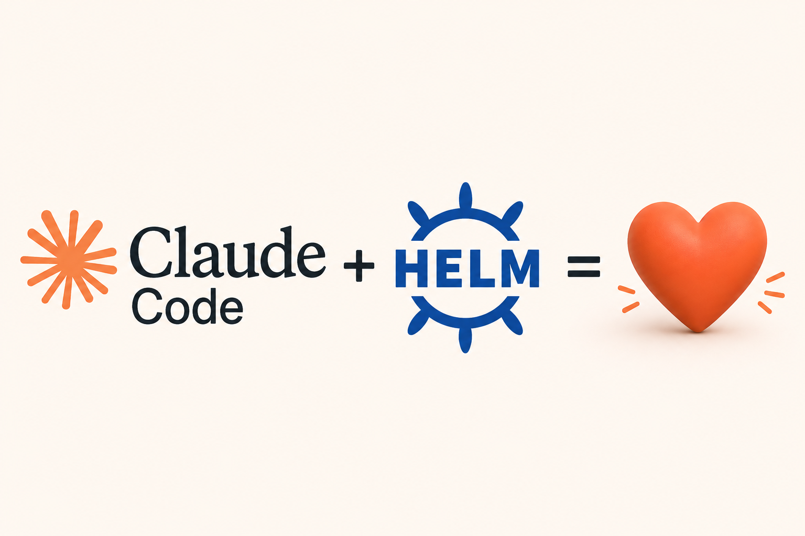

Upgrading a Helm chart sounds simple until you are three environments deep, maintaining a vendored copy of a 2000-line `values.yaml`, and trying to remember whether the image tag format uses a `v` prefix or not. I have been doing chart upgrades like this for years. They are never truly hard, but they are reliably fiddly, and "reliably fiddly" is exactly where human error lives.

Recently I wrote a Claude Code skill to handle this class of work. This post is about what that looks like in practice: the actual skill file, the plan the agent produced for a real upgrade, and the broader idea behind encoding operational knowledge as reusable AI instructions.

## The Problem with Routine Upgrades

Our Kubernetes monitoring setup uses [kube-prometheus-stack](https://github.com/prometheus-community/helm-charts/tree/main/charts/kube-prometheus-stack) deployed via Flux CD across three environments: `experimental`, `dev`, and `prod`. Each environment has its own `values.yaml` that contains the full upstream chart values, not a sparse overlay, but the complete file with our ACR image overrides baked in. When a new chart version drops, the upgrade checklist looks something like this:

1. Pull the new upstream chart and replace the local directory
2. Check whether CRDs changed (if so, handle migration before the upgrade lands)
3. Diff the upstream `values.yaml` — find every new key, every removed key, every image tag that changed
4. Apply those structural changes to all three environment values files, preserving our ACR paths and custom settings
5. Update the three `containerImagesToMirror` blocks in `azure-pipelines.yml` (one per environment — miss one and prod runs a stale image). Pipeline mirrors images from upstream to our ACR, so the tags there must match the env values files.
6. Update the `README.md` shields.io badges
7. Add a `CHANGELOG.md` entry
8. Lint and template-render all three environments to verify nothing is broken
9. Grep for stale version references
10. Commit

None of these steps are individually hard. But do them manually at 4pm on a Friday and you will probably miss something: a tag update in one pipeline block, a new upstream schema key that needs propagating, an old version reference hiding in a comment. I have seen all of these before.

## The Skill

Claude Code supports custom skills, markdown files that describe a workflow and live under `.claude/skills/`. When you invoke a skill, the agent follows the instructions in the file as if they were part of its operating context.

The key insight is that a skill is not a script. It is not a Bash file that blindly executes a sequence of commands. It is a set of instructions that the agent interprets, bringing its own judgment to ambiguous situations, like figuring out whether a new upstream key was intentionally omitted from an env file, or whether a changed image tag format means the `v` prefix convention changed.

Here is the actual `helm-chart-upgrade` skill file, unedited:

````markdown
---
name: helm-chart-upgrade
description:
  Guides a full Helm chart upgrade for repositories that bundle an upstream
  chart with environment values files and an Azure DevOps pipeline.

# Helm Chart Upgrade

This skill guides a complete, safe Helm chart upgrade for repos that follow this pattern:
  - A local chart directory wrapping an upstream Helm chart (e.g. `kyverno/`)
  - Three environment values files (`environments/{experimental,dev,prod}/values.yaml`)
    containing the **full** upstream chart values
  - An Azure DevOps pipeline (`azure-pipelines.yml`) with `containerImagesToMirror`
    lists per environment
  - A `README.md` with shield.io version badges
  - A `CHANGELOG.md`
---

## Step 0 — Collect inputs

Before touching anything, confirm these five values. Extract from the user's message
first; only ask about what is missing.

| Input                  | Example           |
| ---------------------- | ----------------- |
| Local chart directory  | `kyverno`         |
| Helm repo + chart name | `kyverno/kyverno` |
| Old app version tag    | `v1.17.1`         |
| New app version tag    | `v1.17.2`         |
| New Helm chart version | `3.7.2`           |

The app version tag and Helm chart version often differ (e.g. app `v1.17.2`,
chart `3.7.2`). Confirm both.

**`v` prefix consistency** — before doing any version replacement, check the existing
`containerImagesToMirror` entries to determine whether images are tagged `v1.2.3` or
`1.2.3`. Match that format exactly in every replacement. Never assume the `v` prefix
is present or absent.

---

## Step 1 — Plan first, change nothing

Enter plan mode. Before any file is touched:

1. Find every file referencing the old version:
   ```bash
   grep -r "<old-version>" --include="*.yaml" --include="*.yml" --include="*.md" . \
     | grep -v ".git/"
   ```
2. Write a checklist of all files and what changes each needs.
3. Identify any potential breaking changes in the new chart version (schema changes,
   removed keys, etc.) and how they will be reconciled in env values files.
4. Inform the user of the full scope of changes that will be made, including any manual
   steps they must take (e.g. applying CRDs if they changed).
5. Get explicit user approval before proceeding.

---

## Step 1.5 — Read the upstream release notes

Before touching any file, fetch the chart's changelog or GitHub release notes for the
version range being crossed. Even patch bumps occasionally include a "migration required"
note. Summarise any breaking changes (or note "none found") in the plan so the user is
informed before implementation begins.

---

## Step 2 — Pull the upstream chart

```bash
helm repo update
helm pull <helm-repo/chart> --version <new-chart-version> --untar --untardir /tmp/chart-upgrade
```

Replace the local chart directory:

```bash
rm -rf ./<chart-dir>/
cp -r /tmp/chart-upgrade/<chart-name> ./<chart-dir>/
```

Verify the pull succeeded before continuing.

**CRD check** — Helm does not upgrade CRDs by default. After pulling, diff the `crds/`
directory:

```bash
git diff HEAD <chart-dir>/crds/
```

If CRDs changed, flag it to the user — they must apply CRDs manually with
`kubectl apply -f <chart-dir>/crds/` before the Helm release is upgraded, or the
cluster will have schema drift.

---

## Step 3 — Identify schema changes in values.yaml

```bash
git diff HEAD <chart-dir>/values.yaml
```

Focus on **additions** — new top-level keys or sections that were not present in the
old chart. These need to be propagated to the environment values files.

**Also check for removed or renamed keys** — a key that exists in env values files but
no longer exists in the new upstream `values.yaml` will be silently ignored by Helm,
masking misconfiguration. Identify removals explicitly:

```bash
comm -23 <(grep -E "^[a-z]" environments/experimental/values.yaml | sort) \
         <(grep -E "^[a-z]" <chart-dir>/values.yaml | sort)
```

Report any removed top-level keys to the user before proceeding.

**Check sub-chart dependency versions** — if `<chart-dir>/Chart.yaml` has a
`dependencies:` block, diff it:

```bash
git diff HEAD <chart-dir>/Chart.yaml
```

Sub-charts (e.g. `common`, `postgresql`) may have their own image tags that appear in
`containerImagesToMirror` and need separate version bumps.

---

## Step 4 — Reconcile environment values files

The env values files contain the **complete upstream chart values**, not a sparse
override layer. They must be kept in full structural sync with the upstream
`<chart-dir>/values.yaml` after every upgrade — including key additions, key removals,
comments, blank lines, and ordering. The only exception is the _value_ of any key that
has been deliberately customised.

**Sync rules — apply in order:**

1. **Added keys** — if a key/block exists in the new upstream `values.yaml` but not in
   the env file, insert it at the same relative position as upstream (between the same
   neighbouring keys). Use the upstream default value.

2. **Removed keys** — if a key/block no longer exists in the new upstream `values.yaml`
   but is still present in the env file, remove it from the env file. Exception: if the
   key is known to be a local-only addition (not derived from upstream), leave it in
   place and flag it to the user.

3. **Preserve customised values** — for keys that exist in both the env file and
   upstream, keep the env file's value unchanged if it differs from the upstream default
   (ACR image repository paths, resource limits, Azure Workload Identity annotations,
   replica counts, etc.). Do not overwrite customised values with upstream defaults.

4. **Sync structure** — comments, blank lines, ordering, and indentation should follow
   the upstream `values.yaml`. Do not invent or retain env-file-specific formatting that
   diverges from upstream.

**Apply to all three environments** — experimental, dev, and prod must all receive the
same structural reconciliation.

**How to find the insertion point for new blocks:**

1. In the new `<chart-dir>/values.yaml`, identify the key immediately _before_ and
   immediately _after_ the new section.
2. Grep for the preceding key in each env values file to locate the exact insertion line.
3. Insert the new block between those keys.

**Images that inherit from appVersion** — component images that have `tag: ~` or no
explicit tag set automatically pick up `appVersion` from `Chart.yaml`. Do not add
explicit version tags for them; leave them as-is.

---

## Step 5 — Update azure-pipelines.yml

The pipeline has **three separate `containerImagesToMirror` blocks** — one each for
experimental, dev, and prod. All three must be updated. Missing even one leaves a stale
tag in production.

For each block: replace every image entry containing `:<old-version>` with
`:<new-version>`.

**Do not change utility image versions** (`readiness-checker`, `kubectl`, `busybox`,
`curl`, etc.) unless the user explicitly asks. These are pinned independently of the
chart release.

**Re-read the file before each subsequent edit.** A Prettier post-edit hook reformats
YAML files in place. If you edit twice without re-reading, your `old_string` won't match
the reformatted file and the edit will fail silently.

---

## Step 6 — Update README.md

Find shield.io badge lines that reference the chart being upgraded and update the
version strings:

- App version badge: `<ChartName>-v<old>` → `<ChartName>-v<new>`
- Helm chart version badge: `<ChartName>_Helm_Chart-v<old-chart>` →
  `<ChartName>_Helm_Chart-v<new-chart>`
- Any inline version references in documentation text (e.g. example ACR mirror paths)

Re-read the file before each subsequent edit if Prettier is active.

---

## Step 7 — Update CHANGELOG.md

Prepend a new dated entry at the top of the file (immediately after the file header):

```markdown
## YYYY-MM-DD — <Chart Name> v<new-version>

### Changed

- Upgraded <Chart Name> to v<new-version> (Helm chart <new-chart-version>)
- Updated all container image tags in `azure-pipelines.yml` to v<new-version>
  across all three environments
```

If new schema sections were added to env values files, add a bullet for each:

```markdown
- New `<section-name>` section added to upstream chart; inserted into all environment
  values files with upstream defaults
```

---

## Step 8 — Verify

```bash
# Lint the chart against every environment
helm lint ./<chart-dir> -f environments/experimental/values.yaml
helm lint ./<chart-dir> -f environments/dev/values.yaml
helm lint ./<chart-dir> -f environments/prod/values.yaml
```

`helm lint` validates structure but passes even with some broken references. Follow with
a full template render, which catches missing keys, bad references, and schema violations
that lint misses:

```bash
helm template <release-name> ./<chart-dir> -f environments/experimental/values.yaml > /dev/null
helm template <release-name> ./<chart-dir> -f environments/dev/values.yaml > /dev/null
helm template <release-name> ./<chart-dir> -f environments/prod/values.yaml > /dev/null
```

```bash
# Confirm no stale old-version references remain
# (CHANGELOG historical entries are expected — exclude them)
grep -r "<old-version>" --include="*.yaml" --include="*.yml" --include="*.md" . \
  | grep -v "CHANGELOG.md" | grep -v ".git/"
```

The grep must return empty output. Fix any remaining references before committing.

---

## Step 9 — Commit

Use the `gitflow` skill to stage and commit all changed files atomically. Craft the
commit message to explain _why_ (the version bump) and _what_ changed (images, schema):

```
chore(<chart-name>): upgrade to v<new-version> (Helm chart <new-chart-version>)

Bump <Chart Name> from v<old-version> to v<new-version>.
- Updated containerImagesToMirror in azure-pipelines.yml across all three environments
- Reconciled new <section-name> schema section into all environment values files
```

Omit sections that did not apply to this upgrade.
````

A few things worth noting about how this is written:

**It documents the traps inline.** Step 5 explicitly warns about the Prettier post-edit hook and instructs the agent to re-read the file before each subsequent edit. That warning exists because I was burned by it once: the hook reformats YAML on every save, which means a second edit without re-reading produces an `old_string` that no longer matches the file. Writing it into the skill means it is handled correctly on every subsequent run.

**The invariant in Step 4 is the most important line in the file.** "Never overwrite customised values with upstream defaults." Without this constraint, the agent has no way to know which values are intentionally different from upstream and which are just stale. Stating it explicitly means it is applied consistently every time.

**Steps are numbered but the agent can reason across them.** Step 1.5 exists because I added it after an upgrade where I missed a breaking change note that was buried in the release notes. It is out of numeric order but the agent reads it correctly in context.

A `gitflow` is a another custom skill I wrote to handle git operations with a structured commit message format. The `helm-chart-upgrade` skill calls it for the commit step, but it can also be invoked independently for other commits that follow the same format.

## The Plan the Agent Produced

When I invoked `/helm-chart-upgrade` for the kube-prometheus-stack 83.5.1 → 85.1.3 upgrade, the agent entered plan mode and produced the following plan before touching a single file. This is the actual output, not a summary:

---

**Context**

Routine Helm chart version bump from **83.5.1 → 85.1.3**. The prometheus-operator appVersion stays at **v0.90.1**, so no CRD changes are required. However, two meaningful changes land in this range:

1. **Grafana jumps to v13** (13.0.1-security-01) — a major version upgrade from the current 12.4.3.
2. **Distroless images become the default** for Prometheus (explicit `-distroless` tag) and Node Exporter (`distroless: true` flag in sub-chart values). These are lean, shell-free variants — they work fine in production but `kubectl exec` shell access into those pods will not be available.

**Step 0 — Confirmed Inputs**

| Field                 | Value                                        |
| --------------------- | -------------------------------------------- |
| Local chart directory | `kube-prometheus-stack/`                     |
| Helm repo / chart     | `prometheus-community/kube-prometheus-stack` |
| Old chart version     | `83.5.1`                                     |
| Old appVersion        | `v0.90.1`                                    |
| New chart version     | `85.1.3`                                     |
| New appVersion        | `v0.90.1` (unchanged)                        |

**Release Notes Summary (83.5.1 → 85.1.3)**

|                 | Details                                                                                       |
| --------------- | --------------------------------------------------------------------------------------------- |
| CRD changes     | **None** — appVersion stays v0.90.1; no `kubectl apply -f crds/` needed                       |
| Breaking (84.x) | Grafana v13 upgrade — check dashboard/plugin compatibility                                    |
| Breaking (85.x) | Distroless images enabled by default for Prometheus & Node Exporter                           |
| Sub-chart bumps | kube-state-metrics 7.2.2→7.3.0, prometheus-node-exporter 4.53.1→4.55.0, grafana 11.6.1→12.3.3 |

**Image Changes (all 3 pipeline blocks + env values files)**

| Image                                                    | Old tag   | New tag              | Change type          |
| -------------------------------------------------------- | --------- | -------------------- | -------------------- |
| `quay.io/prometheus/prometheus`                          | `v3.11.2` | `v3.11.3-distroless` | version + distroless |
| `quay.io/prometheus/alertmanager`                        | `v0.32.0` | `v0.32.1`            | patch bump           |
| `docker.io/grafana/grafana`                              | `12.4.3`  | `13.0.1-security-01` | **MAJOR**            |
| `quay.io/kiwigrid/k8s-sidecar`                           | `2.6.0`   | `2.7.3`              | minor bump           |
| `ghcr.io/jkroepke/kube-webhook-certgen`                  | `1.8.1`   | `1.8.2`              | patch bump           |
| `quay.io/prometheus/node-exporter`                       | `v1.11.1` | `v1.11.1-distroless` | distroless only      |
| `quay.io/prometheus-operator/prometheus-operator`        | `v0.90.1` | `v0.90.1`            | no change            |
| `quay.io/prometheus-operator/prometheus-config-reloader` | `v0.90.1` | `v0.90.1`            | no change            |
| `registry.k8s.io/kube-state-metrics/kube-state-metrics`  | `v2.18.0` | `v2.18.0`            | no change            |
| `docker.io/library/busybox`                              | `1.35`    | `1.35`               | no change            |

**Files to Change**

| File                                    | What changes                                                                                                                                     |
| --------------------------------------- | ------------------------------------------------------------------------------------------------------------------------------------------------ |
| `kube-prometheus-stack/`                | Replace entire directory with pulled chart 85.1.3                                                                                                |
| `environments/dev/values.yaml`          | Sync new upstream structure; update image tags; add `distroless: true` node-exporter key; add kubelet cert expiration thresholds to defaultRules |
| `environments/prod/values.yaml`         | Same as dev (registry: `ifbalacrprod.azurecr.io`)                                                                                                |
| `environments/experimental/values.yaml` | Same as dev                                                                                                                                      |
| `azure-pipelines.yml`                   | Update 3× `containerImagesToMirror` blocks with new tags                                                                                         |
| `README.md`                             | Badge: `83.5.1` → `85.1.3`                                                                                                                       |
| `CHANGELOG.md`                          | Prepend dated entry for this upgrade                                                                                                             |

**Execution Steps**

- [ ] Helm repo update + pull chart 85.1.3
- [ ] Replace chart directory
- [ ] CRD diff (expected: no changes since appVersion unchanged)
- [ ] Values diff — identify all structural additions/removals
- [ ] Sync `environments/dev/values.yaml`
- [ ] Sync `environments/prod/values.yaml`
- [ ] Sync `environments/experimental/values.yaml`
- [ ] Update `azure-pipelines.yml` — replace image tags in all 3 `containerImagesToMirror` blocks
- [ ] Update `README.md` — chart badge `83.5.1` → `85.1.3`
- [ ] Update `CHANGELOG.md` — prepend entry dated 2026-05-19
- [ ] Lint + template render all 3 environments
- [ ] Stale-reference check — grep must return empty
- [ ] Commit via `gitflow` skill

**Verification**

```bash
# Lint
helm lint kube-prometheus-stack -f environments/experimental/values.yaml
helm lint kube-prometheus-stack -f environments/dev/values.yaml
helm lint kube-prometheus-stack -f environments/prod/values.yaml

# Full template render (catches missing keys and bad references)
helm template kube-prometheus-stack kube-prometheus-stack \
  -f environments/experimental/values.yaml > /dev/null
helm template kube-prometheus-stack kube-prometheus-stack \
  -f environments/dev/values.yaml > /dev/null
helm template kube-prometheus-stack kube-prometheus-stack \
  -f environments/prod/values.yaml > /dev/null

# No stale references (CHANGELOG historical entries expected — excluded)
grep -r "83\.5\.1" --include="*.yaml" --include="*.yml" --include="*.md" . \
  | grep -v "CHANGELOG.md" | grep -v ".git/"
```

**Manual Action Required Before Deployment**

> **None** — appVersion unchanged (v0.90.1), CRDs are identical. Upgrade can proceed via normal pipeline after this PR lands.
>
> **Grafana 13 note** — test dashboard rendering and any custom plugins in `experimental` environment before promoting to `dev`/`prod`.

---

I approved the plan, and the agent executed every step. The commit landed clean on the first attempt.

## What the Agent Caught

Two things in this upgrade would have been easy to miss manually:

**The `distroless: true` placement.** The flag needed to go _inside_ the existing `image:` block in each env values file, not at a sibling level. Placing it at the wrong indentation level would have produced a duplicate `image:` key and silent YAML parsing behaviour. The agent correctly identified the existing block structure and inserted the flag at the right depth.

**The shields.io hyphen encoding.** The badge URL for Grafana references `13.0.1-security-01`. In a shields.io URL, hyphens inside the badge value must be doubled: `13.0.1--security--01`. An obscure encoding rule the skill carries from when I first got it wrong. The agent applied it correctly without being prompted.

## What Makes a Good Skill

A skill is essentially a runbook for an AI operator. A few things I learned from writing this one:

**Start with the process you actually follow, not an idealized one.** The Prettier hook warning in Step 5 exists because I hit that bug in a real session. The double-hyphen badge encoding in Step 6 exists because I published a broken badge once. Skills work best when they encode real institutional knowledge including the failure modes, not just the happy path.

**Identify and state the invariants explicitly.** "Never overwrite customised values with upstream defaults" is a constraint that the agent cannot infer from context alone. Without it, the agent has no way to know which values are intentionally different from upstream and which are just stale. Stating invariants as named rules means they are applied consistently without requiring per-upgrade review.

**Plan-first is non-negotiable for destructive work.** The requirement to get explicit approval before any file is touched might feel like friction. It is not. The plan step consistently surfaces things I would not have noticed until after the fact (like the Grafana major version crossing in this upgrade) when they are cheap to act on. After approval, execution is fast because all the thinking is already done.

**Skills compose.** The `helm-chart-upgrade` skill calls the `gitflow` skill for the commit step. Skills can depend on other skills, share conventions, and be invoked independently when needed.

## The Broader Pattern

Helm chart upgrades are one example of a class of work that is: well-defined, multi-step, error-prone when done manually, and repeated often enough that the accumulated cost of mistakes is real. Infrastructure work is full of this class of work.

The traditional automation answer is a Bash script. Scripts are great for deterministic sequences but brittle at the edges: they cannot handle ambiguity, cannot ask clarifying questions, and cannot adapt when upstream schema structure changes in ways you did not anticipate. A script that worked for v83 might silently corrupt an env file on v85 because a new key appeared in a position the script was not expecting.

An AI agent with encoded domain knowledge handles these edge cases differently. It can inspect what it finds, reason about whether a structural change is a breaking rename or a new addition, and surface the ambiguity for human review rather than silently doing the wrong thing. The skill file is the mechanism for transferring that knowledge from your head to the agent, written once and applied consistently.

The agent is not infallible. The _failure mode_ is better: when the agent encounters something unexpected, it surfaces it rather than proceeding. That is a much more useful behaviour than a script that silently produces a broken output.

## Getting Started with Claude Code Skills

Skills live in `.claude/skills/<skill-name>/SKILL.md`. The format is plain markdown, no special syntax required. The agent reads the file as part of its context when you invoke `/skill-name`.

A few practical tips:

- Write down the manual process you follow today, including the parts where you have been burned before.
- Identify the invariants, the things that must never change regardless of what upstream does. Write them as explicit constraints.
- Add a verification section. The agent should always prove the change is correct before committing, not just report that it thinks it is.
- Keep skills focused. One workflow per skill file is easier to reason about and compose than one large file trying to cover everything.

If you are running Kubernetes in production and doing this kind of maintenance work manually, skills are worth the hour it takes to write one.

## The Broader Toolbox: Loops, Hooks, MCP, and Subagents

Skills are one piece of what Claude Code offers. The toolbox goes further, and the other parts matter for infrastructure work specifically.

**Loops** let the agent run a workflow on a schedule or iterate until a condition is met. The same `helm-chart-upgrade` skill could be invoked in a loop that checks for new chart versions every morning, drafts the plan, and notifies you when there is something to approve. The agent does the reconnaissance; you do the approval. For teams managing a large number of charts across multiple clusters, this shifts chart maintenance from reactive ("someone noticed the chart is three versions behind") to proactive ("I get a plan every time upstream ships").

**Hooks** are shell commands that fire automatically before or after agent tool calls. The Prettier hook that reformats YAML files after every edit is itself a hook, one the blog site uses to keep files formatted consistently. But hooks can do much more in an operations context: run `helm lint` after every values file edit to catch schema errors immediately, create a git checkpoint before any destructive operation, or send a notification when the agent completes a phase. Hooks let you wrap the agent's actions with your own guardrails without modifying the skill itself; the skill defines the workflow, hooks enforce the environment constraints.

**MCP (Model Context Protocol)** is the integration layer that connects agents to external systems as native tool calls. An agent with an MCP server for Azure can query Key Vault for secret metadata, check managed identity assignments, or verify federated credentials, without shell scripts or manual credential setup. For Kubernetes operations this opens up live cluster integrations: the agent can check whether a CRD version already exists before recommending a manual apply, verify that a Flux `HelmRelease` reached a `Ready` state after the pipeline ran, or inspect current resource limits before proposing changes. MCP turns the agent from a file editor into an operator with real-time visibility into the systems it is working on.

**Subagents** let a parent agent delegate work to parallel child instances, each with their own context window and tool access. For the upgrade workflow, that means reconciling three environment values files concurrently rather than sequentially, or researching breaking changes across a range of chart versions without loading a dozen changelogs into a single context. The parent agent orchestrates; the subagents do the reading and return structured results. In wider infrastructure use, the pattern scales further: verify CRD state across multiple clusters in parallel, run `helm lint` against a matrix of chart and environment combinations, or fan out a secret rotation across namespaces and collect the results in one place.

Together these capabilities describe a continuum. At one end: a human types `/helm-chart-upgrade` and approves a plan. At the other: a scheduled loop detects a new upstream release, generates the plan, runs the pipeline, monitors Flux reconciliation via MCP, and pages you only when something needs a decision. The same skill file powers both ends of that continuum; the difference is just how much of the surrounding workflow you have also encoded.

## Conclusion

The pace at which AI agents are changing the way we work is real and it is accelerating. A year ago, the idea of writing a markdown file and having an AI reliably execute a 13-step infrastructure workflow (pulling a chart, diffing schemas, syncing three environment files, updating pipeline configs, verifying renders, and committing) would have sounded optimistic. Today it is a Tuesday afternoon.

The important shift is not that the work gets done faster, although it does. The shift that matters is that the work gets done _consistently_. The agent does not skip the stale-reference grep because it is late. It does not forget the third pipeline block because the first two looked fine. It does not miss the Grafana major version crossing in the release notes because it was already familiar with the chart. Every execution follows the full process, including the parts that humans tend to abbreviate under time pressure.

What I want to emphasise is that AI agents like Claude are not primarily a tool for software developers writing application code. The example in this post has no application code in it at all; it is entirely infrastructure: YAML files, Helm charts, pipeline configurations, badge URLs. The agent performed exactly as well here as it would on a code refactoring task, because the underlying capability is not "write code" but "follow a complex process with context-dependent judgment." That capability applies equally well to:

- Rotating secrets across multiple Kubernetes namespaces following an audit trail
- Upgrading a Flux `HelmRelease` including drift detection and `valuesFrom` reconciliation
- Reviewing a pull request against a checklist of infrastructure security controls
- Onboarding a new cluster environment by replicating configuration from an existing one
- Auditing alert rule coverage against a list of SLOs

These are not software engineering tasks in the traditional sense. They are IT operations tasks, the kind that platform engineers, SREs, and cloud infrastructure engineers do every day. They are also exactly the kind of tasks where consistency matters most and where the cost of human error is highest.

None of this means you stop paying attention. The plan step exists precisely because a human needs to review what the agent intends to do before it does it. Approving the plan for the kube-prometheus-stack upgrade took me about two minutes: scanning the image changes table, confirming the Grafana 13 note was flagged, checking that CRDs were correctly identified as unchanged. That two-minute review is far more valuable than the hour of manual execution it replaces, because it happens at the right moment: before anything is touched, when the cost of catching a mistake is zero. You are not removing the human from the loop; you are moving the human to the part of the loop where their judgment actually matters.

The question worth asking is not "can I use an AI agent for this?" but "what does my current process look like written down?" If the answer is a mental checklist you carry in your head, or a Confluence page that is three versions out of date, or a script that breaks when anything changes, that is a skill waiting to be written.

The world is not waiting for this to happen. It is already happening. The only variable is whether the institutional knowledge that makes your operations reliable ends up encoded somewhere useful, or stays locked in the heads of the people who do the work today.
