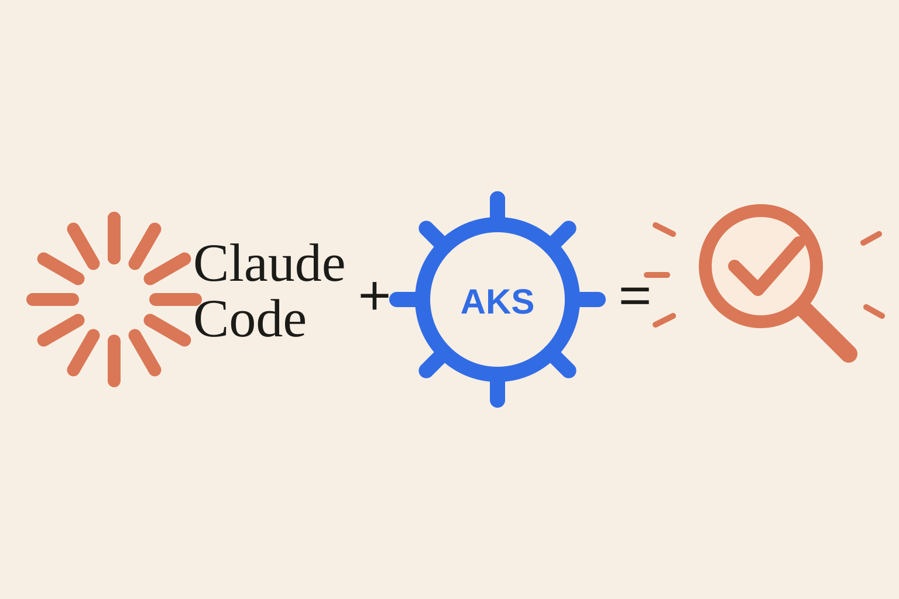

Something breaks on an AKS cluster and the first ninety seconds decide how the next hour goes. Do you `kubectl describe` the failing pod, or do you jump straight into Azure Log Analytics because that's the tab you already had open? Do you check whether it's one pod or the whole node pool before you start theorizing about root cause? Do you compare the metric you're staring at against what it looked like yesterday, or do you just react to the number on the screen? Every on-call engineer has a mental checklist for this. Mine has gotten better over the years, mostly by getting burned: chasing a network hypothesis for forty minutes because I skipped the blast-radius check, or trusting a KQL query that turned out to be silently incomplete because of the ingestion cap.

After [writing a Claude Code skill for Helm chart upgrades](/AI-Agents-and-Helm-Chart-Upgrades/), I went back to the same idea for a different class of work: not routine maintenance this time, but live incident triage. This post walks through that skill, `aks-issue-analyzer`, and a real investigation where it earned its keep.

## The Problem with Ad Hoc Triage

Incident response under time pressure has a predictable failure shape. Not "nobody knows what they're doing," but small, individually reasonable shortcuts that compound:

- **Jumping to the symptom-specific hunch first.** A pod is crashlooping, so you go straight to its logs, without first checking whether it's one pod, one node, or cluster-wide. Ten minutes later you learn three other unrelated pods on the same node are also unhealthy, and the actual story was node pressure, not the app.
- **Reaching for Azure before ruling out in-cluster causes.** Log Analytics and Container Insights feel authoritative because they're an Azure-native, "official" surface. In this environment they're actually the weakest evidence source: the daily ingestion cap and retention window mean queries against them are frequently and silently incomplete. Treating an empty KQL result as "nothing happened" rather than "possibly not captured" has burned me more than once.
- **Eyeballing absolute numbers instead of baselining.** A metric that looks alarming in isolation might be completely normal for that time of day. Without a same-length comparison window, you can't tell signal from steady-state noise.
- **Running something during triage that isn't actually read-only.** Under pressure, "let me just restart it and see" is a tempting shortcut that also destroys the evidence you'd need to find the real cause, and on production infrastructure, that's not a shortcut worth taking.

None of these are exotic mistakes. They're the ordinary cost of doing triage from memory, under time pressure, without a checklist enforcing the order of operations. That's exactly the kind of process a skill is good at encoding.

## The Skill

A Claude Code skill is a markdown file under `.claude/skills/<name>/SKILL.md` that the agent reads as operating instructions when you invoke `/<name>`. For `aks-issue-analyzer`, that means: before the agent runs a single command against a real cluster, it already knows what's mandatory, what's forbidden outright, and what order evidence should be gathered in.

Here's the actual skill file, unedited:

````markdown
---
name: aks-issue-analyzer
description: Read-only diagnostic playbook for troubleshooting AKS clusters, workloads, networking, DNS, and in-cluster Consul. In-cluster kubectl output and Prometheus metrics are the primary evidence source; Azure Activity Log/network config is a secondary escalation only. Never mutates cluster or Azure state.
allowed-tools:
  - Read
  - Write
  - Bash
  - Grep
  - Glob
  - WebFetch
  - Agent
  - AskUserQuestion
---

# AKS Issue Analyzer

Read-only diagnostic playbook for AKS incidents — cluster, workloads, networking, DNS, Consul. Every step here is safe to run against production; nothing in this skill changes cluster or Azure state.

## When to use

- Pod issues: CrashLoopBackOff, Pending, ImagePullBackOff, OOMKilled, failing readiness/liveness probes
- Node issues: NotReady, resource pressure, unexpected restarts
- Autoscaling not reacting: cluster-autoscaler stuck, HPA not scaling
- Networking: timeouts/drops/latency between services, or to something outside the cluster
- DNS resolution failures
- Consul: raft elections, gossip drop-outs, service-discovery gaps
- Control plane / API server: slow kubectl, request throttling, webhook failures
- Storage: PVC stuck Pending, mount failures
- General "something broke at time T" (or is broken right now) investigations

## Hard safety rules — read before running anything

Every command in this skill must be read-only: `get`, `describe`, `list`, `show`, `logs`, `top`, `explain`, `query`. If a command's verb isn't obviously read-only, **stop and ask the user** (`AskUserQuestion`) instead of guessing or "just checking" with it.

**Never run, regardless of how convenient it would be:**

| Category            | Forbidden                                                                                                                                                                                                                  |
| ------------------- | -------------------------------------------------------------------------------------------------------------------------------------------------------------------------------------------------------------------------- |
| kubectl             | `delete`, `apply`, `create`, `replace`, `edit`, `patch`, `scale`, `rollout restart`/`undo`, `cordon`, `drain`, `uncordon`, `taint`, mutating `label`/`annotate`, `exec` running anything other than a read-only diagnostic |
| az aks              | `upgrade`, `scale`, `update`, `stop`, `start`, `nodepool add/delete/scale/upgrade`, `rotate-certs`                                                                                                                         |
| az network          | any `create`/`delete`/`update` on route-table, nsg, firewall, vnet, subnet, lb                                                                                                                                             |
| az vm / vmss        | `restart`, `deallocate`, `delete`, `reimage`                                                                                                                                                                               |
| az resource / group | `delete`                                                                                                                                                                                                                   |
| helm / terraform    | `upgrade`, `install`, `uninstall`, `rollback`, `apply`, `destroy`                                                                                                                                                          |

**Explicitly fine:**

- `az aks get-credentials` — only writes local kubeconfig, doesn't touch the cluster.
- `kubectl debug node/<node>` — spins up an ephemeral diagnostic pod on the node. Acceptable for deeper host-level checks when node-level metrics/events aren't enough, but only run read-only commands inside it (`cat`, `ls`, `ps`, `ss`, etc.) — never write to the host filesystem or restart host services.
- `kubectl exec` into an existing pod/container, but only to run a read-only diagnostic already available there: `nslookup`, `dig`, `curl` against internal endpoints, `consul members`, `consul operator raft list-peers`, `cat`/`ls` on config files.
- SSH directly to an AKS node, for host-level checks `kubectl debug node` handles poorly — see Step 2b. Read-only commands only: no config edits, no service restart/stop, no writes to the host filesystem.
- SSH to a non-cluster VM strictly as a control-group comparison — see Step 2d. Same read-only restriction.
- `strace`/`tcpdump`/eBPF tracing (`bpftrace`, `bcc-tools`) on a node — see Step 2b and Step 2d. These don't mutate state, but unlike `get`/`describe`/`logs` they have real performance overhead and can distort the very thing being measured, so they carry their own restrictions: always time-boxed (`timeout <n>` or an explicit packet/event count), always filtered as tightly as possible, never attached to `kubelet`/`containerd`/CNI daemons or other processes the cluster depends on to keep functioning, output capped and cleaned up after.

If you hit a permissions/access error, widen the read-only query or ask the user for the right scope — never work around it by escalating privileges or changing RBAC.

---

## Step 0 — Establish context

Before running anything, confirm (use `AskUserQuestion` for whatever isn't already stated):

- What's broken — specific symptom (crashlooping pod, timeouts to X, DNS failures, etc.) or "unclear, something's wrong"
- Affected namespace/workload, if known
- Time window in UTC, or "happening live right now"
- What's already been ruled out by whoever reported it — don't re-derive what's already established

---

## Step 1 — Always start here: in-cluster quick triage

This is the mandatory first pass for **every** investigation, regardless of symptom. It establishes blast radius — one pod, one node, one namespace, or cluster-wide — which determines which branch(es) of Step 2 to follow next. Never skip straight to a symptom-specific branch or to Azure without doing this first.

```bash
kubectl get nodes -o wide
kubectl top nodes
kubectl top pods -A
kubectl get pods -A -o wide | grep -Ev "Running|Completed"
kubectl get events -A --sort-by='.lastTimestamp' | tail -100
kubectl get events -A --field-selector type=Warning --sort-by='.lastTimestamp'
kubectl get pods -A -o json | jq '[.items[] | select(.status.containerStatuses[]?.restartCount > 0) | {name:.metadata.name, ns:.metadata.namespace, restarts:.status.containerStatuses[].restartCount}]'
```

If this comes back essentially clean for the reported window, don't stop there — sanity-check by widening the window against a period you know was busy, to confirm the query itself is working rather than the incident genuinely being silent in-cluster (a real and useful finding either way, but only if verified).

---

## Step 2 — Branch by symptom category

Pick whichever subsection(s) match what Step 1 turned up. More than one can apply. Each pairs kubectl checks with Prometheus metrics (the full query library is in Step 3, referenced here by name).

### 2a. Pod / workload issues

CrashLoopBackOff, Pending, ImagePullBackOff, OOMKilled, failing probes.

```bash
kubectl describe pod <pod> -n <ns>
kubectl logs <pod> -n <ns> --previous
kubectl get events -n <ns> --field-selector involvedObject.name=<pod>
kubectl get pod <pod> -n <ns> -o jsonpath='{.status.containerStatuses[*].lastState}'
```

- **OOMKilled**: check `lastState.terminated.reason`, compare `container_memory_working_set_bytes` against the configured limit.
- **Pending**: read the `FailedScheduling` event reason — insufficient cpu/memory, taint/toleration mismatch, or affinity/anti-affinity conflict.
- **ImagePullBackOff**: check imagePullSecrets and registry auth; look for `kubelet` errors reaching the registry.
- Metrics: `kube_pod_container_status_restarts_total`, `kube_pod_container_status_waiting_reason`, `container_memory_working_set_bytes`.

### 2b. Node issues

NotReady, resource pressure, unexpected restarts.

```bash
kubectl describe node <node> | sed -n '/Conditions/,/Allocatable/p'
kubectl get events -A --field-selector involvedObject.kind=Node
kubectl logs -n kube-system -l k8s-app=kube-proxy --tail=200
```

If node-level metrics/events aren't enough, `kubectl debug node/<node>` gives a read-only shell on the host — see safety rules above for what's allowed inside it.

**Direct SSH, when `kubectl debug node` isn't enough.** A few host-level checks are awkward or unreliable through the ephemeral-pod/chroot model `kubectl debug node` uses. If the symptom looks like it fires at a specific clock time (rather than being cluster/workload-driven), or the hypothesis needs driver-level NIC counters finer than what Prometheus exposes, SSH directly to the node instead:

```bash
systemctl list-timers --all
crontab -l; ls /etc/cron.d /etc/cron.daily /etc/cron.hourly
journalctl --since "<window-start>" --until "<window-end>" --no-pager
journalctl --since "<window-start>" --until "<window-end>" -k --no-pager
tail -n 500 /var/log/syslog 2>/dev/null; tail -n 500 /var/log/auth.log 2>/dev/null
grep -iE "sudo|sshd|authentication failure|session opened|session closed" /var/log/auth.log 2>/dev/null
ethtool -S <primary-iface>
ip -s link show <primary-iface>
ss -s; ss -tin
conntrack -S
```

`ethtool -S` in particular surfaces Accelerated-Networking/VF-level drops that `node_network_*` Prometheus metrics don't expose. Cross-check `systemctl list-timers`/`journalctl` firing times against any recurring window seen in the metrics — a pattern that fires at the same clock time every day (weekday or weekend) is as consistent with a per-node scheduled task as with a shared external cause.

**Syslog/auth log caveat**: most AKS node images (Azure Linux/Mariner, Ubuntu with journald) route everything through the journal rather than flat files — `/var/log/syslog` and `/var/log/auth.log` may not exist. If they're missing, use `journalctl -k` (kernel ring) and `journalctl -u sshd -u sudo` instead. Worth checking for unexpected SSH logins, sudo escalations, or kernel OOM/segfault messages that land in the window but wouldn't show up in Kubernetes-level events at all.

**Process-level tracing (`strace`, eBPF).** Reach for this only when `ss`/`conntrack`/logs already point at a specific process and you need to see what it's actually doing syscall-by-syscall — e.g. a process appears to stall on a network or file call but nothing upstream explains why. Always time-box it and target one process, never a daemon the cluster depends on (`kubelet`, `containerd`, CNI):

```bash
timeout 10 strace -p <pid> -T -tt -e trace=network,file 2>&1 | head -200
```

`-T` prints time spent in each syscall, `-tt` gives wall-clock timestamps — together they show exactly where a slow syscall sits in the timeline, which is what you actually want for a latency question. If `bpftrace`/`bcc-tools` are installed, prefer them for anything network-related (`tcpconnect`, `tcpretrans`, `tcplife`) — same read-only observability, much lower overhead than `strace`, and purpose-built for exactly this kind of connection-latency question.

Metrics: `node_memory_MemAvailable_bytes`, `node_filesystem_avail_bytes`, `node_load1`/`node_load5`/`node_load15`, node CPU rate.

### 2c. Autoscaling

Cluster-autoscaler stuck, HPA not reacting.

```bash
kubectl get hpa -A
kubectl describe hpa <hpa> -n <ns>
kubectl logs -n kube-system -l app=cluster-autoscaler --tail=200
```

Look for `NotTriggerScaleUp` reasons in autoscaler logs and HPA events.

Metrics: `cluster_autoscaler_*` (if exposed), `kube_horizontalpodautoscaler_status_*`.

### 2d. Networking

Timeouts/drops/latency, internal or external.

```bash
kubectl get pods -n kube-system -l k8s-app=azure-cni-networkmonitor
kubectl get networkpolicy -A
kubectl get svc,endpoints -n <ns>
az aks show -g <rg> -n <cluster> --query networkProfile
```

Metrics: node network retransmits/drops/conntrack, `node_sockstat_TCP_tw` (see Step 3 for its scope caveat).

Only escalate to Step 4's Azure network-routing check once internal causes (CNI, NetworkPolicy, DNS) are ruled out and the evidence clearly points to something leaving the cluster.

**Retina, if deployed — in-cluster distributed capture & flow observability.** Retina (`kubectl retina`, Microsoft's eBPF-based Kubernetes networking observability tool) isn't present on every AKS cluster by default, so check first:

```bash
kubectl get pods -A -l app=retina
kubectl retina version
```

If it's there, it's worth reaching for before manual per-node `tcpdump` (see below): its capture command coordinates a synchronized packet capture across multiple nodes/pods in one shot, which is a much closer match to a genuine two-point-in-time capture than stitching together separate SSH sessions. Verify current flags with `kubectl retina capture create --help` since they vary by version, but the shape is:

```bash
kubectl retina capture create --name <capture-name> --namespace <ns> --node-selector "<label-selector>" --duration 30s
kubectl retina capture list
kubectl retina capture delete --name <capture-name>
```

It also exposes drop-reason metrics (conntrack/iptables-level, labeled by reason) that are more precise than the generic `node_network_*_drop_total` counters in Step 3, and — if Hubble mode is enabled — live L3/L4 flow logs without a full packet capture at all. A `Capture` creates short-lived Kubernetes resources to run the job; clean up with `capture delete` afterward the same way you would tear down a `kubectl debug node` session.

**Control-group comparison across the shared route.** Once the evidence points outside the cluster (something on the egress path, not the app or Kubernetes itself), the strongest proof isn't more in-cluster metrics — it's finding a non-cluster VM that shares the same UDR next-hop (confirm with `az network route-table route list`, don't assume from subnet naming — see Step 4) and running the same test there. A clean result on a same-route host in an unaffected environment plus a matching-bad result on a same-route host in the affected environment rules out app code and the Kubernetes stack entirely, because neither is running on the comparison VM. SSH to that VM is sanctioned for this purpose — see the safety rules above.

Once 2+ comparison hosts are gathered behind the same route, check for an **ECMP even/odd IP-parity split**: if the hosts cluster into two groups by outcome with no other distinguishing factor, check whether the grouping matches even vs. odd private IP. That's the signature of ECMP hashing across two NVA/firewall instances — it reframes "some hosts are affected" into "one of two upstream instances is affected," a much more actionable hypothesis to hand to the network team.

**Portable connect-timing probe.** A small script that only times TCP connection setup (no app logic) against the real external dependency _and_ a neutral control target (e.g. a well-known public endpoint), run for several minutes per host, produces directly comparable numbers across AKS nodes, dev nodes, and any control-group VM. The control target matters — it's what tells you whether a slow result is specific to the real dependency or general to the host's egress path. Build this once per investigation and reuse it across every host under test rather than re-deriving the comparison method each time.

**Node-side packet capture, to get your own SYN/SYN-ACK timestamps.** If the probe above shows slow connection setup and the cause might be on the path rather than the host, a short `tcpdump` at the node's own NIC lets you measure it directly instead of waiting on another team's capture:

```bash
timeout 60 tcpdump -i <primary-iface> -w /tmp/probe.pcap -c 2000 'host <target-ip> and port 443'
```

Time-boxed and filtered to one target — an unfiltered or open-ended capture on a busy node interface is exactly the overhead/blast-radius risk the safety rules above call out. Pull the file down (`scp`) and diff SYN-sent vs. SYN-ACK-received timestamps for the same flow; this is the same two-point-in-time method worth requesting from an external firewall/NVA team (see Step 4), but captured from a vantage point already in reach, so it doesn't require waiting on another team to produce it.

### 2e. DNS

```bash
kubectl get pods -n kube-system -l k8s-app=kube-dns -o wide
kubectl logs -n kube-system -l k8s-app=kube-dns --tail=200 | grep -i error
kubectl exec -n <ns> <any-running-pod> -- nslookup <target-fqdn>
kubectl get cm coredns -n kube-system -o yaml
```

Live resolution test from a pod in the affected namespace is the fastest ground truth. Metrics: CoreDNS error ratio and forward latency — compare to a same-length baseline window, since steady-state non-zero NXDOMAIN ratios are normal background noise, not incident signal.

### 2f. Consul

```bash
kubectl get pods -n <consul-ns> -l component=server
kubectl exec -n <consul-ns> <consul-server-pod> -- consul operator raft list-peers
kubectl exec -n <consul-ns> <consul-server-pod> -- consul members
kubectl logs -n <consul-ns> <consul-server-pod> --tail=200 | grep -iE "error|leader|election"
```

Look for leadership elections, RPC failures, gossip drop-outs, or member-count changes during the window.

Metrics: `consul_raft_state`, `consul_raft_leader_lastcontact_max`, `consul_rpc_request_error_count`.

### 2g. Control plane / API server

Slow kubectl, request throttling, webhook failures.

```bash
kubectl get --raw /healthz
kubectl get --raw /readyz
kubectl get validatingwebhookconfigurations,mutatingwebhookconfigurations
```

Metrics: `apiserver_request_duration_seconds`, `apiserver_request_total{code=~"5.."}`, admission webhook latency.

### 2h. Storage / PV

```bash
kubectl get pvc,pv -A
kubectl describe pvc <pvc> -n <ns>
```

Check CSI driver pod health/logs for mount failures.

Metrics: `kubelet_volume_stats_*`.

---

## Step 3 — Prometheus reference library

```bash
kubectl port-forward -n <monitoring-ns> svc/<prometheus-svc> 9090:9090 &
curl -s 'http://localhost:9090/api/v1/query_range?query=<promql>&start=<unix>&end=<unix>&step=15s' | jq
```

Grouped queries, referenced by name throughout Step 2:

- **Pod health**: `kube_pod_container_status_restarts_total`, `kube_pod_status_ready`, `kube_pod_container_status_waiting_reason`
- **Node resources**: `node_memory_MemAvailable_bytes`, `node_filesystem_avail_bytes`, `node_load1`/`5`/`15`, CPU rate
- **Node network**: `node_netstat_Tcp_RetransSegs`, `node_sockstat_TCP_tw`, `node_network_receive_drop_total`/`transmit_drop_total`, `node_nf_conntrack_entries` vs `node_nf_conntrack_entries_limit`
- **CoreDNS**: `sum(rate(coredns_dns_response_rcode_count_total{rcode!="NOERROR"}[5m])) / sum(rate(coredns_dns_response_rcode_count_total[5m]))`, `coredns_forward_request_duration_seconds`
- **Consul**: `consul_raft_state`, `consul_raft_leader_lastcontact_max`, `consul_rpc_request_error_count`
- **API server**: `apiserver_request_duration_seconds`, `apiserver_request_total{code=~"5.."}`
- **Autoscaling**: `cluster_autoscaler_*`, `kube_horizontalpodautoscaler_status_*`
- **Storage**: `kubelet_volume_stats_*`

**`node_sockstat_TCP_tw` scope caveat**: node-exporter runs `hostNetwork: true`, so this reflects the _host's own_ network namespace, not each pod's. Under Azure CNI, pod-initiated connections live in the pod's own netns and egress via iptables SNAT/conntrack rather than a host-owned socket — a bump here is a host-level connection-churn signal, not direct proof of a specific pod's traffic.

**Always compare the incident window against a same-length baseline window** (e.g. same time the previous day) rather than eyeballing absolute values — the deviation is the signal, not the raw number.

---

## Step 4 — Azure-side checks (secondary escalation only)

**Do not use Azure Log Analytics / Container Insights (KQL queries) as a primary or default tool in this environment.** The daily ingestion cap and retention here are both small, so it's frequently incomplete and can actively mislead if treated as authoritative. In-cluster kubectl output and Prometheus metrics (Steps 1-3) are the primary evidence. Only reach for Log Analytics if the user explicitly asks for it and in-cluster data genuinely can't answer the question — and caveat any such finding as lower-confidence.

**Azure Activity Log** — cheap and reliable, worth checking once in-cluster evidence doesn't fully explain things. Check both the cluster resource group and the node resource group (the `MC_*` group from `az aks show --query nodeResourceGroup`):

```bash
az monitor activity-log list -g <cluster-rg> --start-time <ISO> --end-time <ISO> -o table
az monitor activity-log list -g <node-rg> --start-time <ISO> --end-time <ISO> -o table
```

Rules out upgrades, scaling operations, NIC/route/NSG changes. An empty node-RG log for the window is itself a real signal, not an absence of evidence.

**Network routing** — only pursue once Step 2d's in-cluster networking checks show drops/timeouts to something _outside_ the cluster, and CNI/NetworkPolicy/DNS are already ruled out:

```bash
az network route-table list -g <vnet-rg> -o table
az network route-table route list -g <vnet-rg> --route-table-name <rt> -o table
az network vnet subnet show -g <vnet-rg> --vnet-name <vnet> -n <subnet> --query routeTable
az aks show -g <rg> -n <cluster> --query networkProfile.outboundType
```

If the node subnet has a UDR with a `0.0.0.0/0` route to a virtual appliance/firewall, that device — not the AKS Standard LB — is the actual data path for internet/cross-VNet traffic, regardless of what `outboundType` says. LB SNAT connection state (`SNATConnectionCount` by `ConnectionState`) is an Azure Monitor metric, not Prometheus, and belongs in this same escalation step. If a firewall/NVA outside your access is implicated, flag it as an open item for the owning team rather than guessing at what's on the other side.

Before treating any other host (a control-group VM, another node pool) as comparable to the affected one, confirm they actually share the same next-hop with the route-table query above — don't assume it from subnet naming or environment layout. Two hosts in "the same" VNet can still egress through different UDRs.

**Requesting evidence from an external team (e.g. firewall/NVA owners).** A single-point packet capture can only prove packets weren't lost in transit — it cannot measure how long a device held onto them internally (session lookup, policy/App-ID evaluation, NAT). If a hypothesis needs that team to rule their device in or out, ask specifically for:

- A two-point (or multi-stage) timestamped capture of the _same_ flow — one capture pre-processing, one post-processing — so the gap between them can be measured directly, not a single vantage point.
- Confirmation the sample was taken during the affected window, not "anytime."
- Confirmation it's from the specific instance implicated (e.g. the odd- or even-hashed side of an ECMP pair), not just any instance in the pair.

Without those three, treat any "looks clean" response as inconclusive rather than as evidence the device is ruled out.

---

## Step 5 — Parallelize with subagents

The branches in Step 2 are largely independent. For a broad "something's wrong, not sure what" sweep, dispatch the relevant branches as parallel read-only `Agent` calls rather than running them sequentially — each reports back a short findings summary, keeping the main conversation focused on synthesis. Reserve inline sequential execution for a narrow investigation where the symptom is already well-scoped to one branch.

---

## Step 6 — Synthesize and report

Structure findings as:

1. **What was checked and came back clean** — specific ("zero Warning events 10:00-17:00, sanity-checked against a known-busy 09:00 window"), not "looks fine."
2. **Genuine anomalies** — exact magnitude and timing, with an honest confidence read. Don't overclaim a modest or circumstantial signal as root cause.
3. **Best-supported hypothesis** — explicitly flagged as a hypothesis if the smoking gun lives outside your access (e.g. a hub-network firewall), with the concrete next step and owner named.
4. **Open items** — what couldn't be checked and why (missing access, metric not scraped, retention exceeded).

Write this to a file if the user wants a shareable report or response draft. Do not send or post it anywhere (email, Teams, Slack) without explicit separate instruction — this skill's job ends at producing the analysis.
````

A few things stand out about how this one is written, compared to the Helm upgrade skill from the last post:

**The safety rules come before anything else, as a table, not a paragraph.** A prose warning like "be careful with kubectl" is easy to skim past under pressure. A table of forbidden verbs by category, sitting above every diagnostic step, is not. It's the difference between a guideline and a hard boundary, and during a live incident that distinction matters more than it does during routine maintenance.

**Step 1 is mandatory and comes before any symptom branch, on purpose.** This is the single most important structural decision in the file. It exists specifically to prevent the failure mode described above: jumping straight into a symptom-specific hunch before establishing blast radius. The agent physically cannot skip it, because the skill states it's step one regardless of what the reported symptom is.

**Azure is explicitly demoted to secondary evidence.** Most runbooks I've seen treat cloud-provider dashboards as the default starting point, because they're the "official" surface. This skill inverts that, and says so explicitly, with the actual operational reason (ingestion cap, retention, silent incompleteness) rather than just asserting it as a rule to follow blindly.

**The synthesis step (Step 6) forces honesty about confidence.** "Don't overclaim a modest or circumstantial signal as root cause" is a constraint I added after watching myself do exactly that under pressure once. Writing it into the skill means every future investigation gets that same discipline, not just the ones where I happen to remember to apply it to myself.

## A Real Investigation: Why the Policy Engine Was Eating the API Server

Here's what this actually looked like on a real cluster. The reported symptom was vague: kubectl felt slow across the board on our production AKS cluster, and someone had noticed `apiserver_request_total` trending up over a couple of weeks without an obvious matching change in workload count.

**Step 1 (mandatory triage)** came back mostly clean at the workload level: no unusual restart counts, no Warning event storm, nodes healthy. That absence of an obvious symptom is exactly why Step 1 matters even when nothing looks broken. It ruled out "something is crashlooping" and pointed the investigation at Step 2g, control plane / API server, instead.

**Step 3's API server metrics** confirmed it: `apiserver_request_total`, broken down by resource, showed one policy-engine controller accounting for roughly two-thirds of all tracked kube-apiserver requests — about 1.79 million of 2.72 million requests in the sampled window. Breaking that down further: `subjectaccessreviews` POST calls alone were over half a million requests, and GET/PUT/LIST/DELETE traffic against the engine's own report objects (`PolicyReport`/`EphemeralReport`) accounted for close to a million more, reconciling a few thousand report objects continuously. One specific controller pod, the leader of a multi-replica deployment doing leader-election, was running at over 2 CPU cores doing this work alone, while its idle sibling replicas sat at a few millicores.

That data pointed at two root causes, both found by reading the actual policy configuration rather than guessing from the metrics alone:

1. **Autogen fan-out.** None of the roughly twenty CEL-based policy templates explicitly scoped `spec.autogen.podControllers.controllers`. Left at the engine's default, every pod-template violation gets fanned out across every controller kind that could have created it (Deployment, ReplicaSet, DaemonSet, StatefulSet, Job, CronJob) as separate report entries for the _same_ underlying finding. The team's own changelog for a lower environment documented roughly 12x inflation from exactly this: a real-findings count of 588 showing up as over 7,000 report entries.
2. **No namespace scoping on the scan itself.** The exclusion mechanism the newer policy API uses only suppresses _enforcement_, not scanning and reporting — so every background-enabled policy was scanning every pod in every namespace, including `kube-system` and every DaemonSet-heavy observability namespace, and doing so inconsistently (only a handful of the roughly twenty policies had any namespace exclusion at all). Compounding it, a background-scan resource-filter flag was set in a way that bypassed even the engine's own built-in `kube-system` exclusions — not a deliberate choice, just an inherited default nobody had revisited.

Both root causes were about volume of duplicate and unnecessary reporting traffic against the API server, not about the policies themselves being wrong.

## What the Playbook Caught

Two habits baked into the skill mattered more than the diagnosis itself here:

**Baselining instead of reacting to an absolute number.** A two-thirds API server request share sounds alarming in isolation, but the skill's Step 3 discipline is to compare against a same-length baseline window before treating a number as anomalous. In this case the comparison mattered less for confirming there _was_ a problem (the magnitude spoke for itself) and more for correctly separating what was steady-state background scanning from what spiked during specific reconciliation bursts, which shaped which of the two root causes to prioritize fixing first.

**Verifying before recommending a change to a live system, even a read-only recommendation.** The obvious next step, once the investigation pointed at over-scanning, was to recommend turning off background scanning for policies that are already in blocking (`Deny`) enforcement mode, since admission already blocks new violations regardless of whether background scan is also watching. But that would mean losing visibility into any existing non-compliant resource still being tracked by one of those policies. Rather than assume that visibility loss was theoretical, the actual live report data was queried first:

```bash
kubectl get policyreports -A -o json | jq -r '.items[].results[]? | select(.result=="fail") | .policy' | sort | uniq -c
```

Across tens of thousands of pass/skip results, the failing results clustered on exactly two policies, neither of which was in the set being considered for the scan-disable change. Zero fails existed on any of the policies the change would actually touch. That turned "this should be safe" into "this is confirmed safe, here's the query that proves it" before the recommendation was written down. It's a small step, but it's the difference between a plausible-sounding fix and one that's been checked against reality.

## What Makes a Good Diagnostic Skill

A few things carried over from the Helm skill, and a few are specific to diagnostic work:

**Make the mandatory first step actually mandatory.** For a maintenance skill like the Helm upgrade one, the risk of skipping a step is a broken upgrade you'll catch in verification. For a diagnostic skill, the risk of skipping blast-radius triage is chasing the wrong theory for forty minutes on a live incident. That's a good reason to make Step 1 structurally unskippable rather than just first-in-a-list.

**State hard boundaries as an enumerated table, not a paragraph of advice.** "Be careful" is not a constraint an agent (or a person, under pressure) can reliably self-enforce. A table of forbidden verbs by category is something that can be checked against mechanically, every time, without relying on judgment holding up under stress.

**Make the escalation order explicit, and say why.** In-cluster kubectl output and Prometheus metrics before Azure Log Analytics isn't an arbitrary preference; it's a direct consequence of this environment's ingestion cap making Log Analytics an unreliable primary source. Writing the reason into the skill means the ordering survives even when whoever's using it doesn't remember why Log Analytics is deprioritized here.

**Build in the verify-before-recommend habit, even for read-only recommendations.** The PolicyReport query above wasn't strictly required by the skill's step structure, it fell out of the general discipline the skill's Step 6 enforces: don't overclaim a hypothesis as confirmed without checking it. That habit is worth encoding explicitly rather than hoping it happens by default.

## The Broader Pattern

A runbook that assumes the reader follows every step in order, under pressure, without skipping ahead, is optimistic. A shell script that automates the "obvious" diagnostic sequence is brittle in the opposite direction: it can't recognize when the symptom doesn't match its assumptions, and it can't reason about whether a given signal is actually anomalous versus normal background noise for that particular cluster at that particular time of day.

A skill sits between those two. It carries the same discipline a good runbook would, mandatory ordering, explicit hard boundaries, named escalation paths, but it's interpreted rather than executed blindly. When the agent hits something the skill didn't anticipate (a metric that isn't scraped, a namespace naming convention that doesn't match the pattern), it can reason about it and flag the gap rather than silently producing a wrong or incomplete answer. That's the same shape of tradeoff the Helm skill post landed on: not infallible, but a much better failure mode than either a human under pressure or a script that only handles the happy path.

## Getting Started

Skills live at `.claude/skills/<skill-name>/SKILL.md`, plain markdown, invoked with `/skill-name`. For a diagnostic skill specifically:

- Put the safety rules first, above any diagnostic step, and make the forbidden actions enumerable rather than descriptive.
- Make the first step mandatory and symptom-agnostic. Whatever you'd otherwise be tempted to skip when you think you already know the answer is exactly the step that needs to be unskippable.
- Name the actual metrics and queries you rely on, not just "check Prometheus." A query library the agent can reference by name is reusable across investigations in a way that "look at the dashboards" isn't.
- Write the escalation order explicitly, and say why one source is preferred over another for your specific environment. That reasoning is what keeps the ordering correct even as the person using the skill changes.

## Where This Goes Next: Claude in the Browser

Everything in this skill today goes through an API or a CLI: `kubectl`, `az`, a Prometheus HTTP query. That covers a lot, but not everything an investigation touches. Log search tools like Kibana or Elastic's Discover view are built around saved searches, field filters, and visual correlation that don't always have a clean equivalent one-liner, and the same is true of a lot of Grafana dashboards and internal log viewers that were built for a human to look at, not for a script to query.

Claude's browser automation (Claude in Chrome) is a natural fit for extending the same read-only discipline into that surface. The agent can navigate to a Kibana/Elastic Discover view, apply the same time-window and namespace filters a person would type in by hand, and read back matched log lines, or take a screenshot of a saturated Grafana panel, without ever touching an index pattern, a saved dashboard, or an alert rule. It's the same safety posture as the rest of this skill: read-only, evidence-gathering only, nothing mutated. Where it would slot in naturally is as an escalation path for exactly the cases the current skill can't reach: full-text search across ingested application logs that were never exposed as Prometheus metrics, or a dashboard someone built once and never turned into a reusable query.

I haven't built this extension yet. It's worth naming here as a concrete direction rather than something already wired into the skill above, but the shape of it, browser automation held to the same read-only rules as everything else in this playbook, seems like the obvious next piece.

## Conclusion

The Helm upgrade post ended on the idea that a skill is worth writing whenever your current process is a mental checklist, a stale wiki page, or a script that breaks the moment something unexpected shows up. Incident triage is the sharpest version of that argument, because the cost of skipping a step isn't a slightly messier commit, it's forty minutes chasing the wrong theory on a live production incident, or worse, a KQL query you trusted that was silently missing the data you needed.

What changed my mind about writing this skill wasn't a single dramatic outage. It was noticing how often the actual root cause, on a cluster generating two-thirds of its API server load from reporting overhead nobody had scoped down, was findable in the first fifteen minutes if the triage order was right, and much harder to find if it wasn't. The playbook doesn't make the agent smarter than a good engineer having a good day. It makes the process consistent on the days that aren't good days too, the ones where you're tired, or new to the cluster, or three alerts deep and tempted to skip the boring first step because you're already pretty sure you know what's wrong.

That's the same thesis as last time, applied to a different shape of work: the value isn't speed, it's that the discipline survives contact with a bad day.
